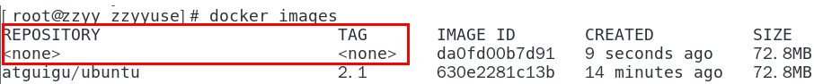
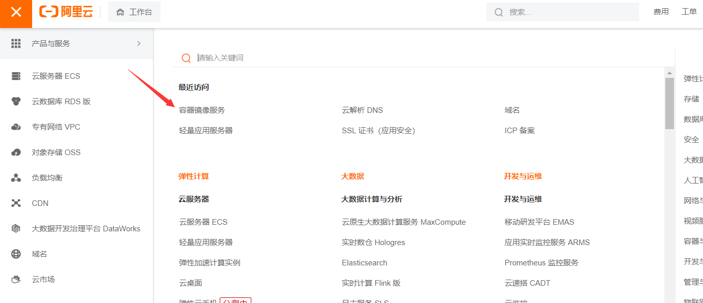
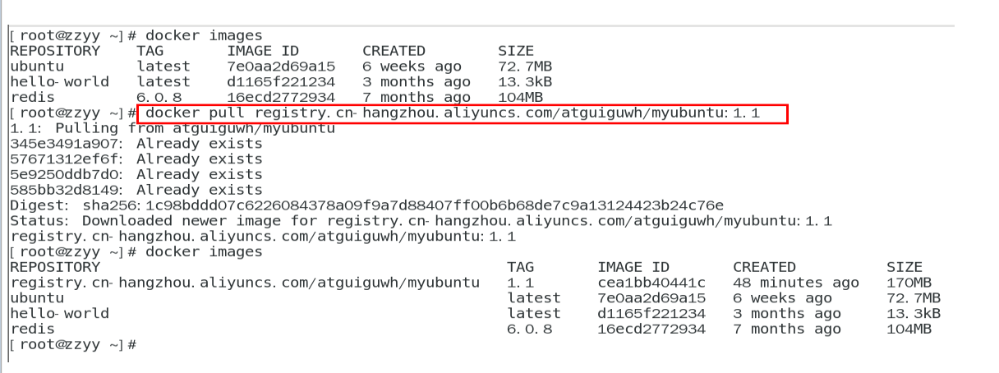

# Docker

# Docker简介

## Docker是什么？

Docker的出现使得Docker得以打破过去「程序即应用」的观念。透过镜像(images)将作业系统核心除外，运作应用程式所需要的系统环境，由下而上打包，达到应用程式跨平台间的无缝接轨运作。

Docker是在Linux容器技术的基础上发展而来，将应用打成镜像，通过镜像成为运行在Docker容器上的实例，而Docker容器在任何操作系统上都是一致的。

这就实现了跨平台、跨服务器。只需要一次配置好环境，换到别的机子上就可以一键部署好，大大简化了操作。


## 容器与虚拟机比较有什么区别？

Linux容器是与系统其他部分隔离开的一系列进程，从另一个镜像运行，并由该镜像提供支持进程所需的全部文件。容器提供的镜像包含了应用的所有依赖项，因而在从开发到测试再到生产的整个过程中，它都具有可移植性和一致性。

容器与虚拟机不同，它不需要捆绑一整套操作系统


Docker容器是在操作系统层面上实现虚拟化，直接复用本地主机的操作系统，而传统虚拟机则是在硬件层面实现虚拟化，Docker优势体现为启动速度快，占用体积小


传统虚拟机技术是虚拟出一套硬件后，在其上运行一个完整操作系统，在该系统上再运行所需应用进程；
容器内的应用进程直接运行于宿主的内核，容器内没有自己的内核且也没有进行硬件虚拟。因此容器要比传统虚拟机更为轻便。

每个容器之间互相隔离，每个容器有自己的文件系统 ，容器之间进程不会相互影响，能区分计算资源。


## Docker去哪下

docker官网：http://www.docker.com

Docker Hub官网: https://hub.docker.com


Docker安装

# Docker的基本组成

## 镜像

Docker镜像相当于一个模板，一个镜像可以创建多个容器

如果类比java的创建对象，镜像相当于类，容器相当于创建的对象。

## 容器

可以把容器看做是一个简易版的linux环境（包括root用户权限，进程，空间，用户空间和网络空间等）和运行在其中的应用程序

最小最核心赖以生存的linux内核文件，不需要的不加载

## 仓库

集中存放镜像文件的场所

类似于

Maven仓库，存放各种jar包的地方；

github仓库，存放各种git项目的地方；

Docker公司提供的官方registry被称为Docker Hub，存放各种镜像模板的地方。


## 小总结

Docker 本身是一个容器运行载体或称之为管理引擎。我们把应用程序和配置依赖打包好形成一个可交付的运行环境，这个打包好的运行

环境就是image镜像文件。只有通过这个镜像文件才能生成Docker容器实例(类似Java中new出来一个对象)。


# Docker平台架构


**简介：**


## 简略版

Docker是一个Client-Server结构的系统，Docker守护进程运行在主机上， 然后通过Socket连接从客户端访问，守护进程从客户端接受命

令并管理运行在主机上的容器。 

容器，是一个运行时环境，就是我们前面说到的集装箱。可以对比mysql演示对比讲解


## 复杂版

Docker 是一个 C/S 模式的架构，后端是一个松耦合架构，众多模块各司其职。 


# Docker安装

## 安装步骤

1. 要求必须是centos7以上的linux系统

```
cat /etc/redhat-release
```


2. 卸载旧版本


3. yum安装gcc相关

```
yum -y install gcc
yum -y install gcc-c++
```


4. 安装需要的软件包

```
yum install -y yum-utils
```


5. 设置stable镜像仓库

```
yum-config-manager --add-repo http://mirrors.aliyun.com/docker-ce/linux/centos/docker-ce.repo
```

**注意：这里不要按照官网要求设置仓库，因为该镜像仓库是在国外，很容易出现以下报错**

报错：
1   [Errno 14] curl#35 - TCP connection reset by peer

2   [Errno 12] curl#35 - Timeout


6. 更新yum软件包索引

```
yum makecache fast
```


7. 安装DOCKER CE

```
yum -y install docker-ce docker-ce-cli containerd.io
```

成功结果


8. 启动docker

```
systemctl start docker
```


9. 测试

```
docker version
docker run hello-world
```


10. 卸载

```
systemctl stop docker 
yum remove docker-ce docker-ce-cli containerd.io
rm -rf /var/lib/docker
rm -rf /var/lib/containerd
```


## 阿里云镜像加速

加速docker下载镜像的速度，毕竟访问外网太慢


- 访问阿里云 镜像服务


- 再将配置镜像加速器的脚本复制到linux上即可

- 重启服务器

```
systemctl daemon-reload
systemctl restart docker
```

- 重新测试运行

```
docker run hello-world
```

# Docker常用命令

## 帮助启动命令

启动docker： systemctl start docker

停止docker： systemctl stop docker

重启docker： systemctl restart docker

查看docker状态： systemctl status docker

开机启动： systemctl enable docker

查看docker概要信息： docker info

查看docker总体帮助文档： docker --help

查看docker命令帮助文档： docker 具体命令 --help

## 镜像命令

### docker images 

docker images [OPTIONS] :列出本地主机上的镜像

OPTION说明：

​	-a：列出本地所有的镜像信息

​	-q：只显示镜像ID


### docker search 某个XXX镜像名字

docker search [OPTIONS]  某个XXX镜像名字：联网在仓库中查询docker镜像

OPTION说明：

​	--limit : 只列出N个镜像，默认25个


### docker pull 某个XXX镜像名字

docker pull 某个XXX镜像名字 [:TAG] :下载某个镜像，默认是Lastest

**例如：**

docker pull Ubuntu：实际上是docker pull Ubuntu laster


### docker system df

查看镜像/容器/数据卷所占的空间


### docker rmi 某个XXX镜像名字ID

意义：删除某个镜像

删除单个镜像：docker rmi  -f 镜像ID

删除多个镜像：docker rmi -f 镜像名1:TAG 镜像名2:TAG 


### docker删除全部镜像

docker rmi -f $(docker images -qa)


### 面试题：虚悬镜像

仓库名，标签都是<none>的镜像，俗称虚悬镜像dangling image



## 容器命令

### 新建，启动机器

docker run [OPTIONS] IMAGE ：**新建，启动机器**

OPTIONS说明（常用）：

-d: 后台运行容器并返回容器ID，也即**启动守护式容器(后台运行)**；

-i：以交互模式运行容器，通常与 -t 同时使用；
-t：为容器重新分配一个伪输入终端，通常与 -i 同时使用；
也即**启动交互式容器(**前台有伪终端，等待交互)；

-P: 随机端口映射，大写P
-p: 指定端口映射，小写p


### 列出当前所有正在运行的容器

docker ps [OPTION] : **列出当前所有正在运行的容器**

OPTIONS说明（常用）：

-a :列出当前所有正在运行的容器+历史上运行过的
-l :显示最近创建的容器。
-n：显示最近n个创建的容器。
-q :静默模式，只显示容器编号。


### 退出容器

1. exit：直接输入exit，容器退出，并停止
2. ctrl+p+q：ctrl+p+q容器退出，不停止


### 启动已停止的容器

docker start 容器ID或者容器名


### 重启容器

docker restart 容器ID或容器名


### 停止容器

docker stop 容器ID或容器名


### 强制停止容器

docker kill 容器ID或容器名


### 删除已停止的容器

docker rm 容器ID或容器名


## 容器命令——重要

### 容器启动

守护式启动（后台服务器）

在大多数的场景下，我们都希望docker的服务是在后台运行的，而不是关了命令行窗口，容器就退出（程序就关闭）了

交互式启动

但是有些情况下，**docker容器在后台运行就会有一个前台进程**


所以，最佳的解决方案是,将你要运行的程序以前台进程的形式运行，
常见就是命令行模式，表示我还有交互操作，别中断


### 查看容器日志

docker logs 容器ID


### 查看容器内运行的进程

docker top 容器ID


### 查看容器内部细节

docker inspect 容器ID


### 进入正在运行的程序并以命令去进行交互

docker exec -it 容器ID bashshell**（推荐）**

docker attach 容器ID

**exec与attach的区别**

attach：直接进入容器启动命令的终端，不会再打开一个窗口，用exit的退出，容器就退出了

exec：则是重新开启一个新的命令的终端，并且启动一个新的进程，用exit的退出，实际上就是退出了新建的终端，容器不会退出。


**适用场景：**一般-d后台启动的程序，和ctrl+p+q退出的程序，可以通过以上两个命令重新进入


### 从容器内拷贝文件到主机上

容器移到主机（宿主机）上

公式：docker cp  容器ID:容器内路径 目的主机路径


### 导入和导出容器

export 导出容器的内容留作为一个tar归档文件

import 从tar包中的内容创建一个新的文件系统再导入为镜像[对应export]


**例子：**

docker export 容器ID > 文件名.tar

cat 文件名.tar | docker import - 镜像用户/镜像名:镜像版本号


# Docker镜像

## 定义

定义：是一种轻量级的，可执行的独立软件包，内部包含了某个软件所需的所有内容，我们将应用程序和配置依赖打包成一个可交付的运行环境（运行时需要的库，代码，环境变量和配置文件等），这个打包好的运行环境就是image镜像文件。


通过这个镜像文件就可以（像java创建对象一样new出一个一个对象）创建一个又一个容器。


## 镜像的分层

docker镜像就像一个金字塔一样，底下是最小的一个可运行的linux系统，上面该如何搭建（改造linux系统/加功能），可以自己diy。

**支持通过扩展现有镜像，创建新的镜像**

类似Java继承于一个Base基础类，自己再按需扩展。
新镜像是从 base 镜像一层一层叠加生成的。每安装一个软件，就在现有镜像的基础上增加一层


**镜像分层的好处？**

镜像分层最大的一个好处就是共享资源，方便复制迁移，就是为了复用。

比如说有多个镜像都从相同的 base 镜像构建而来，那么 Docker Host 只需在磁盘上保存一份 base 镜像；

同时内存中也只需加载一份 base 镜像，就可以为所有容器服务了。而且镜像的每一层都可以被共享。


**实质**

Docker镜像层都是只读的，容器层是可写的

当容器启动时，一个新的可写层被加载到镜像的顶部。

这一层通常被称作“容器层”，“容器层”之下的都叫“镜像层”。

所有对容器的改动，都发生再容器层次。容器层都是只写的，镜像层都是只读的。


## Docker镜像commit操作

docker commit提交容器副本使之成为一个新的镜像

命令：docker commit -m="提交的描述信息" -a="作者" 容器ID 要创建的目标镜像名:[标签名]

例子：

```
docker commit -m="test01，修改" -a="cwh" adawda112dad myubuntu:1.10
```


# Docker本地镜像发布到阿里云

## docker发布到阿里云图解


## 将本地镜像上传到阿里云仓库步骤

1. docker镜像生成（上一章有讲）

2. 找到镜像服务

3. 选择“个人空间”，点击“命名仓库”，再点击“创建命名仓库”，创建仓库


4. 进入到仓库管理页面，点击仓库”管理“


5. 按照阿里云的操作指南，上传即可


## 将阿里云上的镜像下载到本地

参考阿里云的操作指南




# Docker镜像发布到私有库

略


# Docker容器数据卷

## 定义

实质上就是docker容器内的数据保存进宿主机的磁盘中。就算docker容器实例被删除，但是其内部的数据仍然在宿主机内有一个备份。

有点类似与VMware的共享文件夹


**如何运行一个带有数据卷存储功能的容器?**

命令：

```
 docker run -it --privileged=true -v /宿主机绝对路径目录:/容器内目录      镜像名
 
 --privileged=true：
 Docker挂载主机目录访问如果出现cannot open directory .: Permission denied
解决办法：在挂载目录后多加一个--privileged=true参数即可
使用这个OPTION，才可以让容器内部的root权限起作用，不然只是普通权限
```


## 特点

1. 数据卷可在容器之间实现共享和继承

2. 容器和宿主机实时共享数据
3. 生命周期：容器不再进行更新后死亡
4. 数据卷中的更改不会被存放进入镜像中


## 实战

- **在docker容器内添加数据卷**

命令：

读写默认情况：默认是宿主机和容器相互读写

 docker run -it --privileged=true -v /宿主机绝对路径目录:/容器内目录 (:rw)      镜像名

只读情况：容器内只能进行读操作，不能进行写操作

 docker run -it --privileged=true -v /宿主机绝对路径目录:/容器内目录 :ro      镜像名


- **卷的继承和共享**

容器2输入父类命令：

```
docker run -it  --privileged=true --volumes-from 父类  --name u2 ubuntu
```


容器1已经做好了一份数据卷

容器2继承父类（容器1），那么容器2就会继承容器1的数据卷


# Docker常用软件安装

## 安装tomcat

1. 现在docker hub上面查找tomcat镜像,并拉到本地

```
docker search tomcat

docker pull tomcat
```

2. docker images查看是否有拉到该镜像

3. 使用tomcat镜像创建tomcat容器

```
docker run -it -p 8080:8080 tomcat
```

4. 访问tomcat主页

- **如果是用旧版tomcat则正常就可以通过端口访问到，不会出现什么问题**

  这里提供一下旧版的镜像

```
docker pull billygoo/tomcat8-jdk8
docker run -d -p 8080:8080 --name mytomcat8 billygoo/tomcat8-jdk8
```


- **如果用的是最新版的tomcat，可能会遇到404找不到的情况**

****

**解决方案：**

1. 没有映射端口
2. 没有关闭防火墙

3. 把webapps.dist目录换成webapps


## 安装mysql

1. docker hub上面查找mysql镜像

2. 从docker hub上(阿里云加速器)拉取mysql镜像到本地标签为5.7


3. 使用mysql5.7镜像创建容器(也叫运行镜像)

```
docker run -p 3306:3306 -e MYSQL_ROOT_PASSWORD=123456 -d mysql:5.7
docker ps
docker exec -it 容器ID /bin/bash
mysql -uroot -p      //进入mysql控制后台
```

4. 建库建表插入数据


5. 检验是否成功，通过本机上的mysql来连接docker的数据库

   

**注意：**

会出现两个问题：    

- 插入中文数据会产生乱码现象，这是docker上默认字符集的编码隐患

```
 SHOW VARIABLES LIKE 'character%';         //通过这条命令来检测
```

- 删除容器后，里面的mysql数据如何办       这需要通过数据卷进行备份。

**备份问题解决方案：**

在启动容器前，加入数据卷进行主机备份

```
docker run -d -p 3306:3306 --privileged=true 
-v /zzyyuse/mysql/log:/var/log/mysql 
-v /zzyyuse/mysql/data:/var/lib/mysql 
-v /zzyyuse/mysql/conf:/etc/mysql/conf.d 
-e MYSQL_ROOT_PASSWORD=123456  
--name mysql mysql:5.7
```


**中文乱码的解决方案：**

- 新建my.cnf通过容器卷同步给mysql容器实例	

```
[client]
default_character_set=utf8
[mysqld]
collation_server = utf8_general_ci
character_set_server = utf8
```


- 重启mysql容器实例再重新进入，查看字符编码

```
 SHOW VARIABLES LIKE 'character%';  
```

未解决中文乱码前


解决中文乱码后


