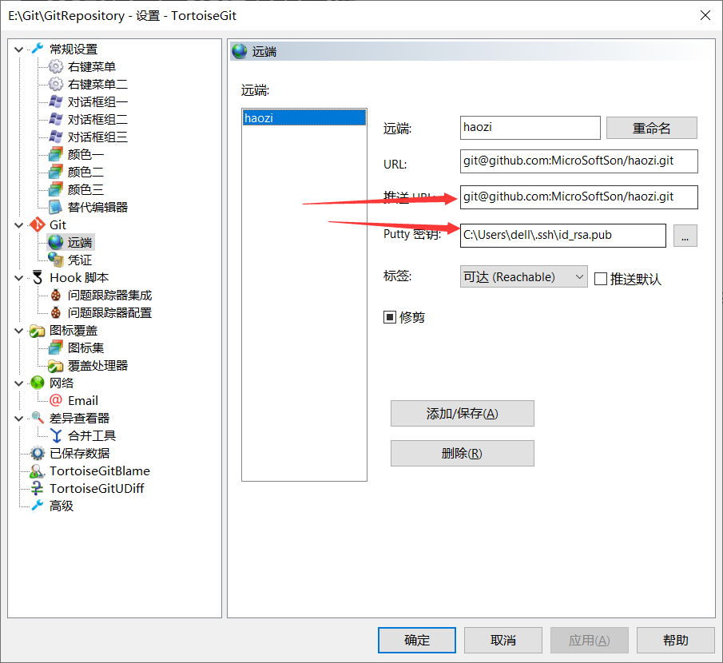

# Git

介绍

Git是一个项目管理工具


## Git的工作流程


Repository（本地仓库）：存放项目的不同版本，然后再从本地仓库将项目去提交到远程仓库。

​												如果这个本地仓库它不存在，那么可以直接从远程仓库复制一份到本地上

## Git的安装


# Git的基本操作

## 本地仓库的创建/文件的创建/克隆远程仓库来生成本地仓库

自定义一个空的文件夹 ，在文件夹下打开Git Bash Here ，在终端输入git init

生成了.git文件就创建成功


克隆远程仓库到目录页面

GitBash拉远程仓库

git clone git@github.com:lytforgood/MLCompetition.git（仓库名    MicroSoftSon/haozi.git  /  github名字+仓库名）   

tortoisegit拉去远程仓库


## 将文件添加到暂存区

将在工作区刚刚写入的文件或者刚刚修改的文件通过

git add 文件名

添加到暂存区


## 由tortoiseGit将文件添加到暂存区


## 将文件提交到本地仓库

将暂存区的文件通过

git commit 文件名

添加到本地仓库         然后添加一些相关注释（介绍提交的文件）


## 由tortoiseGit将文件添加到本地仓库


## 将修改文件/文件加入到本地仓库

git commit -m 注释 文件名

## 工作区和（暂存区与本地目录）版本库/本地目录


## 查看修改历史

git log

git log 文件名：修改的文件名

## 删除本地仓库里提交的内容

git rm 文件名

## 重命名提交在仓库的的文件

git mv 旧文件名 新文件名

# Git提交到GitHub

## 生成公钥和私钥

命令：ssh-keygen -t rsa

## 将git连接到github上

git remote -v:查看远程连接的地址，及地址的别名

git remote add origin(代号) git@github.com:lytforgood/MLCompetition.git（仓库名    MicroSoftSon/haozi.git  /  github名字+仓库名）   
提交到远程

## 上传到github/远程仓库上

### GitBush终端上传

$ git push origin(地址别名) master（分支名	）  

### TortoiseGit上传到GitHub

先配置上传文件




Git同步


将本地仓库的文件  和  远程仓库的文件拉取下来


## 克隆远程仓库到目录页面

GitBash拉远程仓库

git clone git@github.com:lytforgood/MLCompetition.git（仓库名    MicroSoftSon/haozi.git  /  github名字+仓库名）   

tortoisegit拉去远程仓库

	

## 解决文件冲突

如果出现中途修改过后，需要确认“解决冲突”才可提交


## 删除远程仓库

1


2


## 删除远程仓库文件

先把远程仓库拉到本地

git pull 地址别名 分支名

再从本地去删除上传到远程仓库

git push 地址别名 分支名

# Git的分支管理

## 创建分支

1.命令创建

通过“git branch 分支名 ”创建

2.ToritoiseGit方式创建


3.查看创建的分支和主分支


## 删除分支

git branch -d dev

## 合并分支


 如果出现冲突就把冲突修改后再提交

# Git标签

## 新建git标签

GitBush：

git tag 版本号

git tag -a 版本号：给版本号加一些介绍

## 查询标签

git tag

## 删除标签

git tag -d 版本号

# idea中使用git

## idea中配置git

流程就是箭头所指


## idea中使用git

添加到暂存区和提交到本地仓库合并


有修改的文件后add到暂存区


# git服务器搭建

## 为什么搭建git服务器

GitHub就是一个免费托管开源代码的远程仓库。但是对于某些视源代码如生命的商业公司来说，既不想公开源代码，又舍不得给GitHub交保护费，那就只能自己搭建一台Git服务器作为私有仓库使用。

略

略

略

可去动力节点git下补学


# Git补充

## 删除本地分支及Github分支

本地分支

```
git branch -D master
```


Github分支

```
git push origin_note --delete 分支名称
```


## 删除Github远程仓库的文件

先获取GitHub仓库的库，然后再在本地删除，最后上传本地仓库


## pull/push合并

报错：

```
$ git merge origin/druid
fatal: refusing to merge unrelated histories
```

这里的问题的关键在于：`fatal: refusing to merge unrelated histories`
你可能会在`git pull`或者`git push`中都有可能会遇到，这是因为两个分支没有取得关系。

在你操作命令后面加`--allow-unrelated-histories`
例如：

`git merge master --allow-unrelated-histories`

