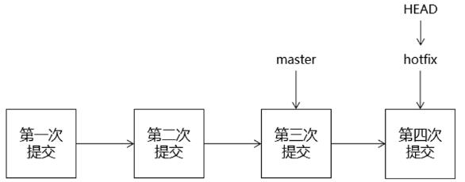

# Git

## 简介

介绍

Git是一个项目管理工具


## Git的工作流程


Repository（本地仓库）：存放项目的不同版本，然后再从本地仓库将项目去提交到远程仓库。

​								  如果这个本地仓库它不存在，那么可以直接从远程仓库复制一份到本地上

## Git作用


## Git工作机制


## Git的安装

下载地址：Git-2.23.0-64-bit.exe

[https://git-for-windows.github.io/ ](https://git-for-windows.github.io/)

https://git-scm.com/download


**在安装好后Git第一步要设置一下签名**

Git是分布式版本控制系统，所以需要**填写用户名和邮箱**作为一个标识——即：**用户签名**

签名的作用：区分不同的操作者身份，用以确认每次提交都是谁提交的。

命令：

```git
git config --global user.name "用户名"
git config --global user.email "用户邮箱"
//--global 表示全局属性，所有的git项目都会共用属性
```


在当前登录的系统用户路径下，生成**~/.gitconfig**隐含文件，里面可以看到**刚刚设置的信息**。如果不用命令设置，也可以直接打开文件进行设置。

也可以使用命令去查看：git config --list


## Git的相关介绍

### 工作区

工作区：就是你电脑本地硬盘目录，一般是项目当前目录

### 版本库

版本库：工作区有个**隐藏**目录**.git**，它就是Git的本地版本库

### 暂存区

暂存区：一般存放在"git目录"下的**index**文件（.git/index）中（**避免多次提交，导致版本爆炸**）

### 分支

分支：Git会为我们自动创建一支分支（master），以及指向master的一个指针HEAD（HEAD指针指向谁，就操作那个版本）


### 工作区和（暂存区与本地目录）版本库/本地目录


### Git提交到版本库的步骤

1. 通过“git add”，把文件推送到暂存区
2. 通过“git commit”，把暂存区中的文件推送到当前分支中

**将需要修改的文件都推送到暂存区，当确定无需修改后，就直接上传到本地库（当前分支）**


# Git的基本操作

## Git的基本命令

| 命令名称                             | 命令作用                 |
| ------------------------------------ | ------------------------ |
| git init                             | 初始化本地库             |
| git config --global user.name 用户名 | 设置用户签名的用户名部分 |
| git config --global user.email 邮箱  | 设置用户签名的邮箱部分   |
| git status                           | 查看本地库状态           |
| git add 文件名                       | 添加到暂存区             |
| git commit -m "日志信息" 文件名      | 提交到本地库             |
| git reflog                           | 查看历史记录             |
| git reset --hard 版本号              | 版本穿梭                 |


# Git本地库的基本操作

## 创建本地库

### 本地初始化一个Git库

自定义一个空的文件夹 ，在文件夹下打开Git Bash Here ，在终端输入**git init**

生成了.git文件就创建成功


**注意：当前的 .git 是一个隐藏文件夹，需要在电脑上面设置隐藏文件夹显示设置，否则，看不到这个.git目录**


### 从远程仓库克隆

克隆远程仓库到目录页面

**GitBash拉远程仓库**

git clone git@github.com:lytforgood/MLCompetition.git（仓库名    MicroSoftSon/haozi.git  /  github名字+仓库名）   


**tortoisegit拉去远程仓库**


## 查看文件状态

**git status：查看文件状态**

**git status -s:使输出信息更加简洁**


**命令：**

​	**git status**

On branch master ：表示主分支

Untracked files：表示未跟踪状态

**说明：**

Git工作目录下的文件状态信息：

​		Untracked 未跟踪（未被纳入版本控制）

​		Tracked 已跟踪（被纳入版本控制）

​		Unmodified 未修改状态

​		Modified 已修改状态

​		Staged 已暂存状态

这些文件的状态会随着我们执行Git的命令发生变化

**红色**表示新建文件或者新修改的文件,都在工作区. 

**绿色**表示文件在暂存区

新建的文件在工作区，需要添加到暂存区并提交到仓库区

也可以使用**git status –s** 使输出信息更加简洁

?? : 表示未跟踪状态


## 将文件添加到暂存区

将在工作区刚刚写入的文件或者刚刚修改的文件通过

| **git add 文件名** |      添加指定文件      |
| :----------------: | :--------------------: |
|   **git add .**    | **添加项目中所有文件** |

添加到暂存区


### 由tortoiseGit将文件添加到暂存区


## 撤销暂存区中的文件

命令：

```
git reset <文件名称>
撤销后，查看文件状态（git status）文件由绿色变为红色
```


## 将暂存区中的文件提交本地库

将暂存区的文件通过

**git commit**  :提交全部文件后，加注解

**git commit 文件名**  ：提交指定文件后，加注解

**git commit -m** **“注解内容”**：直接指定日志内容后提交


添加到本地仓库         然后添加一些相关注释（介绍提交的文件）


### 由tortoiseGit将文件添加到本地仓库


## 查看日志

**git log**

**git log 文件名**：查看指定文件的日志

**git reflog**：查看历史操作


## 回退/穿梭/撤销版本


### 回退版本

**git reset --hard HEAD^**    ：一次回退一个版本，一个^代表一个版本数量

**git reset --hard HEAD~n**：一次退回n个版本

**git reset --hard 版本号**：回到最新的版本


### 穿梭版本

**git reflog a.txt**：查看历史操作


撤销操作：

未add未commit的文件

**git checkout -- a.txt**：撤销之前的修改


已add未commit的文件

**git reset**


## 删除操作

除非你把历史版本都删了，不然还是找的到的。


重命名提交在仓库的的文件

git mv 旧文件名 新文件名

# Git的分支管理

## 分支的概念

背景：之所以几乎每一个仓库都有 master 分支，是因为git init 命令**默认创建它**，并且大多数人都懒得去改动它。

**分支：相当于在原来的分支上复制了一个一摸一样的内容（版本，文件，日志），把这些内容放在新的分支上。**




## 分支的好处

同时并行多个功能的开发，提高开发效率


各个分支开发过程中，如果其中某个分支出现了问题，这也不会影响到其他分支。失败的分支直接删除重新开始即可

## 分支的基本操作

| 命令名称             | 作用                         |
| -------------------- | ---------------------------- |
| git  branch 分支名   | 创建分支                     |
| git  branch -v       | 查看分支                     |
| git  checkout 分支名 | 切换分支                     |
| git  merge 分支名    | 把指定的分支合并到当前分支上 |
| git branch -d 分支名 | 删除分支                     |


## 创建分支和切换分支的图解


当前操作哪个分支，这是由HEAD指针来确定的。

HEAD指针指向谁，就会操作哪个分支。指向master，操作master分支；指向hotfix，操作hotfix分支。

第一次创建本地库就会默认的创建master分支


切换分支的本质：其实就是移动HEAD指针。


## 合并分支的图解


合并分支时一定是涉及到两个分支。这两个分支一个是“**当前所在分支**”，一个是“**目标分支**”。

命令写法：

git merge 目标分支

所以分支合并命令的本质就是**把“目标分支”合并到“当前分支”**。

例如：把hotfix合并到master

git merge hotfx

需要确保当前所在的分支是master

例如：把master合并到hotfix

git merge master

需要确保当前所在的分支是hotfix


## 版本冲突

**查看冲突**

**git diff:查看冲突**

### 1.  冲突产生的表现


​                               

**Git使用“<<<<<<<、=========、>>>>>>>>>>”符号帮我们标记出来，现在产生冲突的内容。**


### 2.  冲突产生的原因

合并分支时，两个分支在**同一个文件**的**同一个位置**有**两套完全不同的修改**。Git无法替我们决定使用哪一个。必须人为决定新代码内容。

### 3.  冲突的解决

①编辑有冲突的文件，删除特殊符号，决定要使用的内容

 

②添加到暂存区


③执行提交（注意：使用git commit命令时不能带文件名）


# Git提交到GitHub

## 生成公钥和私钥

命令：ssh-keygen -t rsa

## 操作步骤

>github使用 9个步骤：
>
>1.创建项目，初始化项目，并设置项目账号
>	①创建项目  D:\workspaceidea\java201021BJ\github1021
>	②初始化本地库  git init  (在项目当前目录下，执行命令)
>		生成.git文件夹，它就是本地库。注意，隐含文件夹。
>	②设置项目账号，如果不设置采用全局账号
>		全局账号：~/.gitconfig
>		局部账号：.git/config
>			git config user.name "zhangsanatguigu"
>			git config user.email "dev111_atguigu@163.com"
>		全局和局部同时存在，局部生效。没有配置局部，全局生效。
>		
>2.开发代码，并且进行提交操作
>	git add .
>	git commit -m "xxx"
>		
>3.注册号github账号，并在github上创建远程库
>
>	创建远程库会生成两个url，客户端可以通过这两个url远程访问远程库
>	https://github.com/zhangsanatguigu/github1021.git
>	git@github.com:zhangsanatguigu/github1021.git
>
>4.映射远程库地址，给url定义别名，简化操作，
>push本地库代码到远程库上
>	git remote add origin https://github.com/zhangsanatguigu/github1021.git
>	git push origin（远程协议代号） master（本地分支名称）
>	在.git/config文件查看
>	http协议需要输入github账号和密码，ssh协议不需要


​																		

​                                                  	**图解	**	

### 1.创建好本地仓库

创建项目，提交到本地库这里就不多做赘述，就是init，add，commit那些。

或者**克隆**也可以

### 2.GitHub创建远程库

①登录后没有任何项目情况下,会显示如下页面


②创建新的仓库


③填写创建新仓库信息


④创建后出现仓库地址，注意：点一下HTTPS，换下地址。


### 3.将本地仓库推送到github上

git remote -v:查看远程连接的地址，及地址的别名

git remote add <远端代号> <远端地址>

**例子**

```
git remote add origin(代号) git@github.com:lytforgood/MLCompetition.git
（仓库名    MicroSoftSon/haozi.git  /  github名字+仓库名）   
```

在.git的config文件中可以查看到


### 4.上传到github/远程仓库上

#### GitBush终端上传

git push <远端代号> <本地分支名称>

例子

*如果是用https协议的话，就需要输入密码，如果用的是SSH则不需要*

```
git push origin(地址别名) master（分支名） 
```


#### TortoiseGit上传到GitHub

先配置上传文件


Git同步


将本地仓库的文件  和  远程仓库的文件拉取下来


### 5.Github上克隆一个项目

git clone  <远端地址>  <新项目目录名>。

 <远端地址> 是指远程链接的地址。

<项目目录名> 是指为克隆的项目在本地新建的目录名称，**可以不填**，**默认是GitHub的项目名**。

**命令执行完后，会自动为这个远端地址建一个名为origin的代号。**

```
git clone git@github.com:lytforgood/MLCompetition.git
（仓库名    MicroSoftSon/haozi.git  /  github名字+仓库名） 
```


tortoisegit拉去远程仓库


### 解决重复输入密码的问题

上传的时候GitHub给了我们两个地址，一个是http协议的地址，一个是SSH模式下


SSH比http协议有一个非常重要的好处，就是通过ssh上传不需要输入密码。

但是有个前提就是你需要是这个项目的拥有者或合作者，且配置好了SSH key


#### 配置SSH Key

①步骤1：检查电脑家目录下是否已经生成了SSH key，如果有**.ssh**目录删除即可

②步骤2：创建**SSH Key : ssh-keygen -t rsa -C lisiatguigu**

成功的话(执行命令不需要输入任何内容)，会在~/下生成**.ssh**文件夹，查看生成两个文件

**id_rsa**

**id_rsa.pub**

打开id_rsa.pub，复制里面的内容，到github上

③步骤3：登录[lisiatguigu]账户

打开用户设置

点击[SSH and GPG keys] 填写Title和Key，点击[Add SSH key]

      

④步骤4：重新建立新的连接SSH连接


命令：

```
git remote add originssh git@github.com:zhangsanatguigu/zhangsanatguigu_project.git

git push originssh master
```


## 配置Git的忽略文件

因为这些文件它与项目的运行无关，不参与服务器的部署。


忽略文件最经典的就是idea的.class文件


忽略文件（git.ignore）

这个文件的存放位置原则上在哪里都可以，为了便于让~/.gitconfig文件引用，建议也放在用户家目录下

```
# Compiled class file
*.class
 

# Log file
*.log
 
# BlueJ files
*.ctxt
 
# Mobile Tools for Java (J2ME)
.mtj.tmp/
 
# Package Files #
*.jar
*.war
*.nar
*.ear
*.zip
*.tar.gz
*.rar
 
# virtual machine crash logs, see http://www.java.com/en/download/help/error_hotspot.xml
hs_err_pid*
 
.classpath
.project
.settings
target
.idea
*.iml

```


在.gitconfig文件中引用忽略规则文件

```
[user]
	name = peter
	email = peter@atguigu.com
[core]
	excludesfile = C:/Users/Lenovo/git.ignore
```

注意：这里要使用“正斜线（/）”，不要使用“反斜线（\）”


## 解决文件冲突

如果出现中途修改过后，需要确认“解决冲突”才可提交


## 删除远程仓库

1


2


## 删除远程仓库文件

先把远程仓库拉到本地

git pull 地址别名 分支名

再从本地去删除上传到远程仓库

git push 地址别名 分支名


# Git标签

## 新建git标签

GitBush：

git tag 版本号

git tag -a 版本号：给版本号加一些介绍

## 查询标签

git tag

## 删除标签

git tag -d 版本号

# idea中使用git

## idea中配置git

定位git程序


## 初始化本地库


## idea中使用git

添加到暂存区和提交到本地仓库合并


有修改的文件后add到暂存区


## 创建分支


## 切换分支


## 合并分支


# git服务器搭建

## 为什么搭建git服务器

GitHub就是一个免费托管开源代码的远程仓库。但是对于某些视源代码如生命的商业公司来说，既不想公开源代码，又舍不得给GitHub交保护费，那就只能自己搭建一台Git服务器作为私有仓库使用。

略

略

略

可去动力节点git下补学


# Git补充

## 删除本地分支及Github分支

本地分支

```
git branch -D master
```


Github分支

```
git push origin_note --delete 分支名称
```


## 删除Github远程仓库的文件

先获取GitHub仓库的库，然后再在本地删除，最后上传本地仓库


## pull/push合并

报错：

```
$ git merge origin/druid
fatal: refusing to merge unrelated histories
```

这里的问题的关键在于：`fatal: refusing to merge unrelated histories`
你可能会在`git pull`或者`git push`中都有可能会遇到，这是因为两个分支没有取得关系。

在你操作命令后面加`--allow-unrelated-histories`
例如：

`git merge master --allow-unrelated-histories`


## 删除当前分支下的所有历史版本


>先新建一个名为latest_branch的分支，然后将当前master分支中的所有文件添加到latest_branch分支
>
>中，接着等待移动完毕后删除master分支，最后把latest_branch这个分支的分支名改为master。


- 切换到latest_branch分支下

  git checkout --orphan latest_branch

- 添加所有文件

  git add -A

- 提交更新

  git commit -am "清除所有历史版本以减少仓库大小，请重新从远程拷贝此仓库"

- 删除分支

  git branch -D master

- 将当前分支重命名

  git branch -m master

- 最后，强制更新存储库

  git push -f origin master


**将如下代码保存在一个bat文件里，然后双击运行即可。**

```xml
git checkout --orphan latest_branch
git add -A
git commit -am "清除所有历史版本以减少仓库大小，请重新从远程拷贝此仓库"
git branch -D master
git branch -m master
git push -f origin master
```

