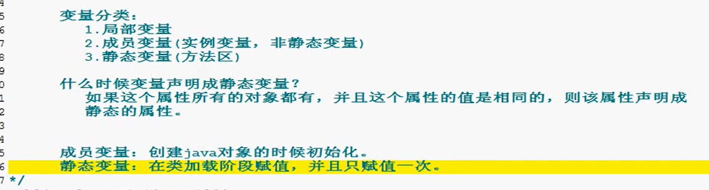
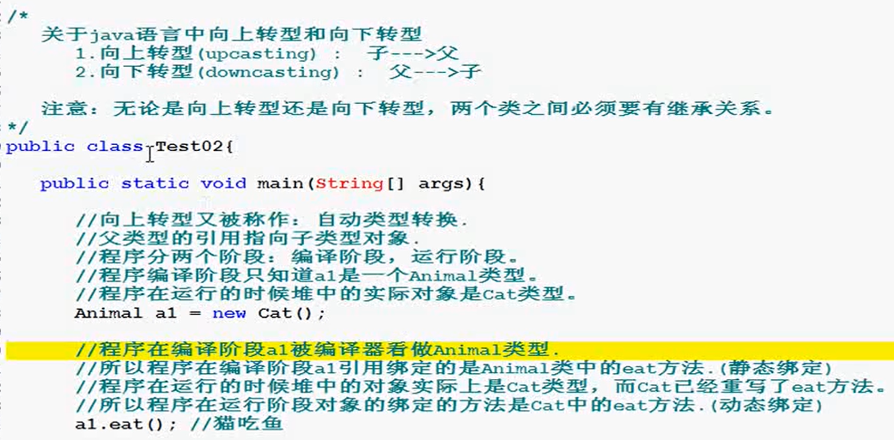
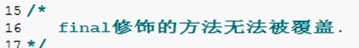
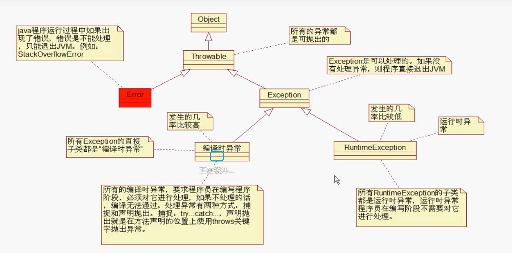
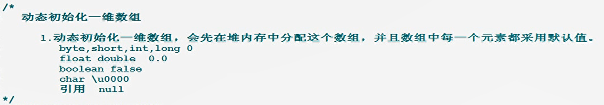
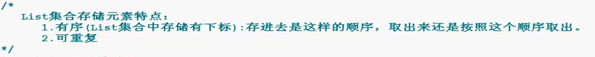
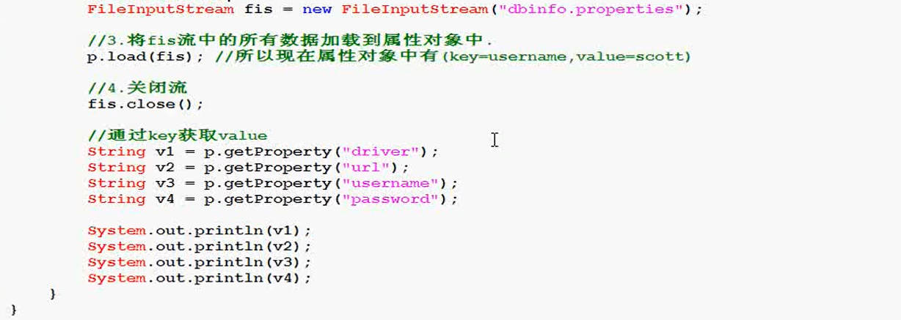

#  JAVASE

### 面向对象

#### 方法的重载

- **方法的重载，为什么要重载，有什么优缺点**

- 

- **public static void main(String[] args)也可以看成是一个方法，是java开发者与程序员之间的一个协议**

- ### 也可以有其他的main方法但是参数列表不能一样。

  ## 重点：java中new一个对象，对象会在虚拟机中的堆内存中创建；当给这个对象一个局部变量/引用时，这个局部变量/引用是该对象在虚拟机中的地址。

  ## 调用成员方法/成员变量都是通过“引用.”调用，所以在成员方法成员变量调用时出现的“this.属性/this.方法”==“引用.属性/引用.方法”

- ### 面向对象：耦合度比较低，扩展能力高

- ### 面向过程：软件较为简单，后期维护困难，因果性较强，牵一发而动全身。

- ### 面向对象的三大特点：封装，继承，多态

- ### 什么是成员变量？什么是局部变量/引用？在对象创建的过程中JVM会创建一个  heap（堆）来存放对象。                                                                                                      引用中保存的是对象在堆中的内存地址，通过引用便可以间接的访问对象和对象中的方法                             

     ### 成员变量/实例变量/非静态变量/成员方法  ：对象中的属性和方法 ，类中的属性；局部变量则是方法内部的属性    

     

     ### 访问成员变量/成员方法，必须通过“引用.”

     

     ### 补充：静态方法/静态变量的调用时：“类名.”

- ```
     Student stu1=new Student();//stu1便是引用变量
     stu1.name//通过“引用.”访问对象属性
     ```

- 

- ### 13.对象的封装性/成员方法

- 

- ### 14.什么是构造方法？构造方法有什么作用？怎么定义构造方法

- 

     ### 15.java内存JVM的划分

- 

- ### 16.对象没有更多的引用指向，则变成了垃圾

- 

- ### 17.基本类型和引用类型的值传递。注意：类是放在堆区中，局部变量指向引用类型是指向堆中的地址。局部变量的改变只是换了一个地址，但是指向的对象还是一样的。


#### this关键字  

- 


- ### 成员变量的访问格式是：“引用.属性”


```
Employ e=new Employ();
e.add(100);//e去调用add，则当前add中的this则代表的就是e对象
成员方法
public void add(int a){
	system.out.prinrln(this.a);
}
```

- ### 19.this不能用在静态方法中

- 

- ### 20.this可以用在构造方法中

- 

- #### 实例语句块在创建对象之前，静态语句块在类加载之前

#### static关键字

- 

- ### 22.在方法调用的过程中什么时候可以省略类名？

- 

- ### 23.static关键字/静态方法在调用过程中压根不需要对象。直接用“类名.”。

- 


#### 变量的分类

- **成员变量：方法层级，通过"对象."或者“引用.”,成员变量在jvm中存放在堆区中的每个方法体内部**

- **静态变量：类层级，通过“类名.”，静态变量在jvm中存放在方法区中，整个类都可以共用**

- **静态语句块：类加载的过程中执行**

- **实例语句块：构造方法被调用时执行**

- **空指针异常：空引用访问成员******（空的引用调用静态变量/方法不会报空指针异常）****

- 

#### 变量分类

- 


### 面向对象第一章


#### 方法的继承

- ### 继承：子类可以继承父类的所有非private的属性和方法，不能继承构造方法

- **父类  ，超类  ，  基类， superclass**

     - **子类   派生类，  subclass**
     - 
     -  


#### 方法的覆盖，方法的重写，override，overwrite（只针对成员方法）

- 


#### 多态详解（父类型的引用指向子类型的对象）

- ### 向上转型（自动类型转换）和向下转型（强制转换）

- ### 程序在两个阶段          编译阶段（会静态绑定/不动）和运行阶段（会发生动态绑定/动）        分析         向上转型和向下转型

- ### instanceof：为避免向下转型时出现错误，可以加一个instanceof判断，是否是自己预期的转型

- 


```
Animal a=new Dog();
a.eat();

person p=new person();
Dog d=new Dog();
p.feed(d);

public void feed(Animal a){//Animal a=new Dog();
    a.eat();    //a.eat();
}
```

#### 多态的好处

- 

- 在使用多态的时候只要

- 父类

- ```
     public class animal {
         public void eat(){}
     }
     ```

- 子类（猫类，狗类）

- ```
     public class dog extends animal{
         public void eat(){
             System.out.println("狗在吃饭。。。");
         }
     }
     
     public class cat extends animal{
         public void eat(){
             System.out.println("猫在吃饭。。。");
         }
     }
     ```

- 关联类

- ```
     public class person {
         //喂养
         public void weifan(animal a){//animal a=new dog();向上转型
             //编译过程中进行静态绑定，引用变量的类型比对象类型大，并且animal类型含有该方法
             a.eat();//动态绑定，引用类型自动变为了dog类型去进行
         }
     }
     ```

- 测试类

- ```
     public class test_01 {
         public static void main(String[] args) {
     //        创建主人
             person p=new person();
     //        创建宠物
             dog d=new dog();
             cat c=new cat();
     //        喂养
             p.weifan(d);//d=new dog()
             p.weifan(c);
         }
     }
     ```


#### super关键字详解

- super和this一样都不能用在静态方法中

- 

- 

- ### super关键字用在构造方法

- 


#### final关键字详解

- 




#### 抽象类详解


#### 接口详解


- **接口继承多个接口**

- 

- **一个类可以实现多个接口**，**需要对实现的接口中的方法进行完全覆盖**

- 

- ### 33.接口的作用

- 

- ```
     接口层
     package implement_02;
     
     public interface engine {
         void start();
     }
     
     
     面向接口实现类
     package implement_02;
     //面向接口实现类
     //发动机
     //实现接口
     public class huaweiengine implements engine{
         @Override
         public void start() {
             System.out.println("huaweiengine启动了!!!");
         }
     }
     package implement_02;
     //面向接口实现类
     //发动机
     //实现接口
     public class ronyaoengine implements engine{
         @Override
         public void start() {
             System.out.println("ronyaoengine启动了!!!");
         }
     }
     
     
     直接面向接口进行编程，不去管接口的实现层，调用的时候结合多态便可，耦合度很低
     package implement_02;
     //面向接口编程
     //生成手机
     public class telephone {
     //引擎
         engine e;//面向接口类，未面向具体类，结合多态
         public telephone(engine e){
             this.e=e;
         }
     //    手机应该可以测试引擎
         public void testengine(){
             e.start();//面向接口类，未面向具体类
         }
     }
     
     
     
     测试层
     public class test_01 {
         public static void main(String[] args) {
             //生产引擎
     //        engine e1=new huaweiengine();//多态
             huaweiengine e1=new huaweiengine();
     //        e1=new ronyaoengine();
             //生产汽车
             telephone phone=new telephone(e1);
             //测试引擎
             phone.testengine();
         }
     }
     
     ```

#### Object中的tostring方法

- 

     

#### hashcode方法：

java对象的内存地址经过哈希算法得出的int类型值再转换成十六进制

print方法后面括号中如果是一个引用类型，会默认调用引用类型的toString方法


#### equals方法

- 


 

#### finalize方法和hashCode方法

- 


- #### hashCode方法

- 


#### JDK常用工具包

- 


#### 访问控制权限


#### 静态内部类

- 


### 异常机制：

#### 1.异常继承结构详解



#### 2.处理异常方式——声明抛出（throw）


#### 3.处理异常方式——捕抓（try。。。catch。。。finally。。。）


**如果在catch代码块中含有return结束语句。那么会先去执行完finally再执行return语句**


 **Tp:printStackTrace()相当于没有处理这个异常**

#### 4.printstacktrace（）和getmessage()


**e.getmessage()输出的只是printstacktrace中的一个值（打印的第一行的值）**

getMessage()是异常描述信息

printStackTrace（）是异常的堆栈信息

如果某个方法出现异常会抛给throws方法的调用者，直到出现处理的方式；如果到主函数仍让未处理，则会抛给JVM，JVM对异常的处理就是printStackTrace()（方法为打印异常的跟踪信息栈，并终止程序的运行）

#### 5.自定义异常


#### 6.方法的重写与异常


### 数组

#### 1.一维数组内存分析


#### 2.动态初始化一维数组




#### 3.数组的拷贝


数组的结构：一维：{}        二维：{ {}，{}，{}，{} }（把一维当作元素）

#### 4.数组Arrays工具类

### 常用工具类

#### 1.String详解


Object中的equals方法比较的是字符串的内存地址

String中重写的equals方法比较的是字符串的内容

- **分析程序创建字符串对象的区别，new对象，和在字符串常量池中创建**
- 


#### 2.字符串常用的方法

- 常用的构造方法

- 常用的方法
- 
- 
- 


#### 3.正则表达式


#### 4.StringBuffer和StringBuilder

>java.lang.StringBuffer
>
>java.lang.StringBuilder
>
>1. StringBuffer和StringBuilder是什么？
>
>   答：是一个字符串缓冲区
>
>2. 工作原理？
>
>   答：预先在内存中申请一块空间，以容纳字符序列，如果预留的空间不够了，会进行自动扩容，以容纳更多的字符。
>
>3. StringBuffer和StringBuilder的区别？
>
>   答：StringBuffer是线程安全的，StringBuilder是线程不安全的。
>
>   ​		StringBuffer有关键字Synchronized的修饰，而StringBuffer没有
>
>   ​		如果在单线程运行中StringBuffer的运行速度小于StringBuilder，因为StringBuilder不需要考虑线程安全，而StringBuffer则每次都需要判断锁。
>
>   ​		StringBuffer和StringBuilder功能上是等价的。
>
>   ​		（Synchronized具有原子性，可见性，排序性）
>
>4. StringBuffer和StringBuilder的默认初始化常量是16.
>
>5. 如何优化stringBuffer和stringBuilder呢?
>
>   答：最好在创建stringBuffer之前,预测stringBuffer的存储字符数量,然后再创建stringBuffer的时候采用指定初始化容量的方式创建stringBuffer.为了减少底层数组的拷贝。提高擞率。
>
>


创建字符串缓冲区对象

如果字符串要进行频繁的拼接，那么则建议使用StringBuffer，这个方法不会出现太多的垃圾


#### 5.基本数据类型的包装类型详解


常用的方法以Integer为例，其他五个类似

转十进制，八进制，十六进制，二进制

最重要见下


自动装箱和自动拆箱，就可以解释之前int和Integer类型相互自动转换的问题

#### 6.日期类型

**常用日期类**


SimpleDateFormat为日期的格式化类

格式化的两种方法

1.sdf.format(time);——string类型（time为date类型）

2.sdf.parse（time）;——date类型


```
        Date datenow=new Date();
        System.out.println(datenow);
        //1.格式化
        SimpleDateFormat sdf=new SimpleDateFormat("yyyy年MM月dd日HH时mm分ss秒");
        //2.开始格式化Date转String
        String sdftime=sdf.format(datenow);
        
        System.out.println(sdftime);
        try{
        //3.String转Date
            Date datenow2=sdf.parse(sdftime);
            System.out.println(datenow2);
        }catch (ParseException e){
            e.printStackTrace();
        }
		A
		//4.Date（long）的构造方法
        Long scu=System.currentTimeMillis();
        Long scu2=System.currentTimeMillis()-60*1000*10;
        System.out.println(scu);

        Date d2=new Date(scu);
        System.out.println(sdf.format(d2));
        System.out.println(sdf.format(new Date(scu2)));
```

#### 7.随机数Random

#### 8.枚举


#### 9.数字类详解

**DecimalFormat类：数字格式化**


**BigDecimal适合做财务软件**


# 集合

集合分为一个一个存，和一对一对存

集合只能存储引用类型

## 集合纲要


Collection<E>这个接口是一个一个存

集合——Collection的继承结构图


单向链表详解


 

## Collection集合详解

### Collection的一些基本方法


### Iterator的一些基本方法

```java
Iterator itr=c.iterator();
itr.hasNext()
itr.next()
itr.remove();
```


 

## List集合详解

### List集合的特点




结构图


## set集合详解

### Hashset集合详解：


**插入时候的操作，需要判断是否该插入插入到什么位置**

**hashMap的key和hashSet必须重写equals和hashCode方法**

向哈希表中添加元素需要先通过key的hashCode方法确认hash值。存在就直接添加，不存在则调用equals方法继续比较

需要在比较的类中重写hashCode和equals方法

### SortedSet集合详解：


或者写一个比较器


**自动排序需要那些步骤**（SortedSet和SortedMap都要重写或者写比较器）

**一定要重写Comparable接口****或者写一个比较器**

**自定义实体类需要实现Comparable重写compareTo方法**（基 本类型已经重写了Comparable接口）

单独写一个比较器

### 数据结构_哈希表_散列表详解

	

## Map集合详解

### 集合Map的继承结构图


### Map的常用方法


​	

### Properties简单方法介绍


# 多线程

## 多线程的基本概念

### 什么是进程？

### 多进程有什么作用？


### 什么是线程


### 多进程有什么作用？


例子


### java程序的运行原理


## 线程的创建和启动

### 实现多线程的第一种方式——继承Thread类


调用线程的图解


### 实现多线程的第二种方式——继承Runnable类


## 线程的生命周期

### UML描述线程的生命周期


## 线程的调度与控制


### 线程优先级01


### 线程优先级02


### Thread sleep


注意：这是一个静态方法，引用/类名.实质上都是类名.调用

### Thread yield


### Thread join

注意：它是一个成员方法

线程的合并，可以将多个线程合并成一个线程。

```
public static void main(String[] args) throws Exception{
	Thread t=new(new processtext())
	t.join()//t和主线程合并
}
```

谁合并了谁，就先执行完谁再执行下一个

## interrupt(中断)

作用：中断线程

可以通过中断线程触发InterruptedException异常来终止程序，但这并非正常的终止过程。

## 如何正确的停止一个线程


## 线程的同步（加锁）

### 为什么需要同步


### 使用线程同步synchronized

### synchronized对象锁


**在成员方法中this代表的东西别忘记了，是该方法的类！！！**


**注意：遇到synchronized才会去寻找对象锁。线程寻找对象锁必须是同一个对象**

**synchronized关键字也可以用在成员方法上**


### synchronized类锁

类锁只有一把，所以无论是不是同一个对象，如果在静态方法中有synchronized关键字修饰的话就需要等待


## 守护线程


#### 定时器的作用

 

#### java多线程——继2019java376集

# 反射机制

## 反射机制

>所谓的反射机制就是java语言**在运行时拥有一项自观的能力**。通过这种能力可以彻底的了解自身的情况为下一步的动作做准备。
>
>Java的反射机制的实现要借助于4个类：**class，Constructor，Field，Method;**
>
>其中class代表的时类对 象，Constructor－类的构造器对象，Field－类的属性对象，Method－类的方法对象。
>
>通过这四个对象我们可以粗略的看到一个类的各个组成部分。


## Java反射的作用

>在Java运行时环境中，对于任意一个类，**可以知道这个类有哪些属性和方法。**
>
>**对于任意一个对象，可以调用它的任意一个方法**。
>
>这种**动态获取类的信息以及动态调用对象的方法的功能**来自于Java 语言的**反射（Reflection）机制。**
>
>


## Java 反射机制提供功能

>在运行时判断任意一个对象所属的类。
>
>在运行时构造任意一个类的对象。
>
>在运行时判断任意一个类所具有的成员变量和方法。
>
>在运行时调用任意一个对象的方法
>
>


## reflect概述


## 获取Class的三种方法

```
第一种方式
Class c1=Class.forName("Employee")//c1引用保存内存地址指向堆中的对象，该对象代表的是Employee整个类
第二种方式，java中每个类型都有class属性（最佳）
Class c2=Employee.class
第三种方式  java语言中任何一个java对象都有getClass方法
Employee e=new Employee();
Class c3=e.getClass;//C3是运行时类（e的运行时类时Employee）
因为Employee这个类在JVM中只有一个，所以c1，c2，c3的内存地址时相同的，指向堆中唯一的一个对象
```


## 通过Class类对象创建java对象

```
Class c=A.class;//用这个方法获取Class时，静态语句块是不会执行的，也就是说类不会加载
Class.forName("A");//用这个方法的话A.class文件会装载到JVM中，也就是说类会加载
```


我们获取了Class类型的对象之后，可以通过Class类中的**newInstance()**方法创建**无参数**的构造方法


## 可变长参数

**1.可变长参数传参格式**
**public void m1(类型... 局部变量)**
**2.m1方法被调用是，传递的实参可以是0~N个**
**3.如果可以精确匹配方法，那么他就不会去调用含有可变长参数的那个方法**
**4.可变长参数可以等同看作数组**
**5.可变长参数在参数列表中只能出现一次，而且只能出现在最后一位**


## IO和Properties配置文件联合应用——属性文件（配置文件）

属性文件以“.properties”结尾

属性文件可以以“空格”，"冒号"，“等号”作为分割符，如果都有则以首个符号为分隔符

properties为map下的一个类（线程安全），是一个属性类，以key和value的方式存储元素，但是key和value只能是字符串类型

*创建属性对象指的就是创建properties对象*




## 反编译某个类的所有属性Field


返回某个类的公共类属性


getFields:获取public属性

getDeclaredField()：获取所有的属性

getDeclaredField(String field):获取特定的属性

get.getModifiers():获取属性的修饰符

get.Type().SimpleName（）:获取属性的类型名字的简称

```
import java.lang.reflect.Field;
import java.lang.reflect.Modifier;

public class FiledRefllect_text1 {
    public static void main(String[] args) throws Exception{
        Class c=Class.forName("Employee");
//        Object o=c.newInstance();
        Field[] f=c.getDeclaredFields();
        for(Field fff:f){
            System.out.println(Modifier.toString(fff.getModifiers()));
            System.out.println(fff.getType().getSimpleName());
            System.out.println(fff.getName());
        }


        StringBuffer sb=new StringBuffer();
        sb.append(Modifier.toString(c.getModifiers())+" class "+c.getName()+"{\n");
        for (Field fff:f
             ) {
            sb.append("\t");
            sb.append(Modifier.toString(fff.getModifiers())+" ");
            sb.append(fff.getType().getSimpleName()+";\n");

        }
        sb.append("}");
        System.out.println(sb);
    }
}

```

f.set(o,"尤梓涵");

属性对象.set(类对象,设置内容);

f.setAccessible(true);

取消java语言访问权限

```
import java.lang.reflect.Field;

public class FiledReflect_Main {
    public static void main(String[] args) throws Exception{
//        设置一个对象
        Class c=Class.forName("User");
        Object o=c.newInstance();
//        获取特定的属性
        Field f=c.getDeclaredField("username");
//        设置属性值
//        取消java语言访问权限
        f.setAccessible(true);
        f.set(o,"尤梓涵");
        System.out.println(f.get(o));
//        获取属性
    }

}
```

## 反编译某个类的所有方法Method

getReturnType（）:获取返回值类型


getParameterTypes():获取所有的形参


通过反射机制反编译莫个具体的方法

invoke（）：通过这个方法，反射生成的对象就可以进行调用具体的方法。

```
public Object invoke(Object obj，Object... args)
```

```
//        通过反射机制执行login方法
        Object oinvoke=m.invoke(o,"admin","admin");
        Object oinvoke2=m2.invoke(o,"admin");
```

## 反射某个类的某个构造方法

获取构造方法：getDeclaredConstructor（

创建对象：newInstance（）；


## 反射某个类父类和父接口

获取父类：superClass()

获取父接口：getInterFaces（）；


# 第十二章 泛型

## 12.1 泛型的概念

### 12.1.1 泛型的引入

例如：生产瓶子的厂家，一开始并不知道我们将来会用瓶子装什么，我们什么都可以装，但是有的时候，我们在使用时，想要限定某个瓶子只能用来装什么，这样我们不会装错，而用的时候也可以放心的使用，无需再三思量。我们生活中是**在使用这个瓶子时在瓶子上“贴标签”**，这样就轻松解决了问题。


还有，在Java中我们在声明方法时，当在完成方法功能时如果有未知的数据需要参与，这些未知的数据需要在调用方法时才能确定，那么我们把这样的数据通过形参表示。那么在方法体中，用这个形参名来代表那个未知的数据，而调用者在调用时，对应的传入值就可以了。


受以上两点启发，JDK1.5设计了泛型的概念。泛型即为“类型参数”，这个类型参数在声明它的类、接口或方法中，代表未知的通用的类型。例如：

java.lang.Comparable接口和java.util.Comparator接口，是用于对象比较大小的规范接口，这两个接口只是限定了当一个对象大于另一个对象时返回正整数，小于返回负整数，等于返回0。但是并不确定是什么类型的对象比较大小，之前的时候只能用Object类型表示，使用时既麻烦又不安全，因此JDK1.5就给它们增加了泛型。

```java
public interface Comparable<T>{
    int compareTo(T o) ;
}
```

```java
public interface Comparator<T>{
     int compare(T o1, T o2) ;
}
```

其中<T>就是类型参数，即泛型。

### 12.1.2 泛型的好处

示例代码：

JavaBean：圆类型

```java
class Circle{
	private double radius;

	public Circle(double radius) {
		super();
		this.radius = radius;
	}

	public double getRadius() {
		return radius;
	}

	public void setRadius(double radius) {
		this.radius = radius;
	}

	@Override
	public String toString() {
		return "Circle [radius=" + radius + "]";
	}
	
}
```

比较器

```java
import java.util.Comparator;

public class CircleComparator implements Comparator{

	@Override
	public int compare(Object o1, Object o2) {
		//强制类型转换
		Circle c1 = (Circle) o1;
		Circle c2 = (Circle) o2;
		return Double.compare(c1.getRadius(), c2.getRadius());
	}
	
}
```

测试类

```java
public class TestGeneric {
	public static void main(String[] args) {
		CircleComparator com = new CircleComparator();
		System.out.println(com.compare(new Circle(1), new Circle(2)));
		
		System.out.println(com.compare("圆1", "圆2"));//运行时异常：ClassCastException
	}
}
```

那么我们在使用如上面这样的接口时，如果没有泛型或不指定泛型，很麻烦，而且有安全隐患。

*缺点：*

**因为在设计（编译）Comparator接口时，不知道它会用于哪种类型的对象比较，因此只能将compare方法的形参设计为Object类型，而实际在compare方法中需要向下转型为Circle，才能调用Circle类的getRadius()获取半径值进行比较。**

使用泛型：

比较器：

```java
class CircleComparator implements Comparator<Circle>{

	@Override
	public int compare(Circle o1, Circle o2) {
		//不再需要强制类型转换，代码更简洁
		return Double.compare(o1.getRadius(), o2.getRadius());
	}
	
}
```

测试类

```java
import java.util.Comparator;

public class TestGeneric {
	public static void main(String[] args) {
		CircleComparator com = new CircleComparator();
		System.out.println(com.compare(new Circle(1), new Circle(2)));
		
//		System.out.println(com.compare("圆1", "圆2"));
//		编译错误，因为"圆1", "圆2"不是Circle类型，是String类型，编译器提前报错，而不是冒着风险在运行时再报错
	}
}
```

**如果有了泛型并使用泛型，那么既能保证安全，又能简化代码。**

**因为把不安全的因素在编译期间就排除了；既然通过了编译，那么类型一定是符合要求的，就避免了类型转换。**

### 12.1.3 泛型的相关名词

**定义：**

*<类型>这种语法形式就叫泛型。*


其中：

- <T>是**类型变量**（Type Variables），而<T>是代表未知的数据类型，我们可以指定为<String>，<Integer>，<Circle>等，那么<类型>的形式我们成为**类型参数；**

- 类比方法的参数的概念，我们可以把<T>，称为**类型形参**，将<Circle>称为**类型实参**，有助于我们理解泛型；

- Comparator<T0>这种就称为**参数化类型（**Parameterized Types）。

自从有了泛型之后，Java的数据类型就更丰富了：


Class：`Class` 类的实例表示正在运行的 Java 应用程序中的类和接口。枚举是一种类，注释是一种接口。每个数组属于被映射为 Class  对象的一个类，所有具有相同元素类型和维数的数组都共享该 `Class` 对象。基本的 Java  类型（`boolean`、`byte`、`char`、`short`、`int`、`long`、`float`  和 `double`）和关键字 `void` 也表示为 `Class` 对象。 

- GenericArrayType：泛化的数组类型，即T[]
- ParameterizedType：参数化类型，例如：Comparator<T>，Comparator<String>
- TypeVariable：类型变量，例如：Comparator<T>中的T，Map<K,V>中的K,V
- WildcardType：通配符类型，例如：Comparator<?>等

### 12.1.4 在哪里可以声明类型变量\<T>

- **泛型不能是基本数据类型，只能是包装类**
- **如果实例化时，没有指明泛型的类型，默认类型位Object类型**

- **声明类或接口时，在类名或接口名后面声明类型变量，我们把这样的类或接口称为泛型类或泛型接口**

```java
【修饰符】 class 类名<类型变量列表> 【extends 父类】 【implements 父接口们】{
    
}
【修饰符】 interface 接口名<类型变量列表> 【implements 父接口们】{
    
}

例如：
public class ArrayList<E>    
public interface Map<K,V>{
    ....
}    
```

- 声明方法时，在【修饰符】与返回值类型之间声明类型变量，我们把声明（是<font color='red'>**声明**</font>不是单纯的使用）了类型变量的方法称为泛型方法

```java
【修饰符】 <类型变量列表> 返回值类型 方法名(【形参列表】)【throws 异常列表】{
    //...
}

例如：java.util.Arrays类中的
public static <T> List<T> asList(T... a){
    ....
}
```


## 12.2 参数类型：泛型类与泛型接口

当我们在声明类或接口时，类或接口中定义某个成员时，该成员有些类型是不确定的，而这个类型需要在使用这个类或接口时才可以确定，那么我们可以使用泛型。

### 12.2.1 声明泛型类与泛型接口

语法格式：

```java
【修饰符】 class 类名<类型变量列表> 【extends 父类】 【implements 父接口们】{
    
}
【修饰符】 interface 接口名<类型变量列表> 【implements 父接口们】{
    
}
```

注意：

* <类型变量列表>：可以是一个或多个类型变量，一般都是使用单个的大写字母表示。例如：<T>、<K,V>等。
* <类型变量列表>中的类型变量不能用于静态成员上。

什么时候使用泛型类或泛型接口呢？

- 当某个类的非静态实例变量的类型不确定，需要在创建对象或子类继承时才能确定
- 当某个（些）类的非静态方法的形参类型不确定，需要在创建对象或子类继承时才能确定

示例代码：

例如：我们要声明一个学生类，该学生包含姓名、成绩，而此时学生的成绩类型不确定，为什么呢，因为，语文老师希望成绩是“优秀”、“良好”、“及格”、“不及格”，数学老师希望成绩是89.5, 65.0，英语老师希望成绩是'A','B','C','D','E'。那么我们在设计这个学生类时，就可以使用泛型。

```java
public class Student<T>{
	private String name;
	private T score;
	
	public Student() {
		super();
	}
	public Student(String name, T score) {
		super();
		this.name = name;
		this.score = score;
	}
	public String getName() {
		return name;
	}
	public void setName(String name) {
		this.name = name;
	}
	public T getScore() {
		return score;
	}
	public void setScore(T score) {
		this.score = score;
	}
	@Override
	public String toString() {
		return "姓名：" + name + ", 成绩：" + score;
	}
}
```

### 12.2.2 使用泛型类与泛型接口

在使用这种参数化的类与接口时，我们需要指定泛型变量的实际类型参数：

（1）**实际类型参数必须是引用数据类型，不能是基本数据类型**

（2）在创建类的对象时指定类型变量对应的实际类型参数

```java
public class TestGeneric{
	public static void main(String[] args) {
		//语文老师使用时：
		Student<String> stu1 = new Student<String>("张三", "良好");
        
		//数学老师使用时：
        //Student<double> stu2 = new Student<double>("张三", 90.5);//错误，必须是引用数据类型
		Student<Double> stu2 = new Student<Double>("张三", 90.5);
        
		//英语老师使用时：
		Student<Character> stu3 = new Student<Character>("张三", 'C');
        
        //错误的指定
        //Student<Object> stu = new Student<String>();//错误的
	}
}
```

> JDK1.7支持简写形式：Student<String> stu1 = new Student<>("张三", "良好");
>
> 指定泛型实参时，必须左右两边一致，不存在多态现象

（3）在继承泛型类或实现泛型接口时，**指定类型变量对应的实际类型参数，那么实例类调用该类就不需要再添加泛型**

​			如果类型变量没有指明实际类型参数，则这个继承或者实现泛型接口的类或泛型仍然需要再指明类型变量（泛型）

```java
class ChineseStudent extends Student<String>{

	public ChineseStudent() {
		super();
	}

	public ChineseStudent(String name, String score) {
		super(name, score);
	}
	
}
```

```java
public class TestGeneric{
	public static void main(String[] args) {
		//语文老师使用时：
		ChineseStudent stu = new ChineseStudent("张三", "良好");
	}
}

```

```java
class Circle implements Comparable<Circle>{
	private double radius;

	public Circle(double radius) {
		super();
		this.radius = radius;
	}

	public double getRadius() {
		return radius;
	}

	public void setRadius(double radius) {
		this.radius = radius;
	}

	@Override
	public String toString() {
		return "Circle [radius=" + radius + "]";
	}
    
    @Override
    public int compareTo(Circle c){
        return Double.compare(radius,c.radius);
    }
	
}
```

### 12.2.3 类型变量的上限

>定义：
>
>当在声明类型变量时，如果不希望这个类型变量代表任意引用数据类型，
>
>而是某个系列的引用数据类型，那么可以设定类型变量的上限。


语法格式：

```
<类型变量  extends 上限>
```

如果有多个上限

```
<类型变量  extends 上限1 & 上限2>
```

> 如果多个上限中有类有接口，那么只能有一个类，而且必须写在最左边。接口的话，可以多个。
>
> **如果在声明<类型变量>时没有指定任何上限，默认上限是java.lang.Object。(也就是可以是任意的数据类型)**

例如：我们要声明一个两个数求和的工具类，要求两个加数必须是Number数字类型，并且**实现Comparable接口。**

```java
class SumTools<T extends Number & Comparable<T>>{
	private T a;
	private T b;
	public SumTools(T a, T b) {
		super();
		this.a = a;
		this.b = b;
	}
	@SuppressWarnings("unchecked")
	public T getSum(){
		if(a instanceof BigInteger){
			return (T) ((BigInteger) a).add((BigInteger)b);
		}else if(a instanceof BigDecimal){
			return (T) ((BigDecimal) a).add((BigDecimal)b);
		}else if(a instanceof Integer){
			return (T)(Integer.valueOf((Integer)a+(Integer)b));
		}else if(a instanceof Long){
			return (T)(Long.valueOf((Long)a+(Long)b));
		}else if(a instanceof Float){
			return (T)(Float.valueOf((Float)a+(Float)b));
		}else if(a instanceof Double){
			return (T)(Double.valueOf((Double)a+(Double)b));
		}
		throw new UnsupportedOperationException("不支持该操作");
	}
}
```

测试类

```java
	public static void main(String[] args) {
		SumTools<Integer> s = new SumTools<Integer>(1,2);
		Integer sum = s.getSum();
		System.out.println(sum);
		
//		SumTools<String> s = new SumTools<String>("1","2");//错误，因为String类型不是extends Number
	}
```

### 12.2.4 泛型擦除

当使用参数化类型的类或接口时，如果没有指定泛型，那么会怎么样呢？

会发生泛型擦除，自动按照最左边的第一个上限处理。**如果没有指定上限，上限即为Object。**

```java
	public static void main(String[] args) {
		SumTools s = new SumTools(1,2);
		Number sum = s.getSum();
		System.out.println(sum);
	}
```

```java
import java.util.Comparator;

public class CircleComparator implements Comparator{

	@Override
	public int compare(Object o1, Object o2) {
		//强制类型转换
		Circle c1 = (Circle) o1;
		Circle c2 = (Circle) o2;
		return Double.compare(c1.getRadius(), c2.getRadius());
	}
	
}
```

### 12.2.5 练习

#### 练习1 

1、声明一个坐标类Coordinate<T>，它有两个属性：x,y，都为T类型
2、在测试类中，创建两个不同的坐标类对象，
分别指定T类型为String和Double，并为x,y赋值，打印对象

```java
public class TestExer1 {
	public static void main(String[] args) {
		Coordinate<String> c1 = new Coordinate<>("北纬38.6", "东经36.8");
		System.out.println(c1);
		
//		Coordinate<Double> c2 = new Coordinate<>(38.6, 38);//自动装箱与拆箱只能与对应的类型 38是int，自动装为Integer
		Coordinate<Double> c2 = new Coordinate<>(38.6, 36.8);
		System.out.println(c2);
	}
}
class Coordinate<T>{
	private T x;
	private T y;
	public Coordinate(T x, T y) {
		super();
		this.x = x;
		this.y = y;
	}
	public Coordinate() {
		super();
	}
	public T getX() {
		return x;
	}
	public void setX(T x) {
		this.x = x;
	}
	public T getY() {
		return y;
	}
	public void setY(T y) {
		this.y = y;
	}
	@Override
	public String toString() {
		return "Coordinate [x=" + x + ", y=" + y + "]";
	}
	
}
```

#### 练习2

1、声明一个Person类，包含姓名和伴侣属性，其中姓名是String类型，而伴侣的类型不确定，
因为伴侣可以是Person，可以是Animal（例如：金刚），可以是Ghost鬼（例如：倩女幽魂），
可以是Demon妖（例如：白娘子），可以是Robot机器人（例如：剪刀手爱德华）。。。

2、在测试类中，创建Person对象，并为它指定伴侣，打印显示信息

```java
public class TestExer3 {
	@SuppressWarnings({ "rawtypes", "unchecked" })
	public static void main(String[] args) {
		Person<Demon> xu = new Person<Demon>("许仙",new Demon("白娘子"));
		System.out.println(xu);
		
		Person<Person> xie = new Person<Person>("谢学建",new Person("徐余龙"));
		Person fere = xie.getFere();
		fere.setFere(xie);
		System.out.println(xie);
		System.out.println(fere);
	}
}
class Demon{
	private String name;

	public Demon(String name) {
		super();
		this.name = name;
	}

	@Override
	public String toString() {
		return "Demon [name=" + name + "]";
	}
}
class Person<T>{
	private String name;
	private T fere;
	public Person(String name, T fere) {
		super();
		this.name = name;
		this.fere = fere;
	}
	public Person(String name) {
		super();
		this.name = name;
	}

	public Person() {
		super();
	}
	public String getName() {
		return name;
	}
	public void setName(String name) {
		this.name = name;
	}
	public T getFere() {
		return fere;
	}
	public void setFere(T fere) {
		this.fere = fere;
	}
	@SuppressWarnings("rawtypes")
	@Override
	public String toString() {
		if(fere instanceof Person){
			Person p = (Person) fere;
			return "Person [name=" + name + ", fere=" + p.getName() + "]";
		}
		return "Person [name=" + name + ", fere=" + fere + "]";
	}
}
```

#### 练习3

1、声明员工类型Employee，包含姓名（String），薪资（double），年龄（int）

2、员工类Employee实现java.lang.Comparable<T>接口，指定T为Employee类型，重写抽象方法，按照薪资比较大小，薪资相同的按照姓名的自然顺序比较大小。

3、在测试类中创建Employee数组，然后调用Arrays.sort(Object[] arr)方法进行排序，遍历显示员工信息

4、再次调用Arrays.sort(Object[] arr,Comparator<T> c)方法进行按照年龄排序，年龄相同的安装姓名自然顺序比较大小，遍历显示员工信息

```java
public class TestExer3 {
	@Test
	public void test01() {
		Employee[] arr = new Employee[3];
		arr[0] = new Employee("Irene", 18000, 18);
		arr[1] = new Employee("Jack", 14000, 28);
		arr[2] = new Employee("Alice", 14000, 24);
		
		Arrays.sort(arr);
		
		for (int i = 0; i < arr.length; i++) {
			System.out.println(arr[i]);
		}
	}
	
	@Test
	public void test02() {
		Employee[] arr = new Employee[3];
		arr[0] = new Employee("Irene", 18000, 18);
		arr[1] = new Employee("Jack", 14000, 28);
		arr[2] = new Employee("Alice", 14000, 24);
		
		//Arrays.sort(T[] arr,Comparator<T> c)
		Arrays.sort(arr, new Comparator<Employee>() {

			//按照年龄排序，年龄相同的安装姓名自然顺序比较大小
			@Override
			public int compare(Employee o1, Employee o2) {
				if(o1.getAge() != o2.getAge()) {
					return o1.getAge() - o2.getAge();
				}
				return o1.getName().compareTo(o2.getName());
			}
			
		});
		
		for (int i = 0; i < arr.length; i++) {
			System.out.println(arr[i]);
		}
	}
}
class Employee implements Comparable<Employee>{
	private String name;
	private double salary;
	private int age;
	public Employee(String name, double salary, int age) {
		super();
		this.name = name;
		this.salary = salary;
		this.age = age;
	}
	public Employee() {
		super();
	}
	public String getName() {
		return name;
	}
	public void setName(String name) {
		this.name = name;
	}
	public double getSalary() {
		return salary;
	}
	public void setSalary(double salary) {
		this.salary = salary;
	}
	public int getAge() {
		return age;
	}
	public void setAge(int age) {
		this.age = age;
	}
	@Override
	public String toString() {
		return "Employee [name=" + name + ", salary=" + salary + ", age=" + age + "]";
	}
	
	//重写抽象方法，按照薪资比较大小，薪资相同的按照姓名的自然顺序比较大小。
	@Override
	public int compareTo(Employee o) {
		if(this.salary != o.salary) {
			return Double.compare(this.salary, o.salary);
		}
		return this.name.compareTo(o.name);//name是String类型，有compareTo方法
	}
	
}
```


## 12.3 泛型方法

前面介绍了在定义类、接口时可以声明<类型变量>，在该类的方法和属性定义、接口的方法定义中，这些<类型变量>可被当成普通类型来用。但是，在另外一些情况下，

（1）如果我们定义类、接口时没有使用<类型变量>，但是某个方法形参类型不确定时，可以单独这个方法定义<类型变量>；

（2）**另外我们之前说类和接口上的类型形参是不能用于静态方法中，那么当某个静态方法的形参类型不确定时**

**，可以单独定义<类型变量>。**

那么，JDK1.5之后，还提供了泛型方法的支持。

语法格式：

```java
【修饰符】 <类型变量列表> 返回值类型 方法名(【形参列表】)【throws 异常列表】{
    //...
}
```

* <类型变量列表>：可以是一个或多个类型变量，一般都是使用单个的大写字母表示。例如：<T>、<K,V>等。
* <类型变量>同样也可以指定上限

示例代码：

```java
public <E> E getdata(){
    return E;
}
```


我们编写一个数组工具类，包含可以给任意对象数组进行从小到大排序，要求数组元素类型必须实现Comparable接口

```java
public class MyArrays{
	public static <T extends Comparable<T>> void sort(T[] arr){
		for (int i = 1; i < arr.length; i++) {
			for (int j = 0; j < arr.length-i; j++) {
				if(arr[j].compareTo(arr[j+1])>0){
					T temp = arr[j];
					arr[j] = arr[j+1];
					arr[j+1] = temp;
				}
			}
		}
	}
}
```

测试类

```java
public class TestGeneric{
	public static void main(String[] args) {
		int[] arr = {3,2,5,1,4};
//		MyArrays.sort(arr);//错误的，因为int[]不是对象数组
		
		String[] strings = {"hello","java","chai"};
		MyArrays.sort(strings);
		System.out.println(Arrays.toString(strings));
		
		Circle[] circles = {new Circle(2.0),new Circle(1.2),new Circle(3.0)};
		MyArrays.sort(circles);
		System.out.println(Arrays.toString(circles));
	}
}
```


## 12.4 类型通配符 

**使用情况：**

>当我们声明一个变量/形参时，这个变量/形参的类型是一个泛型类或泛型接口，
>
>例如：Comparator<T>类型，但是**我们仍然无法确定这个泛型类或泛型接口的类型变量<T>的具体类型（一种类型，多种类型）**
>
>此时我们考虑使用类型通配符。

**注意：类A是类B的父类，G<A>和G<B>是没有关系的，二者共同的父类是：G<?>**


例如：

这个学生类是一个参数化的泛型类，代码如下（详细请看$12.2.1中的示例说明）：


```java
public class Student<T>{
	private String name;
	private T score;
	
	public Student() {
		super();
	}
	public Student(String name, T score) {
		super();
		this.name = name;
		this.score = score;
	}
	public String getName() {
		return name;
	}
	public void setName(String name) {
		this.name = name;
	}
	public T getScore() {
		return score;
	}
	public void setScore(T score) {
		this.score = score;
	}
	@Override
	public String toString() {
		return "姓名：" + name + ", 成绩：" + score;
	}
}
```

### 12.4.1 <?>任意类型

例如：我们要声明一个学生管理类，这个管理类要包含一个方法，可以遍历学生数组。

学生管理类：

```java
class StudentService {
	public static void print(Student<?>[] arr) {
		for (int i = 0; i < arr.length; i++) {
			System.out.println(arr[i]);
		}
	}
}
```

测试类


```java
public class TestGeneric {
	public static void main(String[] args) {
		// 语文老师使用时：
		Student<String> stu1 = new Student<String>("张三", "良好");

		// 数学老师使用时：
		// Student<double> stu2 = new Student<double>("张三", 90.5);//错误，必须是引用数据类型
		Student<Double> stu2 = new Student<Double>("张三", 90.5);

		// 英语老师使用时：
		Student<Character> stu3 = new Student<Character>("张三", 'C');

		Student<?>[] arr = new Student[3];
		arr[0] = stu1;
		arr[1] = stu2;
		arr[2] = stu3;

		StudentService.print(arr);
	}
}
```

### 12.4.2 <? extends 上限>

例如：我们要声明一个学生管理类，这个管理类要包含一个方法，找出学生数组中成绩最高的学生对象。

要求学生的成绩的类型必须可比较大小，实现Comparable接口。

**这里的上限最高就只能是“上限类”及上限的“子类”**

学生管理类：

```java
class StudentService {
	@SuppressWarnings({ "rawtypes", "unchecked" })
	public static Student<? extends Comparable> max(Student<? extends Comparable>[] arr){
		Student<? extends Comparable> max = arr[0];
		for (int i = 0; i < arr.length; i++) {
			if(arr[i].getScore().compareTo(max.getScore())>0){
				max = arr[i];
			}
		}
		return max;
	}
}
```

测试类

```java
public class TestGeneric {
	@SuppressWarnings({ "rawtypes", "unchecked" })
	public static void main(String[] args) {
		Student<? extends Double>[] arr = new Student[3];
		arr[0] = new Student<Double>("张三", 90.5);
		arr[1] = new Student<Double>("李四", 80.5);
		arr[2] = new Student<Double>("王五", 94.5);
		
		Student<? extends Comparable> max = StudentService.max(arr);
		System.out.println(max);
	}
}
```

### 12.4.3 <? super 下限>

现在要声明一个数组工具类，包含可以给任意对象数组进行从小到大排序，只要你指定定制比较器对象，

**而且这个定制比较器对象可以是当前数组元素类型自己或其父类的定制比较器对象**

数组工具类：

```java
class MyArrays{
	public static <T> void sort(T[] arr, Comparator<? super T> c){
		for (int i = 1; i < arr.length; i++) {
			for (int j = 0; j < arr.length-i; j++) {
				if(c.compare(arr[j], arr[j+1])>0){
					T temp = arr[j];
					arr[j] = arr[j+1];
					arr[j+1] = temp;
				}
			}
		}
	}
}
```

例如：有如下JavaBean

```java
class Person{
	private String name;
	private int age;
	public Person(String name, int age) {
		super();
		this.name = name;
		this.age = age;
	}
	public Person() {
		super();
	}
	public String getName() {
		return name;
	}
	public void setName(String name) {
		this.name = name;
	}
	public int getAge() {
		return age;
	}
	public void setAge(int age) {
		this.age = age;
	}
	@Override
	public String toString() {
		return "name=" + name + ", age=" + age;
	}
}
class Student extends Person{
	private int score;

	public Student(String name, int age, int score) {
		super(name, age);
		this.score = score;
	}

	public Student() {
		super();
	}

	public int getScore() {
		return score;
	}

	public void setScore(int score) {
		this.score = score;
	}

	@Override
	public String toString() {
		return super.toString() + ",score=" + score;
	}
	
}
```

测试类

```java
public class TestGeneric {
	public static void main(String[] args) {
		Student[] all = new Student[3];
		all[0] = new Student("张三", 23, 89);
		all[1] = new Student("李四", 22, 99);
		all[2] = new Student("王五", 25, 67);
		
		MyArrays.sort(all, new Comparator<Person>() {

			@Override
			public int compare(Person o1, Person o2) {
				return o1.getAge() - o2.getAge();
			}
		});
		
		System.out.println(Arrays.toString(all));
		
		MyArrays.sort(all, new Comparator<Student>() {

			@Override
			public int compare(Student o1, Student o2) {
				return o1.getScore() - o2.getScore();
			}
		});
		System.out.println(Arrays.toString(all));
	}
}
```

### 12.4.4 使用类型通配符来指定类型参数的问题

<?>：不可变，因为<?>类型不确定，编译时，任意类型都是错

<? extends 上限>：因为<? extends 上限>的?可能是上限或上限的子类，即类型不确定，编译按任意类型处理都是错。

<? super 下限>：可以将值修改为下限或下限子类的对象，因为<? super 下限>?代表是下限或下限的父类，那么设置为下限或下限子类的对象是安全的。

```java
public class TestGeneric {
	public static void main(String[] args) {
		Student<?> stu1 = new Student<>();
		stu1.setScore(null);//除了null，无法设置为其他值
		
		
		Student<? extends Number> stu2 = new Student<>();
		stu2.setScore(null);//除了null，无法设置为其他值
		
		Student<? super Number> stu3 = new Student<>();
		stu3.setScore(56);//可以设置Number或其子类的对象
	}
}
class Student<T>{
	private String name;
	private T score;
	
	public Student() {
		super();
	}
	public Student(String name, T score) {
		super();
		this.name = name;
		this.score = score;
	}
	public String getName() {
		return name;
	}
	public void setName(String name) {
		this.name = name;
	}
	public T getScore() {
		return score;
	}
	public void setScore(T score) {
		this.score = score;
	}
	@Override
	public String toString() {
		return "姓名：" + name + ", 成绩：" + score;
	}
}
```

## 12.5 练习

在数组工具类中声明如下泛型方法：

（1）可以在任意类型的对象数组中，查找某个元素的下标，按照顺序查找，如果有重复的，就返回第一个找到的，如果没有返回-1

（2）可以在任意类型的对象数组中，查找最大值，要求元素必须实现Comparable接口

（3）可以在任意类型的对象数组中，查找最大值，按照指定定制比较器来比较元素大小

（4）可以给任意对象数组进行从小到大排序，要求数组元素类型必须实现Comparable接口

（5）可以给任意对象数组进行从小到大排序，只要你指定定制比较器对象，不要求数组元素实现Comparable接口

（6）可以将任意对象数组的元素拼接为一个字符串返回

```java
public class MyArrays {
	//可以在任意类型的对象数组中，查找某个元素的下标，按照顺序查找，如果有重复的，就返回第一个找到的，如果没有返回-1
	public static <T> int find(T[] arr, T value) {
		for (int i = 0; i < arr.length; i++) {
			if(arr[i].equals(value)) {//使用==比较太严格，使用equals方法，因为任意对象都有equals方法
				return i;
			}
		}
		return -1;
	}
	
	//可以在任意类型的对象数组中，查找最大值，要求元素必须实现Comparable接口
	public static <T extends Comparable<? super T>> T max(T[] arr) {
		T max = arr[0];
		for (int i = 0; i < arr.length; i++) {
			if(max.compareTo(arr[i])<0) {//if(max < arr[i]) {
				max = arr[i];
			}
		}
		return max;
	}
	
	//可以在任意类型的对象数组中，查找最大值，按照指定定制比较器来比较元素大小
	public static <T> T max(T[] arr, Comparator<? super T> c) {
		T max = arr[0];
		for (int i = 0; i < arr.length; i++) {
			if(c.compare(max, arr[i])<0) {//if(max < arr[i]) {
				max = arr[i];
			}
		}
		return max;
	}
	
	//可以给任意对象数组进行从小到大排序，要求数组元素类型必须实现Comparable接口
	public static <T extends Comparable<? super T>> void sort(T[] arr) {
		for (int i = 0; i < arr.length-1; i++) {
			int minIndex = i;
			for (int j = i+1; j < arr.length; j++) {
				if(arr[minIndex].compareTo(arr[j])>0) {
					minIndex = j;
				}
			}
			if(minIndex!=i) {
				T temp = arr[minIndex];
				arr[minIndex] = arr[i];
				arr[i] = temp;
			}
		}
	}
	
	//可以给任意对象数组进行从小到大排序，只要你指定定制比较器对象，不要求数组元素实现Comparable接口
	public static <T> void sort(T[] arr, Comparator<? super T> c) {
		for (int i = 0; i < arr.length-1; i++) {
			int minIndex = i;
			for (int j = i+1; j < arr.length; j++) {
				if(c.compare(arr[minIndex],arr[j])>0) {
					minIndex = j;
				}
			}
			if(minIndex!=i) {
				T temp = arr[minIndex];
				arr[minIndex] = arr[i];
				arr[i] = temp;
			}
		}
	}
	
	//可以将任意对象数组的元素拼接为一个字符串返回
	public static <T> String toString(T[] arr) {
		String str = "[";
		for (int i = 0; i < arr.length; i++) {
			if(i==0) {
				str += arr[i];
			}else {
				str += "," + arr[i];
			}
		}
		str += "]";
		return str;
	}
}
```


·
