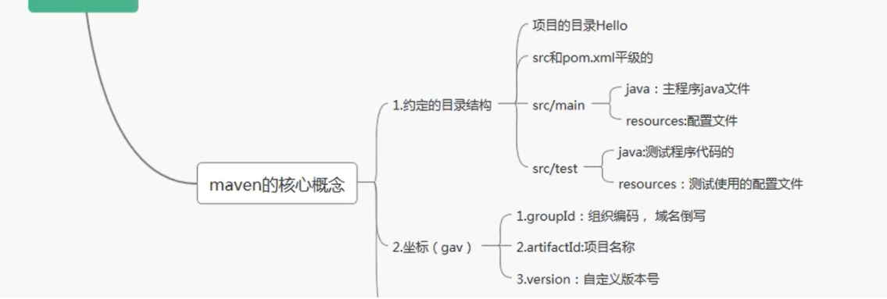
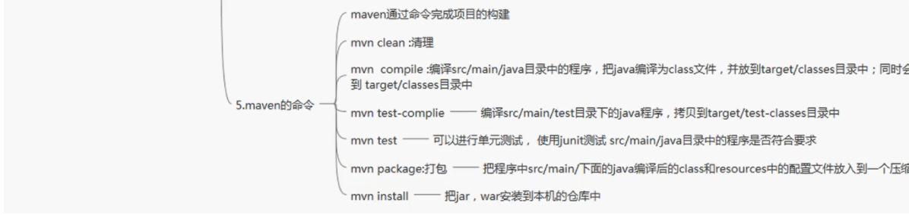
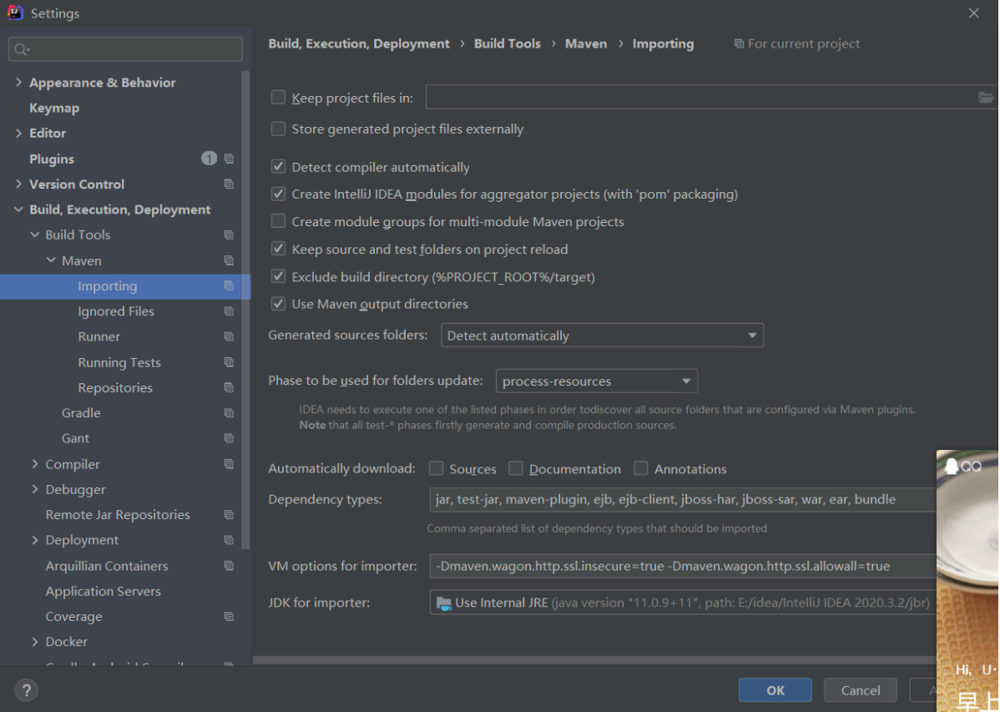
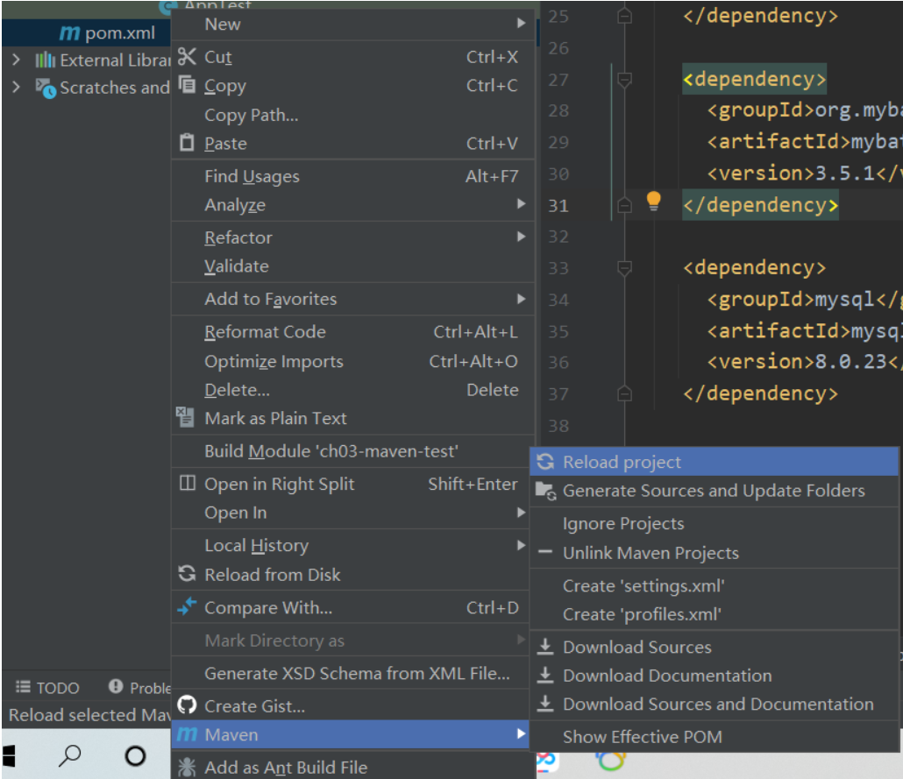
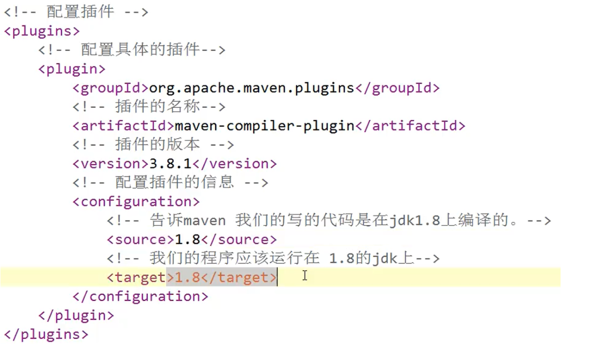
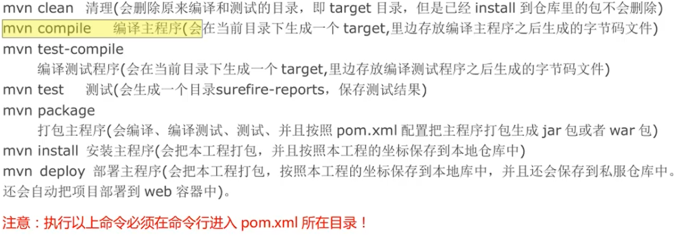
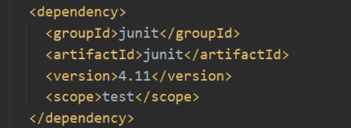
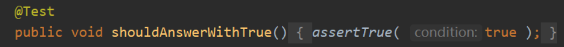
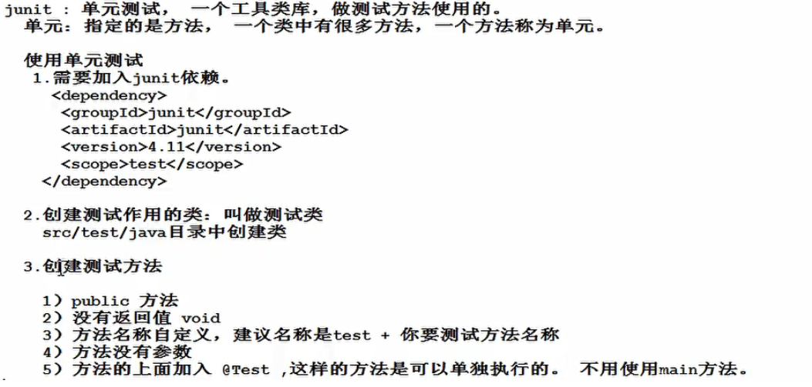

修改maven的镜像


group:指的是组织id

Artifact：指的是项目名称

# maven








## 一部分

### 1.完成一个java项目，需要做哪些工作

1.分析项目要做什么，知道项目有哪些组成部分。
2.设计项目，通过哪些步骤，使用哪些技术。需要多少人， 多长的时间。
3.组建团队，招人， 购置设备，服务器， 软件， 笔记本。
4.开发人员写代码。 开发人员需要测试自己写代码。 重复多次的工作。
5.测试人员，测试项目功能是否符合要求。
  测试开发人员提交代码-如果测试有问题--需要开发人员修改--在提交代码给测试
  --测试人员在测试代码-如果还有问题-在交给开发人员-开发人员在提交-在测试
  直到-测试代码通过。

### 2.传统开发项目的问题，没有使用maven【meivn】管理的项目

  1）很多模块，模块之间有关系， 手工管理关系，比较繁琐。
  2）需要很多第三方功能， 需要很多jar文件，需要手工从网络中获取各个jar
  3）需要管理jar的版本， 你需要的是mysql.5.1.5.jar 拿你不能给给一个mysql.4.0.jar
  4）管理jar文件之间的依赖， 你的项目要使用a.jar 需要使用b.jar里面的类。
     必须首先获取到b.jar才可以， 然后才能使用a.jar. 

     a.jar需要b.jar这个关系叫做依赖， 或者你的项目中要使用mysql的驱动， 也可以叫做项目依赖mysql驱动。
     a.class使用b.class， a依赖b类

###  3.需要改进项目的开发和管理，需要maven

​    1）maven可以管理jar文件
​    2）自动下载jar和他的文档，源代码
​    3）管理jar直接的依赖， a.jar需要b.jar ， maven会自动下载b.jar
​    4）管理你需要的jar版本*(需要什么版本的就会下什么版本)*
​    5）帮你编译程序，把java编译为class
​    6）帮你测试你的代码是否正确。
​    7）帮你打包文件，形成jar文件，或者war文件
​    8）帮你部署项目

###  4.构建： 项目的构建。

   构建是面向过程的，就是一些步骤，完成项目代码的编译，测试，运行，打包，部署等等。
   maven支持的构建包括有：
    1.清理， 把之前项目编译的东西删除掉，我新的编译代码做准备。
    2.编译， 把程序源代码编译为执行代码， java-class文件
             批量的，maven可以同时把成千上百的文件编译为class。
	     javac 不一样，javac一次编译一个文件。
    3.测试， maven可以执行测试程序代码，验证你的功能是否正确。
             批量的，maven同时执行多个测试代码，同时测试很多功能。
    4.报告， 生成测试结果的文件， 测试通过没有。
    5.打包， 把你的项目中所有的class文件，配置文件等所有资源放到一个压缩文件中。
              这个压缩文件就是项目的结果文件， 通常java程序，

​			压缩文件是jar扩展名的。
​	      对于web应用，压缩文件扩展名是.war
​    6.安装， 把5中生成的文件jar，war安装到本机仓库
​    7.部署， 把程序安装好可以执行。


###  5.maven核心概念： 用好maven，了解这些概念

①POM ： 一个文件 名称是pom.xml ,  pom翻译过来叫做项目对象模型。 
         maven把一个项目当做一个模型使用。控制maven构建项目的过程，管理jar依赖。

②约定的目录结构 ： maven项目的目录和文件的位置都是规定的。

③坐标 ： 是一个唯一的字符串，用来表示资源的。

④依赖管理 ： 管理你的项目可以使用jar文件

⑤仓库管理（了解） ：你的资源存放的位置

⑥生命周期 (了解) ： maven工具构建项目的过程，就是生命周期。
⑦插件和目标（了解）：执行maven构建的时候用的工具是插件
⑧继承
⑨聚合

讲maven的使用，先难后易的。 难是说使用maven的命令，完成maven使用 ， 在idea中直接使用maven，代替命令。

### 6.maven工具的安装和配置。

  1）需要从maven的官网下载maven的安装包 apache-maven-3.3.9-bin.zip
  2）解压安装包，解压到一个目录，非中文目录。
      子目录 bin :执行程序，主要是mvn.cmd
		       conf :maven工具本身的配置文件 settings.xml
  3）配置环境变量
     在系统的环境变量中，指定一个M2_HOME的名称， 指定它的值是maven工具安装目录，bin之前的目录

    M2_HOME=D:\work\maven_work\apache-maven-3.3.9
    
     再把M2_HOME加入到path之中，在所有路径之前加入 %M2_HOME%\bin;

  4）验证，新的命令行中，执行mvn -v

	注意：需要配置JAVA_HOME ，指定jdk路径

  


	C:\Users\Administrator>mvn -v
	 出现如下内容，maven安装，配置正确。
	Apache Maven 3.3.9 (bb52d8502b132ec0a5a3f4c09453c07478323dc5; 2015-11-11T00:41:4
	Maven home: D:\work\maven_work\apache-maven-3.3.9
	Java version: 1.8.0_40, vendor: Oracle Corporation
	Java home: C:\java\JDK8-64\jre
	Default locale: zh_CN, platform encoding: GBK
	OS name: "windows 7", version: "6.1", arch: "amd64", family: "dos"

自动依赖的设置

1.到idea2020版本之后，maven导入依赖包需要手动更新，如果对pom.xml文件更新后需要点旁边的更新按钮

2.或者在设置中进行的这个位置加入



-Dmaven.wagon.http.ssl.insecure=true -Dmaven.wagon.http.ssl.allowall=true

3.在pom.xml左侧单击选择Maven，Reload project单机即可重新更新



## 二部分

###  1.maven约定的目录结构， 约定是大家都遵循的一个规则。

   每一个maven项目在磁盘中都是一个文件夹（项目-Hello）
	Hello/
	  ---/src
	  ------/main           #放你主程序java代码和配置文件
	  ----------/java       #你的程序包和包中的java文件
	  ----------/resources  #你的java程序中要使用的配置文件

​	  ------/test  #放测试程序代码和文件的（可以没有）

​	  ----------/java       #测试程序包和包中的java文件
​	  ----------/resources  #测试java程序中要使用的配置文件

 	 ---pom.xml  #maven的核心文件（maven项目必须有）

###  2.疑问： mvn compile 编译src/main目录下的所有java文件的。

   1）为什么要下载
	   maven工具执行的操作需要很多插件（java类--jar文件）完成的
	2）下载什么东西了
	    jar文件--叫做插件--插件是完成某些功能

​	3）下载的东西存放到哪里了。
 	   默认仓库（本机仓库）：
 	  C:\Users\（登录操作系统的用户名）Administrator\.m2\repository

	Downloading: https://repo.maven.apache.org/maven2/org/apache/maven/maven-plugin-parameter-documenter-2.0.9.pom

   https://repo.maven.apache.org ：中央仓库的地址


设置本机存放资源的目录位置(设置本机仓库)：
 1. 修改maven的配置文件， maven安装目录/conf/settings.xml
    先备份 settings.xml

 2. 修改 <localRepository>  指定你的目录（不要使用中文目录）

 D:\work\maven_work\maven_repository

执行mvn compile， 结果是在项目的根目录下生成target目录（结果目录）
maven编译的java程序，最后的class文件都放在target目录中，执行文件也是执行class文件，就是说在target中执行可执行文件


###  3.仓库

  1）仓库是什么： 仓库是存放东西的， 存放maven使用的jar 和 我们项目使用的jar
     > maven使用的插件（各种jar）
	  > 我项目使用的jar(第三方的工具)

  2）仓库的分类
     >本地仓库， 就是你的个人计算机上的文件夹，存放各种jar
	  >远程仓库， 在互联网上的，使用网络才能使用的仓库
	    ①：中央仓库，最权威的， 所有的开发人员都共享使用的一个集中的仓库，
			      https://repo.maven.apache.org ：中央仓库的地址
		②：中央仓库的镜像：就是中央仓库的备份， 在各大洲，重要的城市都是镜像。

​		③：私服，在公司内部，在局域网中使用的， 不是对外使用的。

仓库的地址：mvnrepository.com

  3）仓库的使用，maven仓库的使用不需要人为参与。 
    	开发人员需要使用mysql驱动--->maven首先查本地仓库--->私服--->镜像--->中央仓库

###  4.pom:项目对象模型，是一个pom.xml文件

​    1）坐标：唯一值， 在互联网中唯一标识一个项目的
​	  <groupId>公司域名的倒写</groupId>
​     <artifactId>自定义项目名称</artifactId>
​     <version>自定版本号</version>

   https://mvnrepository.com/ 搜索使用的中央仓库， 使用groupId 或者 artifactId作为搜索条件

​     2） packaging： 打包后压缩文件的扩展名，默认是jar ，web应用是war 
​      packaging 可以不写， 默认是jar

​	 3) 依赖
​    dependencies 和dependency ，相当于是 java代码中import

​    你的项目中要使用的各种资源说明， 比我的项目要使用mysql驱动

	<dependencies>
		<!--依赖  java代码中 import -->
	  	 <dependency>
			<groupId>mysql</groupId>
			<artifactId>mysql-connector-java</artifactId>
			<version>5.1.9</version>
		 </dependency>
	</dependencies>
	
	4）properties：设置属性

  5）build ： maven在进行项目的构建时， 配置信息，例如指定编译java代码使用的jdk的版本等

例子如下




###   5.maven生命周期， maven的命令，maven的插件

maven的生命周期：就是maven构建项目的过程，清理，编译，测试，报告，打包，安装，部署
maven的命令：maven独立使用，通过命令，完成maven的生命周期的执行。
	              maven可以使用命令，完成项目的清理，编译，测试等等

maven的插件： maven命令执行时，真正完成功能的是插件，插件就是一些jar文件， 一些类。


   1）单元测试（测试方法）：用的是junit， junit是一个专门测试的框架（工具）。
	     junit测试的内容： 测试的是类中的方法， 每一个方法都是独立测试的。
		方法是测试的基本单位（单元）。

  maven借助单元测试，批量的测试你类中的大量方法是否符合预期的。


   2）使用步骤
     1.加入依赖，在pom.xml加入单元测试依赖
	  	 <!-- 单元测试 -->
		 <dependency>
			<groupId>junit</groupId>
			<artifactId>junit</artifactId>
			<version>4.11</version>
			<scope>test</scope>
		</dependency>

 2.在maven项目中的src/test/java目录下，创建测试程序。
    推荐的创建类和方法的提示：
	1.测试类的名称 是Test + 你要测试的类名
	2.测试的方法名称 是：Test + 方法名称

​    例如你要测试HelloMaven ,
​    创建测试类 TestHelloMaven

   @Test
	 public void testAdd(){
      测试HelloMaven的add方法是否正确
	 }

测试方法


		 其中testAdd叫做测试方法，它的定义规则
		 1.方法是public的，必须的
		 2.方法没有返回值， 必须的
		 3.方法名称是自定义的，推荐是Test + 方法名称
		 4.在方法的上面加入 @Test

###      6.mvn 指令 

   编译main/java/目录下的java 为class文件， 同时把class拷贝到 target/classes目录下面
	把main/resources目录下的所有文件 都拷贝到target/classes目录下



## 三部分

###  1.在idea中设置maven ，让idea和maven结合使用。 

   idea中内置了maven ，一般不使用内置的， 因为用内置修改maven的设置不方便。
	使用自己安装的maven， 需要覆盖idea中的默认的设置。让idea指定maven安装位置等信息

配置的入口 ①：配置当前工程的设置， file--settings ---Build, Excution,Deployment--Build Tools
               --Maven 
					   Maven Home directory: maven的安装目录
						User Settings File :  就是maven安装目录conf/setting.xml配置文件
						Local Repository :    本机仓库的目录位置

 				--Build Tools--Maven--Runner  
 						  VM Options : archetypeCatalog=internal
 						  JRE: 你项目的jdk
 	
 				-DarchetypeCatalog=internal , maven项目创建时，会联网下载模版文件，
 						  比较大， 使用-DarchetypeCatalog=internal，不用下载， 创建maven项目速度快。

​            ②：配置以后新建工程的设置， file--other settings--Settings for New Project


### 2.使用模版创建项目

  1）maven-archetype-quickstart : 普通的java项目
  2）maven-archetype-webapp : web工程

## 四部分

###  依赖范围， 使用scope表示的。

   scope的值有 compile, test, provided ,默认是compile
	scope:表示依赖使用的范围，也就是在maven构建项目的那些阶段中起作用。
	    maven构建项目  编译， 测试 ，打包， 安装 ，部署 过程（阶段）

   junit的依赖范围是 test
	<dependency>
      <groupId>junit</groupId>
      <artifactId>junit</artifactId>
      <version>4.11</version>
      <scope>test</scope>
    </dependency>

<dependency>
  <groupId>a</groupId>
  <artifactId>b</artifactId>   b.jar
  <version>4.11</version>
</dependency>

 <dependency>
  <groupId>javax.servlet</groupId>
  <artifactId>javax.servlet-api</artifactId>
  <version>3.1.0</version>          servlet.jar
  <scope>provided</scope> 提供者
</dependency>

   你在写项目的中的用到的所有依赖（jar ） ，必须在本地仓库中有。
​	没有必须通过maven下载， 包括provided的都必须下载。

你在servlet需要继承HttpServlet( provided) , 你使用的HttpServlet是maven仓库中的。

当你的写好的程序， 放到 tomat服务器中运行时， 此时你的程序中不包含servlet的jar
因为tomcat提供了 servlet的.jar


## 五部分

  maven常用操作

###   1.maven的属性设置

​     <properties> 设置maven的常用属性（jdk的版本，字符编码等）

###   2.maven的全局变量

​     自定义的属性，1.在<properties> 通过自定义标签声明变量（标签名就是变量名）
​	                 		   2.在pom.xml文件中的其它位置，使用 ${标签名} 使用变量的值

​	自定义全局变量一般是定义 依赖的版本号， 当你的项目中要使用多个相同的版本号，
​	先使用全局变量定义， 在使用${变量名}

###   3.资源插件

  <build>
	<resources>
	<resource>
	<directory>src/main/java</directory><!--所在的目录-->
	<includes><!--包括目录下的.properties,.xml 文件都会扫描到-->
	<include>**/*.properties</include>
	<include>**/*.xml</include>
	</includes>
	<!—filtering 选项 false 不启用过滤器， *.property 已经起到过滤的作用了 -->
	<filtering>false</filtering>
	</resource>
	</resources>
  </build>

  作用： mybatis课程中会用到这个作用

  1. 默认没有使用resources的时候， maven执行编译代码时， 会把src/main/resource目录中的文件拷贝到target/classes目录中。


## 六部分

### target文件夹

***target\***是用来**存放**项目构建后的**文件和目录、jar包、war包、编译的class**文件，，所有都是Maven构建时生成的。

### create from archetype

为什么要点create from archetype？

因为点了后会从默认的模板中创建maven项目，更快更简洁

###  maven中的测试类/单元测试junnit

maven中有一个依赖时单元测试依赖



通过此依赖，需要再测试方法前加@text才能运行测试





### dependency

加依赖，加jar包，导入jar包

### plugin

加入所需插件

### Resource（资源）

简单介绍：

构建Maven项目的时候，如果没有进行特殊的配置，Maven会按照标准的目录结构查找和处理各种类型文件。
● src/main/java和src/test/java 
这两个目录中的所有*.java文件会分别在comile和test-comiple阶段被编译，编译结果分别放到了target/classes和targe/test-classes目录中，但是这两个目录中的其他文件都会被忽略掉。

● src/main/resouces和src/test/resources
这两个目录中的文件也会分别被复制到target/classes和target/test-classes目录中。

● target/classes
打包插件默认会把这个目录中的所有内容打入到jar包或者war包中。


**配置POM.XML的resource把xml也打包到mapper目录下**

    <build>
       <!-- 资源目录 -->    
        <resources>    
            <resource>    
                <!-- 设定主资源目录  -->    
                <directory>src/main/java</directory>    
     
                <!-- maven default生命周期，process-resources阶段执行maven-resources-plugin插件的resources目标处理主资源目下的资源文件时，只处理如下配置中包含的资源类型 -->     
    			 <includes>
    				  <include>**/*.xml</include>
    			 </includes>  
                     
                <!-- maven default生命周期，process-resources阶段执行maven-resources-plugin插件的resources目标处理主资源目下的资源文件时，不处理如下配置中包含的资源类型（剔除下如下配置中包含的资源类型）-->      
    			<excludes>  
    				<exclude>**/*.yaml</exclude>  
    			</excludes>  
     
                <!-- maven default生命周期，process-resources阶段执行maven-resources-plugin插件的resources目标处理主资源目下的资源文件时，指定处理后的资源文件输出目录，默认是${build.outputDirectory}指定的目录-->      
                <!--<targetPath>${build.outputDirectory}</targetPath> -->      
       
                <!-- maven default生命周期，process-resources阶段执行maven-resources-plugin插件的resources目标处理主资源目下的资源文件时，是否对主资源目录开启资源过滤 -->    
                <filtering>true</filtering>     
            </resource>  			
        </resources> 	
     </build>

# 配置阿里云镜像

1) 为了以后下载jar包方便，配置阿里云镜像

将以下标签配置到<mirrors></mirrors>标签里面

```
  <mirror>      
  	<id>nexus-aliyun</id>      
  	<mirrorOf>central</mirrorOf>      
  	<name>Nexus aliyun</name>      
  	<url>http://maven.aliyun.com/nexus/content/groups/public</url>  
  </mirror>  
```

