# Mybatis-plus

# 前言

## 简单介绍

>在持久层框架中mybatis应用比较多，而且比重在逐渐的上升。**通常项目的组合是SSM。mybatis之所以火，是因为他的灵活，使用方便，优化比较容易。**
>
>mybatis的直接执行sql语句，sql语句是写在xml文件中，使用mybatis需要多个xml配置文件，在一定程度上比较繁琐。一般数据库的操作都要涉及到CURD。
>
>**mybatis-plus是在mybatis 上的增强，减少了xml的配置，几乎不用编写xml就可以做到单表的CURD**,很是方便，极大提供了开发的效率。我们写程序目的就是让生活更加简单。


## 什么是mybatis-plus

>MyBatis-Plus(简称MP)是一个MyBatis的增强工具，在MyBatis的基础上只做增强不做改变，为简化开发、提高效率而生。
>
>MyBatis-Plus在MyBatis之上套了一层外衣，单表CURD的操作几乎都可以由MyBatis-Plus 代替执行。而且提供了各种查询方式，分页行为。作为使用者无需编写xml,直接调用MyBatis-Plus提供的API就可以了。
>
>官网: http://mp.baomidou.com/
>
>


# 第一个Mybatis项目

## 新建springboot工程

## 指定maven的mybatis-plus依赖，数据库依赖

```xml
<!--        mybatis-plus-->
        <dependency>
            <groupId>com.baomidou</groupId>
            <artifactId>mybatis-plus-boot-starter</artifactId>
            <version>3.0.5</version>
        </dependency>

<!--            mysql配置-->
        <dependency>
            <groupId>mysql</groupId>
            <artifactId>mysql-connector-java</artifactId>
            <scope>runtime</scope>
        </dependency>
<!--lombok用来简化实体类-->
        <dependency>
            <groupId>org.projectlombok</groupId>
            <artifactId>lombok</artifactId>
        </dependency>
```

## 实体类  指定主键类型

**@Data是添加的Lombok注解**

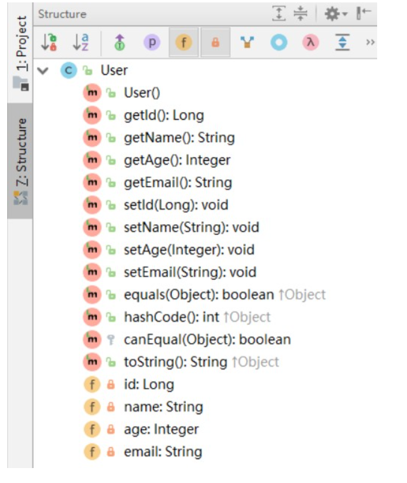

**Lombok的使用说明：**

https://blog.csdn.net/motui/article/details/79012846

```java
@Data
public class User {

    @TableId(
            value = "id",
            type = IdType.AUTO
    )
    /*
        指定主键及它的各种属性
    * 指定主键的方式
    *   value：主键字段的名称，如果是id可以不写
    *   type：指定主键的类型，主键的值如何生成   IdType.AUTO表示增长
    * */
    private String name;
    private Integer id;
    private String email;
    private Integer age;
}
```

## 创建Dao类      继承BaseMapper<实体.class>

BaseMapper:就是MP框架中封装好的mapper对象

* 1.要实现BaseMapper
* 2.BaseMapper的泛型要指定实体类

```java
/*
*自定义Mapper，就是Dao接口。
* 1.要实现BaseMapper
* 2.BaseMapper的泛型要指定实体类
*
* BaseMapper是MP框架中的对象，定义了17个操作方法（crud）
* */
public interface UserMapper extends BaseMapper<User> {

}

```

## 测试类

**注意：**

IDEA在 userMapper 处报错，因为找不到注入的对象，因为类是动态创建的，但是程序可以正确的执行。

为了避免报错，可以在 dao 层 的接口上添加 @Repository 注解

```java
//忽略运行前未bean类的非运行时异常
//也可以在dao方法中将类添加到spring管理
@SuppressWarnings("all")
@SpringBootTest
public class PlusApplicationTests {
    @Autowired
    UserMapper userMapper;
    @Test
    void contextLoads() {
        System.out.println("11");
        User user=userMapper.selectById(1);
        System.out.println(user);
    }

}
```

## 启动类

设置扫描器：指定mapper所在的包

@MapperScan(value = "com.bjpowernode.mybatisplus.mapper")

注意：这个地址是“.”，不是“/”

```java
/*
*   设置扫描器：指定mapper所在的包
* */
@MapperScan(value = "com.bjpowernode.mybatisplus.mapper")
@SpringBootApplication
public class PlusApplication {

    public static void main(String[] args) {
        SpringApplication.run(PlusApplication.class, args);
    }

}
```

# 配置mybatis日志

application.yml

```yaml
mybatis-plus:
  configuration:
    log-impl: org.apache.ibatis.logging.stdout.StdOutImpl
```

# CRUD基本用法

>CRUD 的操作是来自 BaseMapper 中的方法。BaseMapper 中共有 17 个方法，CRUD 操作都有多个不同参数的方法。继承 BaseMapper 可以其中的方法。


BaseMapper 方法列表：

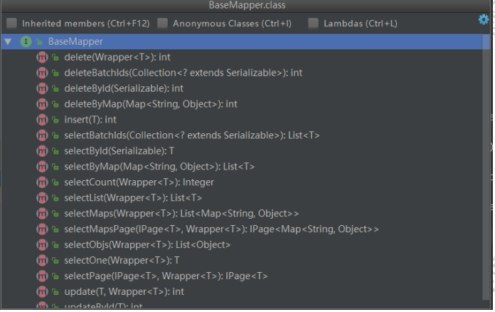

## insert操作

```java
@Test
public void inserttest(){
    for(int i=0;i<10;i++){
        User user=new User();
        user.setAge(20);
        user.setEmail("130450@qq.com");
        user.setName("lisi");
        int row=userMapper.insert(user);
        System.out.println("row="+row);
    }

}
```

注：insert()返回值 int，数据插入成功的行数，成功的记录数。getId()获取主键值

## update操作（还有点小问题）

```java
@Test
public void updatetest(){
    User user=new User();
    user.setName("lisi");
    user.setAge(20);
    user.setEmail("121@qq.com");
    user.setId(3);
    int row=userMapper.updateById(user);
    System.out.println("row="+row);

}
```

注意：null 的字段不更新

## delete操作

### deleteById:按主键删除

```java
@Test
public void deleteTest(){
    int row=userMapper.deleteById(" 1");
    System.out.println("row="+row);
}
```

### 根据 Map 中条件删除

```java
@Test
public void deleteTestmap(){
    Map<String,Object> map=new HashMap<>();
    map.put("age",20);
    int row=userMapper.deleteByMap(map);
    System.out.println("row="+row);
}
```

注：删除条件封装在 Map 中，key 是列名，value 是值，多个 key 之间 and 联接。

### 批量删除

```java
@Test
public void deleteBatech(){
    List<Integer> list=new ArrayList<>();
    list.add(0,15);
    list.add(1,16);
    list.add(2,17);
    int row=userMapper.deleteBatchIds(list);
    System.out.println("row="+row);
}
```

注：list 集合的创建可以使用 lambda 表达式，也可以使用 add()。例如： idlist.add(1); idlist.add(2);idlist.add(3)… 把要删除的 id 放入 List ，传给 deleteBatchIds()。 批量操作使用 in(…)

## select操作

### 根据 id 主键查询

```java
@Test
void contextLoads() {
    System.out.println("11");
    User user=userMapper.selectById(1);
    System.out.println(user);
}
```

### 批量查询记录

```java
@Test
public void selecttest(){
    List<Integer> list=new ArrayList<>();
    list.add(3);
    list.add(4);
    List<User> list1=userMapper.selectBatchIds(list);
    System.out.println(list1.size());
}
```

注：根据 id 查询记录，把需要查询的多个 id 存入到 List，调用 selectBatchIds(), 传入 List，返回值也是 List。 查询条件是 from user where in id (1,2)

### 使用 Map 的条件查询

```java
@Test
public void selectmap(){
    Map<String,Object> map=new HashMap<>();
    map.put("age",24);
    map.put("name","Billie");
    List<User> users=userMapper.selectByMap(map);
    System.out.println(users.size());
}
```


# 条件构造器

## wapper介绍

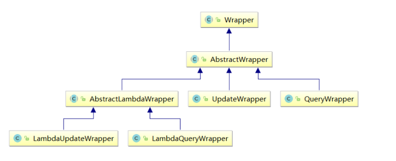

>Wrapper ： 条件构造抽象类，最顶端父类
>
>  AbstractWrapper ： 用于查询条件封装，生成 sql 的 where 条件
>
>​    QueryWrapper ： Entity 对象封装操作类，不是用lambda语法
>
>​    UpdateWrapper ： Update 条件封装，用于Entity对象更新操作
>
>  AbstractLambdaWrapper ： Lambda 语法使用 Wrapper统一处理解析 lambda 获取 column。
>
>​    LambdaQueryWrapper ：看名称也能明白就是用于Lambda语法使用的查询Wrapper
>
>​    LambdaUpdateWrapper ： Lambda 更新封装Wrapper


## AbstractWrapper

**注意：以下条件构造器的方法入参中的 column 均表示数据库字段**

eq相等  ne、neq不相等，  gt大于， lt小于 gte、ge大于等于  lte、le 小于等于  not非  mod求模  is [not] div by是否能被某数整除  is [not] even是否为偶数  is [not] even by b即(b即(a / b)b)b即(a/a/b) % 2 != 0 示例：

### ge、gt、le、lt、isNull、isNotNull

```java
@Test
public void testDelete() {

    QueryWrapper<User> queryWrapper = new QueryWrapper<>();
    queryWrapper
        .isNull("name")
        .ge("age", 12)
        .isNotNull("email");
    int result = userMapper.delete(queryWrapper);
    System.out.println("delete return count = " + result);
}
```


SQL：UPDATE user SET deleted=1 WHERE deleted=0 AND name IS NULL AND age >= ? AND email IS NOT NULL


### eq、ne

**注意：**seletOne返回的是一条实体记录，当出现多条时会报错

```java
@Test
public void testSelectOne() {

    QueryWrapper<User> queryWrapper = new QueryWrapper<>();
    queryWrapper.eq("name", "Tom");

    User user = userMapper.selectOne(queryWrapper);
    System.out.println(user);
}
```


SELECT id,name,age,email,create_time,update_time,deleted,version FROM user WHERE deleted=0 AND name = ? 


### between、notBetween

**包含大小边界**

```java
@Test
public void testSelectCount() {

    QueryWrapper<User> queryWrapper = new QueryWrapper<>();
    queryWrapper.between("age", 20, 30);

    Integer count = userMapper.selectCount(queryWrapper);
    System.out.println(count);
}
```


SELECT COUNT(1) FROM user WHERE deleted=0 AND age BETWEEN ? AND ?


### allEq

```java
@Test
public void testSelectList() {

    QueryWrapper<User> queryWrapper = new QueryWrapper<>();
    Map<String, Object> map = new HashMap<>();
    map.put("id", 2);
    map.put("name", "Jack");
    map.put("age", 20);

    queryWrapper.allEq(map);
    List<User> users = userMapper.selectList(queryWrapper);

    users.forEach(System.out::println);
}
```

SELECT id,name,age,email,create_time,update_time,deleted,version 

FROM user WHERE deleted=0 AND name = ? AND id = ? AND age = ? 


### like、notLike、likeLeft、likeRight

selectMaps返回Map集合列表

```java
@Test
public void testSelectMaps() {

    QueryWrapper<User> queryWrapper = new QueryWrapper<>();
    queryWrapper
        .notLike("name", "e")
        .likeRight("email", "t");

    List<Map<String, Object>> maps = userMapper.selectMaps(queryWrapper);
    //返回值是Map列表
    maps.forEach(System.out::println);
}
```

SELECT id,name,age,email,create_time,update_time,deleted,version 

FROM user WHERE deleted=0 AND name NOT LIKE ? AND email LIKE ?  


### or、and

**注意：**这里使用的是 UpdateWrapper 

不调用or则默认为使用 and 连 

```java
@Test
public void testUpdate1() {

    //修改值
    User user = new User();
    user.setAge(99);
    user.setName("Andy");

    //修改条件
    UpdateWrapper<User> userUpdateWrapper = new UpdateWrapper<>();
    userUpdateWrapper
        .like("name", "h")
        .or()
        .between("age", 20, 30);

    int result = userMapper.update(user, userUpdateWrapper);

    System.out.println(result);
}
```

UPDATE user SET name=?, age=?, update_time=? WHERE deleted=0 AND name LIKE ? OR age BETWEEN ? AND ?


### 嵌套or、嵌套and

这里使用了lambda表达式，or中的表达式最后翻译成sql时会被加上圆括号

```java
@Test
public void testUpdate2() {


    //修改值
    User user = new User();
    user.setAge(99);
    user.setName("Andy");

    //修改条件
    UpdateWrapper<User> userUpdateWrapper = new UpdateWrapper<>();
    userUpdateWrapper
        .like("name", "h")
        .or(i -> i.eq("name", "李白").ne("age", 20));

    int result = userMapper.update(user, userUpdateWrapper);

    System.out.println(result);
}
```

UPDATE user SET name=?, age=?, update_time=? 

WHERE deleted=0 AND name LIKE ? 

OR ( name = ? AND age <> ? ) 

### 指定要查询的列

```java
@Test
public void testSelectListColumn() {

    QueryWrapper<User> queryWrapper = new QueryWrapper<>();
    queryWrapper.select("id", "name", "age");

    List<User> users = userMapper.selectList(queryWrapper);
    users.forEach(System.out::println);
}
```

SELECT id,name,age FROM user WHERE deleted=0 


# 自动填充（插件）

## 介绍

>**项目中经常会遇到一些数据，每次都使用相同的方式填充**，例如记录的创建时间，更新时间等。
>
>我们可以使用MyBatis Plus的自动填充功能，完成这些字段的赋值工作：
>
>这样就可以实现解耦合


## 实例

### 数据库表中添加自动填充字段

在User表中添加datetime类型的新的字段 create_time、update_time

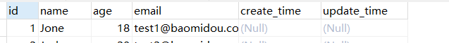


### 实体上添加注解

```java
@Data
public class User {
//        @TableId(value="id",type= IdType.AUTO)
        private Long id;
        private String name;
        private Integer age;
        private String email;
        @TableField(fill = FieldFill.INSERT)
        private Date createTime;
        @TableField(fill = FieldFill.INSERT_UPDATE)
        private Date updateTime;

}
```


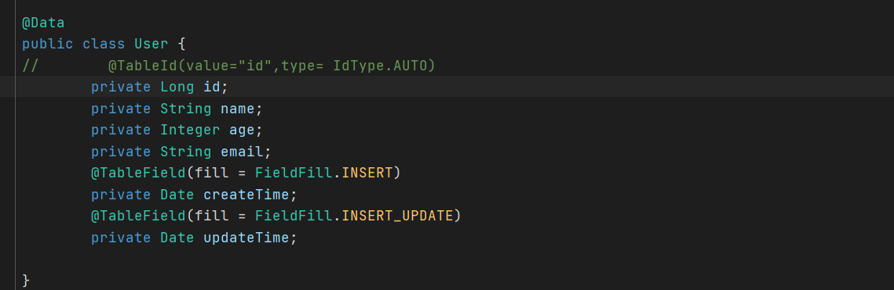

*对fill属性的解释*

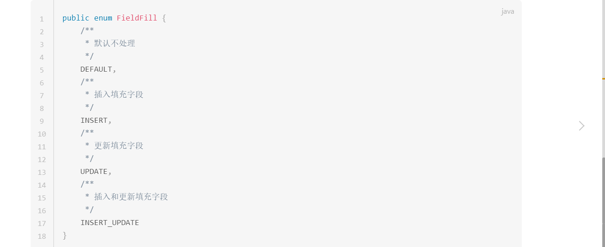


**注：好像不能使自定义的sql语句实现自动填充。**

### 实现元对象处理器接口

**注意：不要忘记添加 @Component 注解**

输入实体类的名称（注意大小写）

```java
@Component
public class MyMetaObjectHandler implements MetaObjectHandler {
    @Override
    public void insertFill(MetaObject metaObject) {
        this.setFieldValByName("createTime",new Date(),metaObject);
        this.setFieldValByName("updateTime",new Date(),metaObject);
    }

    @Override
    public void updateFill(MetaObject metaObject) {
        this.setFieldValByName("updateTime",new Date(),metaObject);
    }
}
```


# 乐观锁（插件）

## 适用场景

>当要更新一条记录的时候，希望这条记录没有被别人更新，也就是说实现线程安全的数据更新


## 乐观锁实现方式

>- 取出记录时，获取当前version
>
>- 更新时，带上这个version
>
>- 执行更新时， set version = newVersion where version = oldVersion
>
>- 如果version不对，就更新失败


## 乐观锁实现实例

- **数据库中添加version字段**

```sql
ALTER TABLE `user` ADD COLUMN `version` INT
```

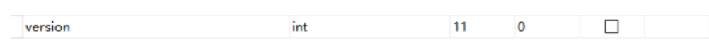


- **实体类添加version字段**  

***并添加 @Version 注解***

```java
@Version
@TableField(fill = FieldFill.INSERT)
private Integer version;
```


- **元对象处理器接口添加version的insert默认值**

```java
@Override
public void insertFill(MetaObject metaObject) {
    ......
    this.setFieldValByName("version", 1, metaObject);
}
```


- **设置一个config的包，写下配置类插件**

```java
@EnableTransactionManagement
@Configuration
@MapperScan("com.atguigu.mybatis_plus.mapper")
public class MybatisPlusConfig {

    /**
     * 乐观锁插件
     */
    @Bean
    public OptimisticLockerInterceptor optimisticLockerInterceptor() {
        return new OptimisticLockerInterceptor();
    }
}
```


- **测试**

*测试后分析打印的sql语句，将version的数值进行了加1操作*

```java
/**
 * 测试 乐观锁插件
 */
@Test
public void testOptimisticLocker() {

    //查询
    User user = userMapper.selectById(1L);
    //修改数据
    user.setName("Helen Yao");
    user.setEmail("helen@qq.com");
    //执行更新
    userMapper.updateById(user);
}
```


# 逻辑删除（插件）

## 逻辑删除

- 物理删除：真实删除，将对应数据从数据库中删除，之后查询不到此条被删除数据  

- 逻辑删除：假删除，将对应数据中代表是否被删除字段状态修改为“被删除状态”，之后在数据库中仍旧能看到此条数据记录  


## 实例

**（1）数据库中添加 deleted字段**

```xml
ALTER TABLE `user` ADD COLUMN `deleted` boolean
```


**（2）实体类添加deleted 字段**

并加上 @TableLogic 注解 和 @TableField(fill = FieldFill.INSERT) 注解

@TableLogic

@TableField(fill = FieldFill.INSERT)     （可以不写）

private Integer deleted;


**（3）元对象处理器接口添加deleted的insert默认值**（可以不写）

@Override

public void insertFill(MetaObject metaObject) {

   ......

   this.setFieldValByName("deleted", 0, metaObject);

}


**（4）application.properties 加入配置**  （可以不写）

此为默认值，如果你的默认值和mp默认的一样,该配置可无

mybatis-plus.global-config.db-config.logic-delete-value=1

mybatis-plus.global-config.db-config.logic-not-delete-value=0

**（5）在 MybatisPlusConfig 中注册 Bean**  

```java
@Bean

public ISqlInjector sqlInjector() {

   return new LogicSqlInjector();

}
```


**（6）测试逻辑删除**

- 测试后发现，数据并没有被删除，deleted字段的值由0变成了1  

- 测试后分析打印的sql语句，是一条update

- **注意：**被删除数据的deleted 字段的值必须是 0，才能被选取出来执行逻辑删除的操作

```java
/**

 \* 测试 逻辑删除

 */

@Test

public void testLogicDelete() {

   int result = userMapper.deleteById(1L);

   System.out.println(result);

}
```


**（7）测试逻辑删除后的查询**

MyBatis Plus中查询操作也会自动添加逻辑删除字段的判断

```java
/**

 \* 测试 逻辑删除后的查询：

 \* 不包括被逻辑删除的记录

 */

@Test

public void testLogicDeleteSelect() {

   User user = new User();

   List<User> users = userMapper.selectList(null);

  users.forEach(System.out::println);

}
```


测试后分析打印的sql语句，包含 WHERE deleted=0 

SELECT id,name,age,email,create_time,update_time,deleted FROM user WHERE deleted=0


# 分页（插件）

*MyBatis Plus自带分页插件，只要简单的配置即可实现分页功能*


**操作方法**

- 创建配置类

```java
/**
 * 分页插件
 */
@Bean
public PaginationInterceptor paginationInterceptor() {
    return new PaginationInterceptor();
}
```


- 测试selectPage分页

```java
@Test
public void testSelectPage() {

    Page<User> page = new Page<>(1,5);
    userMapper.selectPage(page, null);

    page.getRecords().forEach(System.out::println);
    System.out.println(page.getCurrent());
    System.out.println(page.getPages());
    System.out.println(page.getSize());
    System.out.println(page.getTotal());
    System.out.println(page.hasNext());
    System.out.println(page.hasPrevious());
}
```


控制台sql语句打印：SELECT id,name,age,email,create_time,update_time FROM user LIMIT 0,5 


- 测试selectMapsPage分页：结果集是Map

```java
@Test
public void testSelectMapsPage() {

    Page<User> page = new Page<>(1, 5);

    IPage<Map<String, Object>> mapIPage = userMapper.selectMapsPage(page, null);

    //注意：此行必须使用 mapIPage 获取记录列表，否则会有数据类型转换错误
    mapIPage.getRecords().forEach(System.out::println);
    System.out.println(page.getCurrent());
    System.out.println(page.getPages());
    System.out.println(page.getSize());
    System.out.println(page.getTotal());
    System.out.println(page.hasNext());
    System.out.println(page.hasPrevious());
}
```


# ActiveRecord（AR）

与CRUD不同的地方在于一个通过mapper调用crud方法，一个（AR）通过对象调用crud方法。

ActiveRecord 是什么

​	每一个数据库表对应创建一个类，类的每一个对象实例对应于数据库中 表的一行记录; 通常表的每个字段在类中都有相应的 Field;  	

​	ActiveRecord 负责把自己持久化. 在 ActiveRecord 中封装了对数据库的访 问，通过对象自己实现 CRUD，实现优雅的数据库操作。 

​	ActiveRecord 也封装了部分业务逻辑。可以作为业务对象使用。

## insert操作

（1）entity 实体类

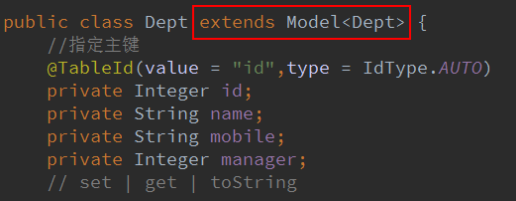

**必须继承 Model,Model 定义了表的 CRUD 方法，Dept 属性名和列名是一样的。**

**其他部分和CRUD相似**

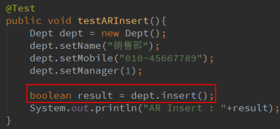

## update操作

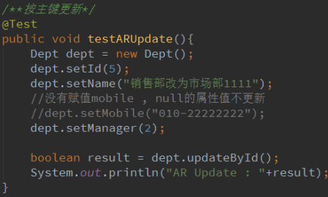

## delete操作

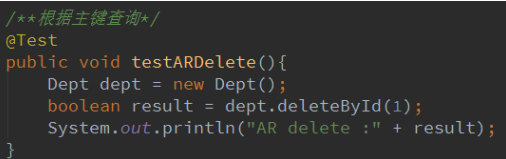

## select操作

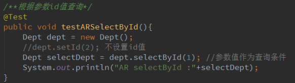

# 列和表和主键生成策略

## 主键生成策略

>- 自动增长
>- UUID：每次生成随机的唯一值
>- redis实现
>
>当使用数据库来生成ID性能不够要求的时候，我们可以尝试使用Redis来生成ID。这主要依赖于Redis是单线程的，所以也可以用生成全局唯一的ID。可以用Redis的原子操作 INCR和INCRBY来实现。
>
>可以使用Redis集群来获取更高的吞吐量。假如一个集群中有5台Redis。可以初始化每台Redis的值分别是1,2,3,4,5，然后步长都是5。各个Redis生成的ID为：
>
>A：1,6,11,16,21
>
>B：2,7,12,17,22
>
>C：3,8,13,18,23
>
>D：4,9,14,19,24
>
>E：5,10,15,20,25
>
>- mp自带策略：雪花算法（snowflake）
>
>


>- AUTO
>- ID_WORKER（long）雪花
>- ID_WORKER_STR(字符串)  雪花
>- INPUT
>- NONE
>- UUID
>
>


## 主键类型（mp自带策略）

idType枚举类，主键定义如下

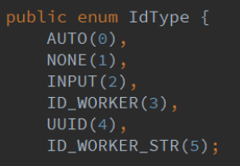

0.none 没有主键 

1.auto 自动增长(mysql, sql server) 

2.input 手工输入 

3.id_worker: 实体类用 Long id ， 表的列用 bigint ，int 类型大小不够 ---------**应对于数据库表中的主键是*长整型**bigInt*，mp自带的策略，生成19位值

4.id_worker_str 实体类使用 String id, 表的列使用 varchar 50 ---------------**应对于数据库表中的主键是*字符串类型的**varchar*，mp自带的策略，生成19位值

5.uuid 实体类使用 String id， 列使用 varchar 50 id_worker: 

6.Twitter 雪花算法-分布式 ID**（41bit作为毫秒数，其中10bit作为机器的ID，12bit作为毫秒内流水号）**

7.NONE：输入（没有策略）

##  指定表名（重）

实体类的表名如果和数据库表名不一样，会出现这个错误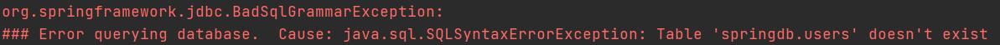


**定义实体类，默认的表名和实体类同名；**

如果不一致，在实体类定义上面使用 @TableName 说明表名称。 

例如：@TableName(value=”数据库表名”)

```java
@TableName(value = "user_address")
public class Address {
//    指定主键
    @TableId(value = "id",type = IdType.AUTO)
    private Integer id;
    @TableField(value = "user_city")
    private String city;
    @TableField(value = "user_street")
    private String street;
    @TableField(value = "user_zipcode")
    private String zipcode;
```

## 指定列名（重）

和指定表名相同


**定义实体类，默认的属性名和实体类的属性名一致；**

如果不一致，在实体类定义上面使用 @TableField 说明表名称。 

例如：@TableField(value=”数据库表名”)

```java
@TableName(value = "user_address")
public class Address {
//    指定主键
    @TableId(value = "id",type = IdType.AUTO)
    private Integer id;
    @TableField(value = "user_city")
    private String city;
    @TableField(value = "user_street")
    private String street;
    @TableField(value = "user_zipcode")
    private String zipcode;
```

## 驼峰命名

列名使用下划线,属性名是驼峰命名方式。MyBatis 默认支持这种规则。

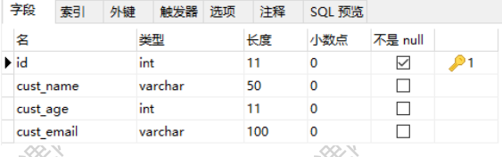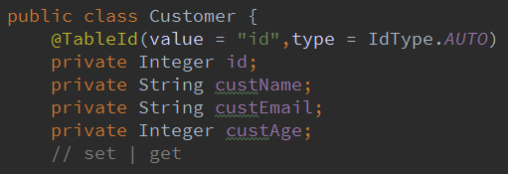

# 自定义sql.表定义

这个自定义就是和传统的mybatis定义方法一样了

## 创建实体

```java
public class Student {
    //设置主键属性
    @TableId(value = "id",type = IdType.AUTO)
    private Integer id;
    private String name;
    private Integer age;
    private String email;
    private Integer status;
```

## 创建mapper

自定义Mapper，就是Dao接口。

* 要实现BaseMapper
* BaseMapper的泛型要指定实体类
* BaseMapper是MP框架中的对象，定义了17个操作方法（crud）

```java
/*
*自定义Mapper，就是Dao接口。
* 1.要实现BaseMapper
* 2.BaseMapper的泛型要指定实体类
*
* BaseMapper是MP框架中的对象，定义了17个操作方法（crud）
* */
public interface StudentMapper extends BaseMapper<Student> {
    public int insertStudent(Student student);
    public Student selectStudentById(Integer id);
    public List<Student> selectByName(String name);
}
```

## 新建sql映射xml文件

```xml
<?xml version="1.0" encoding="UTF-8" ?>
<!DOCTYPE mapper
        PUBLIC "-//mybatis.org//DTD Mapper 3.0//EN"
        "http://mybatis.org/dtd/mybatis-3-mapper.dtd">
<mapper namespace="com.bjpowernode.mybatisplus.mapper.StudentMapper">
    <select id="selectStudentById" resultType="com.bjpowernode.mybatisplus.entity.Student">
        select id,name,age,email,status from Student where id=#{id}
    </select>

    <insert id="insertStudent">
        insert into student(name,age,email,status) values (#{name},#{age},#{email},#{status})
    </insert>

    <select id="selectByName" resultType="com.bjpowernode.mybatisplus.entity.Student">
        select id,name,email,age,status from student where name=#{name}
    </select>
</mapper>
```

## 配置xml文件位置

在配置文件中的mybatis-plus中配置xml的位置

指定mapper.xml的文件为Mapper映射文件使用

mapper-locations: classpath:xml/*Mapper.xml

```yaml
mybatis-plus:
  configuration:
    log-impl: org.apache.ibatis.logging.stdout.StdOutImpl
#    指定mapper.xml的文件为Mapper映射文件使用
  mapper-locations: classpath:xml/*Mapper.xml
```

## 测试

```java
@SpringBootTest
public class StudentApplicationTest {
    @Autowired
    private StudentMapper studentMapper;
    @Test
    public void inserrTest(){
        Student student=new Student();
        student.setAge(10);
        student.setEmail("12306@qq.com");
        student.setName("李四");
        student.setStatus(5);
        int row=studentMapper.insertStudent(student);
//        int row=studentMapper.insert(student);
        System.out.println(row);
    }
```

## 启动类——主方法

配置扫描器

```java
/*
*   设置扫描器：指定mapper所在的包
* */
@MapperScan(value = "com.bjpowernode.mybatisplus.mapper")
@SpringBootApplication
public class PlusApplication {

    public static void main(String[] args) {
        SpringApplication.run(PlusApplication.class, args);
    }

}
```


# MP生成器

第一步：加依赖

```xml
<!--        mybatis-plus-->
        <dependency>
            <groupId>com.baomidou</groupId>
            <artifactId>mybatis-plus-boot-starter</artifactId>
            <version>3.0.5</version>
        </dependency>
<!--        mybatis-plus代码生成器依赖-->
        <dependency>
            <groupId>com.baomidou</groupId>
            <artifactId>mybatis-plus-generator</artifactId>
            <version>3.0.5</version>
        </dependency>
<!--        mybatis-plus模板引擎依赖-->
        <dependency>
            <groupId>org.apache.velocity</groupId>
            <artifactId>velocity-engine-core</artifactId>
            <version>2.0</version>
        </dependency>
```

第二步：上代码，改配置，生成地址

```java
package com;

import com.baomidou.mybatisplus.annotation.IdType;
import com.baomidou.mybatisplus.generator.AutoGenerator;
import com.baomidou.mybatisplus.generator.config.DataSourceConfig;
import com.baomidou.mybatisplus.generator.config.GlobalConfig;
import com.baomidou.mybatisplus.generator.config.PackageConfig;
import com.baomidou.mybatisplus.generator.config.StrategyConfig;
import com.baomidou.mybatisplus.generator.config.rules.NamingStrategy;

public class AutoMapper {

    public static void main(String[] args) {
        //创建AutoGenerator ,MP中对象
        AutoGenerator ag = new AutoGenerator();

        //设置全局配置
        GlobalConfig gc  = new GlobalConfig();
        //设置代码的生成位置， 磁盘的目录
        String path = System.getProperty("user.dir");//项目在磁盘的地址
//        地址：D:\java-idea\mybatis-plus-new\mybatis-plus
        gc.setOutputDir(path+"/mybatis-plus/src/main/java");//项目中的代码的在磁盘的地址
        //设置生成的类的名称（命名规则）%s代表的是数据库中的数据表名
        gc.setMapperName("%sMapper");//所有的Dao类都是Mapper结尾的，例如DeptMapper
        //设置Service接口的命名
        gc.setServiceName("%sService");//DeptService
        //设置Service实现类的名称
        gc.setServiceImplName("%sServiceImpl");//DeptServiceImpl
        //设置Controller类的命名
        gc.setControllerName("%sController");//DeptController
        //设置作者
        gc.setAuthor("changming");
        //设置主键id的配置
        gc.setIdType(IdType.ID_WORKER);
        ag.setGlobalConfig(gc);

        //设置数据源DataSource
        DataSourceConfig ds  = new DataSourceConfig();
        //驱动
        ds.setDriverName("com.mysql.jdbc.Driver");
        //设置url
        ds.setUrl("jdbc:mysql://localhost:3306/springdb?useSSL=false&serverTimezone=Asia/Shanghai&allowPublicKeyRetrieval=true");
        //设置数据库的用户名
        ds.setUsername("root");
        //设置密码
        ds.setPassword("123456789");
        //把DataSourceConfig赋值给AutoGenerator
        ag.setDataSource(ds);

        //设置Package信息
        PackageConfig pc  = new PackageConfig();
        //设置模块名称， 相当于包名， 在这个包的下面有 mapper， service， controller。
        pc.setModuleName("order");
        //设置父包名，order就在父包的下面生成
        pc.setParent("com"); //com.wkcto.order
        ag.setPackageInfo(pc);

        //设置策略
        StrategyConfig sc  = new StrategyConfig();
        sc.setNaming(NamingStrategy.underline_to_camel);
        //设置支持驼峰的命名规则
        sc.setColumnNaming(NamingStrategy.underline_to_camel);
        ag.setStrategy(sc);

        //执行代码的生成
        ag.execute();
    }
}

```

例子2：

```java
import com.baomidou.mybatisplus.annotation.DbType;
import com.baomidou.mybatisplus.annotation.IdType;
import com.baomidou.mybatisplus.generator.AutoGenerator;
import com.baomidou.mybatisplus.generator.config.DataSourceConfig;
import com.baomidou.mybatisplus.generator.config.GlobalConfig;
import com.baomidou.mybatisplus.generator.config.PackageConfig;
import com.baomidou.mybatisplus.generator.config.StrategyConfig;
import com.baomidou.mybatisplus.generator.config.rules.DateType;
import com.baomidou.mybatisplus.generator.config.rules.NamingStrategy;
import org.junit.Test;

public class getCode {

    @Test
    public void main1() {

        // 1、创建代码生成器
        AutoGenerator mpg = new AutoGenerator();

        // 2、全局配置
        GlobalConfig gc = new GlobalConfig();
        String projectPath = System.getProperty("user.dir");
        System.out.println(projectPath);
        gc.setOutputDir("G:\\java-workplace\\zhihuishu_parents\\service\\service-edu" + "/src/main/java");//修改1：地址修改
        gc.setAuthor("atguigu");//修改2：作者
        gc.setOpen(false); //生成后是否打开资源管理器(打开所有文件夹)
        gc.setFileOverride(false); //重新生成时文件是否覆盖
        /*
         * mp生成service层代码，默认接口名称第一个字母有 I
         * UcenterService
         * */
        gc.setServiceName("%sService"); //去掉Service接口的首字母I
        gc.setIdType(IdType.ID_WORKER); //主键策略
        gc.setDateType(DateType.ONLY_DATE);//定义生成的实体类中日期类型
        gc.setSwagger2(true);//开启Swagger2模式

        mpg.setGlobalConfig(gc);

        // 3、数据源配置
        DataSourceConfig dsc = new DataSourceConfig();
        dsc.setUrl("jdbc:mysql://localhost:3306/zhihuishu_edu?serverTimezone=GMT%2B8");//修改3：数据库
        dsc.setDriverName("com.mysql.cj.jdbc.Driver");//修改3：数据库
        dsc.setUsername("root");//修改3：数据库
        dsc.setPassword("123456789");//修改3：数据库
        dsc.setDbType(DbType.MYSQL);//修改3：数据库
        mpg.setDataSource(dsc);

        // 4、包配置
        PackageConfig pc = new PackageConfig();//修改4：地址
        pc.setModuleName("serviceedu"); //模块名 //修改4：地址
        pc.setParent("com.atguigu");//修改4：地址
        pc.setController("controller");//修改4：地址
        pc.setEntity("entity");//修改4：地址
        pc.setService("service");//修改4：地址
        pc.setMapper("mapper");//修改4：地址
        mpg.setPackageInfo(pc);

        // 5、策略配置
        StrategyConfig strategy = new StrategyConfig();
        strategy.setInclude("edu_teacher");//对应的生成的表的名称。   //修改5：生成的表
        strategy.setNaming(NamingStrategy.underline_to_camel);//数据库表映射到实体的命名策略
        strategy.setTablePrefix(pc.getModuleName() + "_"); //生成实体时去掉表前缀

        strategy.setColumnNaming(NamingStrategy.underline_to_camel);//数据库表字段映射到实体的命名策略
        strategy.setEntityLombokModel(true); // lombok 模型 @Accessors(chain = true) setter链式操作

        strategy.setRestControllerStyle(true); //restful api风格控制器
        strategy.setControllerMappingHyphenStyle(true); //url中驼峰转连字符

        mpg.setStrategy(strategy);

        // 6、执行
        mpg.execute();
    }
}
```

图解：

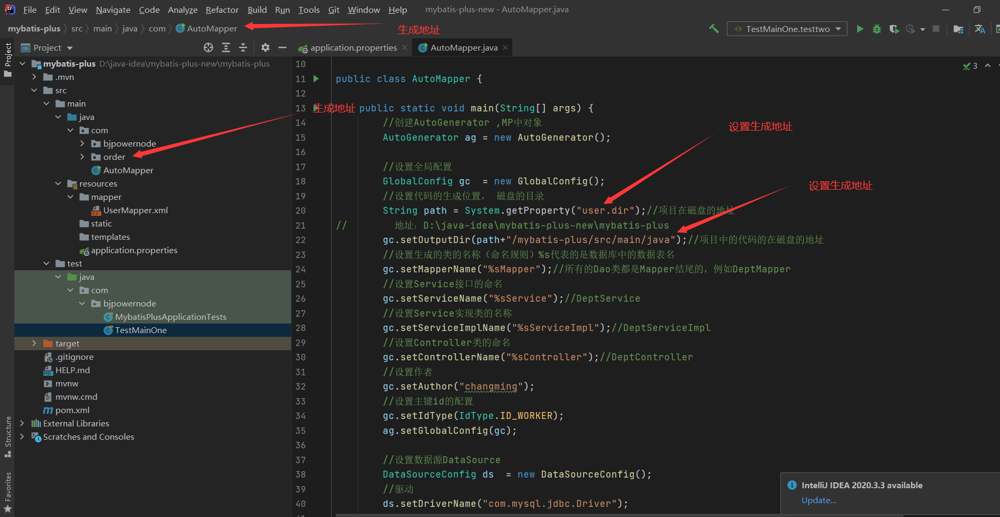

# Mybatis-plus之坑

在运用时一定要注意实体类需要给主键加注解@TableId，不然会报错

```java
package com.haozi.entity;

import com.baomidou.mybatisplus.annotation.IdType;
import com.baomidou.mybatisplus.annotation.TableId;

public class users {
    @TableId(
            value = "uid",
            type = IdType.AUTO
    )
    private int uid;
    private String uname;
    private String upass;


```


mapper文件

```xml
    <insert id="insertCar">
        insert into abc_car (car_number,car_owner_id)
        values ( #{carNumber},
                (select owner_id from abc_car_owner where owner_vx_code = #{carPhone}) );
    </insert>
```


controller

```java
@RestController
@RequestMapping("/serviceedu/abc-car")
public class AbcCarController {
    @Autowired
    AbcCarService carService;

    @GetMapping("/addCar")
    public Result addCar(String carNumber,String phone){
        int i = carService.addCar(phone, carNumber);
        if(i==1){
            return Result.ok();
        }else{
            return Result.error();
        }
    }
}

```

service interface

```java
public int addCar(String phone,String carNumber);
```

service impl

```java
@Autowired
    AbcCarMapper carMapper;
    @Override
    public int addCar(String phone, String carNumber) {
        Integer i = carMapper.insertCar(carNumber, phone);
        return i;
    }


```

# Mybatis中target文件不存在问题的三种解决方式

Mybatis文件中          要是在java文件夹下的.xml文件没有出现在target.classes.src.main....中或者resources中的配置文件没有出现在target中，三种解决方式

1.查看pom文件中是否添加了下面这段资源代码

```xml
<resources>
  <resource>
    <directory>src/main/java</directory>
    <includes>
      <include>**/*.properties</include>
      <include>**/*.xml</include>
    </includes>
    <filtering>false</filtering>
  </resource>
</resources>
```

2.Maven-》clean-》compile重新编译

3.重新让idea重新编译


4.重启idea


