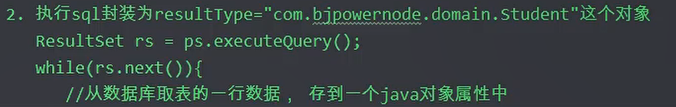
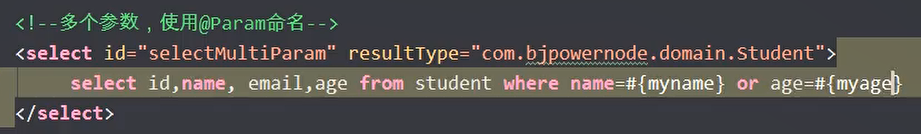
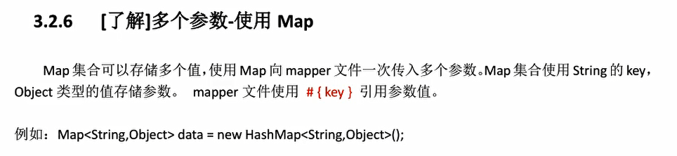
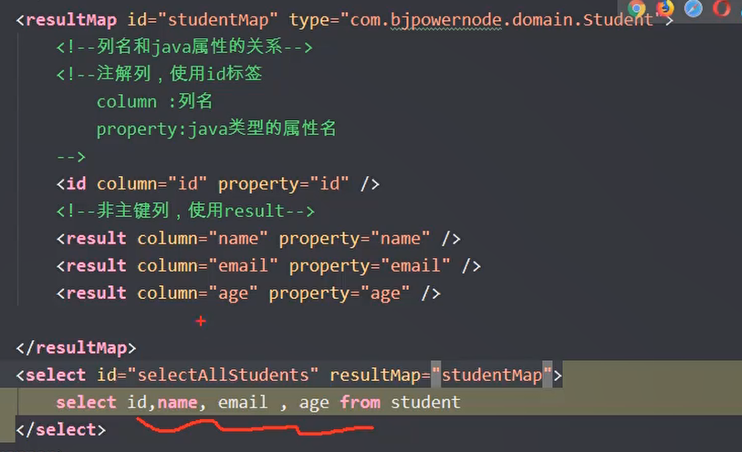
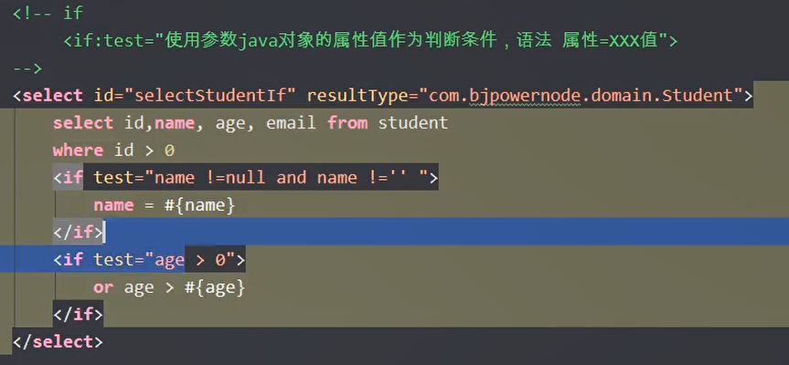
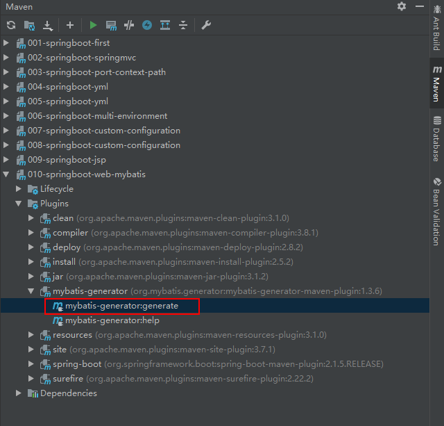

# 第一章.MyBatis框架

## 框架概述，快速入门及Mybatis框架快速入门

## 三层架构 


## 框架


### 使用JDBC的缺陷


###  mybatis框架


### mybatis提供了哪些功能


# 第二章.快速入门

## Mybatis使用实现步骤


### 加入依赖和资源

```xml
<dependency>
  <groupId>org.mybatis</groupId>
  <artifactId>mybatis</artifactId>
  <version>3.5.1</version>
</dependency>

<dependency>
  <groupId>mysql</groupId>
  <artifactId>mysql-connector-java</artifactId>
  <version>8.0.23</version>
</dependency>


<resources>
      <resource>
        <directory>src/main/java</directory>
        <includes>
          <include>**/*.properties</include>
          <include>**/*.xml</include>
        </includes>
        <filtering>false</filtering>
      </resource>
   </resources>
```

### mybatis使用的sql映射（Mapper）文件

sql映射文件的标签的一些介绍，该文件的作用是用来写sql语句的，Mybatis框架会执行这些sql

重点有两个：

1.<mapper namespace="org.example.domain.dao.StudentDao">

这个标签中的namespace是用来做寻找sql映射文件的id的

2.<select id="selectstudents" resultType="org.example.domain.entity.Student">

这个标签的id是来明确用哪一个sql语句的，这个最好**使用接口的方法名称**

resultType是select查询结果属于什么类的，**这里必须使用类的全限定名称**，如果不用的话，可能会出现找不到类的意外错误

```xml
<?xml version="1.0" encoding="UTF-8" ?>
<!DOCTYPE mapper
        PUBLIC "-//mybatis.org//DTD Mapper 3.0//EN"
        "http://mybatis.org/dtd/mybatis-3-mapper.dtd">
<!--sql映射文件：写sql语句的，mybatis会执行这些sql-->
<!--指定约束文件-->
<!--mybatis-3-mapper.dtd，dtd是扩展名，mybatis-3-mapper是约束文件的名称-->
<!--约束文件的作用：限制，检查在当前文件中出现的标签，属性必须符合mybatis的要求-->


<mapper namespace="org.example.domain.dao.StudentDao">
<!--
    mapper:当前文件的根标签,必须的
    namespace:叫做命名空间，唯一值的，可以是自定义的字符串
                但是要求最好写全限定名称
-->


    <select id="selectstudents" resultType="org.example.domain.entity.Student">
        select * from Student
    </select>
<!--
    select：表示查询操作。
    id：你要执行的sql语句的唯一标识，mybatis会使用这个id的值来找到要执行的sql语句可以自定义，
        但是要求使用接口中的方法名称。
    resultType：表示结果类型的，是sql语句执行后得到ResultSet，遍历这个ResultSet得到java对象的类型的全限定名称
    必须用全限定名称，如果不用可能会出现找不到文件这种情况

-->
</mapper>
```

mapper文件和Mybatis主配置文件，mapper文件在namespace=“*.*”

Mybatis主配置文件则是/

### Mybatis的主配置文件介绍

主配置文件有两个重要标签

1. <environments default="development">
   <!--
   环境配置：主管数据库的配置信息
   default:必须和某个environment的id值一样
   告诉Mybatis使用哪一个数据库的连接信息也就是访问哪个数据库
   -->

2.  <environments default="development">

   ​	 <environment id="development">

   ​		<transactionManager type="JDBC"/>

   ​		<dataSource type="POOLED">

   ​			<property name="driver" value="com.mysql.jdbc.Driver"/>
   ​            <property name="url" value="jdbc:mysql://localhost:3306/bjpowernode"/>
   ​            <property name="username" value="root"/>
   ​            <property name="password" value="12345678"/>

   ​		</dataSource>
   ​       </environment>
      </environments>

   ​	default：必须和某个environment的id值一样，告诉Mybatis框架，我们要用哪一个环境配置

   ​	transactionManager中的type：表示jdbc中的Connection对象的commit，rollback做事务处理

   ​															像现在这个就是告诉Mybatis框架，做JDBC事务处理

   ​	dateSource中的type：表示数据源的类型，POOLED表示连接数据池

   ​	property：配置文件

   

   3. <mappers>

      ​		<mapper resource="org/example/domain/dao/StudentDao.xml"/>

      </mappers>

      mapper 中的resource：一个mapper指定一个映射文件的位置。从类路径开始的路径信息，绝对路径


```xml
<?xml version="1.0" encoding="UTF-8" ?>
<!DOCTYPE configuration
        PUBLIC "-//mybatis.org//DTD Config 3.0//EN"
        "http://mybatis.org/dtd/mybatis-3-config.dtd">


<configuration>
<!--
    configuration：根标签
-->


    <environments default="development">
<!--
    环境配置：主管数据库的配置信息
    default:必须和某个environment的id值一样
    告诉Mybatis使用哪一个数据库的连接信息也就是访问哪个数据库
-->
        <!--    配置日志-->
    <settings>
        <setting name="logImpl" value="STDOUT_LOGGING"/>
    </settings>

        <environment id="development">
<!--
    environment：设置一个数据库信息的配置信息
    id：一个唯一值，自定义，表示环境（数据库）的名称
-->


            <transactionManager type="JDBC"/>
<!--
    transactionManager：mybatis的事务类型
        type：JDBC（表示jdbc中的Connection对象的commit，rollback做事务处理）
-->


            <dataSource type="POOLED">
<!--
    dataSource：表示数据源，连接数据库的
        type：表示数据源的类型，POOLED表示连接数据池
-->


                <property name="driver" value="com.mysql.jdbc.Driver"/>
                <property name="url" value="jdbc:mysql://localhost:3306/bjpowernode"/>
                <property name="username" value="root"/>
                <property name="password" value="12345678"/>
<!--
    配置具体信息，driver，url，password，username
-->
            </dataSource>
        </environment>
    </environments>


    <mappers>
<!--        sql mapper（映射文件）的位置-->
        <mapper resource="org/example/domain/dao/StudentDao.xml"/>
<!--        一个mapper指定一个映射文件的位置
            从类路径开始的路径信息，绝对路径-->
    </mappers>
</configuration>


<!--
    Mybatis的主配置文件：主要定义了数据库的配置信息，sql映射文件的位置

    1.约束文件，，，，，mybatis-3-config.dtd配置文件的名称，，“.dtd”固定的后缀名
    <!DOCTYPE configuration
        PUBLIC "-//mybatis.org//DTD Config 3.0//EN"
        "http://mybatis.org/dtd/mybatis-3-config.dtd">


-->
```


### Mybatis调用sql文件的测试类

注意1：Mybatis框架通过sqlSession对象的方法去对，增删改查进行操作

注意2：sqlSession创建时如果默认是sqlsessionfactory（），则是默认为非自动提交

在创建时SqlSession sqlSession=sqlSessionFactory.openSession();方法openSession的参数是true，则是自动提交

如果不是则是非自动提交


```java
package org.example.domain;

import org.apache.ibatis.io.Resources;
import org.apache.ibatis.session.SqlSession;
import org.apache.ibatis.session.SqlSessionFactory;
import org.apache.ibatis.session.SqlSessionFactoryBuilder;
import org.example.domain.entity.Student;

import java.io.IOException;
import java.io.InputStream;
import java.util.List;

public class MyApp {
    public static void main(String[] args) throws IOException{
//        访问Mybatis读取student数据
//        1.定义Mybatis主配置文件的名称，从类路径的根开始
        String config="Mybatis.xml";

//        2.读取这个config表示的文件
        InputStream is=Resources.getResourceAsStream(config);

//        3.创建一个SqlSessionFactoryBuilder对象
        SqlSessionFactoryBuilder sqlSessionFactoryBuilder=new SqlSessionFactoryBuilder();
        
//        4.创建一个SqlSessionFactory对象，参数就是读出来的文件
        SqlSessionFactory sqlSessionFactory=sqlSessionFactoryBuilder.build(is);
        
//        5.[重]获取SqlSession对象，从SqlSessionFactory中获取SqlSession
        SqlSession sqlSession=sqlSessionFactory.openSession();
        
//        6.[重]指定要执行的sql语句的标识
//        namespace值+sql语句的id值
        String sqlId="org.example.domain.dao.StudentDao"+"."+"selectstudents";
        
//        7.执行sql语句，通过sqlId找到语句
        List<Student> studentList=sqlSession.selectList(sqlId);
        
//        8.输出结果
        for(Student stu:studentList){
            System.out.println("查询的学生："+stu);
        }
        
//        9.关闭SqlSession对象
        sqlSession.close();
    }
}
```

## Mybatis中target文件不存在问题的三种解决方式

Mybatis文件中要是在java文件夹下的.xml文件没有出现在target.classes.src.main....中或者

resources中的配置文件没有出现在target中，**三种解决方式**

**1.查看pom文件中是否添加了下面这段资源代码**

```xml
<resources>
  <resource>
    <directory>src/main/java</directory>
    <includes>
      <include>**/*.properties</include>
      <include>**/*.xml</include>
    </includes>
    <filtering>false</filtering>
  </resource>
</resources>
```

**2.Maven-》clean-》compile重新编译**

**3.重新让idea重新编译**


**4.重启idea**


## Mybatis在插入操作中设置动态数据（占位符）

Mybatis执行插入操作时如何在Mapper文件中设置动态数据

例子：


## Mybatis提交事务（更新数据库）


## 配置日志功能


# 第三章：Mybatis框架的动态代理

## 主要类的介绍

1）Resources：mybatis中的一个类

​		作用：负责读取主配置文件

例子：

```java
InputStream is= Resources.getResourceAsStream("Mybatis.xml");
```

2） SqlSessionFactoryBuilder

​		作用：创建SqlSessionFactory对象

例子：

```java
SqlSessionFactoryBuilder sqlSessionFactoryBuilder=new SqlSessionFactoryBuilder();
SqlSessionFactory sqlSessionFactory=sqlSessionFactoryBuilder.build(is);
```

3）SqlSessionFactory

​		介绍：重量级对象，程序创建一个对象耗时比较长，使用资源较多，在整个项目中有一个就够用了

​		作用：获取SqlSession对象。

例子：

```java
SqlSession sqlSession=sqlSessionFactory.openSession();
```

openSession方法说明：

1.openSession（）：无参数的，获取的是非自动提交事务的SqlSession

2.openSession（boolean）：openSession（true）获取的是自动提交事务的SqlSession

​													openSession（false）获取的是非自动提交事务的SqlSession

4）SqlSession

​		SqlSession接口：定义了操作数据的方法   例如	selectone（），selectlist（），update（），insert（），delete（），rollback（），commit（）

​		SqlSession接口的实现类：DefaultSqlSession

使用要求：SqlSession对象不是线程安全的，需要在方法内部使用，在执行sql语句之前，使用openSession（）获取SqlSession对象。

在执行完SqlSession语句后，你需要关闭它，执行SqlSession.close（）。这样能保证他的使用是线程安全的。

## Mybatis工具类的使用

```java
package org.example.domain.util;

import org.apache.ibatis.io.Resources;
import org.apache.ibatis.session.SqlSession;
import org.apache.ibatis.session.SqlSessionFactory;
import org.apache.ibatis.session.SqlSessionFactoryBuilder;

import javax.annotation.Resource;
import java.io.IOException;
import java.io.InputStream;

public class Mybatisutils {
    private static SqlSessionFactory sqlSessionFactory=null;
    static{
        String config="Mybatis.xml";
        try {
            InputStream is=Resources.getResourceAsStream(config);
            sqlSessionFactory=new SqlSessionFactoryBuilder().build(is);

        } catch (IOException e) {
            e.printStackTrace();
        }
    }

    public static SqlSession getsqlsession(){
        SqlSession sqlSession=null;
        if(sqlSessionFactory!=null){
            sqlSession=sqlSessionFactory.openSession(true);
        }
        return sqlSession;
    }
}
```

## Mybatis动态代理（Dao代理）

1）使用动态代理的条件分析


2）Mybatis动态代理


### Mybatis动态代理getMapper

Mybatis框架可以通过getMapper方法（动态代理）创建dao层接口的实现类（下方所示的类）

使用动态代理的要求：

有一定的要求就是，sql映射文件的namespace应该是接口的全限定名称

sql语句的id应该是接口中的方法名称

使用方式：


dao层接口的实现类：


### 使用动态代理的要求

有一定的要求就是，sql映射文件的namespace应该是**接口的全限定名称**

sql语句的id应该是**接口中的方法名称**

dao接口中不要使用重载方法，不要使用同名的，不同参数的方法

# 第四章.Mybatis传入参数

**从java代码中把数据传入到mapper文件的sql语句中**

## parameterType/传入参数#{任意字符}

介绍：


***但是一般mybatis通过动态代理就可以知道别名，也可以省略不写***


mybatis的一些别名


## 一个简单类型的参数


**注：Mybatis中的#{任意字符}就和jdbc中的占位符“？”一样**


Mybatis在映射（Mapper）文件中的sql语句，他在Mybatis框架中的效果等于以下在jdbc中的效果





这个student也是给了dao层select方法调用的返回值了

## 多个参数传参——@Param（“自定义名称”）

接口：public List<Student> selectparamStudent

(@Param(”myname“)String name，@Param（”myage“）int age){}


使用方法：**@Param("参数名") String name**

mapper文件：

```xml
<select id="myselectparam" resultType="org.example.entity.Student">
    select * from Student where name=#{myname} and age=#{myage};
</select>
```

例子：

dao接口方法：


mapper文件中的sql语句：



## 使用java对象传参#{java对象的属性名称}


简化版（一般也是用这个版本）：

用法：#{对象属性名}，javaType，jdbcType的值mybatis反射能获取。不用提供

例子：

有一个java对象，它的属性中有name，age，Id

那么在mapper中的sql语句：

```xml
<select id="myselectparam" resultType="org.example.entity.Student">
    select * from Student where name=#{name} and age=#{age};
</select>

#{属性名}
```

## 按位置传参（不推荐）#{arg0}，#{arg1}...


例子：

dao接口方法：


mapper文件sql语句


## Map传参（不推荐）#{Map的key值}




## 两个占位符‘#’和‘$’的比较

Mybatis的‘#’：这相当于jdbc中的PrepareStatement，这个一般可以防止sql注入。

Mybatis的‘$’：这相当于jdbc中的Statement，这个则不安全，有sql注入隐患。


# 第五章：Mybatis返回结果

## resultType的使用

resultType表示像select取出的信息都封装在一个对象中，resultType确定封装对象的类型

如果是List，则封装的是list中的属性中的对象

resultType它一般的结果是：①全限定名称 ②别名

**A.返回类型为简单类型和自定义类型**


**B.定义自定义类型的别名**

建议用全限定名称


在mybatis主配置文件中设置

给resultType起的自定义类型的别名

```xml
<typeAlias type="com.bjpowernode.domain.Student" alias="stu"/>
```

第二种方式，该包下面的类的类名就是别名

```xml
<typeAlias>
	<package name="com.bjpowernode.domain"/>
</typeAlias>
```


**C.返回类型为map**


例子：

接口方法

```java
Map<Object,Object> selectresultmap(int id);
```

mapper文件：

```xml
<select id="selectreturnmap" resultType="java.util.HashMap">
    select name,age,id from student where id=#{myage}
</select>
```


## resultMap(结果映射)

当列名和属性名不一样时，一定使用resultMap


### resultMap的使用

resultMap使用格式：

主键用id,,非主键用result

 colum是列名属性，property是实体类属性

```xml
    <resultMap id="studentresMap" type="org.example.entity.Student">
<!--        colum是列名属性，property是实体类属性-->
<!--        主键用id-->
        <id column="id" property="id"/>
<!--        非主键用result-->
        <result column="name" property="name"/>
        <result column="email" property="email"/>
        <result column="age" property="age"/>
    </resultMap>
```



**resultMap和resultType不能一起用**


第二种不同的让列名和属性名一致的方式


### Like查询的两种方式

第一种 like，java代码指定like的内容


第二种 like，mapper文件中指定like的内容（不推荐）


# 第六章.Mybatis动态sql


## 动态sql之 if 标签

语法：


例子：



## 动态sql之where标签

语法：


例子：


**注意：这是属于拼接字符串，sql语句的语法要注意**


## 动态sql之foreach标签

语法：


两种用法

第一种基本类型循环

mapper文件例子：


测试类


第二种引用类型循环

mapper文件例子：


测试类例子：


## sql代码片段

语法：


# 第七章： Mybatis的主配置文件

## 主配置文件的一些基本信息

1）<typeAliases>设置别名


2）settings，控制mybatis全局行为，不止设置输出日志一种，还有其他的设置


3）transactionManager：mybatis提交事务，回顾事务的方式


4）dataSource：数据源，datasource的使用


## 数据库属性配置文件


例子：


## mapper文件的使用

指定mapper文件的位置

第一种指定mapper文件

```xml
<mappers>
        <mapper resource="org/example/dao/StudentDao.xml"/>
</mappers>
```


指定多个mapper文件的话，一般都用第二种方式“使用包名”

```xml
<mappers>
    <package name="org.example.dao"/>
</mappers>
```


第八章：扩张

PageHelper（分页处理的一个插件）

实现分页操作

比如第一页，5个人评论，第二页也是五个人评论，有点类似京东（下方数据）


用法：


注：这个是在mybatis主配置文件中加入的插件，有点类似于过滤器


# 第八章.Mybatis的逆向工程（代码生成器）

## 拷贝Mybatis反向工程配置文件到项目的根目录下

获取目录：GeneratorMapper.xml


## 根据项目及表的情况，修改GeneratorMapper.xml配置

```xml
<?xml version="1.0" encoding="UTF-8"?>
<!DOCTYPE generatorConfiguration
        PUBLIC "-//mybatis.org//DTD MyBatis Generator Configuration 1.0//EN"
        "http://mybatis.org/dtd/mybatis-generator-config_1_0.dtd">

<generatorConfiguration>
    <!--指定连接数据库的JDBC 驱动包所在位置，指定到你本机的完整路径-->
    <classPathEntry location="JDBC驱动包的位置"/>
    <!--配置table表信息内容体，targetRuntime 指定采用MyBatis3的版本-->
    <context id="tables" targetRuntime="MyBatis3">
        <!--抑制生成注释，由于生成的注释都是英文的，可以不让它生成-->
        <commentGenerator>
            <property name="suppressAllComments" value="true" />
        </commentGenerator>
        <!--配置数据库连接信息-->
        <jdbcConnection driverClass="jdbc驱动"
                        connectionURL="url地址"
                        userId="账号"
                        password="密码">
<!--            <property name="nullCatalogMeansCurrent" value="true"/>-->

        </jdbcConnection>

        <!--生成model 类，targetPackage 指定 model 类的包名，targetProject 指定
        生成的 model放在eclipse的哪个工程下面-->
        <javaModelGenerator targetPackage="model生成在哪一个包下"
                            targetProject="生成在哪一个项目下">
            <property name="enableSubPackages" value="false"/>
            <property name="trimStrings" value="false"/>
        </javaModelGenerator>
        <!--生成 MyBatis的Mapper.xml文件，targetPackage 指定 mapper.xml文件的包名，targetProject 指定生成的 mapper.xml放在 eclipse的哪个工程下面
        -->
        <sqlMapGenerator targetPackage="mapper生成在哪一个包下"
                         targetProject="生成在哪一个项目下">
            <property name="enableSubPackages" value="false"/>
        </sqlMapGenerator>
        <!--生成 MyBatis的 Mapper接口类文件,targetPackage 指定 Mapper 接口类的包名，targetProject 指定生成的 Mapper 接口放在eclipse 的哪个工程下面
        -->
        <javaClientGenerator type="XMLMAPPER"
                             targetPackage="mapper映射文件生成在哪一个包下"
                             targetProject="生成在哪一个项目下">
            <property name="enableSubPackages" value="false"/>
        </javaClientGenerator>

        <!--数据库表名及对应的Java模型类名-->
        <!--有几个表就配几个table-
        <table tableName="t_Student" domainObjectName="Student"
               enableCountByExample="false"
               enableUpdateByExample="false"
               enableDeleteByExample="false"
               enableSelectByExample="false"
               selectByExampleQueryId="false" />
        <!--
                <table tableName="user" domainObjectName="User"
                       enableCountByExample="false"
                       enableUpdateByExample="false"
                       enableDeleteByExample="false"
                       enableSelectByExample="false"
                       selectByExampleQueryId="false" />-->
    </context>
</generatorConfiguration>
```

这一段会爆红，不过没有什么影响

## 在pom.xml文件中添加mysql反向工程依赖

```xml
!--mybatis代码自动生成插件-->

<plugin>
    <groupId>org.mybatis.generator</groupId>
    <artifactId>mybatis-generator-maven-plugin</artifactId>
    <version>1.3.6</version>
    <configuration>
        <!--配置文件的位置-->
        <configurationFile>GeneratorMapper.xml</configurationFile>
        <verbose>true</verbose>
        <overwrite>true</overwrite>
    </configuration>
</plugin>
```

## 双击红色选中命令，生成相关文件

****

# 第九章.Mybatis逆向工程生成代码一些语法

1.

```xml
<resultMap id="BaseResultMap" type="com.bjpowernode.springboot.model.Student">
  <!--
    id标签：修改主键字段
    result标签：修改主键以外的字段

    column 数据库中的字段名称
    property 映射对象的属性名称
    jdbcType 列中数据库中字段的类型（可以省略不写）

    resultMap作用：
    1.当数据库中字段名称与实体类对象的属性名不一致时，可以进行转换
    2.当前查询的结果没有对象一个表的时候，可以自定义一个这样的表
  -->
  <id column="id" jdbcType="INTEGER" property="id" />
  <result column="name" jdbcType="VARCHAR" property="name" />
  <result column="age" jdbcType="INTEGER" property="age" />
</resultMap>
```

2.类似第六章动态sql中的sql代码片段

```xml
<!--
  sql语句片段，将公共的部分抽取出来
  通过include标签引用sql语句片段
-->
<sql id="Base_Column_List">
  id, name, age
</sql>

<select id="selectByPrimaryKey" parameterType="java.lang.Integer" resultMap="BaseResultMap">
  select 
  <include refid="Base_Column_List" />
  from t_student
  where id = #{id,jdbcType=INTEGER}
</select>
```

3.  /*
          prefix前缀  suffix后缀
          suffixOverrides=","   去除多余的，
      */

```xml
<insert id="insertSelective" parameterType="com.bjpowernode.springboot.model.Student">
  insert into t_student
  <trim prefix="(" suffix=")" suffixOverrides=",">
    <if test="id != null">
      id,
    </if>
    <if test="name != null">
      name,
    </if>
    <if test="age != null">
      age,
    </if>
  </trim>

  <trim prefix="values (" suffix=")" suffixOverrides=",">
    <if test="id != null">
      #{id,jdbcType=INTEGER},
    </if>
    <if test="name != null">
      #{name,jdbcType=VARCHAR},
    </if>
    <if test="age != null">
      #{age,jdbcType=INTEGER},
    </if>
  </trim>
</insert>
```

