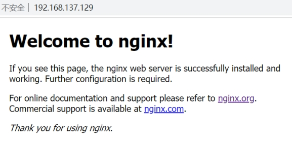
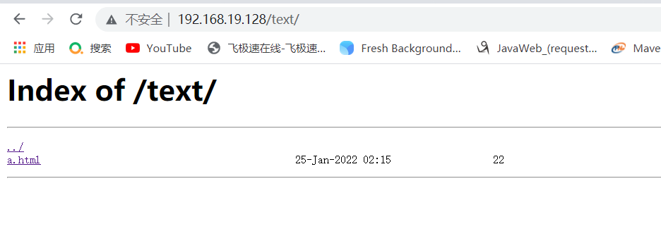

# Nginx

# 第一章Nginx简介

## 1.1Nginx概述

Nginx ("engine x") 是一个高性能的**HTTP和反向代理**服务器,特点是**占有内存少**，**并发能力强**，事实上nginx的并发能力确实在同类型的网页服务器中表现较好，中国大陆使用nginx网站用户有：百度、京东、新浪、网易、腾讯、淘宝等

## 1.2Nginx作为web服务器

Nginx可以作为**静态页面的web服务器**，同时还支持CGI协议的动态语言，比如perl、php等。**但是不支持java。Java程序只能通过与tomcat配合完成**。

Nginx专为性能优化而开发，性能是其最重要的考量,实现上非常注重效率 ，能经受高负载的考验,有报告表明能支持高达 50,000个并发连接数。

## 1.3正向代理

Nginx不仅可以做反向代理，实现负载均衡。还能用作**正向代理**来进行上网等功能。


**正向代理：**如果把局域网外的Internet想象成一个巨大的资源库，则局域网中的客户端要访问Internet，则需要通过代理服务器来访问，这种代理服务就称为正向代理。


## 1.4反向代理

**反向代理：**其实客户端对代理是无感知的，因为客户端不需要任何配置就可以访问，我们只需要将请求发送到反向代理服务器，由反向代理服务器去选择目标服务器获取数据后，在返回给客户端，此时反向代理服务器和目标服务器对外就是一个服务器，

**暴露的是代理服务器地址，隐藏了真实服务器IP地址。**


## 1.5负载均衡

**负载均衡**：我们去掉增加**服务器物理配置（内存，CPU）**来解决问题的办法，也就是说纵向解决问题的办法行不通了，那么横向增加服务器的数量呢？

这时候**集群**的概念产生了，**单个服务器**解决不了，我们**增加服务器的数量，然后将请求分发到各个服务器上**

将原先请求集中到**单个服务器**上的情况改为将请求分发到**多个服务器**上，将**负载分发**到不同的服务器，也就是我们所说的**负载均衡。**

负载均衡通过**轮询，平均分配，随机分配，IpHash算法**来对请求进行平均分配


## 1.6动静分离

为了加快网站的解析速度，可以把动态页面和静态页面由不同的服务器来解析，加快解析速度。降低原来单个服务器的压力。

**一般将静态请求发送给Nginx处理，动态请求交给tomcat处理**


# 第二章Nginx安装

## 下载地址

下载地址：http://nginx.org/   nginx-1.12.2.tar.gz


## Nginx需要的依赖安装包

pcre-8.37.tar.gz 

openssl-1.0.1t.tar.gz

zlib-1.2.8.tar.gz

nginx-1.12.2.tar.gz


### 在线安装nginx

第一步 联网下载pcre

wget http://downloads.sourceforge.net/project/pcre/pcre/8.37/pcre-8.37.tar.gz

第二步 解压压缩文件

使用命令 tar -zxvf pcre-8.37.tar.gz

第三步进入pcre-8.37 ./configure完成后，回到pcre目录下执行make，最后执行make install

第四步 pcre-config --version  检查版本


### 第二步，安装openssl，zlib，gcc依赖

>yum -y install make zlib zlib-devel gcc-c++ libtool  openssl openssl-devel


### 第三步 Nginx

使用命令解压 

./configure

make && make install

进入目录 /usr/local/nginx/sbin  执行./nginx 启动服务

### 第四步，关闭防火墙，访问nginx

在windows系统中访问linux中nginx，默认不能访问的，因为防火墙问题

关闭防火墙-开放访问的端口号，**80**端口

查看开放的端口号

firewall-cmd --list-all

设置开放的服务或端口号

firewall-cmd --add-service=http --permanent

firewall-cmd --add-port=80/tcp --permanent


### 测试

启动nginx后




# 第三章Nginx常用的命令和配置文件

## 3.1nginx常用的命令

（1）启动命令

在/usr/local/nginx/sbin目录下执行： ./nginx 

（2）关闭命令

在/usr/local/nginx/sbin目录下执行：./nginx  -s stop 

（3）重新加载命令

在/usr/local/nginx/sbin目录下执行： ./nginx  -s  reload

（4）查看版本

在/usr/local/nginx/sbin目录下执行：./nginx -v

（5）查看进程

在/usr/local/nginx/sbin目录下执行：ps -ef|grep nginx

## 3.2nginx.conf配置文件

nginx 安装目录(**/usr/local/nginx/conf/nginx.conf**)下，

其默认的配置文件都放在这个目录的 conf 目录下，

而主配置文件 nginx.conf 也在其中，后续对 nginx 的使用基本上都是对此配置文件进行相应的修改


配置文件中有很多#， 开头的表示注释内容

我们去掉所有以 # 开头的段落，精简之后的内容如下：


根据上述文件，我们可以很明显的将 nginx.conf 配置文件分为三部分：

### 第一部分：全局块

全局块：从配置文件开始到 events 块之间的内容，主要会设置一些影响nginx 服务器整体运行的配置指令，

主要包括配置运行 Nginx 服务器的用户（组）、允许生成的 worker process 数，进程 PID 存放路径、日志存放路径和类型以及配置文件的引入等。


比如上面第一行配置的：

```
worker_processes  1;
```

这是 Nginx 服务器并发处理 ，**worker_processes 值越大，可以支持的并发处理量也越多**，但是会受到硬件、软件等设备的制约。

### 第二部分：events块

比如上面第一行配置的：

```
events {
    worker_connections  1024;
}
```

events 块涉及的指令主要影响 **Nginx 服务器与用户的网络连接**，

常用的设置包括是否开启对多 work process 下的网络连接进行序列化，是否允许同时接收多个网络连接，选取哪种事件驱动模型来处理连接请求，每个 work process 可以同时支持的最大连接数等。

上述例子就表示**每个 work process 支持的最大连接数为 1024.**

这部分的配置对 Nginx 的性能影响较大，在实际中应该灵活配置。

### 第三部分：http块

比如上面配置的：

```
http {
    include       mime.types;
    default_type  application/octet-stream;
    sendfile        on;
    keepalive_timeout  65;

    server {
        listen       80;
        server_name  192.168.19.128;

        location / {
            root   html;
            proxy_pass http://127.0.0.1:8080;
            index  index.html index.htm;
		  }

        error_page   500 502 503 504  /50x.html;
        location = /50x.html {
            root   html;
        }
     }
```

这算是 Nginx 服务器配置中最频繁的部分，代理、缓存和日志定义等绝大多数功能和第三方模块的配置都在这里。

需要注意的是：http 块也可以包括 **http全局块**、**server 块**。

#### http全局块

http全局块配置的指令包括**文件引入**、**MIME-TYPE 定义**、**日志自定义**、**连接超时时间**、**单链接请求数上限**等。

#### **server 块**

**这块和虚拟主机有密切关系**，虚拟主机从用户角度看，和一台独立的硬件主机是完全一样的，该技术的产生是为了节省互联网服务器硬件成本。

**每个 http 块可以包括多个 server 块**，而每个 server 块就相当于一个虚拟主机。

而每个 server 块也分为**全局 server 块**，以及可以同时包含多个 locaton 块。


##### 全局 server 块

最常见的配置是本虚拟机主机的监听配置和本虚拟主机的名称或IP配置。

##### location 块

一个 server 块可以配置多个 location 块。

作用：基于 Nginx 服务器接收到的请求字符串（例如 server_name/uri-string），对虚拟主机名称（也可以是IP别名）之外的字符串（例如 前面的 /uri-string）进行匹配，**对特定的请求进行处理**。**地址定向**、数据缓存和应答控制等功能，还有许多第三方模块的配置也在这里进行。

# 第四章Nginx反向代理实例

## 反向代理实例一（通过nginx转发到服务器中）

实现效果：使用nginx反向代理，访问 www.123.com 直接跳转到127.0.0.1:8080


### 实验准备工作

1）.启动一个 tomcat，浏览器地址栏输入 127.0.0.1:8080，出现如下界面

在liunx系统安装tomcat，使用默认端口8080

tomcat安装文件放到liunx系统/opt中，解压

进入tomcat的bin目录中，./startup.sh启动tomcat服务器 


windows访问tomcat


2）.通过修改本地 host 文件，将 [www.123.com](http://www.123.com) 映射到 192.168.137.129

计算机会先去查看电脑中本地的host文件（**域名和ip对应关系的配置**），查找是否有对应的域名然后去转发；如果没有的话，将会去互联网寻找，这里先去改变本机中的host文件

host文件地址：C:\Windows\System32\drivers\etc


3）.配置完成之后，我们通过 [www.123.com:8080](www.123.com:8080) 访问到第一步出现的 Tomcat初始界面。 


### 反向代理实例一演示

>server全局块：
>
>**`listen: 申请代理的ip端口                     server_name: 申请代理的ip地址`**
>
>location：
>
>**`proxy_pass  ：转发的ip地址（申请代理的ip地址）`**

**在Nginx进行请求转发的配置**

那么如何只需要输入 [www.123.com](http://www.123.com) 便可以跳转到 Tomcat初始界面呢？

**实验步骤**

1）**在 nginx.conf 配置文件中增加如下配置**

修改listen与server_name

增加proxy_pass 需要转发的ip地址


**如上配置，我们监听80端口，访问域名为www.123.com，不加端口号时默认为80端口，故访问该域名时会跳转到127.0.0.1:8080路径上。**


## 反向代理实例二（通过路径转发到不同的服务端口）

实现效果：使用nginx反向代理，根据访问的路径跳转到不同端口的服务中

nginx监听端口为9001，

访问 http://127.0.0.1:9001/edu/ 直接跳转到127.0.0.1:8080

访问 http://127.0.0.1:9001/vod/ 直接跳转到127.0.0.1:8090

### 实验准备工作

第一步，准备两个tomcat，一个8080端口，一个8090端口，并准备好测试的页面

webapps/vod/a.html 

webapps/edu/a.html

第二步，修改nginx的配置文件,在http块中添加server{}

 

### 反向代理实例二演示


### location指令说明

该指令用于匹配 URL。

语法如下：

​                               

1、= ：用于不含正则表达式的 uri 前，要求请求字符串与 uri 严格匹配，如果匹配成功，就停止继续向下搜索并立即处理该请求。

2、~：用于表示 uri 包含正则表达式，并且**区分**大小写。

3、~*：用于表示 uri 包含正则表达式，并且**不区分**大小写。

4、^~：用于不含正则表达式的 uri 前，要求 Nginx 服务器找到标识 uri 和请求字符串匹配度最高的 location 后，立即使用此 location 处理请求，而不再使用 location 块中的正则 uri 和请求字符串做匹配。

**注意：如果 uri 包含正则表达式，则必须要有 ~ 或者 ~* 标识。**

#  第五章Nginx负载均衡实例

## 实现效果

浏览器地址栏输入地址 http://192.168.137.129/vod/a.html，负载均衡效果，将请求平均分配到8080和8081两台服务器上。

## 实验准备工作

1）准备两台tomcat服务器，一台8080，一台8081


2）在两台tomcat里面webapps目录中，创建名称是vod文件夹，在vod文件夹中创建页面a.html(让a.html内容不一样，查看效果)，用于测试

## 负载均衡实例演示

>**`upstream称为上游服务器，即真实处理请求的业务服务器。`**
>
>


server 192.168.19.128:8080   :     不同服务器的地址

server块  listen  :  80           

​				 server_name  


```
upstream myserver{
        server 192.168.19.128:8090;
        server 192.168.19.128:8080;
    }

    server {
        listen       80;
        server_name  192.168.19.128;

        location / {
            root   html;
            proxy_pass http://myserver;
            index  index.html index.htm;
        }


    }
```

## nginx分配服务器策略

随着互联网信息的爆炸性增长，**负载均衡（load balance）**已经不再是一个很陌生的话题，顾名思义，负载均衡即是**将负载分摊到不同的服务单元**，既保证服务的可用性，又保证响应足够快，给用户很好的体验。快速增长的访问量和数据流量催生了各式各样的负载均衡产品，很多专业的负载均衡硬件提供了很好的功能，但却价格不菲，这使得负载均衡软件大受欢迎，nginx就是其中的一个，在linux下有Nginx、LVS、Haproxy等等服务可以提供负载均衡服务，而且Nginx提供了**几种分配方式**(策略)：

### 1）轮询（默认）

每个请求按时间顺序逐一分配到不同的后端服务器，如果后端服务器down掉，能自动剔除。


### 2）weight

weight代表权,重默认为1,权重越高被分配的客户端越多

指定轮询几率，weight和访问比率成正比，用于后端服务器性能不均的情况。 例如：

```
upstream server_pool{   
server 192.168.5.21 weight=1;    
server 192.168.5.22 weight=2; 
server 192.168.5.23 weight=3;   
}
```


### 3） ip_hash

每个请求按访问ip的hash结果分配，这样每个访客固定访问一个后端服务器，可以解决session的问题。 例如：

```
upstream server_pool{   
ip_hash;    
server 192.168.5.21:80;    
server 192.168.5.22:80;    
}
```


### 4）fair（第三方）

按后端服务器的响应时间来分配请求，响应时间短的优先分配。

```
upstream server_pool{  

server 192.168.5.21:80;  

server 192.168.5.22:80;  

fair;  

}
```

# 第六章Nginx配置实质-动静分离

## 简单介绍

Nginx 动静分离简单来说就是**把动态跟静态请求分开**，不能理解成只是单纯的把**动态页面**和**静态页面**物理分离。严格意义上说应该是**动态请求跟静态请求分开**，可以理解成使用Nginx 处理静态页面，Tomcat处理动态页面。动静分离从目前实现角度来讲大致分为两种：

**一种是纯粹把静态文件独立成单独的域名，放在独立的服务器上，也是目前主流推崇的方案；**

**另外一种**方法就是动态跟静态文件混合在一起发布，通过 nginx 来分开。

通过 location 指定不同的**后缀名**实现不同的请求转发。

通过 expires 参数设置，可以使浏览器缓存过期时间，减少 与服务器之前的请求和流量。

具体 Expires 定义：是给一个资源设定一个过期时间，也就是说无需去服务端验证，直接通过**浏览器自身确认是否过期即可**，所以不会产生额外的流量。

此种方法非常适合不经常变动的资源。（如果经常更新的文件，不建议使用 Expires 来缓存），我这里设置 3d，表示在这 3 天之内访问这个 URL，发送一个请求，比对服务器该文件最后更新时间没有变化，则不会从服务器抓取，返回状态码 304，如果有修改，则直接从服务器重新下载，返回状态码 200。

## 实验准备工作

1.项目静态资源准备


2.nginx配置文件

```
server {
        listen       80;
        server_name  192.168.19.128;

        location / {
            root   html;
            proxy_pass http://myserver;
            index  index.html index.htm;
        }

        location /image/ {
            root    /data/;
            autoindex   on;
        }
        location /text/{
            root    /data/;
            autoindex   on;
            index   index.html  index.htm;
        }

    }
```


添加监听端口、访问服务名字；重点是添加location；

最后检查 Nginx 配置是否正确即可，然后测试动静分离是否成功

## 实验一


**注意🐖：因为配置文件 autoindex on，所以通过访问目录时可以列出该目录问题。注意：文件路径的斜线。**




# 第七章Nginix原理与优化参数配置

## Nginx原理


### **master-workers的机制的好处**

首先，对于每个worker进程来说，独立的进程，不需要加锁，所以省掉了锁带来的开销，同时在编程以及问题查找时，也会方便很多。

其次，采用独立的进程，可以让互相之间不会影响，一个进程退出后，其它进程还在工作，服务不会中断，master进程则很快启动新的worker进程。

当然，worker进程的异常退出，肯定是程序有bug了，异常退出，会导致当前worker上的所有请求失败，不过不会影响到所有请求，所以降低了风险。

### **需要设置多少个worker**

Nginx 同redis类似都采用了**io多路复用机制**，每个worker都是一个独立的进程，但每个进程里只有一个主线程，通过**异步非阻塞**的方式来处理请求， 即使是千上万个请求也不在话下。每个worker的线程可以把一个cpu的性能发挥到极致。

所以**worker数和服务器的cpu数相等**是最为适宜的。设少了会浪费cpu，设多了会造成cpu频繁切换上下文带来的损耗	

### **设置worker数量**

worker_processes 4

worker_processes 2

因为Nginx接收到请求只有两个请求对象一个是该请求是静态请求，它向自己发起请求

另外一个是动态请求，Nginx不能处理java代码，只能像tomcat发起请求

每个请求一来一回，这个工作数量就是2和4了

### **连接数**

这个值是表示每个worker进程所能建立连接的最大值，所以，一个nginx能建立的最大连接数，应该是worker_connections * worker_processes。当然，这里说的是最大连接数，对于HTTP请求本地资源来说，能够支持的**最大并发数量**是worker_connections * worker_processes，如果是支持http1.1的浏览器每次访问要占两个连接，

所以普通的静态访问最大并发数是： worker_connections * worker_processes /2，而如果是HTTP作为反向代理来说，最大并发数量应该是worker_connections * worker_processes/4。

因为作为反向代理服务器，每个并发会建立与客户端的连接和与后端服务的连接，会占用两个连接。

## Nginx.conf配置详情


```
#worker数和服务器的cpu数相等是最为适宜
worker_processes  2;
events {
    worker_connections  1024;  这个值是表示nginx要支持哪种多路io复用。
}

http{
#当web服务器收到静态的资源文件请求时，依据请求文件的后缀名在服务器的MIME配置文件中找到对应的MIME Type，再根据MIME Type设置HTTP Response的Content-Type，然后浏览器根据Content-Type的值处理文件。

	include       mime.types; 
	
#如果 不能从mime.types找到映射的话，用以下作为默认值-二进制
    default_type  application/octet-stream;
    
#开启从磁盘直接到网络的文件传输，适用于有大文件上传下载的情况，提高IO效率。
    sendfile        on; //大文件传递优化，提高效率

#一个请求完成之后还要保持连接多久, 默认为0，表示完成请求后直接关闭连接。
	keepalive_timeout  65; 


    upstream myserver{
        server 192.168.19.128:8090;
        server 192.168.19.128:8080;
    }
    
    server {
            #监听端口号
        listen       80;
            #服务名
        server_name  192.168.19.128;

			#匹配地址
        location / {
            #定义服务器的默认网站根目录位置
            root   html;
            #反向代理路径
            proxy_pass http://myserver;
            index  index.html index.htm;
        }

        location /image/ {
            root    /data/;
            autoindex   on;
        }
        location /text/{
            root    /data/;
            autoindex   on;
            index   index.html  index.htm;
        }

    }


}
```

