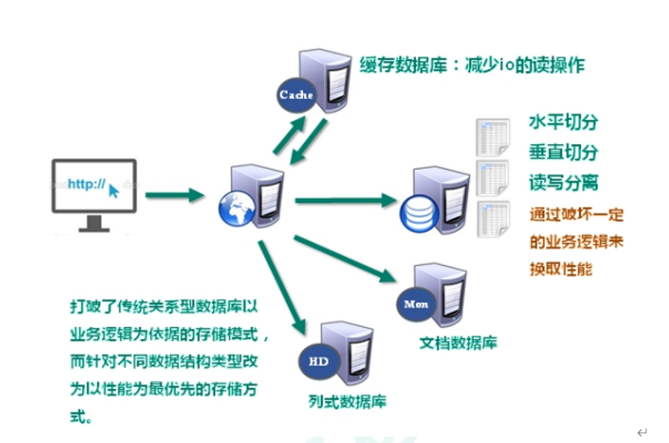
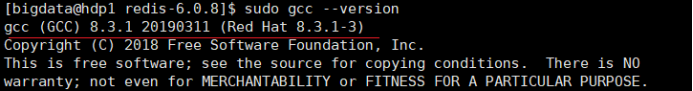
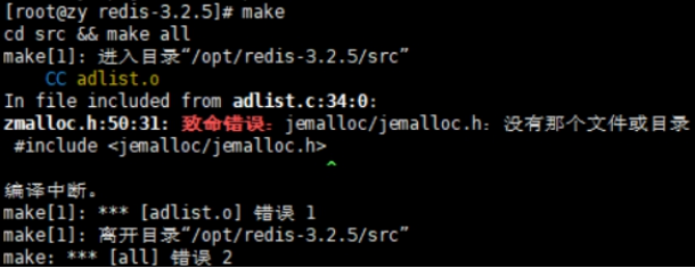
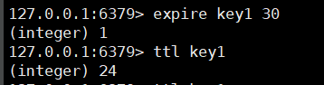
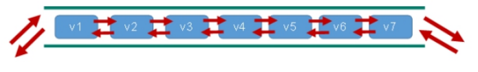
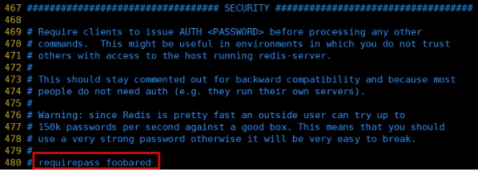

# Redis

# 一.NoSQL数据库简介

## 技术发展

>1、解决功能性的问题：Java、Jsp、RDBMS、Tomcat、HTML、Linux、JDBC、SVN
>
>2、解决扩展性的问题：Struts、Spring、SpringMVC、Hibernate、Mybatis
>
>3、解决性能的问题：NoSQL、Java线程、Hadoop、Nginx、MQ、ElasticSearch

## 互联网技术的发展及问题

**`注：解决cpu压力及内存压力`**

**`注：解决io压力`**

## NoSQL数据库概述

>NoSQL(NoSQL = **Not Only SQL** )，意即“不仅仅是SQL”，泛指**`非关系型的数据库`**。 
>
>NoSQL 不依赖业务逻辑方式存储，而以简单的**`key-value模式存储`**。因此大大的增加了数据库的扩展能力。
>
>- 不遵循SQL标准
>- 不支持ACID。（ACID是事务的四大特性；不是不支持事务，只是不支持ACID）
>- 远超于SQL的性能。

## NoSQL适用场景

>- 对数据高并发的读写
>
>- 海量数据的读写
>
>- 对数据高可扩展性的

## NoSQL不适用的场景

>1. 需要**事务支持**
>
>2. 基于sql的结构化查询存储，处理复杂的关系,需要**即席查询**。
>
>3. **用不着sql的和用了sql也不行的情况，请考虑用NoSql**

# 二.Redis概述及安装

>- Redis是一个**开源**的**key-value**存储系统。
>
>- 和Memcached类似，它支持存储的value类型相对更多，包括string(字符串)、list(链表)、set(集合)、zset(sorted set --有序集合)和hash（哈希类型）。
>
>- 这些数据类型都支持`push/pop、add/remove`及`取交集并集和差集`及更丰富的操作，而且这些操作都是`原子性的`。
>- 在此基础上，Redis支持`各种不同方式的排序。`
>- 与memcached一样，为了保证效率，`数据都是缓存在内存中。`
>- 区别的是**Redis会周期性的把更新的数据写入磁盘或者把修改操作写入追加的记录文件。**
>- 并且在此基础上实现了**master-slave(主从)**同步。

## 应用场景

### **配合关系型数据库做高速缓存**

高频次，热门访问的数据，**降低数据库IO**

分布式架构，**做session共享**

### ****多样的数据结构存储持久化数据

##  Redis安装

>在redis网站上下载redis压缩包（linux压缩包）
>
>[**http://redis.io**](http://redis.io)
>
>Redis中文官方文档
>
>http://redis.cn/

### 安装版本

redis的官方文档中已经说明无需考虑对window版本的支持

### 安装步骤

**准备工作**

安装C语言的编译环境

yum install centos-release-scl scl-utils-build

yum install -y devtoolset-8-toolchain

scl enable devtoolset-8 bash

测试gcc版本

gcc --version

**安装步骤**

>1. 下载redis-6.2.1.tar.gz放/opt目录
>
>2. 解压命令：tar -zxvf redis-6.2.1.tar.gz
>
>3. 解压完成后进入目录：cd redis-6.2.1
>
>4. 在redis-6.2.1目录下再次执行make命令（只是编译好）
>
>5. 跳过make test 继续执行: make install
>
>   

>(如果没有准备好c语言环境就会报下面这个错误)
>
>**Jemalloc/jemalloc.h：没有那个文件**
>
>
>
>解决方案：**运行make distclean**，然后继续执行make命令即可

## 解压后安装到/usr/local/bin

查看默认安装目录：

>- redis-benchmark:性能测试工具，可以在自己本子运行，看看自己本子性能如何
>
>- redis-check-aof：修复有问题的AOF文件，rdb和aof后面讲
>
>- redis-check-dump：修复有问题的dump.rdb文件
>
>- redis-sentinel：Redis集群使用
>
>- redis-server：Redis服务器启动命令
>
>- redis-cli：客户端，操作入口

## Redis启动

### 前台启动（不推荐）

前台启动，命令行窗口不能关闭，否则服务器停止

### 后台启动（推荐）

**1.备份redis.conf**

拷贝一份redis.conf到其他目录（/etc/redis.conf）

cp redis.conf  /etc/redis.conf

**2.后台启动设置daemonize no改成yes**

redis.conf在/usr/local/bin这个目录下

修改redis.conf(128行)文件将里面的daemonize no 改成 yes，让服务在后台启动

**3.redis启动**

redis-server /etc/redis.conf

后面的（/etc/redis.conf）这个是在redis.conf复制的目录下

**4.用客户端访问：redis-cli**

redis-cli

**5.验证测试：ping**

**6.Redis关闭**

单实例关闭：redis-cli shutdown

也可以进入终端后再关闭，输入：shutdown命令

## Redis相关知识

>Redis**默认16个数据库**，**类似数组下标从0开始，初始默认使用0号库**
>
>使用命令 **select  <dbid>**来切换数据库。如: select 8
>
>统一密码管理，所有库同样密码。
>
>**dbsize**查看当前数据库的key的数量
>
>**flushdb清空当前库**
>
>**flushall通杀全部库**

Redis是**`单线程+多路IO复用技术`**

>**多路复用**是指使用一个线程来检查多个文件描述符（Socket）的就绪状态，比如调用select和poll函数，传入多个文件描述符，
>
>如果有一个文件描述符就绪，则返回，否则阻塞直到超时。
>
>得到就绪状态后进行真正的操作可以在同一个线程里执行，也可以启动线程执行（比如使用线程池）

**串行  vs  多线程+锁（memcached） vs  单线程+多路IO复用(Redis)**

>这里的串行很简单，执行方式和文字一样，像串一样，一个一个执行
>
>多线程+锁更不用多说了
>
>这里用买票的例子类比一下**单线程+多路IO复用(Redis)**
>
>黄牛是个单线程，每个买票的人就像许多个IO，当他已经准备好钱（就绪状态），黄牛就可以帮他买票了（进入单线程）
>
>

Redis与Memcache三点不同: **支持多数据类型，支持持久化，单线程+多路IO复用**

# 三.常用五大数据类型

>查询redis的操作命令：http://www.redis.cn/commands.html

## Redis键（Key）

### Redis键（Key）基本命令

| 命令              | 含义                                             | 例子                                                         |
| :---------------- | ------------------------------------------------ | ------------------------------------------------------------ |
| keys *            | 查看当前库所有key（匹配：keys *）                |                                                              |
| set  <key><value> | 添加键值对                                       |  |
| exists key        | 判断某个key是否存在                              |  |
| type key          | 查看你的key是什么类型                            |  |
| del key           | 删除指定的key数据                                |  |
| expire key 10     | 为给定的key设置过期时间                          |  |
| ttl key           | 查看还有多少秒过期，-1表示永不过期，-2表示已过期 |                                                              |
|                   | 1表示存在，0表示不存在                           |                                                              |
| select  序号      | 切换数据库                                       |                                                              |
| dbsize            | 查看当前数据库的key的数量                        |                                                              |
| flushdb           | 清空当前库                                       |                                                              |
| flushall          | 通杀全部库                                       |                                                              |

## Redis字符串（String）

>String是Redis最基本的类型，你可以理解成与Memcached一模一样的类型，**一个key对应一个value。**
>
>String类型是**`二进制安全的`**。意味着Redis的string可以包含任何数据。比如jpg图片或者序列化的对象。
>
>String类型是Redis最基本的数据类型，**一个Redis中字符串value最多可以是512M**

### Redis字符串（String）命令

| 命令                                       | 含义                                                         | 例子                                                         |
| ------------------------------------------ | ------------------------------------------------------------ | ------------------------------------------------------------ |
| get  <key>                                 | 查询对应键值                                                 |  |
| append  <key><value>                       | 将给定的<value> 追加到原值的末尾                             |                                                              |
| strlen  <key>                              | 获得值的长度                                                 |  |
| setnx  <key><value>                        | 只有在 key 不存在时   设置 key 的值；                        |  |
|                                            | 存在的时候设置不了                                           |                                                              |
| incr  <key>                                | 将 key 中储存的数字值增1                                     |  |
|                                            | **只能对数字值操作**，如果为空，新增值为1                    |                                                              |
| decr  <key>                                | 将 key 中储存的数字值减1                                     |  |
|                                            | **只能对数字值操作**，如果为空，新增值为-1                   |                                                              |
| incrby / decrby  <key><步长>               | 将 key 中储存的数字值增减。自定义步长                        |  |
| mset  <key1><value1><key2><value2>...      | 同时设置一个或多个 key-value对                               |  |
| mget  <key1><key2><key3> .....             | 同时获取一个或多个 value                                     |  |
| msetnx <key1><value1><key2><value2>  ..... | 同时设置一个或多个 key-value 对，当且仅当所有给定 key 都不存在。 |  |
|                                            | **`原子性，有一个失败则都失败`**                             |                                                              |
| getrange  <key><起始位置><结束位置>        | 获得值的范围，类似java中的substring，                        |  |
| setrange  <key><起始位置><value>           | 用 <value>  覆写<key>所储存的字符串值，从<起始位置>开始(索引从0开始)。 |  |
| setex  <key><过期时间><value>              | 设置键值的同时，设置过期时间，单位秒。                       |  |
| getset <key><value>                        | 以新换旧，设置了新值同时获得旧值。                           |  |
|                                            |                                                              |                                                              |

------

### 3.2.2原子性

>
>
>所谓**原子操作**是指不会被**线程调度机制打断**的操作；
>
>**这种操作一旦开始，就一直运行到结束，中间不会有任何 context switch （切换到另一个线程）。**
>
>（1）在单线程中， **能够在单条指令中完成的操作都可以认为是"原子操作"**，因为中断只能发生于指令之间。
>
>（2）在多线程中，不能被其它进程（线程）打断的操作就叫**`原子操作`**。
>
>Redis单命令的原子性主要得益于**`Redis的单线程。`**

### 3.2.3String的数据结构

>String的数据结构为简单动态字符串(Simple Dynamic String,缩写SDS)。
>
>是可以修改的字符串，内部结构实现上类似于Java的ArrayList，采用预分配冗余空间的方式来减少内存的频繁分配.
>
> 
>
>如图中所示，内部为当前字符串实际分配的空间capacity一般要高于实际字符串长度len。
>
>当字符串长度**小于1M**时，**扩容都是加倍现有的空间**，如果**超过1M**，扩容时一次**只会多扩1M的空间**。需要注意的是字符串**最大长度为512M。**

## Redis列表（List）

### 简介

>**单键多值**
>
>**Redis 列表**是简单的**`字符串列表`**，按照插入顺序排序。你可以**添加一个元素到列表的头部（左边）或者尾部（右边）。**
>
>它的底层实际是个**双向链表**，对两端的操作性能很高，通过索引下标的操作中间的节点性能会较差。
>
>

### 常用命令

- **lpush/rpush  <key><value1><value2><value3> .... 从左边/右边插入一个或多个值。**

- lpop/rpop  <key>从左边/右边吐出一 个值。值在键在，值光键亡。

 

- **rpoplpush  <key1><key2>从<key1>列表右边吐出一个值，插到<key2>列表左边。**

 

- **lrange <key><start><stop>**

  按照索引下标获得元素(从左到右)

  **lrange mylist 0 -1  0左边第一个，-1右边第一个，（0-1表示获取所有）**

- **lindex <key><index>按照索引下标获得元素(从左到右)**

- **llen <key>获得列表长度** 

 

- **linsert <key>  before <value><newvalue>在<value>的`前面`插入<newvalue>插入值**

- **lrem <key><n><value>从左边删除n个value(从左到右)**

- **lset<key><index><value>将列表key下标为index的值替换成value**

### 数据结构

>List的数据结构为**快速链表quickList。**
>
>首先在列表元素较少的情况下会使用**一块连续的内存存储**，这个结构是**ziplist**，也即是**压缩列表。**
>
>它将所有的元素紧挨着一起存储，分配的是一块连续的内存。
>
>
>
>**当数据量比较多的时候才会改成quicklist。**
>
>因为普通的链表需要的附加指针空间太大，会比较浪费空间。比如这个列表里存的只是int类型的数据，结构上还需要两个额外的指针prev和next。
>
>
>
>**`Redis将链表和ziplist结合起来组成了quicklist`**。
>
>也就是将多个ziplist使用双向指针串起来使用。这样既满足了快速的插入删除性能，又不会出现太大的空间冗余。

## Redis集合（Set）

### 简介

>Redis set对外提供的功能与list类似是一个列表的功能，特殊之处在于set是可以\**自动排重\**的，
>
>当你需要**存储一个列表数据，又不希望出现重复数据时**，set是一个很好的选择，
>
>并且set提供了判断某个成员是否在一个set集合内的重要接口，这个也是list所不能提供的。
>
>
>
>Redis的Set是string类型的*无序集合*。它底层其实是一个value为null的hash表，
>
>所以添加，删除，查找的***\*复杂度都是O(1)\****。
>
>一个算法，随着数据的增加，执行时间的长短，如果是O(1)，数据增加，查找数据的时间不变

### 常用命令

- sadd <key><value1><value2> ..... 

  将一个或多个 member 元素加入到集合 key 中，已经存在的 member 元素将被忽略

  

- smembers <key>取出该集合的所有值。

- sismember <key><value>判断集合<key>是否为含有该<value>值，有1，没有0

- scard<key>返回该集合的元素个数。

  

- srem <key><value1><value2> .... 删除集合中的某个元素。

- spop <key>***\*随机从该集合中吐出一个值。\****

- srandmember <key><n>随机从该集合中取出n个值。不会从集合中删除 。

  

- smove <source><destination>value把集合中一个值从一个集合移动到另一个集合

### 数据结构

>Set数据结构是dict字典，字典是用哈希表实现的。
>
>Java中HashSet的内部实现使用的是HashMap，只不过所有的value都指向同一个对象。
>
>Redis的set结构也是一样，它的内部也使用hash结构，所有的value都指向同一个内部值。

## Redis哈希（Hash）

### 简介

>Redis hash 是一个键值对集合。
>
>Redis hash是一个string类型的field和value的映射表，hash特别适合用于存储对象。
>
>类似Java里面的Map<String,Object>
>
>用户ID为查找的key，存储的value用户对象包含姓名，年龄，生日等信息，
>
>如果用普通的key/value结构来存储
>
>主要有以下2种存储方式：
>
>
>
>
>
>

### 常用命令

- hset <key><field><value>给<key>集合中的  <field>键赋值<value>

- hget <key1><field>从<key1>集合<field>取出 value 

- hmset <key1><field1><value1><field2><value2>... 批量设置hash的值

- hexists<key1><field>查看哈希表 key 中，给定域 field 是否存在。 

- hkeys <key>列出该hash集合的所有field

- hvals <key>列出该hash集合的所有value

- hincrby <key><field><increment>为哈希表 key 中的域 field 的值加上增量 1  -1

- hsetnx <key><field><value>将哈希表 key 中的域 field 的值设置为 value ，当且仅当域 field 不存在 .

### 数据结构

>Hash类型对应的数据结构是两种：ziplist（压缩列表），hashtable（哈希表）。
>
>当field-value长度较短且个数较少时，使用ziplist，否则使用hashtable。

## Redis有序集合Zset（Sorted Set）

### 简介

>Redis有序集合zset与普通集合set非常相似，是一个**没有重复元素**的字符串集合。
>
>不同之处是有序集合的每个成员都关联了一个***评分（score）***,
>
>这个评分（score）被用来按照**从最低分到最高分的方式排序集合中的成员**。集合的成员是唯一的，但是评分可以是重复了 。
>
>因为元素是有序的, 所以你也可以很快的根据评分（score）或者次序（position）来获取一个范围的元素。

### 常用命令

- zadd  <key><score1><value1><score2><value2>…

  将一个或多个 member 元素及其 score 值加入到有序集 key 当中。

 

- zrange <key><start><stop>  [WITHSCORES]

  返回有序集 key 中，下标在<start><stop>之间的元素

  带WITHSCORES，可以让分数一起和值返回到结果集。

 

- zrangebyscore key minmax [withscores] [limit offset count]

  返回有序集 key 中，所有 score 值介于 min 和 max 之间(包括等于 min 或 max )的成员。有序集成员按 score 值递增(从小到大)次序排列。 

 

- zrevrangebyscore key maxmin [withscores] [limit offset count]        

  同上，改为从大到小排列。 

 

- zincrby <key><increment><value>    为元素的score加上增量

- zrem  <key><value>删除该集合下，指定值的元素 

- zcount <key><min><max>统计该集合，分数区间内的元素个数 

- zrank <key><value>返回该值在集合中的排名，从0开始。

### 数据结构

>SortedSet(zset)是Redis提供的一个非常特别的数据结构，
>
>一方面它等价于Java的数据结构Map<String, Double>，**可以给每一个元素value赋予一个权重score，**
>
>另一方面它又类似于TreeSet，**内部的元素会按照权重score进行排序，可以得到每个元素的名次**，还**可以通过score的范围来获取元素的列表**
>
>
>
>**zset底层使用了两个数据结构**
>
>（1）**hash，hash的作用就是关联元素value和权重score，保障元素value的唯一性，可以通过元素value找到相应的score值。**
>
>（2）跳跃表，**跳跃表的目的在于给元素value排序，根据score的范围获取元素列表。**

# 四.配置文件

需要进行修改的配置：

## bind

>默认情况bind=127.0.0.1`只能接受本机的访问请求`
>
>不写的情况下，**无限制接受任何ip地址的访问**
>
>生产环境肯定要写你应用服务器的地址；服务器是需要远程访问的，所以需要将**其注释掉**
>
>
>
>如果开启了protected-mode，那么在没有设定bind ip且没有设密码的情况下，**Redis只允许接受本机的响应**

## protected-mode

>将本机访问保护模式设置no
>
>

## 设置账号密码

>将图1圈圈处后面的部分改为自己选定的密码
>
>
>
>图1
>
>
>
>图2

# 五.Redis的发布和订阅

## 什么是发布和订阅？

>Redis 发布订阅 (pub/sub) 是一种消息通信模式：发送者 (pub) 发送消息，订阅者 (sub) 接收消息。
>
>Redis 客户端可以订阅任意数量的频道。

## Redis的发布和订阅

**客户端可以订阅频道如下图**

**当给这个频道发布消息后，消息就会发送给订阅的客户端**

## 发布订阅命令行实现

1. 打开一个客户端订阅channel1

   SUBSCRIBE channel1

2. 打开另一个客户端，给channel1发布消息hello

   publish channel1 hello

​		返回的1是订阅者数量

3. 打开第一个客户端可以看到发送的消息

​		**注：发布的消息没有持久化，如果在订阅的客户端收不到hello，只能收到订阅后发布的消息**

# 六.Redis新数据类型
