#  Spring框架

>spring的主要功能就是为你创建对象和注入值。所以在使用spring框架时，当你要用一个对象的时候，对象的注入，对象的创建都可以交给spring直接加入注解@Componenet和@autowired 
>
>name是属性，value是参数，ref是引用参数
>
>@Component @Value @autowired@A


# 一.ioc（Inversion of Control）控制反转

## 概念

概念：把对象的创建，赋值，管理工作都交给代码之外的容器进行实现，也就是对象的创建也是由外部资源来完成 。

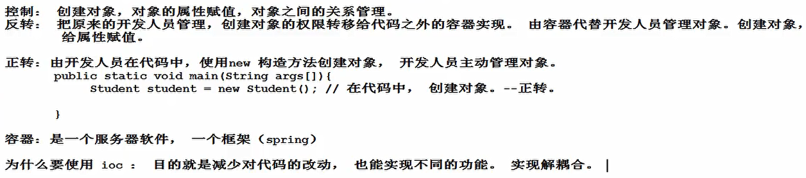

java创建对象有哪些方法：

1.构造方法，new Student()

2.反射

3.序列化

4.克隆

5.ioc：容器创建对象

6.动态代理

## ioc的体现

 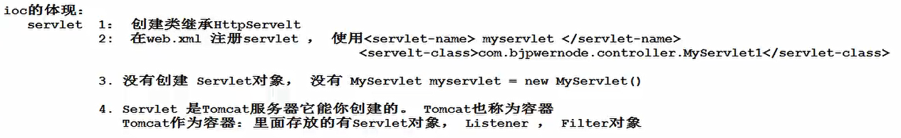

## ioc的技术实现

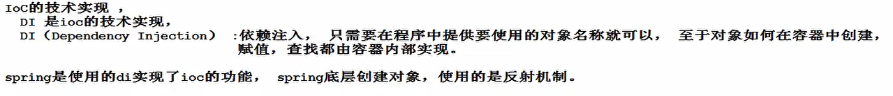


**di是ioc的技术实现，也叫做依赖注入。spring时使用di实现了ioc的功能**

# 二.基于XML的di（依赖注入）

DI是ioc的技术实现

## 举个例子

### 由spring创建对象

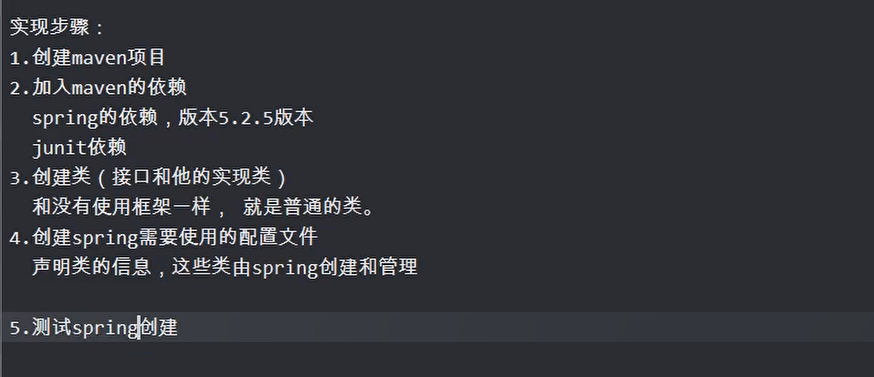

### spring在maven中的依赖

```xml
<!--    <spring依赖>-->
    <dependency>
      <groupId>org.springframework</groupId>
      <artifactId>spring-context</artifactId>
      <version>5.2.5.RELEASE</version>
    </dependency>
```

### 创建spring需要的配置文件

简要介绍下<beans>,<bean>标签

步骤

1.<bean id="自定义id" class="类的全限定名称（全名）"/>标签内给类进行赋值

注意：

创建对象的时候是在new容器时，容器读取beans标签内bean标签时创建，创建好的对象，存在springMap中。

读取容器的同时，对象其实也已经创建好了


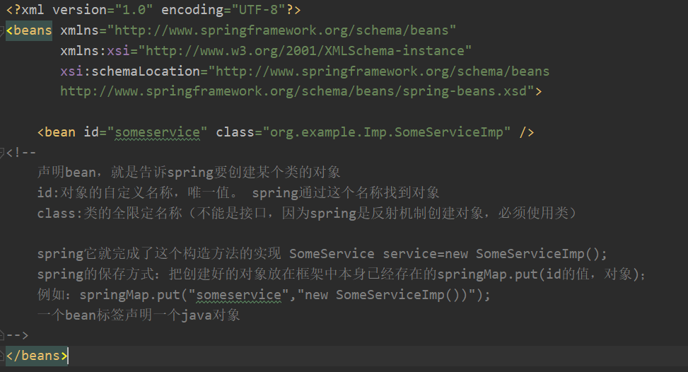

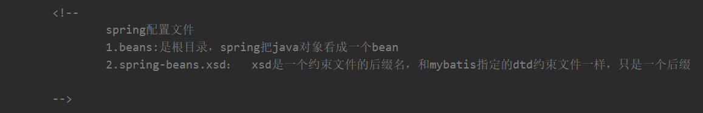

### 使用spring容器创建对象

1.创建容器

2.通过容器创建对象

3.ac.getBean（id值）：其实就是调用已经创建好的对象

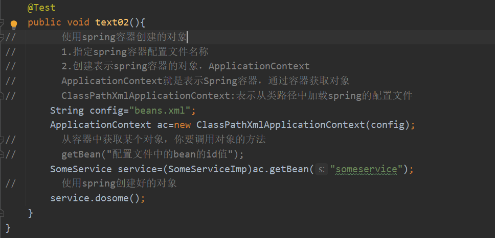

### 对象创建的时机

创建对象的时候是在new容器时，容器读取beans标签内bean标签时创建，创建好的对象，存在springMap中。

读取容器的同时，对象其实也已经创建好了

ac.getBean（id值）：其实就是调用已经创建好的对象


## 获取容器中的对象信息

getBeanDefinitionCount():表示的是spring容器中对象的数量

getBeanDefinitionNames（）：表示的是spring所有对象的名称的

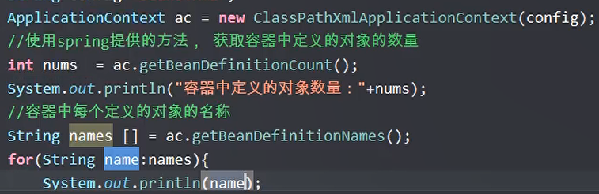

## 对象的属性赋值(set注入/set赋值)

**spring的配置文件叫做“applicationContext.xml”，最好不要改成其他的**

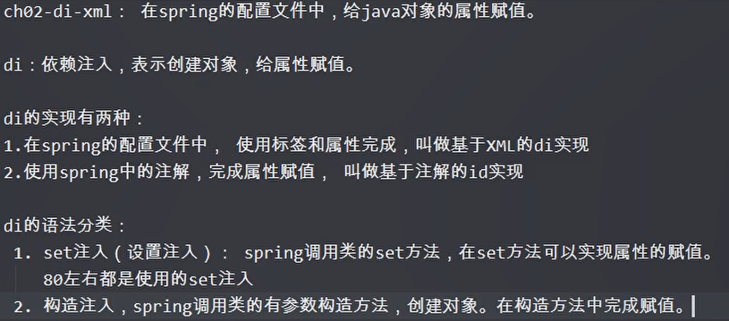

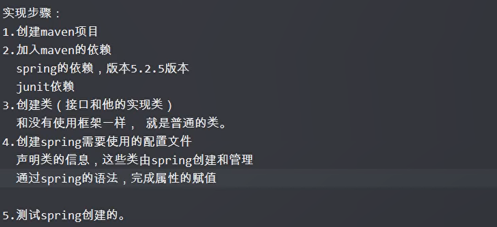

### 设置注入

#### 简单类型的设置注入（set赋值）

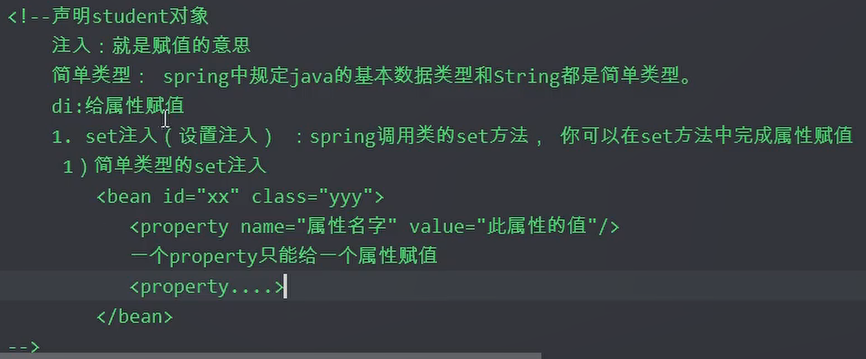

<property name="age" value="12">

spring通过property给set赋值，但只是执行已经做好了的set名字方法

Spring调用的只是set方法，和其他无关

#### 引用类型的设值注入

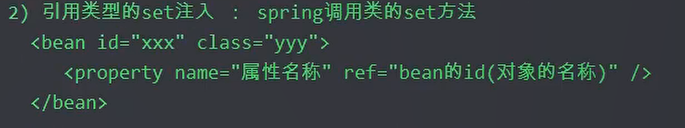

例子：

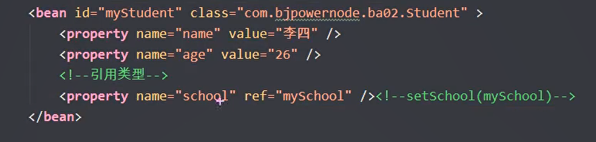

### 构造注入

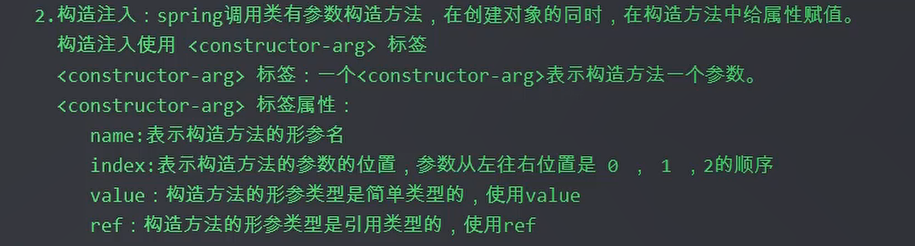

例子：

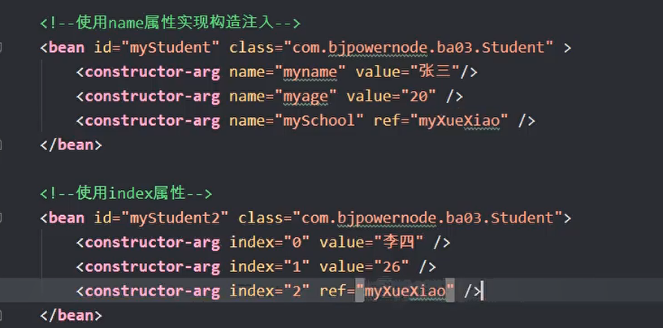

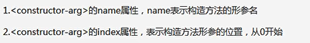

### 自动注入

#### byName方式（按名称注入）

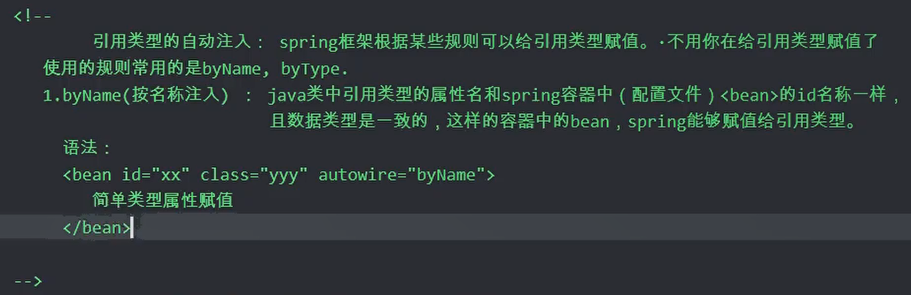

#### byType方式（按类型注入）

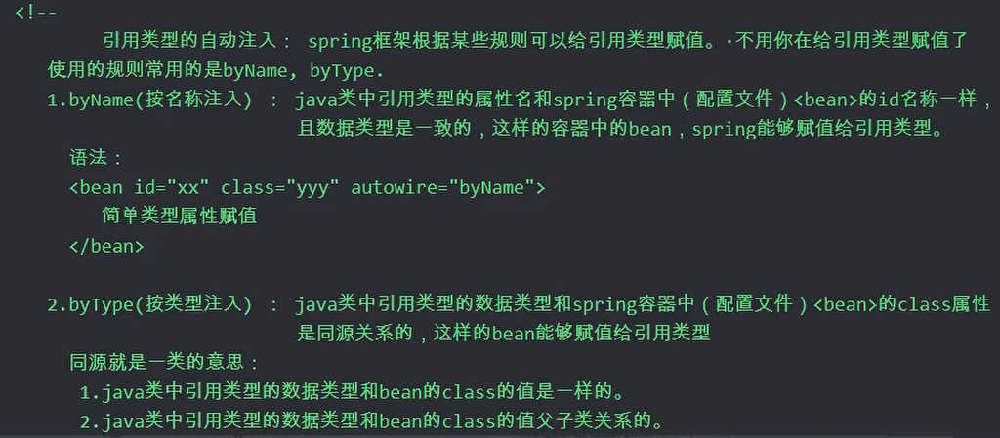

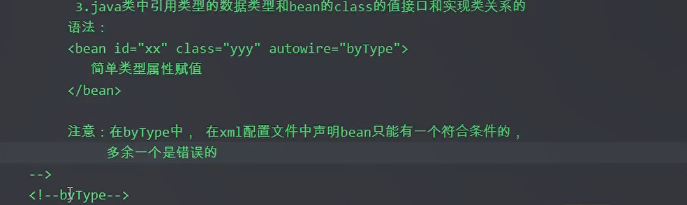

## 使用多配置文件

### 使用多配置文件的好处

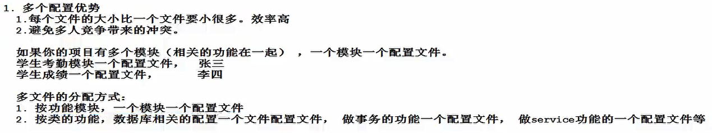

### 包含关系的配置文件

多配置文件通过<import resource="classpath:ba06/spring-school.xml">都引入到一个文件中

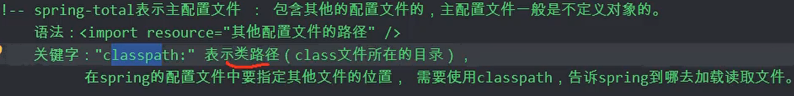

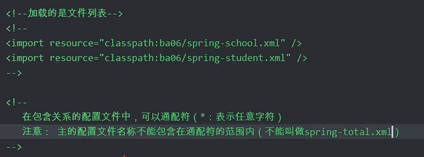

***classpath：***

**关键字:"classpath:"表示类路径（class文件所在的目录）**

# 三.基于注解的di

## 概念

通过spring的注解创建完成java对象创建，属性。代替xml文件

## @component注解及创建对象的方式

基本步骤

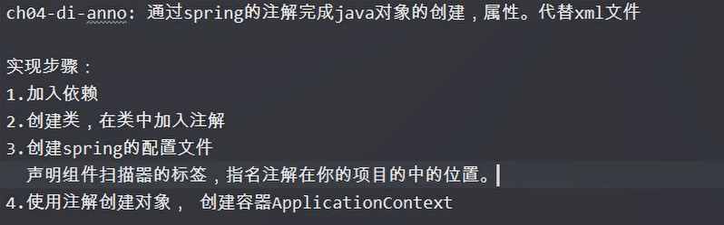

@Component注解的含义：

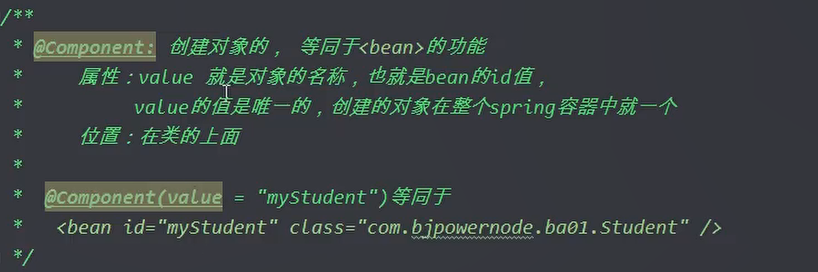

三种使用方法，红圈为公司常用的方法

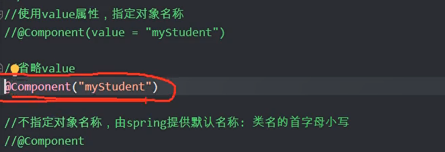

例子


在spring的配置文件中声明组件扫描器component-scan的标签

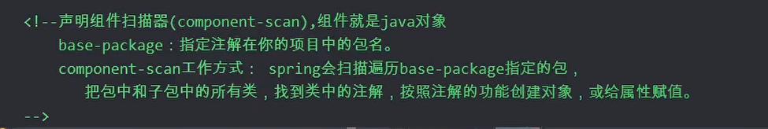

例子


## 和@component相似的三个注解

@Repository---------dao实现类

@Service-----------业务层类

@Controller----------控制器类

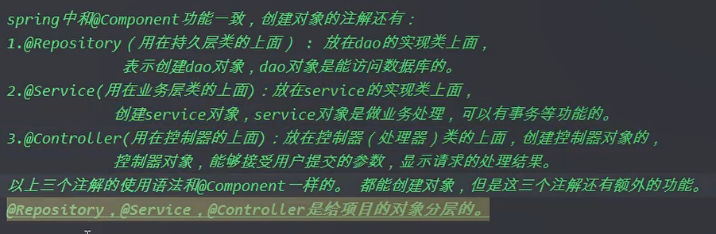

## @component扫描多个包的三种方式

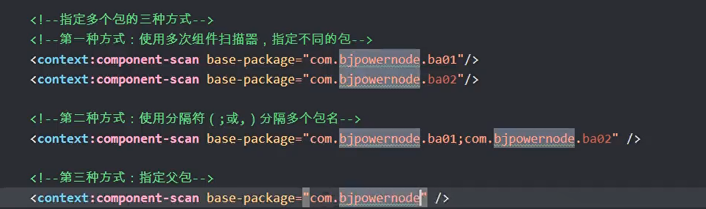

如果你使用第三种方式，那么必须确定在这个包下面没有同名的对象，否者会创建多个对象

## 简单类型属性赋值@value

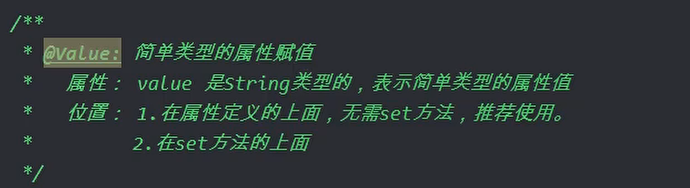

例子：

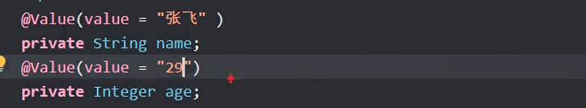

另一种写法

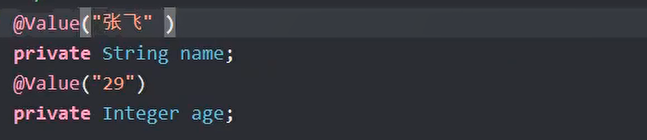

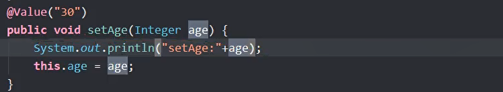

## @Autowired的byType,byName自动注入

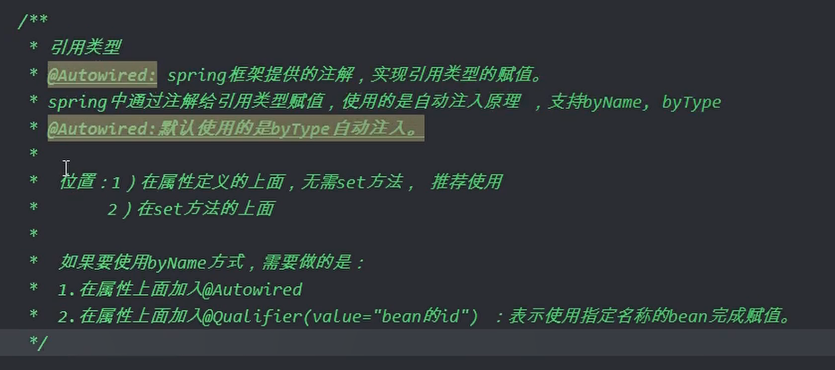

byType自动会去框架中找相同类型的对象

根据Type自动找对象的例子：

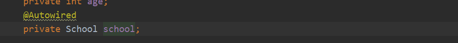

byName自动会去框架中找相同名字的对象

根据Name自动找对象的例子：


7.@autowired的required属性

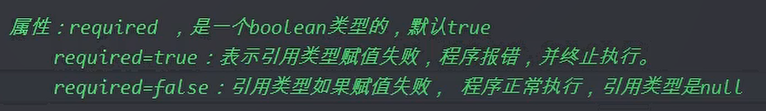

例子：

正确的名字是@Qualifier("mySchool")

## @Resource的自动注入

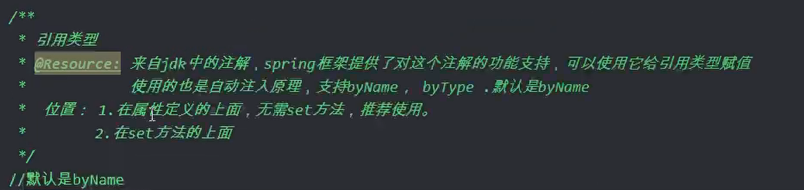


思考引用类型注入，如果要自己指定自己想指定的，这样做无论是自动注入还是引用注入都不方便。

# 四.aop面向切面编程

aop（Aspect Orient Programming）

spring的**动态代理编程方法**

## 动态代理

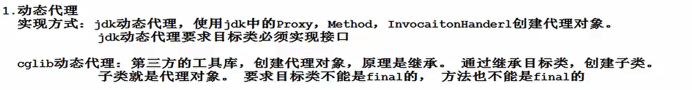

## 动态代理的作用


## 什么是aop

Aop : 面向切面编程，基于动态代理，可以使用jdk，cglib两种代理方式

**aop：就是对动态代理进行的一种规范化，让大家在用代理的时候用统一的方式去使用，其实就是“动态代理”**


## Aop基本介绍

>AOP 底层，就是采用动态代理模式实现的。采用了两种代理：JDK 的动态代理，与cglib 的动态代理。
>
>
>
>AOP 为 Aspect Oriented Programming 的缩写，意为：面向切面编程
>
>通过预编译方式和运行期动态代理实现程序功能的统一维护的一种技术。
>
>AOP 是 OOP 的延续，是软件开发中的一个热点，也是 Spring 框架中的一个重要内容。
>
>利用 AOP 可以对业务逻辑的各个部分进行隔离，从而使得业务逻辑各部分之间的耦合度降低，提高程序的可重用性，同时提高了开发的效率。
>
>
>
>面向切面编程，就是将交叉业务逻辑封装成切面，利用 AOP 容器的功能将切面织入到主业务逻辑中。
>
>所谓交叉业务逻辑是指，通用的、与主业务逻辑无关的代码，如安全检查、事务、日志、缓存等。
>
>
>
>若不使用 AOP，则会出现代码纠缠，即交叉业务逻辑与主业务逻辑混合在一起。
>
>这样，会使主业务逻辑变的混杂不清。
>
>
>
>**实例**
>
>**例如，转账，在真正转账业务逻辑前后，需要权限控制、日志记录、加载事务、结束事务等交叉业务逻辑，而这些业务逻辑与主业务逻辑间并无直接关系。**但，它们的代码量所占比重能达到总代码量的一半甚至还多。它们的存在，不仅产生了大量的“冗余”代码，还大大干扰了主业务逻辑---转账。


## Aop编程术语

- **切面（Aspect）**

切面泛指交叉业务逻辑。上例中的事务处理、日志处理就可以理解为切面。常用的切面是通知（Advice）。实际就是对主业务逻辑的一种增强。


- **织入（Weaving）**

织入是指将切面代码插入到目标对象的过程。上例中MyInvocationHandler类中的invoke() 方法完成的工作，就可以称为织入。


- **连接点（JoinPoint）**

连接点指可以被切面织入的具体方法。通常业务接口中的方法均为连接点。


- **切入点（Pointcut）**

切入点指声明的一个或多个连接点的集合。通过切入点指定一组方法。

被标记为 final 的方法是不能作为连接点与切入点的。因为最终的是不能被修改的，不能被增强的。


- **目标对象（Target）**

目标对象指将要被增强的对象。即包含主业务逻辑的类的对象。上例中的StudentServiceImpl的对象若被增强，则该类称为目标类，该类对象称为目标对象。当然，不被增强，也就无所谓目标不目标了


- **通知（Advice）**

通知是切面的一种实现，可以完成简单织入功能（织入功能就是在这里完成的）。上例中的 MyInvocationHandler 就可以理解为是一种通知。换个角度来说，通知定义了增强代码切入到目标代码的时间点，是目标方法执行之前执行，还是之后执行等。通知类型不同，切入时间不同。 切入点定义切入的位置，通知定义切入的时间。


**切面的三个关键要素**

>1. 切面的功能代码，这个切面是干什么
>
>2. 切面的执行位置，使用pointcut表示切面执行的位置
>3. 切面的执行时间，是在目标方法之前还是目标方法之后


**面向切面编程的好处**

● 减少重复；

● 专注业务；

注意：面向切面编程只是面向对象编程的一种补充。

​		使用AOP减少重复代码，专注业务实现：

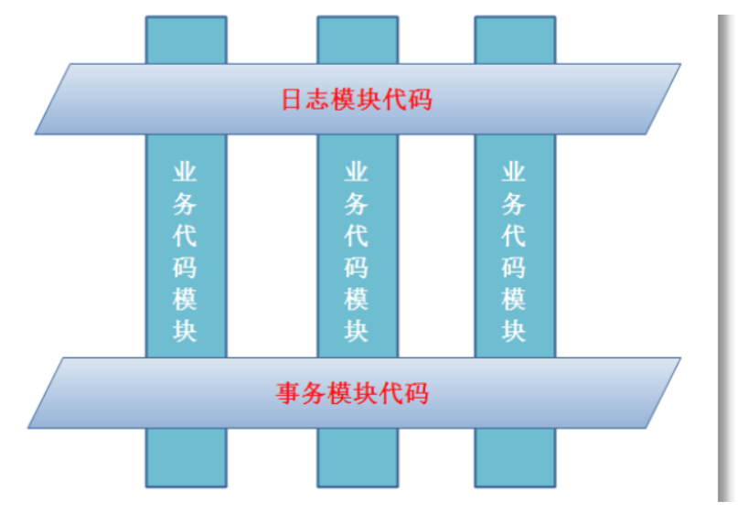


## AOP的实现——AspectJ

>对于 AOP 这种编程思想，很多框架都进行了实现。
>
>Spring 就是其中之一，可以完成面向切面编程。
>
>然而，AspectJ 也实现了 AOP 的功能，且其实现方式更为简捷，使用更为方便，而且还支持注解式开发。
>
>所以，Spring 又将 AspectJ 的对于 AOP 的实现也引入到了自己的框架中。
>
>在 Spring 中使用 AOP 开发时，一般使用 AspectJ 的实现方式。


### AspectJ简介

>AspectJ 是一个面向切面的框架，它扩展了 Java 语言。AspectJ 定义了 AOP 语法，它有一个专门的编译器用来生成遵守 Java 字节编码规范的 Class 文件。
>
>官网地址：http://www.eclipse.org/aspectj/
>
>AspetJ 是 Eclipse 的开源项目，官网介绍如下：
>
>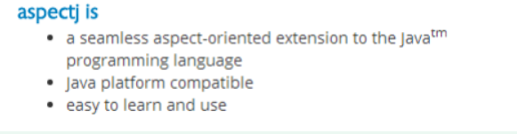
>
>a seamless aspect-oriented extension to the Javatm programming language（一种基于 Java 平台的面向切面编程的语言）
>
>Java platform compatible（兼容 Java 平台，可以无缝扩展）
>
>easy to learn and use（易学易用）
>
>
>
>aspectJ框架实现aop有两种方式
>
>1. 使用xml的配置文件：配置全局事务
>
>2. 使用注解，我们在项目中要做aop功能，一般都是用注解，aspectJ有5个注解
>
>3. AspectJ 中常用的通知有五种类型：
>
>   ● 前置通知
>
>   ● 后置通知
>
>   ● 环绕通知
>
>   ● 异常通知
>
>   ● 最终通知


### 6.aspectJ切入点表达式execution() 


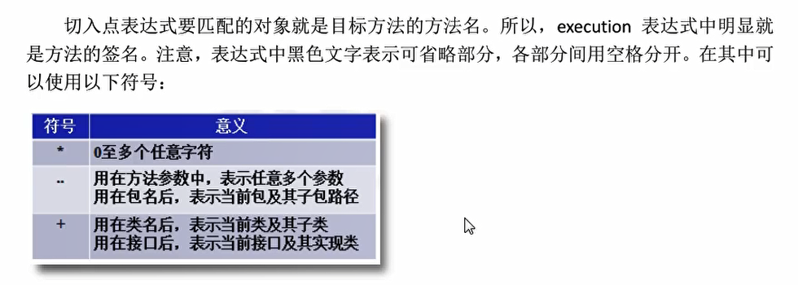

举例： 

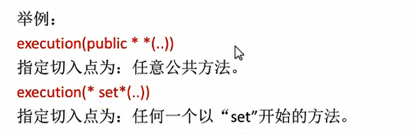

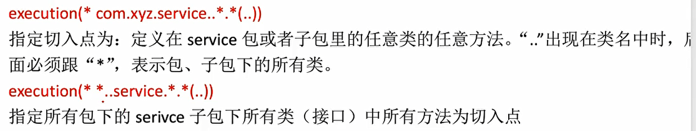


### 学习aspectj框架的使用

1）切面的执行时间，这个执行时间在规范中叫做Advice(通知，增强)

​	在aspectj框架中使用注解表示的。也可以使用xml配置文件中的标签表示

@Before           @AfterReturning           @Around            @AfterThrowing              @After

2）表示切面的执行位置，使用的是切入点表达式，可见上文


3）使用aspectj实现aop的基本步骤（以前置通知为例）

- ①.新建maven项目

- ②.加入依赖

  ​    	1.spring依赖

  ​		2.aspectj依赖

  ​		3.junnit单元测试

  ```xml
  <!--    spring依赖-->
      <dependency>
        <groupId>org.springframework</groupId>
        <artifactId>spring-context</artifactId>
        <version>5.2.5.RELEASE</version>
      </dependency>
  <!--    aspectj依赖-->
      <dependency>
        <groupId>org.springframework</groupId>
        <artifactId>spring-aspects</artifactId>
        <version>5.2.15.RELEASE</version>
      </dependency>
  ```

- ③.创建目标类：接口及它的实现类

  ​	（我们能要做的是给实现类中的方法增加功能）

- ④.创建切面类：普通类

  ​		1.在类的上面加入@Aspect

  ​		2.在类中定义方法，方法就是切面要执行的功能代码

  ​			在方法的上面加入aspectj中的通知注解，例如@Before

  ​			有需要指定切入点表达式execution()

  切面类例子

  ```java
  package org.example.ba01;
  import org.aspectj.lang.annotation.Aspect;
  import org.aspectj.lang.annotation.Before;
  /*
  * @Aspect:是aspectj框架中的注解
  *       作用：表示当前类是切面类
  *       切面类：是用来给业务方法增加功能的，在这个类中有切面的功能代码
  *       位置：在类定义的上面
  * */
  @Aspect
  public class Myaspectj {
      /*
      * @Before:前制通知注解
      * 属性：value ，“value=”的内容是切入点表达式，表示切面的功能执行位置
      * 位置：在方法的上面
      * 特点：
      *   1.在目标方法之前先执行的
      *   2.不会改变目标方法的执行结果
      *   3.不会影响目标方法的执行
      * */
  
      @Before(value = "execution(public void dosome(String,int))")
      /*
      * 定义方法，方法是实现切面类要给业务方法
      * 方法的定义要求：
      * 1.方法的访问权限是：public
      * 2.方法没有返回值（void）
      * 3.方法名称自定义
      * 4.方法可以有参数，也可以没有参数
      *       如果有参数，参数不是自定义的，有几个参数可以使用
      * */
      public void mybefore(){
          System.out.println("在dosome（）之前执行");
      }
  }
  ```

- ⑤.声明spring的配置文件：声明对象，把对象交给容器统一管理

  ​	声明对象可以使用注解或者xml配置文件<bean>

  1）声明目标对象

  **注：一定要创建对象，切面类申明@Aspect注解只是另外加的，为了说明这个类也是切面类**

  2）声明切面类对象

  3）声明aspectj框架中的自**动代理生成器标签**。

  ​	自动代理生成器：用来完成代理对象的自动创建功能的。

  （和spring的扫描文件相似）

  >在定义好切面 Aspect 后，需要通知 Spring 容器，让容器生成“目标类+ 切面”的代理对象。
  >
  >这个代理是由容器自动生成的。
  >
  >只需要在 Spring 配置文件中注册一个基于 aspectj 的自动代理生成器，其就会自动扫描到@Aspect 注解，并按通知类型与切入点，将其织入，并生成代理。
  >
  >

  ```xml
      <aop:aspectj-autoproxy/>
  <!--    
  		功能，搜索spring框架内部的对象，寻找到切面类，在切面类的切入点表达式中定位到目标类。
  		aspectj框架再将目标类改造成为代理类
  -->
  ```

- ```xml
  配置文件实例
  <?xml version="1.0" encoding="UTF-8"?>
  <beans xmlns="http://www.springframework.org/schema/beans"
         xmlns:xsi="http://www.w3.org/2001/XMLSchema-instance" xmlns:aop="http://www.springframework.org/schema/aop"
         xsi:schemaLocation="http://www.springframework.org/schema/beans http://www.springframework.org/schema/beans/spring-beans.xsd http://www.springframework.org/schema/aop https://www.springframework.org/schema/aop/spring-aop.xsd">
  <!--    声明目标对象-->
      <bean id="ssi" class="org.example.ba01.SomeServiceImp"/>
  <!--    声明切面类对象-->
      <bean id="ms" class="org.example.ba01.Myaspectj"/>
  
      <!--
          声明自动代理生成器：使用aspectj框架内部的功能，创建目标对象的代理对象。
          创建代理对象是在内存中实现，实际上是修改目标对象的内存中的结构，把它创建为代理对象
          所以目标对象就是一个被修改后的代理对象
  
          aspectj-autoproxy:会把spring容器中的所有的目标对象，一次性都生成代理对象。
      -->
  
      <aop:aspectj-autoproxy/>
  <!--    
  功能，搜索spring框架内部的对象，寻找到切面类，在切面类的切入点表达式中定位到目标类，
  		aspectj框架再将目标类改造成为代理类
  -->
  </beans>
  ```

注意改造后的目标类已经成为了代理类

- ⑥.创建测试类，从spring容器中获取目标对象（实际就是代理对象）。

  ​	通过代理对象执行方法，实现aop的功能增强。
  
  执行顺序：在测试类中调用目标方法，会先调用前置通知（增加）方法，再调用目标方法

### JoinPoint的使用

JoinPoint介绍：切面类中的方法不能自定义，其中JoinPoint就可以使用

​							业务方法，要加入切面功能的业务方法

​							作用：在通知（增强）方法中获取方法执行时信息，例如方法名称，方法的实参

​							如果你的切面功能中需要用到方法的信息，就加入JoinPoint

​							这个JoinPoint参数的值，是由aspectj框架赋予的，**必须是参数列表的第一个位置的参数**

获取目标方法参数的信息：

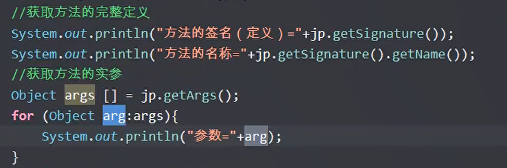

### 前置通知

前置通知的实现：

方法定义

```java
 /* 定义方法，方法是实现切面类要给业务方法
    * 方法的定义要求：
    * 1.方法的访问权限是：public
    * 2.方法没有返回值（void）
    * 3.方法名称自定义
    * 4.方法可以有参数，也可以没有参数
    *       如果有参数，参数不是自定义的，有几个参数可以使用
    * */
```

**注意：如果方法有参数，参数不是自定义的，有几个参数可以使用**

```java
/*
* @Before:前制通知注解
* 属性：value ，“value=”的内容是切入点表达式，表示切面的功能执行位置
* 位置：在方法的上面
* 特点：
*   1.在目标方法之前先执行的
*   2.不会改变目标方法的执行结果
*   3.不会影响目标方法的执行
* */
```

例子：

```java
@Before(value = "execution(public void dosome(String,int))")
    /*
    * 定义方法，方法是实现切面类要给业务方法
    * 方法的定义要求：
    * 1.方法的访问权限是：public
    * 2.方法没有返回值（void）
    * 3.方法名称自定义
    * 4.方法可以有参数，也可以没有参数
    *       如果有参数，参数不是自定义的，有几个参数可以使用
    * */
    public void mybefore(){
        System.out.println("在dosome（）之前执行");
    }
}
```


### 后置通知

后置通知的实现：

方法定义

```java
/*
* 后置通知定义方法，方法是实现切面类要给业务方法
* 方法的定义要求：
* 1.方法的访问权限是：public
* 2.方法没有返回值（void）
* 3.方法名称自定义
* 4.方法是有参数的，推荐是Object，参数名自定义 	
* */

```

**注意：方法是有参数的，推荐是Object，参数名自定义**

```java

/*
* @AfterReturning后置通知
*   属性：1.value切入点表达式
*        2.returning自定义的变量，表示目标方法的返回值的
*        自定义的变量名必须和通知方法的形参名一样
*   位置：在方法定义的上面
*
* 特点：
* 1.在目标方法之后执行
* 2.能够获取到目标方法的返回值，可以根据这个方法的返回值来做不同的处理
* 3.不可以修改这个返回值
* */
```

例子：

```java
@AfterReturning(value = "execution(* *..doother(..))",returning = "org")
public void myaspcetj(Object org){
    System.out.println("切面方法的返回值是"+org);
}
```

形象描述：

org接收目标方法的返回值，ajectj框架将org赋给切面类方法的形参。然后就可以调用或者修改返回值了

执行顺序：在测试类中调用目标方法，会先调用目标方法，再调用后置通知（增加）方法。

### 环绕通知

环绕通知方法定义格式：

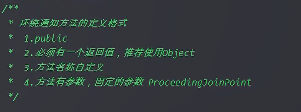

注意：

**ProceedingJoinPoint具有JoinPoint的功能，也能获取得到*目标方法的名称，实参*等信息。**

**注意：方法有参数，固定的参数*ProceedingJoinPoint***

环绕通知@Around注解

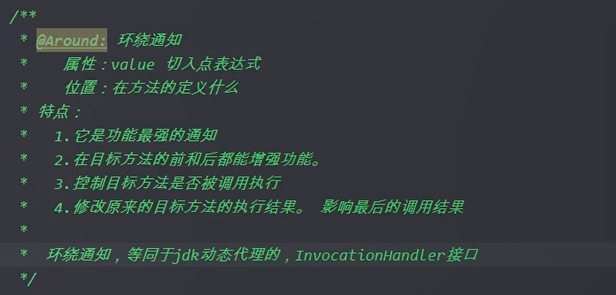


在环绕通知@Around中

调用方法的语句是：

public object myfirst(ProceedingJoinPoint pjp){

​	Object o=pjp.proceed()                             //method.invoke()

}


环绕通知返回值会覆盖原来的目标方法的返回值

```
//在环绕通知中测试类调用目标方法，aspectj框架会去寻找@Around注解，发现注解
//        方法后就会去调用该方法，覆盖目标方法。
//        例如上面的ti的返回值，它返回值获取对象其实并不是doFirst（）方法的返回值，而是@Around注解覆盖的切面方法的返回值
```

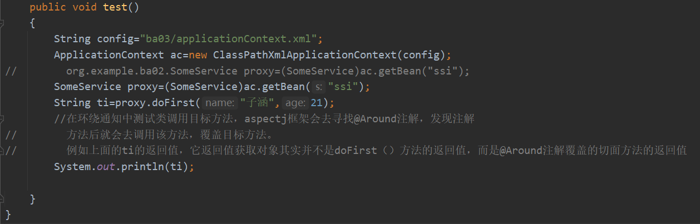


环绕通知的例子

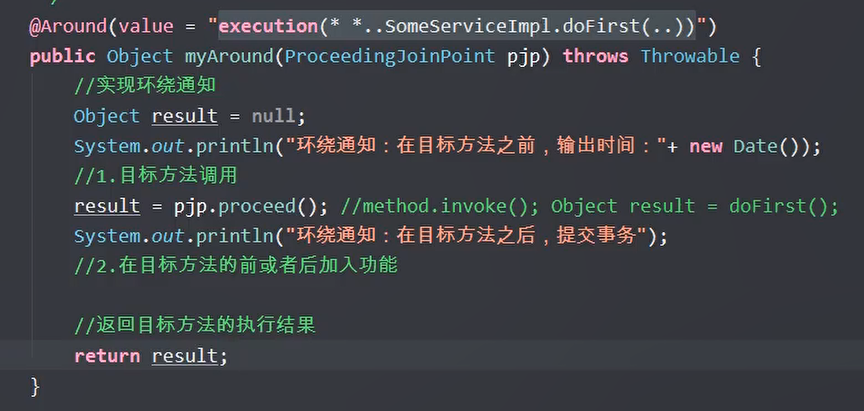

### 异常通知

**该方法可以做异常的监控程序，如果出现异常就发个短信，或者邮件进行通知**

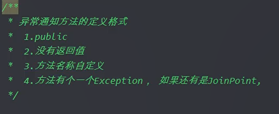

**注：方法的参数有*一个Exception*，如果还有是*JoinPoint*，参数名称必须和注释中的throwing相同**

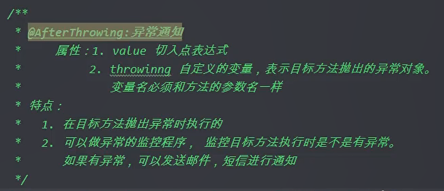


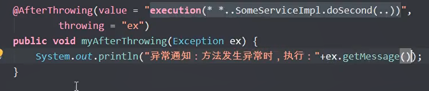

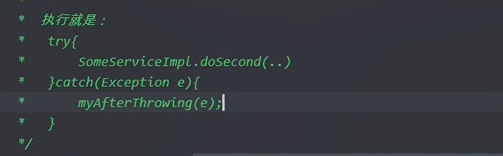

### 最终通知

无论代码是否会有异常，最终通知总是会被执行

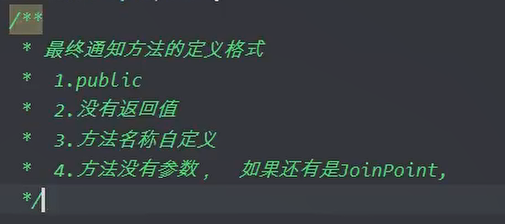

**注意：方法没有参数，如果有就是JoinPoint**


**执行特点：最后总会执行**

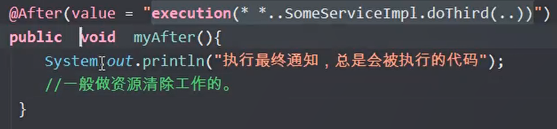

### Pointcut注解

**其实就是用它来代替切入点表达式的，因为切入点表达式需要复用，用它更加方便。**

语法：

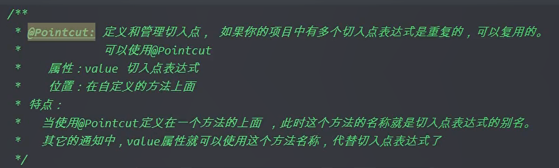

例子：


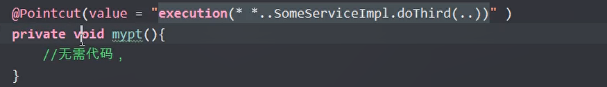

14.cglib代理

如果目标类没有接口类的话，spring框架会默认使用cglib动态代理（图二）

下面是目标类的名字，如果是用jdk动态代理则是（图一）


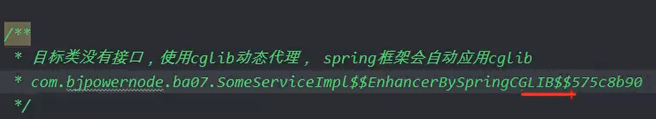

如果目标类有接口你仍然希望用cglib动态代理，则在配置文件中如下设置即可

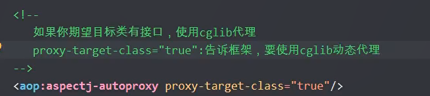

# 五.集成MyBatis——ioc

## ioc介绍

介绍：把Mybatis框架和spring集成在一起，向一个框架一样使用的技术是：ioc。

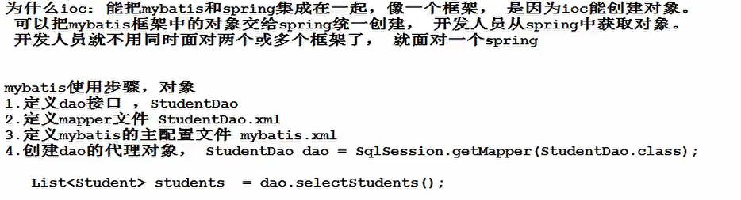

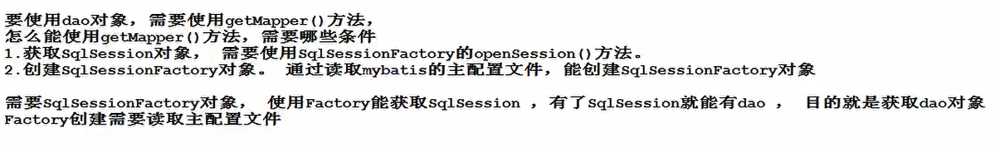


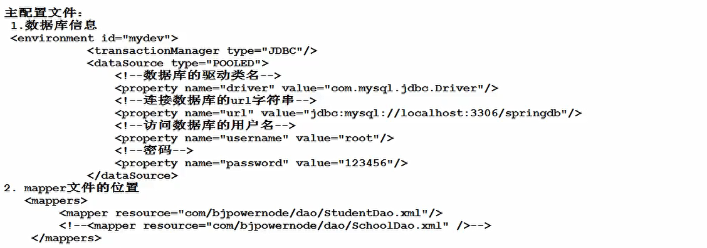

 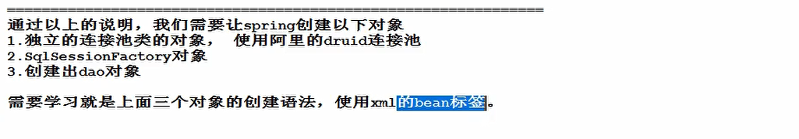

注意：Mybatis的连接池实用性不高所以需要学习新的连接池——**druid连接池**

## 创建Spring和Mybatis集成文件的步骤

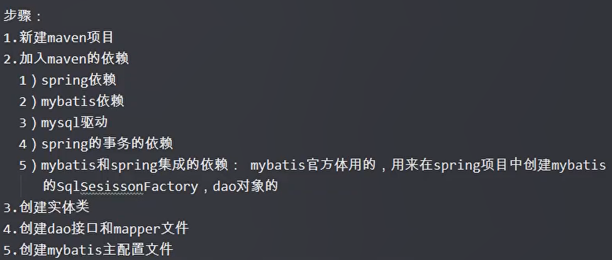

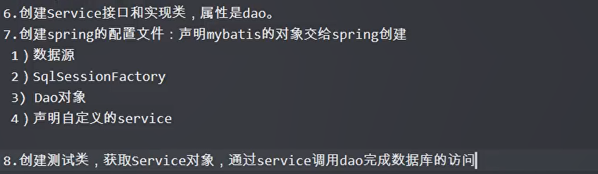


### 加入maven的依赖

```xml
//加入的依赖
<dependencies>
<!--    单元测试-->
    <dependency>
      <groupId>junit</groupId>
      <artifactId>junit</artifactId>
      <version>4.11</version>
      <scope>test</scope>
    </dependency>
<!--    spring的核心-->
    <dependency>
      <groupId>org.springframework</groupId>
      <artifactId>spring-context</artifactId>
      <version>5.2.5.RELEASE</version>
    </dependency>
<!--    spring的事务需要的依赖-->
    <dependency>
      <groupId>org.springframework</groupId>
      <artifactId>spring-tx</artifactId>
      <version>5.2.5.RELEASE</version>
    </dependency>
    <dependency>
      <groupId>org.springframework</groupId>
      <artifactId>spring-jdbc</artifactId>
      <version>5.2.5.RELEASE</version>
    </dependency>
<!--    Mybatis依赖-->
    <dependency>
      <groupId>org.mybatis</groupId>
      <artifactId>mybatis</artifactId>
      <version>3.5.1</version>
    </dependency>
<!--    Mybatis和spring集成的依赖-->
    <dependency>
      <groupId>org.mybatis</groupId>
      <artifactId>mybatis-spring</artifactId>
      <version>1.3.1</version>
    </dependency>
<!--    mysql驱动-->
    <dependency>
      <groupId>mysql</groupId>
      <artifactId>mysql-connector-java</artifactId>
      <version>8.0.23</version>
    </dependency>
<!--      阿里公司的数据库连接池-->
      <dependency>
          <groupId>com.alibaba</groupId>
          <artifactId>druid</artifactId>
          <version>1.1.12</version>
      </dependency>
  </dependencies>

目的是吧src/main/java中的xml文件包含到输出结果target的classes 目录中
<build>
      <resources>
          <resource>
              <directory>src/main/java</directory>
              <includes>
                  <include>**/*.properties</include>
                  <include>**/*.xml</include>
              </includes>
              <filtering>false</filtering>
          </resource>
      </resources>
  </build>
```

### mapper配置文件

```xml
<?xml version="1.0" encoding="UTF-8" ?>
<!DOCTYPE mapper
        PUBLIC "-//mybatis.org//DTD Mapper 3.0//EN"
        "http://mybatis.org/dtd/mybatis-3-mapper.dtd">
<mapper namespace="org.example.dao.StudentDao">
    <insert id="insertStudent">
        insert into student values(#{id},#{name},#{email},#{age})

    </insert>
    
    <select id="selectStudents" resultType="org.example.entity.Student">
        select * from student
    </select>
</mapper>
```

### Mybatis主配置文件

```xml
<?xml version="1.0" encoding="UTF-8" ?>
<!DOCTYPE configuration
        PUBLIC "-//mybatis.org//DTD Config 3.0//EN"
        "http://mybatis.org/dtd/mybatis-3-config.dtd">

<configuration>
<!--    设置日志-->
    <settings>
        <setting name="logImpl" value="STDOUT_LOGGING"/>
    </settings>
<!--    设置别名,设置自定义类型的简称,在mapper文件引用其他自定义类型时可以使用简称，类型的首字母小写全程-->
    <typeAliases>
        <package name="org.example.entity"/>
<!--        name="实体类的包名"-->
    </typeAliases>
<!--    sql mapper文件的位置-->
    <mappers>
        <package name="org.example.dao"/>
        <!--        name="mapper文件类所在的的包名"-	->
<!--
		<mapper resource="org/example/dao/StudentDao.xml"/>  
-->
    </mappers>
</configuration>
```

### 建立service类

其实就是加工类

**创建Spring配置文件:声明将mybatis交给Spring去管理，创建**

***1)数据源DataSource***

作用：连接数据库，代替mybatis主配置文件中的

​			声明数据库DataSource，作用是连接数据库的，
​            它与spring-mybatis整合框架中的Mybatis.xml文件整合就成了mybatis框架中的Mybatis.xml文件

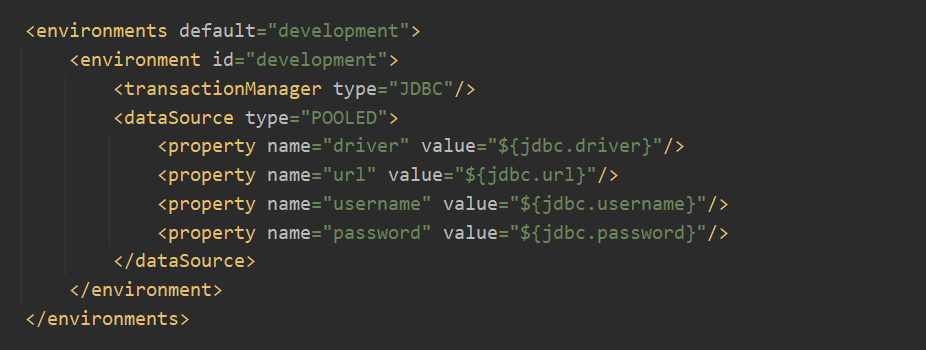

例子：

```xml
<!--        
            声明数据库DataSource，作用是连接数据库的，
            它与spring-mybatis整合框架中的Mybatis.xml文件整合就成了mybatis框架中的Mybatis.xml文件
-->
    <bean id="myDateSource" class="com.alibaba.druid.pool.DruidDataSource" init-method="init" destroy-method="close">
<!--        set注入给DruidDataSource提供连接数据库信息-->
        <property name="url" value="jdbc:mysql://localhost:3306/bjpowernode"/>
        <property name="username" value="root"/>
        <property name="password" value="123456789"/>
        <property name="maxActive" value="20"/>
<!--        这个连接池最多只能连接20个数据库-->
    </bean>
```

druid说明网址

https://github.com/alibaba/druid/


***2）sqlSessionFactory***

声明的时mybatis和spring中由mybatis这个框架提供的SqlSessionFactory类，这个类内部创建了SqlSessionFactory类

 <property name="dataSource" ref="myDateSource"/>

实质：就是将dataSource还有spring-mybatis框架中的Mybatis.xml文件合并

mybatis主配置文件的位置
        configLocation属性是Resource类型，读取配置文件，和以下方法类似
        它的赋值因为是字符串，使用value，指定文件的路径，在spring框架中一般使用classpath：表示文件的位置
        InputStream is=Resources.getResourceAsStream(config);

<property name="configLocation" value="classpath:Mybatis.xml"/>

```xml
<!--    声明的时mybatis和spring中由mybatis这个框架提供的SqlSessionFactory类，这个类内部创建了SqlSessionFactory类-->
    <bean id="sqlSessionFactory" class="org.mybatis.spring.SqlSessionFactoryBean">
<!--
        set注入，把数据连接池“dataSource”类型，读取配置文件
        实质：就是将dataSource还有spring-mybatis框架中的Mybatis.xml文件合并
-->
        <property name="dataSource" ref="myDateSource"/>
<!--
        mybatis主配置文件的位置
        configLocation属性是Resource类型，读取配置文件，和以下方法类似
        它的赋值因为是字符串，使用value，指定文件的路径，在spring框架中一般使用classpath：表示文件的位置
        InputStream is=Resources.getResourceAsStream(config);
-->
        <property name="configLocation" value="classpath:Mybatis.xml"/>
    </bean>
```


***3）Dao对象***

创建dao对象，使用Sqlsession的getMapper（StudentDao.class）
    MapperScannerConfigurer：在内部调用getMapper（）生成每个dao接口的代理对象
    因为MapperScannerConfigurer是创建一个包下面所有的接口
    所以没有指定的name（对象），它可能会创建多个对象

dao对象的默认名称是：接口首字母小写


value="classpah:地址"：这种情况只会出现在要获取配置文件的时候

```xml
<!--
    创建dao对象，使用Sqlsession的getMapper（StudentDao.class）
    MapperScannerConfigurer：在内部调用getMapper（）生成每个dao接口的代理对象
    因为MapperScannerConfigurer是创建一个包下面所有的接口
    所以没有指定的name（对象），它可能会创建多个对象
-->
    <bean class="org.mybatis.spring.mapper.MapperScannerConfigurer">
<!--
        它的作用是为了找到sqlSessionFactory，有点类似下方的代码
        sqlSessionFactory=new SqlSessionFactoryBuilder().build(is);
        指定SqlSessionFactory对象的id-->
        <property name="sqlSessionFactoryBeanName" value="sqlSessionFactory"/>
<!--
        指定包名，包名是dao接口所在的包
        MapperScannerConfigurer会扫描这个包中的所有接口，把每个接口都执行一次getMapper方法，得到每个接口的dao对象
        创建好的dao对象会放到Spring容器中，dao对象的默认名称是：接口首字母小写
-->
        <property name="basePackage" value="org.example.dao"/>
    </bean>
```


***4）声明自定义的Service***

ref中的引用对象，是框架创建的中dao的对象，是给service类中的对象创建引用对象（dao对象）

```xml
<!--    声明service-->
    <bean id="studentService" class="org.example.service.imp.StudentServiceimp">
        <property name="studentDao" ref="studentDao"/>
    </bean>
```

### Spring配置文件全部配置

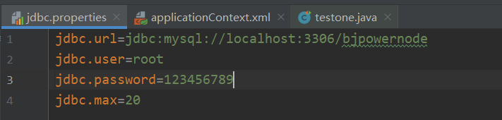

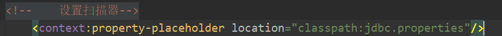

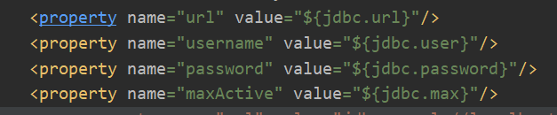

如果不声明完全可能会发生，通配符找不到的错误

# 六.Spring事务（偏理论）

简单概述

>Spring框架中的事务：
>
>1） 管理事务的对象： 事务管理器（接口， 接口有很多的实现类）
>
>​      例如：使用Jdbc或mybatis访问数据库，使用的**事务管理器：DataSourceTransactionManager**
>
>2 ) 声明式事务：  在xml配置文件或者使用注解说明事务控制的内容
>
>​     控制事务： **隔离级别，传播行为， 超时时间**
>
>3）事务处理方式：
>
>​      1） Spring框架中的**@Transactional**
>
>​      2)    **aspectj框架可以在xml配置文件**中，**声明事务控制的内容**


## spring的事务处理

回答问题

### 什么是事务？

### 在什么时候想道使用事务？

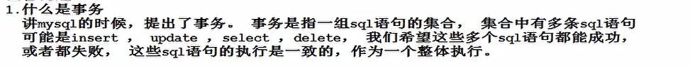

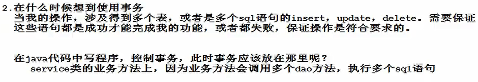


***通常使用jdbc访问数据库，还是mybatis访问数据库，怎么处理事务***

**问题中事务的处理方式，有什么不足**

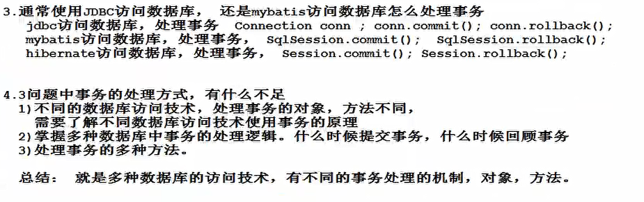

**怎么解决不足**

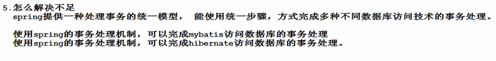

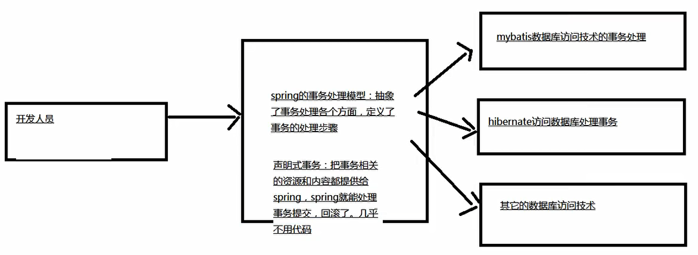

**处理事务，需要怎么做，做什么**


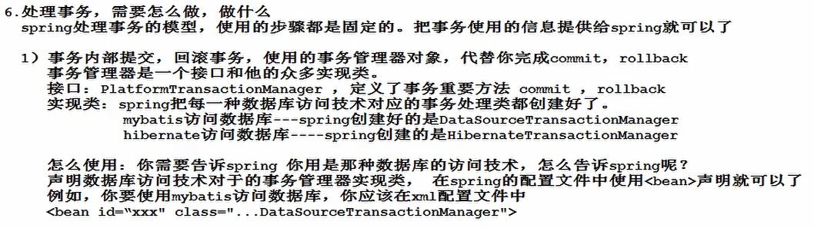


### 事务的隔离级别常量


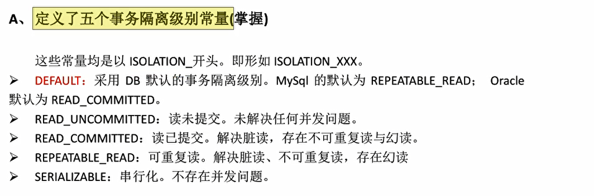


扩展：

https://blog.csdn.net/qq_33591903/article/details/82079302?ops_request_misc=%257B%2522request%255Fid%2522%253A%2522158632818519726869014448%2522%252C%2522scm%2522%253A%252220140713.130056874..%2522%257D&request_id=158632818519726869014448&biz_id=0&utm_source=distribute.pc_search_result.none-task-blog-blog_SOOPENSEARCH-1


**什么是“脏读”，“不可重复读”，“幻读”**

扩展：

https://blog.csdn.net/qq_33591903/article/details/81672260


### 事务的超时时间

>**如果一个事务长时间运行，这时为了尽量避免浪费系统资源，应为这个事务设置一个有效时间，使其等待数秒后自动回滚。单位是秒，整数值，默认是：-1**
>
>**与设置“只读”属性一样，事务有效属性也需要给那些具有可能启动新事物的传播行为的方法的事务标记成只读才有意义。**
>
>


### 事务的传播行为

>什么叫**事务传播行为**？听起来挺高端的，其实很简单。 
>
>即然是传播，那么至少有两个东西，才可以发生传播。单体不存在传播这个行为。
>
>事务传播行为（propagation behavior）指的就是当一个事务方法被另一个事务方法调用时，这个事务方法应该如何进行。 
>
>例如：methodA事务方法调用methodB事务方法时，methodB是继续在调用者methodA的事务中运行呢，还是为自己开启一个新事务运行，这就是由methodB的事务传播行为决定的。


Spring定义了七种传播行为

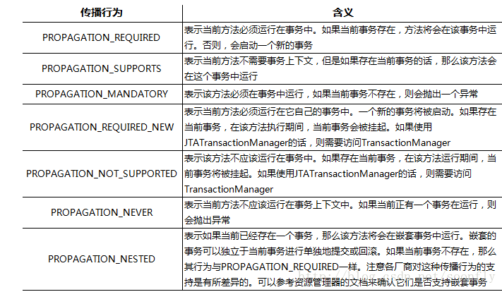


第一种行为：

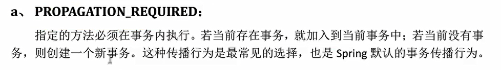

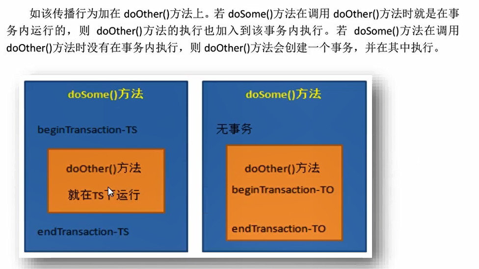

第二种行为：

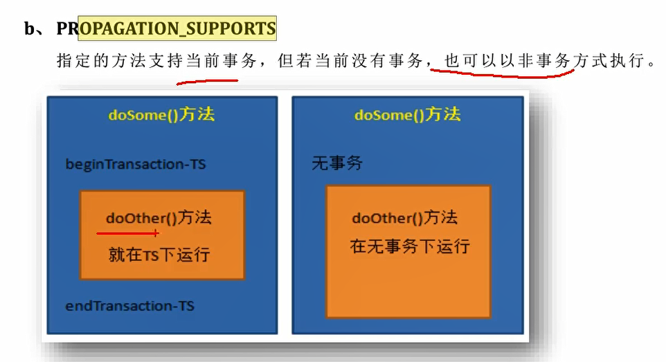

第三种行为：

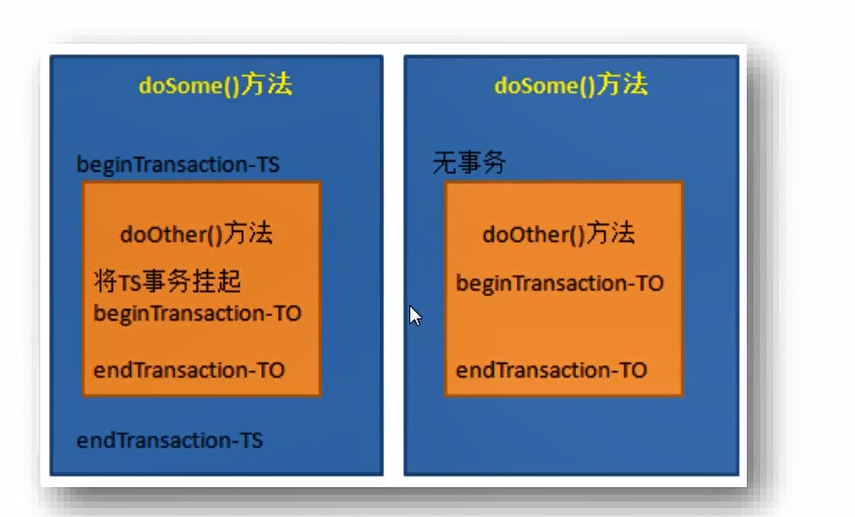

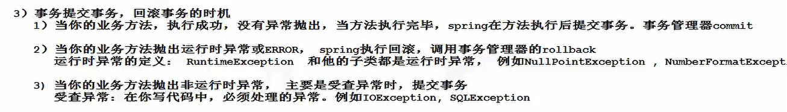

**总结事务**


### web项目中怎么使用容器对象

**javase项目中如果需要调用或者创建对象，需要在main方法中创建容器对象**

ApplicationContext ctx=new ClassPathXmlApplicationContext("applicationContext.xml")

**web项目是在tomcat服务器上运行的。tomcat一启动，项目也会一直运行**


>WebApplicationContext 是 ApplicationContext 的扩展。它具有 Web 应用
>
>程序所需的一些额外功能。它与普通的 ApplicationContext 在解析主题和决定
>
>与哪个 servlet 关联的能力方面有所不同。


需求：

web项目中容器对象只需要创建一次，applicationContext容器不需要创建多次，那么只需要创建全局作用域ServletContext中

在全局作用域ServletContext中创建即可

因为全局作用域ServletContext是随着tomcat的启动创建，也会随着tomcat的关闭而关闭。


怎么实现：

​	使用监听器   当全局作用域对象被创建时    创建容器    存放创建ServletContext

​	监听器的作用：

​		创建容器对象，执行

ApplicationContext ctx=new ClassPathXmlApplicationContext("applicationContext.xml")；

​		把容器对象放入到

ServletContext，ServletContext.setAttribute（key，ctx）；

​	监听器可以我们自己手动创建，也可以使用框架为我们提供好的ContextLoaderListener

​	框架它可以为我们创建的监听器，里面会为我们创建好全局作用域ServletContext，并且会把容器放入到其中。

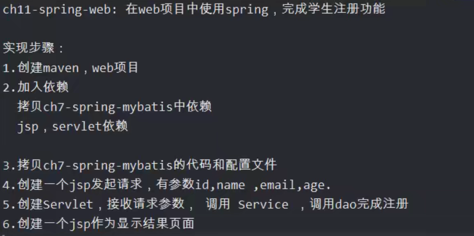

#### 为了使用监听器加入的依赖

```xml
<!--    为了使用监听器加入的依赖-->
    <dependency>
      <groupId>org.springframework</groupId>
      <artifactId>spring-web</artifactId>
      <version>5.2.5.RELEASE</version>
    </dependency>
  </dependencies>
```

#### 在web-inf下注册监听器

```xml
 <!--注册监听器ContextLoaderListener
    监听器被创建对象后，会读取WEB-INF/spring.xml
    为什么要读取文件：因为在监听器中要创建ApplicationContext对象，需要加载配置文件
    /WEB-INF/applicationContext.xml就是监听器默认读取的spring的配置文件路径
    可以修改默认的文件位置，使用context-param重新指定文件的位置-->
    <listener>
        <listener-class>org.springframework.web.context.ContextLoaderListener</listener-class>
    </listener>
    <context-param>
<!--        表示自定义配置文件的路径-->
        <param-name>contextConfigLocation</param-name>
        <param-value>classpath:</param-value>
    </context-param>
```


## 事务实例

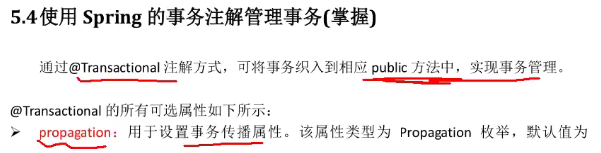

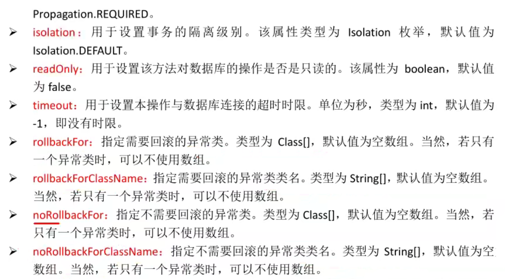


## Spring事务管理器


### 事务的简单介绍

>**事务：**
>
>比如因为一些抛出异常会导致代码中断，只执行了一部分操作的数据库的代码，却因为抛出异常，异常后的代码不会执行，前面的代码（对数据库的操作）也仍然存在。
>
>此时就应该加入事务，如果因为抛出异常的话，那么之前的代码（对数据库的操作）就都会被回滚


>**Spring事务的两种实现方式**
>
>在Spring中，事务有两种实现方式，分别是**编程式事务管理**和**声明式事务管理**两种方式。
>
>***编程式事务管理***： 编程式事务管理使用TransactionTemplate或者直接使用底层的PlatformTransactionManager。对于编程式事务管理，spring推荐使用TransactionTemplate。
>
>***声明式事务管理***： 建立在AOP之上的。其本质是对方法前后进行拦截，然后在目标方法开始之前创建或者加入一个事务，在执行完目标方法之后根据执行情况提交或者回滚事务。
>声明式事务管理不需要入侵代码，通过@Transactional就可以进行事务操作，更快捷而且简单。推荐使用


### 编程式事务管理

**spring框架中提供的事务处理方案**

>适合中小项目使用的，注解方案。
>
>spring框架自己用aop实现给业务方法增加事务（回滚）的功能，使用@Transactional注解增加事务
>
>@Transactional注解是spring框架自己注解，放在public方法的上（也需要放在public方法上），表示当前方法具有事务。可以给注解的属性赋值，表示具体的隔离级别，传播行为，异常信息等等。
>


**使用@Transactional的步骤**

1).在applicationContext中声明**事务管理器对象**

2).开启**事务注解驱动**，告诉spring框架，我们要使用注解的方式管理事务。

​	**spring使用aop机制，创建@Trancational所在的类代理对象，给方法加入事务的功能**

```xml
<!--    使用spring的事务处理-->
<!--    1.声明事务管理器-->
    <bean id="transactionManager" class="org.springframework.jdbc.datasource.DataSourceTransactionManager">
<!--        既然要回滚事务（操作数据库的代码），连接数据库，指定数据源-->
        <property name="dataSource" ref="myDataSource"/>
    </bean>

<!--    2.开启事务注解驱动，告诉spring使用注解管理事务，创建代理对象
        transaction-manager:事务管理器对象的id
-->
    <tx:annotation-driven transaction-manager="transactionManager"/>
```


***注mybatis访问数据库技术对应的事务处理类，DataSourceTransactionManager***


3).在方法的上面加入@Trancational(service类)

```java
package org.example.service.imp;

import org.example.dao.GoodsDao;
import org.example.dao.SaleDao;
import org.example.entity.Goods;
import org.example.entity.Sale;
import org.example.excep.NotEnoughException;
import org.example.service.BuyGoodsService;
import org.springframework.transaction.annotation.Isolation;
import org.springframework.transaction.annotation.Propagation;
import org.springframework.transaction.annotation.Transactional;

public class BuyGoodsServiceImp implements BuyGoodsService {
    private GoodsDao goodsDao;
    private SaleDao saleDao;

    public void setGoodsDao(GoodsDao goodsDao) {
        this.goodsDao = goodsDao;
    }

    public void setSaleDao(SaleDao saleDao) {
        this.saleDao = saleDao;
    }

//    @Transactional(
//            propagation = Propagation.REQUIRED,
//            isolation = Isolation.DEFAULT,
//            readOnly = false,
//            rollbackFor = {
//                    //表示指定的异常一定回滚
//                    NullPointerException.class,NotEnoughException.class
//            }
//    )
    /*
    *   使用的是事务控制的默认值，默认的传播行为是REQUIRED,默认的隔离级别是DEFAULT
    *   默认抛出运行时异常，回滚事务。
    * */
    @Transactional
    @Override
    public void buy(Integer goodsId, Integer nums) {
//        购买商品
        Sale sale=new Sale();
        sale.setGid(goodsId);
        sale.setNums(nums);
        saleDao.insertSale(sale); 
//        更新库存
        Goods goods=goodsDao.selectGoods(goodsId);
        if(goods==null){
            throw new NullPointerException("编号是："+goodsId+"不存在");
        }else if(goods.getAmount()<nums){
            throw new NotEnoughException("编号"+goodsId+"库存量不足");
        }
        Goods buygoods=new Goods();
        buygoods.setId(goodsId);
        buygoods.setAmount(nums);
        goodsDao.updateGoods(buygoods);
    }
}
```


### aop（aspects）的事务管理


>适合大型项目，有很多的类，方法，需要大量的配置事务，使用aspectj框架功能，
>
>在spring配置文件中声明类，方法需要的事务，这种方式业务方法和事务配置完全分离


**实现步骤：都是在xml配置文件中实现。**

1）要使用的是aspectj框架，需要加入依赖

```xml
<!--    aspectj依赖-->
    <dependency>
      <groupId>org.springframework</groupId>
      <artifactId>spring-aspects</artifactId>
      <version>5.2.15.RELEASE</version>
    </dependency>
```

2）声明事务管理器

```xml
<!--    使用spring的事务处理-->
<!--    1.声明事务管理器-->
    <bean id="transactionManager" class="org.springframework.jdbc.datasource.DataSourceTransactionManager">
<!--        既然要回滚事务（操作数据库的代码），连接数据库，指定数据源-->
        <property name="dataSource" ref="myDataSource"/>
    </bean>
```

3）声明方法需要的事务类型（配置方法的事务属性【隔离级别，传播行为，超时】）

```xml

<!--    aop的注解管理事务-->
<!--
            2.声明业务方法和它的事务属性（隔离级别，传播行为，超时时间）
                id:自定义名称，表示<tx:advice></tx:advice>的内容
                transaction-manage：事务管理器对象的id
-->
    <tx:advice id="myAdvice" transaction-manager="transactionManager">
<!--        tx:attributes:配置事务属性-->
        <tx:attributes>
<!--            tx:method:给具体的方法配置事务属性，method可以有多个，分别给不同的方法设置事务属性
                name：方法名称，1）完整的方法名称，不带有包和类
                               2）方法可以使用通配符，*表示任意字符
                propagation：传播行为，枚举值
                isolation：隔离级别
                rollback-for：你指定的异常类名，全限定类名。发生异常一定回滚
-->
            <tx:method name="buy" propagation="REQUIRED" isolation="DEFAULT"
                    rollback-for="java.lang.NullPointerException,org.example.excep.NotEnoughException"/>
        </tx:attributes>
    </tx:advice>
```

4）配置aop：指定哪些类要创建代理

```xml
<!--    配置aop-->
    <aop:config>
<!--        配置切入点表达式：指定哪些包中的类，要使用事务
            id:切入点表达式的名称，唯一值
            expression：切入点表达式，指定哪些类要使用事务，aspectj会创建代理对象-->
        <aop:pointcut id="servicePt" expression="execution(* *..service..*.*(..))"/>
<!--        配置增强器：关联advice和pointcut  advice：tx:advice的位置  pointcut：需要指定的包的位置-->
        <aop:advisor advice-ref="myAdvice" pointcut="servicePt"/>
    </aop:config>
```

**aspects在方法上添加事务管理：在配置文件中添加**

**Spring框架在方法上添加事务管理，则在方法上添加@Transactional**


# 七.补充

## Spring的@Bean注解

>Spring中为什么有@bean注解？
>
>Spring的@Bean注解用于告诉方法，**产生一个Bean对象，然后这个Bean对象交给Spring管理**。 
>
>产生这个Bean对象的方法Spring只会调用一次，随后这个Spring将会将这个Bean对象放在自己的IOC容器中。
>
>@Bean明确地指示了一种方法，什么方法呢？
>
>**产生一个bean的方法，并且交给Spring容器管理；**
>
>从这我们就明白了为啥@Bean是放在方法的注释上了，因为它很明确地告诉被注释的方法，你给我产生一个Bean，然后交给Spring容器，剩下的你就别管了。
>
>记住，@Bean就放在方法上，就是让方法去产生一个Bean，然后交给Spring容器。


**实例**

```java
@Configuration
public class BeanConfig {
 
    @Bean
    public Person person() {
        return new Person("老王", 20);
    }
 
}
```


在配置类上打个一个 @Configuration 注解，表示声明该类为 Spring 的配置类。

在创建一个方法，方法返回对象即我们要创建的对象 Person ， 返回该对象的实例。

在方法上打上注解 @Bean即表示声明该方法返回的实例是受 Spring 管理的 Bean。


使用@Bean 注解表明myBean需要交给Spring进行管理
未指定bean 的名称，默认采用的是 "方法名" + "首字母小写"的配置方式

​	

## InitialzingBean用法

>在spring初始化bean的时候，如果该bean是实现了InitializingBean接口，
>
>并且同时配置文件中指定了init-method，系统则是先调用afterPropertiesSet方法，
>
>然后在调用init-method中指定的方法。


## MultipartFile

### 介绍

>​	在Java中实现文件上传、下载操作一直是一种令人烦躁的工作。但是随着Spring框架的发展，使用Spring框架中的MultipartFile来处理文件就是一件比较简单的事情。
>
>  MultipartFile类是org.springframework.web.multipart包下面的一个类，如果想使用MultipartFile类来进行文件操作，那么一定要引入Spring框架。MultipartFile主要是用表单的形式进行文件上传，在接收到文件时，可以获取文件的相关属性，比如文件名、文件大小、文件类型等等。


