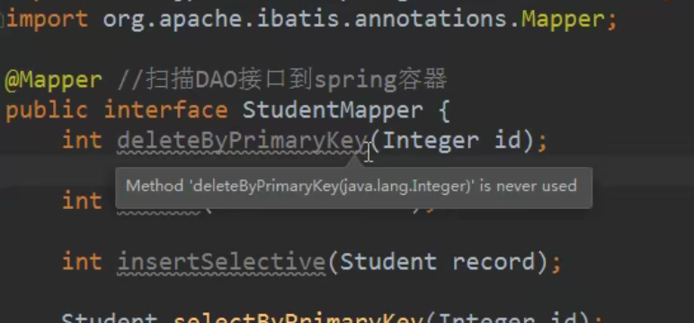

# SpringBoot

介绍：默认集成了Spring，SpringMVC

**Mybatis后面在dao层的@Mapper注解加入**

## 一.第一个SpringBoot项目

1.创建一个Module，选择类型为Spring Initializr快速构建

****

2.设置GAV坐标及pom配置信息


3.选择SpringBoot版本及依赖

会根据选择的依赖自动添加起步依赖并进行自动配置


4.设置模块名称、Content Root路径及模块文件的目录

****

点击Finish，如果是第一次创建，在右下角会提示正在下载相关的依赖

5.项目创建完毕，如下：

****

## 二.Xml和JavaConfig

### JavaConfig

>Spring中为什么有@bean注解？
>
>Spring的@Bean注解用于告诉方法，**产生一个Bean对象，然后这个Bean对象交给Spring管理**。 
>
>产生这个Bean对象的方法Spring只会调用一次，随后这个Spring将会将这个Bean对象放在自己的IOC容器中。
>
>@Bean明确地指示了一种方法，什么方法呢？
>
>**产生一个bean的方法，并且交给Spring容器管理；**
>
>从这我们就明白了为啥@Bean是放在方法的注释上了，因为它很明确地告诉被注释的方法，你给我产生一个Bean，然后交给Spring容器，剩下的你就别管了。
>
>记住，@Bean就放在方法上，就是让方法去产生一个Bean，然后交给Spring容器。


**实例**

```java
@Configuration
public class BeanConfig {
 
    @Bean
    public Person person() {
        return new Person("老王", 20);
    }
 
}
```


在配置类上打个一个 @Configuration 注解，表示声明该类为 Spring 的配置类。

在创建一个方法，方法返回对象即我们要创建的对象 Person ， 返回该对象的实例。

在方法上打上注解 @Bean即表示声明该方法返回的实例是受 Spring 管理的 Bean。


使用@Bean 注解表明myBean需要交给Spring进行管理
未指定bean 的名称，默认采用的是 "方法名" + "首字母小写"的配置方式,也可以用name属性指定

当然也可以用@Autowired去调用

```java
package com.guigu;

import com.guigu.vo.Student;
import org.junit.jupiter.api.Test;
import org.springframework.beans.factory.annotation.Autowired;
import org.springframework.boot.test.context.SpringBootTest;

@SpringBootTest
class Springsecurity01StartApplicationTests {
    @Autowired
    Student getStudent;
    @Test
    void contextLoads() {
        System.out.println(getStudent.getName());
    }

}

```


### @ImporResource

@ImportResource 作用导入其他的xml配置文件， 等于 在xml 

```xml
<import resources="其他配置文件"/>
```


**实例**

```java
@Configuration
@ImportResource(value ={ "classpath:applicationContext.xml","classpath:beans.xml"})
public class SpringConfig {
}
```


### @PropertyResource

@PropertyResource: 读取properties属性配置文件。 使用属性配置文件可以实现外部化配置 ，

在程序代码之外提供数据。


比如在配置文件中配置数据


步骤：

1. 在resources目录下，创建properties文件， 使用k=v的格式提供数据
2. 在PropertyResource 指定properties文件的位置
3. 使用@Value（value="${key}"）


```java
@Configuration
@ImportResource(value ={ "classpath:applicationContext.xml","classpath:beans.xml"})
@PropertySource(value = "classpath:config.properties")
@ComponentScan(basePackages = "com.bjpowernode.vo")
public class SpringConfig {
}
```


## 三.Springboot项目分析

### 对Pom.xml进行解释

```xml
<?xml version="1.0" encoding="UTF-8"?>
<project xmlns="http://maven.apache.org/POM/4.0.0" xmlns:xsi="http://www.w3.org/2001/XMLSchema-instance"
         xsi:schemaLocation="http://maven.apache.org/POM/4.0.0 https://maven.apache.org/xsd/maven-4.0.0.xsd">
    <modelVersion>4.0.0</modelVersion>
<!--    springboot父工程-->
    <parent>
        <groupId>org.springframework.boot</groupId>
        <artifactId>spring-boot-starter-parent</artifactId>
        <version>2.5.5</version>
        <relativePath/> <!-- lookup parent from repository -->
    </parent>
<!--    当前项目编译级别/jdk-->
    <groupId>com.bjpowernode.springboot</groupId>
    <artifactId>demo</artifactId>
    <version>1.0.0</version>

    <properties>
        <java.version>1.8</java.version>
    </properties>
    
<!--    依赖-->
    <dependencies>
<!--        SpringBoot框架web项目起步依赖-->
        <dependency>
            <groupId>org.springframework.boot</groupId>
            <artifactId>spring-boot-starter-web</artifactId>
        </dependency>
<!--        SpringBoot框架web项目测试起步依赖-->
        <dependency>
            <groupId>org.springframework.boot</groupId>
            <artifactId>spring-boot-starter-test</artifactId>
            <scope>test</scope>
        </dependency>
    </dependencies>

    <build>
        <plugins>
<!--            springboot编译打包的插件-->
            <plugin>
                <groupId>org.springframework.boot</groupId>
                <artifactId>spring-boot-maven-plugin</artifactId>
                <version>2.5.5</version>
            </plugin>
        </plugins>
    </build>

</project>
```

### 对SpringBoot项目结构进行说明

****

• mvn|mvnw|mvnw.cmd：使用脚本操作执行maven相关命令，国内使用较少，可删除

• gitignore：使用版本控制工具git的时候，设置一些忽略提交的内容

• static|templates：后面模板技术中存放文件的目录

• **application.properties：SpringBoot的配置文件**，很多集成的配置都可以在该文件中进行配置，例如：Spring、springMVC、Mybatis、Redis等。目前是空的

• **Application.java：SpringBoot程序执行的入口，执行该程序中的main方法，SpringBoot就启动了**

1. 创建一个SpringBoot的Controller类

2. 创建一个Spring MVC的SpringBootController

   SpringBootController类所在包：com.bjpowernode.springboot.web

   ```java
   package com.bjpowernode.springboot.demo;
   
   import org.springframework.boot.SpringApplication;
   import org.springframework.boot.autoconfigure.SpringBootApplication;
   //SpringBoot项目启动类
   @SpringBootApplication//SpringBoot的核心注解，主要用于开启spring自动配置
   public class DemoApplication {
   //    SpringBoot项目代码必须放到Application类所在的同级目录或下级目录中
       public static void main(String[] args) {
           SpringApplication.run(DemoApplication.class, args);
       }
   
   }
   ```

**注意：新创建的类一定要位于Application同级目录或者下级目录，否则SpringBoot加载不到。**

​			**在配置文件中前面要加一个空格**


### SpringBoot项目中的注意项

1. @SpringBootApplication注解是SpringBoot项目的核心注解，主要作用是开启Spring自动配置，如果Application类上去掉了这个注解，那么就不会启动SpringBoot这个框架
2. @Controller和@ResponseBody依然是我们之前的Spring MVC，实际上SpringBoot的里面就是Spring+SpringMVC+Mybatis框架
3. main方法是一个标准的Java的main方法，主要作用是作为项目的启动入口

## 四.SpringBoot核心配置文件

**核心配置文件虽然只有一个，但可以有多种形式（多种后缀名，每个后缀名都有一种书写的方式）**


### 描述

>描述：Spring Boot的核心配置文件用于配置Spring Boot程序，名字必须以**application**开始.


### SpringBoot核心配置文件

**注：如果这两种后缀名格式的核心配置文件同时存在的话，以properties结尾的核心配置文件为主**


#### properties文件

>也可以不配置端口号和上下文根，不配置就代表着端口号是默认的（8080），上下文根默认为无


```properties
#设置内嵌Tomcat端口号
server.port=9090

#配置项目上下文根
server.servlet.context-path=/003-springboot-port-context-path
```


#### yml/yaml文件 

>yml描述：yml 是一种 yaml 格式的配置文件，主要采用一定的空格、换行等格式排版进行配置。
>
>yaml 是一种直观的能够被计算机识别的的数据序列化格式，容易被人类阅读，yaml 类似于 xml，但是语法比xml 简洁很多，**值与前面的冒号配置项必须要有一个空格**， yml 后缀也可以使用 yaml 后缀


```properties
server:
  port: 8084
  servlet:
    context-path: /springboot
```


### SpringBoot多环境配置

>介绍：在实际开发的过程中，**我们的项目会经历很多的阶段**(开发->测试->上线)，**每个阶段的配置也会不同**
>
>
>
>例如：端口、上下文根、数据库等，那么这个时候为了方便在不同的环境之间切换，SpringBoot提供了多环境配置


**例子**

1.为每个环境创建一个配置文件，命名必须以application-环境标识.properties|yml


application-dev.properties

```properties
#开发环境

#设置内嵌Tomcat默认端口号
server.port=8080

#设置项目的上下文根
server.servlet.context-path=/006-springboot-multi-environment-dev
```

application-product.properties

```properties
#生产环境

#配置内嵌Tomcat默认端口号
server.port=80

#配置项目上下文根
server.servlet.context-path=/006-springboot-multi-environment-product
```

application-test.properties

```properties
#测试环境

#配置内嵌Tomcat端口号
server.port=8081

#配置项目的上下文根
server.servlet.context-path=/006-springboot-multi-environment-test
```


在总配置文件application.properties进行环境的激活

***spring.profiles.active=product***

```properties
#SpringBoot的总配置文件

#激活开发环境
#spring.profiles.active=dev

#激活测试环境
#spring.profiles.active=test

#激活生产环境
spring.profiles.active=product
```


**等号右边的值和配置文件的环境标识名一致，可以更改总配置文件的配置，重新运行Application，查看启动的端口及上下文根。**


### SpringBoot自定义配置

>**在SpringBoot的核心配置文件中，除了使用内置的配置项之外，我们还可以在自定义配置，**
>
>**然后采用如下注解去读取配置的属性值。**


#### @Value注解

>（单个属性配置）
>
>**用于逐个读取application.properties中的配置**


**有点类似于Spring中简单类型注入设置属性值的@Value（值）相似**

下面是spring的@Value注入


**例子**

*配置文件*

```properties
school.name=bjpowernode
school.websit=www.bjpowernode.com
```

*java类*

```java
@Controller
public class SpringBootController {

    @Value("${school.name}")
    private String schoolName;

    @Value("${school.websit}")
    private String schoolWebsit;

    @RequestMapping(value = "/springBoot/say")
    public @ResponseBody String say() {
        return schoolName + "------" + schoolWebsit;
    }
}
```

*浏览器*


#### @ConfigurationProperties注解

**(SpringBoot特有的，多个属性配置)**

将整个文件映射成一个对象，用于自定义配置项比较多的情况（你总不会一个一个去打吧，多累呀）


>创建ConfigInfo类，并为该类加上Component和ConfigurationProperties注解，
>
>@ConfigurationProperties需要和@Configuration或者@Component配合使用
>
>prefix可以不指定，如果不指定，那么会去配置文件中寻找与该类的属性名一致的配置，prefix的作用可以区分同名配置


*properties*

```properties
mail.hostname=host@mail.com
mail.port=9000
mail.from=mailer@mail.com
```

*java*

```java
@Configuration
@ConfigurationProperties(prefix = "mail")
@Data
public class ConfigProperties {
    private String hostName;
    private int port;
    private String from;
}
```


*修改SpringBootController类中的测试方法*

```java
@SpringBootTest
class ApplicationTests {

    @Autowired
    ConfigProperties config;

    @Test
    void contextLoads() {
        System.out.println(config);
    }

}


```


*重新运行Application,测试*


##### 警告解决

① 在ConfigInfo类中使用了ConfigurationProperties注解后，IDEA会出现一个警告，不影响程序的执行


②看着不顺眼的解决办法

```xml
!--解决使用@ConfigurationProperties注解出现警告问题-->
<dependency>
    <groupId>org.springframework.boot</groupId>
    <artifactId>spring-boot-configuration-processor</artifactId>
    <optional>true</optional>
</dependency>
```


### 中文乱码

如果在SpringBoot核心配置文件中有中文信息，会出现乱码：

• 一般在配置文件中，不建议出现中文(注释除外)

• 如果有，可以先转化为ASCII码


## 五.SpringBoot整合JSP框架

### 在pom.xml文件中配置依赖项

```html
<!--引入Spring Boot内嵌的Tomcat对JSP的解析包，不加解析不了jsp页面-->
<!--如果只是使用JSP页面，可以只添加该依赖-->
<dependency>
    <groupId>org.apache.tomcat.embed</groupId>
    <artifactId>tomcat-embed-jasper</artifactId>
</dependency>

<!--如果要使用servlet必须添加该以下两个依赖-->
<!-- servlet依赖的jar包-->
<dependency>
    <groupId>javax.servlet</groupId>
    <artifactId>javax.servlet-api</artifactId>
</dependency>

<!-- jsp依赖jar包-->
<dependency>
    <groupId>javax.servlet.jsp</groupId>
    <artifactId>javax.servlet.jsp-api</artifactId>
    <version>2.3.1</version>
</dependency>

<!--如果使用JSTL必须添加该依赖-->
<!--jstl标签依赖的jar包start-->
<dependency>
    <groupId>javax.servlet</groupId>
    <artifactId>jstl</artifactId>
</dependency>
```

### **在pom.xml的build标签中**

SpringBoot要求jsp文件必须编译到指定的META-INF/resources目录下才能访问，否则访问不到。其实官方已经更建议使用模板技术(后面会讲模板技术)。

```xml
<!--
    SpringBoot要求jsp文件必须编译到指定的META-INF/resources目录下才能访问，否则访问不到。
    其它官方已经建议使用模版技术（后面会课程会单独讲解模版技术）
-->
<resources>
    <resource>
        <!--源文件位置-->
        <directory>src/main/webapp</directory>
        <!--指定编译到META-INF/resource，该目录不能随便写-->
        <targetPath>META-INF/resources</targetPath>
        <!--指定要把哪些文件编译进去，**表示webapp目录及子目录，*.*表示所有文件-->
        <includes>
            <include>**/*.*</include>
        </includes>
    </resource>
</resources>
```


注意：

如果加了这个之后一般springboot他的类文件的加载方式就会被改变，src/resources中的配置文件就不会再加到target的类路径下

但是一般idea比较智能，他会给你再加上。如果真出现了配置文件消失的情况。只需再加以下代码即可

```xml
<!--src/main/resources下的所有配置文件编译到classes下面去-->
    <resource>
        <directory>src/main/resources</directory>
        <includes>
            <include>**/*.*</include>
        </includes>
    </resource>
```


### 配置application.properties视图解析器

在application.properties文件配置Spring MVC的视图展示为jsp，这里相当于Spring MVC的配置

```properties
#配置SpringMVC的视图解析器
#其中：/相当于src/main/webapp目录
spring.mvc.view.prefix=/
spring.mvc.view.suffix=.jsp
```

集成完毕之后，剩下的步骤和我们使用Spring MVC一样


**在src/main下创建一个webapp目录，然后进入该面板下新建index.jsp页面，并配置webapp目录** 


一定要在src/main目录下创建webapp目录，目录名字一个字都不能打错。不然可能会出现找不到页面的错误

因为视图解析器的配置是/src/main/webapp


## 六.SpringBoot整合Mybatis

**注意**：在提供者项目创建逆向工程之前不能添加接口项目的依赖，不然会报错

### 相关的pom文件依赖

```xml
<dependencies>
<!--        springboot依赖-->
        <dependency>
            <groupId>org.springframework.boot</groupId>
            <artifactId>spring-boot-starter-web</artifactId>
        </dependency>

        <!--MySQL的驱动依赖-->
        <dependency>
            <groupId>mysql</groupId>
            <artifactId>mysql-connector-java</artifactId>
        </dependency>

        <!--MyBatis整合SpringBoot的起步依赖-->
        <dependency>
            <groupId>org.mybatis.spring.boot</groupId>
            <artifactId>mybatis-spring-boot-starter</artifactId>
            <version>2.0.0</version>
        </dependency>
</dependencies>
```

### 添加数据源

```properties
server.port=8080
server.servlet.context-path=/

spring.datasource.driver-class-name=com.mysql.cj.jdbc.Driver
spring.datasource.url=jdbc:mysql://localhost:3306/springboot?useSSL=false&serverTimezone=Asia/Shanghai\
  &allowPublicKeyRetrieval\
  =true
spring.datasource.username=root
spring.datasource.password=123456789

#指定mybatis映射文件的路径
mybatis.mapper-locations=classpath:mapper/*.xml
```


### mybatis自动扫描数据持久层的映射文件及Dao接口的关系

>- 第一种方法
>
>@Mapper的作用：*如果在接口类上添加了@Mapper，在编译之后会生成相应的接口实现类。*
>
>
>
>- 第二种方法
>
>@MapperScan(basePackages = "接口类名+“.class”")
>
>例子：@MapperScan(basePackages = "com.bjpowernode.mapper")
>
>


配置文件中的***mybatis.mapper-locations***是指定映射文件(mapper.xml)的路径


#### @Mapper





一般mapper文件都和dao接口文件在同一个包下，如果将mapper文件放到resource目录下，则需要在application配置文件中加入

也可以见：5.4xml文件的编译位置


#### @MapperScan

***群配置方法（常用方法）***

```java
@MapperScan(basePackages = "com.bjpowernode.springboot.mapper")
@SpringBootApplication
public class Application {

    public static void main(String[] args) {
        SpringApplication.run(Application.class, args);
    }

}
```


### xml文件的编译位置

- **第一种**

默认情况下，Mybatis的xml映射文件不会编译到target的class目录下，

 所以我们需要在pom.xml文件中配置resource

（如果映射文件是在java文件夹下，那么编译之后正常的情况下，xml文件它是不会编译进target/class目录下）

如果需要令它编译在target/class中，那么需要在pom文件中加入资源配置

```xml
<!--识别所有的配置文件-->
<resources>
    <resource>
        <directory>src/main/java</directory>
        <includes>
            <include>**/*.properties</include>
            <include>**/*.xml</include>
        </includes>
        <filtering>false</filtering>
    </resource> 
</resources>
```

- **第二种**

如果mapper文件并不在java目录下，并不和dao接口在同一个包下，放在resources目录下

则无需去配置第一种方法的xml文件，此时需要告诉springboot，mapper的文件位置变了

在application配置文件下输入


**注意：**

>**java下的文件只有.class文件才会编译进入target中，如果你要在java中写的xml文件也编译进target目录中，这时就需要你去pom文件中设置resource配置了（也就是第一种方法）。**
>
>**resource下的文件基本是.xml，.properties，.yml，.yaml配置文件，编译后可以直接进入到target目录中**
>
>**编译后的class，xml文件就在指定的资源文件夹目录（target）中类路径下。**


此时就需要在application.properties配置文件中指定映射文件的位置，这个配置只有接口和映射文件不在同一个包的情况下，才需要指定

```properties
# 指定Mybatis映射文件的路径
mybatis.mapper-locations=classpath:mapper/*.xml
```

这是dao接口文件和mapper文件分开后，他们编译后的位置


这是mapper和dao接口文件在同级目录下


## 七.添加事务

>Spring框架中的事务：
>
>1） 管理事务的对象： 事务管理器（接口， 接口有很多的实现类）
>
>​      例如：使用**Jdbc或mybatis访问数据库，使用的事务管理器**：**DataSourceTransactionManager**
>
>​		扩展：hibernate访问数据库的事务管理器是：**HibernateTransactioManager**
>
>****
>
>
>
>2 ) 声明式事务：  在xml配置文件或者使用注解说明事务控制的内容
>
>​     控制事务： 隔离级别，传播行为， 超时时间
>
>3）事务处理方式：
>
>​      1） Spring框架中的@Transactional
>
>​      2)    aspectj框架可以在xml配置文件中，声明事务控制的内容
>
>
>
>​    
>
>SpringBoot中使用事务： 上面的两种方式都可以。
>
>1）在业务方法的上面加入**@Transactional** ,  加入注解后，方法有事务功能了。
>
>2）明确的在 主启动类的上面 ，加入**@EnableTransactionManager**
>
>


例子：

```java
@Service
@Transactional
public class StudentServiceImpl implements StudentService {

    @Autowired
    StudentMapper studentMapper;
    @Override
    public int updateStudent(Student student) {
        int n=studentMapper.updateByPrimaryKeySelective(student);
        int a=100/0;
        return n;
    }
}
```

这个和Spring中的事务管理差不多，**@Transactional**

## 八.整合Dubbo分布式框架

### 基本步骤

a.接口工程：存放实体类和业务接口

b.服务提供者：业务接口的实现类并将服务暴露且注册到注册中心，调用数据持久层

​							-添加依赖（整合dubbo依赖，注册中心，接口工程）

​							-配置服务提供者核心配置文件

c.服务消费者：处理浏览器客户端发送的请求，从注册中心调用服务提供者提供的服务（接口）

​							-添加依赖（整合dubbo依赖，注册中心，接口工程）

​							-配置服务消费者核心配置文件

举例：

#### a.接口工程

##### ①创建UserService（服务）接口

```java
public interface UserService {
    String say(String name);
}
```

#### b.服务提供者

##### ①.添加依赖

```xml
		<!-- SpringBoot结成Spring和SpringMVC依赖-->
		<dependency>
            <groupId>org.springframework.boot</groupId>
            <artifactId>spring-boot-starter-web</artifactId>
        </dependency>

        <!--Spring Boot集成Dubbo的起步依赖-->
        <dependency>
            <groupId>com.alibaba.spring.boot</groupId>
            <artifactId>dubbo-spring-boot-starter</artifactId>
            <version>2.0.0</version>
        </dependency>

        <!--ZooKeeper注册中心依赖-->
        <dependency>
            <groupId>com.101tec</groupId>
            <artifactId>zkclient</artifactId>
            <version>0.10</version>
        </dependency>

        <!--Dubbo接口工程依赖-->
        <dependency>
            <groupId>com.bjpowernode</groupId>
            <artifactId>017-springboot-dubbo-interface</artifactId>
            <version>1.0.0</version>
        </dependency>

```

##### ②核心配置文件配置dubbo的信息

```properties
#配置服务器
server.port=8081
server.servlet.context-path=/

#配置Dubbo
#配置Dubbo服务提供者配置
#服务提供者应用名称必须写，且不能重复，Dubbo的名称是独一无二的
spring.application.name=017-springboot-dubbo-provider
#表示是服务提供者，可以省略
spring.dubbo.server=true  
#注册中心地址
spring.dubbo.registry=zookeeper://localhost:2181
```

注意：Dubbo的注解都是自定义的注解，由我们添加的Dubbo依赖中的类进行处理编写dubbo配置是没有提示的

##### ③编写Dubbo接口的实现类（服务）

```java
import com.alibaba.dubbo.config.annotation.Service;
import com.bjpowernode.UserService;
import org.springframework.stereotype.Component;
//@Service是由原来的阿里提供的注解，不是spring的提供
//如果提供者提供了version，那么消费者也要提供version
//因为已经使用了阿里提供的@Service，所以原本的@Service就无法用，自然也无法将该实现类放入到容器中
//所以通过@Component注解将该实现类放入到容器中
//<!--    暴露服务接口-->
//    <dubbo:service interface="com.bjpowernode.dubbo.service.UserService" ref="UserServiceImpl"></dubbo:service>
@Service(interfaceClass = UserService.class)
@Component
public class UserServiceimpl implements UserService {

    @Override
    public String say(String name) {
        return "你好springboot，dubbo";
    }
}

```

##### ④SpringBoot入口程序类上加开启Dubbo配置支持的注解

```java
package com.bjpowernode;

import com.alibaba.dubbo.spring.boot.annotation.EnableDubboConfiguration;
import org.springframework.boot.SpringApplication;
import org.springframework.boot.autoconfigure.SpringBootApplication;
//开启Dubbo配置支持
@EnableDubboConfiguration
@SpringBootApplication
public class Application {

    public static void main(String[] args) {
        SpringApplication.run(Application.class, args);
    }

}
```

##### ⑤开启zookeeper服务


#### c.服务消费者

##### ①.添加依赖

```xml
		<!-- SpringBoot结成Spring和SpringMVC依赖-->
		<dependency>
            <groupId>org.springframework.boot</groupId>
            <artifactId>spring-boot-starter-web</artifactId>
        </dependency>

        <!--Spring Boot集成Dubbo的起步依赖-->
        <dependency>
            <groupId>com.alibaba.spring.boot</groupId>
            <artifactId>dubbo-spring-boot-starter</artifactId>
            <version>2.0.0</version>
        </dependency>

        <!--ZooKeeper注册中心依赖-->
        <dependency>
            <groupId>com.101tec</groupId>
            <artifactId>zkclient</artifactId>
            <version>0.10</version>
        </dependency>

        <!--Dubbo接口工程依赖-->
        <dependency>
            <groupId>com.bjpowernode</groupId>
            <artifactId>017-springboot-dubbo-interface</artifactId>
            <version>1.0.0</version>
        </dependency>

```

##### ②核心配置文件配置dubbo的信息

```properties
#配置服务器
server.port=8080
server.servlet.context-path=/

#配置dubbo
#配置dubbo服务提供者，不能重复，取名
spring.application.name=017-springboot-dubbo-consumertwo
#配置注册中心
spring.dubbo.registry=zookeeper://localhost:2181
```

注意：Dubbo的注解都是自定义的注解，由我们添加的Dubbo依赖中的类进行处理编写dubbo配置是没有提示的

##### ③编写一个Controller，调用远程dubbo服务

```java
@Controller
public class UserController {
//    @Reference是由阿里提供的
//    相当于注解中的引用远程接口 <dubbo:reference id="userService" interface="com.bjpowernode.dubbo.service.UserService"></dubbo:reference>
    @Reference
    UserService userService;
    @RequestMapping("/SpringBoot/hello")
    @ResponseBody
    public Object hello(HttpServletRequest request){
        String sayHello=userService.say("SpringBoot");
        return sayHello;
    }
}
```

##### ④SpringBoot入口程序类上加开启Dubbo配置支持的注解

```java
package com.bjpowernode;

import com.alibaba.dubbo.spring.boot.annotation.EnableDubboConfiguration;
import org.springframework.boot.SpringApplication;
import org.springframework.boot.autoconfigure.SpringBootApplication;
//开启Dubbo配置支持
@EnableDubboConfiguration
@SpringBootApplication
public class Application {

    public static void main(String[] args) {
        SpringAppl ication.run(Application.class, args);
    }

}
```

### SpringBoot+Dubbo+Mybatis+jsp集成

#### **a.接口工程**

##### ①创建业务接口

```java
package com.bjpowernode.service;

import com.bjpowernode.model.Student;

public interface StudentService {

    Student queryStudentById(Integer id);
}
```

##### ②实体类

这个是通过逆向工程生成的

记得序列化

```java
package com.bjpowernode.model;

import java.io.Serializable;

public class Student implements Serializable {
    private Integer id;

    private String name;

    private Integer age;

    public Integer getId() {
        return id;
    }

    public void setId(Integer id) {
        this.id = id;
    }

    public String getName() {
        return name;
    }

    public void setName(String name) {
        this.name = name;
    }

    public Integer getAge() {
        return age;
    }

    public void setAge(Integer age) {
        this.age = age;
    }
}
```

#### b.服务提供者

##### ①添加依赖

```xml
<dependencies>
<!--        springboot启动依赖-->
        <dependency>
            <groupId>org.springframework.boot</groupId>
            <artifactId>spring-boot-starter-web</artifactId>
        </dependency>
<!--springboot测试依赖-->
        <dependency>
            <groupId>org.springframework.boot</groupId>
            <artifactId>spring-boot-starter-test</artifactId>
            <scope>test</scope>
        </dependency>

<!--        dubbo集成spring boot起步依赖-->
        <dependency>
            <groupId>com.alibaba.spring.boot</groupId>
            <artifactId>dubbo-spring-boot-starter</artifactId>
            <version>2.0.0</version>
        </dependency>

<!--        zookeeper注册中心依赖-->
        <dependency>
            <groupId>com.101tec</groupId>
            <artifactId>zkclient</artifactId>
            <version>0.10</version>
        </dependency>

<!--        mybatis集成spring boot起步依赖-->
        <dependency>
            <groupId>org.mybatis.spring.boot</groupId>
            <artifactId>mybatis-spring-boot-starter</artifactId>
            <version>2.0.0</version>
        </dependency>

<!--        MySQL驱动-->
        <dependency>
            <groupId>mysql</groupId>
            <artifactId>mysql-connector-java</artifactId>
        </dependency>

<!--接口工程-->
        <dependency>
            <groupId>org.example</groupId>
            <artifactId>017-springboot-ssm-interface</artifactId>
            <version>1.0-SNAPSHOT</version>
            <scope>compile</scope>
        </dependency>
    </dependencies>
<build>
<!--            springboot打包插件-->
        <plugins>
            <plugin>
                <groupId>org.springframework.boot</groupId>
                <artifactId>spring-boot-maven-plugin</artifactId>
            </plugin>
            <!--            mybatis逆向工程插件-->
            <!--mybatis 代码自动生成插件-->
            <plugin>
                <groupId>org.mybatis.generator</groupId>
                <artifactId>mybatis-generator-maven-plugin</artifactId>
                <version>1.3.6</version>
                <configuration>
                    <!--配置文件的位置-->
                    <configurationFile>GeneratorMapper.xml</configurationFile>
                    <verbose>true</verbose>
                    <overwrite>true</overwrite>
                </configuration>
            </plugin>
        </plugins>
   <!--将java中的xml文件写入target中-->
        <resources>
            <resource>
                <directory>src/main/java</directory>
            <includes>
                <include>**/*.properties</include>
                <include>**/*.xml</include>
            </includes>
            <filtering>false</filtering>
            </resource>
        </resources>
</build>
```

##### ②核心配置文件

```properties
server.port=8081
server.servlet.context-path=/
#数据库配置
spring.datasource.driver-class-name=com.mysql.cj.jdbc.Driver
spring.datasource.url=jdbc:mysql://localhost:3306/springboot?useSSL=false&serverTimezone=Asia/Shanghai\
  &allowPublicKeyRetrieval\
  =true
spring.datasource.username=root
spring.datasource.password=123456789

#设置dubbo配置
spring.application.name=017-springboot-dubbo-interface
#dubbo提供者
spring.dubbo.server=true
#注册中心地址
spring.dubbo.registry=zookeeper://120.25.219.190:2181
```

##### ③通过逆向工程生成mapper文件和dao接口文件

这里就不加赘述

##### ④编写Dubbo接口实现类

```java
package com.bjpowernode.service.impl;

import com.alibaba.dubbo.config.annotation.Service;
import com.bjpowernode.mapper.StudentMapper;
import com.bjpowernode.model.Student;
import com.bjpowernode.service.StudentService;
import org.springframework.beans.factory.annotation.Autowired;
import org.springframework.stereotype.Component;

@Component
@Service(interfaceClass = StudentService.class)
public class StudentServiceImpl implements StudentService {

    @Autowired
    private StudentMapper mapper;
    @Override
    public Student queryStudentById(Integer id) {
        Student student=mapper.selectByPrimaryKey(id);
        return student;
    }
}
```

##### ⑤SpringBoot启动类

```java
package com.bjpowernode;

import com.alibaba.dubbo.spring.boot.annotation.EnableDubboConfiguration;
import org.mybatis.spring.annotation.MapperScan;
import org.springframework.boot.SpringApplication;
import org.springframework.boot.autoconfigure.SpringBootApplication;

@SpringBootApplication
@MapperScan(basePackages = "com.bjpowernode.mapper")
@EnableDubboConfiguration//开启dubbo配置
public class Application {

    public static void main(String[] args) {
        SpringApplication.run(Application.class, args);
    }

}
```

#### c.服务消费者

##### ①添加依赖

```xml
<dependencies>
<!--        SpringBoot的起步依赖-->
        <dependency>
            <groupId>org.springframework.boot</groupId>
            <artifactId>spring-boot-starter-web</artifactId>
        </dependency>

<!--SpringBoot测试的起步依赖-->
        <dependency>
            <groupId>org.springframework.boot</groupId>
            <artifactId>spring-boot-starter-test</artifactId>
            <scope>test</scope>
        </dependency>

        <!--        dubbo集成spring boot起步依赖-->
        <dependency>
            <groupId>com.alibaba.spring.boot</groupId>
            <artifactId>dubbo-spring-boot-starter</artifactId>
            <version>2.0.0</version>
        </dependency>

        <!--        zookeeper注册中心依赖-->
        <dependency>
            <groupId>com.101tec</groupId>
            <artifactId>zkclient</artifactId>
            <version>0.10</version>
        </dependency>

        <!--接口工程-->
        <dependency>
            <groupId>org.example</groupId>
            <artifactId>017-springboot-ssm-interface</artifactId>
            <version>1.0-SNAPSHOT</version>
            <scope>compile</scope>
        </dependency>


        <!--        引入SpringBoot内嵌Tomcat对jsp的解析包,不添加解析不了jsp
                    仅仅只是展现jsp页面，只添加以下一个依赖-->
        <!--引入Spring Boot内嵌的Tomcat对JSP的解析包，不加解析不了jsp页面-->
        <!--如果只是使用JSP页面，可以只添加该依赖-->
        <dependency>
            <groupId>org.apache.tomcat.embed</groupId>
            <artifactId>tomcat-embed-jasper</artifactId>
        </dependency>


    </dependencies>

    <build>
        <plugins>
<!--            SpringBoot编译打包插件-->
            <plugin>
                <groupId>org.springframework.boot</groupId>
                <artifactId>spring-boot-maven-plugin</artifactId>
            </plugin>
        </plugins>
        <!--
    SpringBoot要求jsp文件必须编译到指定的META-INF/resources目录下才能访问，否则访问不到。
    其它官方已经建议使用模版技术（后面会课程会单独讲解模版技术）
-->
        <resources>
            <resource>
                <!--源文件位置-->
                <directory>src/main/webapp</directory>
                <!--指定编译到META-INF/resource，该目录不能随便写-->
                <targetPath>META-INF/resources</targetPath>
                <!--指定要把哪些文件编译进去，**表示webapp目录及子目录，*.*表示所有文件-->
                <includes>
                    <include>**/*.*</include>
                </includes>
            </resource>
        </resources>
    </build>
```

##### ②核心配置文件

```properties
server.port=8080
server.servlet.context-path=/

#设置dubbo配置
spring.application.name=017-springboot-dubbo-consumer
#注册中心地址
spring.dubbo.registry=zookeeper://120.25.219.190:2181

#配置视图解析器
spring.mvc.view.prefix=/
spring.mvc.view.suffix=.jsp
```

##### ③controller控制层文件

```java
package com.bjpowernode.controller;

import com.alibaba.dubbo.config.annotation.Reference;
import com.bjpowernode.model.Student;
import com.bjpowernode.service.StudentService;
import org.springframework.beans.factory.annotation.Autowired;
import org.springframework.stereotype.Controller;
import org.springframework.ui.Model;
import org.springframework.web.bind.annotation.RequestMapping;

@Controller
public class StudentController {
    @Reference
    private StudentService service;
    @RequestMapping("/student/detail")
    public String studentDetali(Integer id, Model model){
        Student student=service.queryStudentById(id);
        model.addAttribute("Student",student);
        return "student";
    }
}
```

##### ④SpringBoot启动类

```properties
server.port=8080
server.servlet.context-path=/

#设置dubbo配置
spring.application.name=017-springboot-dubbo-consumer
#注册中心地址
spring.dubbo.registry=zookeeper://120.25.219.190:2181

#配置视图解析器
spring.mvc.view.prefix=/
spring.mvc.view.suffix=.jsp
```

## 九.SpringBoot使用拦截器，servlet，Filter

### 拦截器

因为SpringBoot他是为了简化开发，所以省去了ssm框架中的诸多配置文件，所以拦截器的配置文件也被省去了，springboot用类的方式来写配置文件

**1.实现一个拦截器，实现HandlerInterceptor类中的三个方法**

```java
package com.bjpowernode.intercepter;

import org.springframework.web.servlet.HandlerInterceptor;
import org.springframework.web.servlet.ModelAndView;

import javax.servlet.http.HttpServletRequest;
import javax.servlet.http.HttpServletResponse;

public class LoginIntercepter implements HandlerInterceptor {
    @Override
    public boolean preHandle(HttpServletRequest request, HttpServletResponse response, Object handler) throws Exception {
        System.out.println("登入拦截器");
        return false;
    }

    @Override
    public void postHandle(HttpServletRequest request, HttpServletResponse response, Object handler, ModelAndView modelAndView) throws Exception {

    }

    @Override
    public void afterCompletion(HttpServletRequest request, HttpServletResponse response, Object handler, Exception ex) throws Exception {

    }
}
```

**2.声明拦截器的位置和拦截的地址**

**springboot中用类来代替配置文件**

```java
package com.bjpowernode.config;

import com.bjpowernode.intercepter.LoginIntercepter;
import org.springframework.context.annotation.Configuration;
import org.springframework.web.servlet.config.annotation.InterceptorRegistry;
import org.springframework.web.servlet.config.annotation.WebMvcConfigurer;
@Configuration
public class IntercepterConfig implements WebMvcConfigurer {

    @Override
    public void addInterceptors(InterceptorRegistry registry) {
//        定义需要拦截的uri
        String[] addPathPattern={"/springboot/**"};
//        定义不需要拦截的uri
        String[] ExcludePathPattern={"/springboot/login","/springboot/register"};

        registry.addInterceptor(new LoginIntercepter()).
                addPathPatterns(addPathPattern).
                excludePathPatterns(ExcludePathPattern);
    }
}
```

**ssm配置拦截器，写在springmvc的配置文件**

```xml
<!--    声明拦截器，拦截器一般有0个或多个-->
    <mvc:interceptors>
<!--        第一个拦截器-->
        <mvc:interceptor>
<!--            指定拦截的请求地址-->
            <mvc:mapping path="/**"/>
<!--            指定拦截器-->
            <bean class="handler.MyInterceptor"/>
        </mvc:interceptor>
    </mvc:interceptors>
```


### servlet

在SpringBoot框架中使用Servlet对象。

使用步骤：

1. 创建Servlet类。 创建类继承HttpServlet
2. 注册Servlet ，让框架能找到Servlet


 例子：

1.创建自定义Servlet

```java
//创建Servlet类
public class MyServlet extends HttpServlet {
    @Override
    protected void doGet(HttpServletRequest req, HttpServletResponse resp) throws ServletException, IOException {
        doPost(req,resp);
    }

    @Override
    protected void doPost(HttpServletRequest req, HttpServletResponse resp) throws ServletException, IOException {
       //使用HttpServletResponse输出数据，应答结果
        resp.setContentType("text/html;charset=utf-8");
        PrintWriter out  = resp.getWriter();
        out.println("===执行的是Servlet==");
        out.flush();
        out.close();

    }
}
```

2.注册Servlet

以前是在web.xml中注册的，现在springboot采用java代码进行注册

```java
@Configuration
public class WebApplictionConfig {

    //定义方法， 注册Servlet对象
    @Bean
    public ServletRegistrationBean servletRegistrationBean(){

        //public ServletRegistrationBean(T servlet, String... urlMappings)
        //第一个参数是 Servlet对象， 第二个是url地址

        //ServletRegistrationBean bean =
                //new ServletRegistrationBean( new MyServlet(),"/myservlet");


        ServletRegistrationBean bean = new ServletRegistrationBean();
        bean.setServlet( new MyServlet());
        bean.addUrlMappings("/login","/test"); // <url-pattern>


        return bean;
    }
}
```


### Filter

**过滤器主要是对Request和Response的属性和参数过滤；**

**拦截器是用来验证请求的；**


>Filter是Servlet规范中的过滤器，可以处理请求， 对请求的参数， 属性进行调整。 常常在过滤器中处理字符编码
>
>在框架中使用过滤器：
>
>1. 创建自定义过滤器类
>2. 注册Filter过滤器对象


例子：

```java
// 自定义过滤器
public class MyFilter implements Filter {
    @Override
    public void doFilter(ServletRequest servletRequest, ServletResponse servletResponse, FilterChain filterChain) throws IOException, ServletException {
        System.out.println("执行了MyFilter，doFilter ");
        filterChain.doFilter(servletRequest,servletResponse);
    }
}
```


注册Filter

```java
@Configuration
public class WebApplicationConfig {

    @Bean
    public FilterRegistrationBean filterRegistrationBean(){
        FilterRegistrationBean bean  = new FilterRegistrationBean();
        bean.setFilter( new MyFilter());
        bean.addUrlPatterns("/user/*");
        return bean;
    }
}
```


### 字符集过滤器

CharacterEncodingFilter : 解决post请求中乱码的问题

在SpringMVC框架， 在web.xml 注册过滤器。 配置他的属性。 


#### 第一种方式

使用步骤：

1. 配置字符集过滤器

```java
@Configuration
public class WebSystemConfig {

    //注册Servlet
    @Bean
    public ServletRegistrationBean servletRegistrationBean(){
        MyServlet myServlet = new MyServlet();
        ServletRegistrationBean reg = new ServletRegistrationBean(myServlet,"/myservlet");
        return reg;
    }


    //注册Filter
    @Bean
    public FilterRegistrationBean filterRegistrationBean(){
        FilterRegistrationBean reg = new FilterRegistrationBean();

        //使用框架中的过滤器类
        CharacterEncodingFilter filter  = new CharacterEncodingFilter();
        //指定使用的编码方式
        filter.setEncoding("utf-8");
        //指定request ， response都使用encoding的值
        filter.setForceEncoding(true);

        reg.setFilter(filter);
        //指定 过滤的url地址
        reg.addUrlPatterns("/*");


        return reg;
    }
}
```


2. 修改application.properties文件， 让自定义的过滤器起作用

```properties
#SpringBoot中默认已经配置了CharacterEncodingFilter。 编码默认ISO-8859-1
#设置enabled=false 作用是关闭系统中配置好的过滤器， 使用自定义的CharacterEncodingFilter
server.servlet.encoding.enabled=false
```


#### 第二种方式

修改application.properties文件

```properties
server.port=9001
server.servlet.context-path=/myboot

#让系统的CharacterEncdoingFilter生效
server.servlet.encoding.enabled=true
#指定使用的编码方式
server.servlet.encoding.charset=utf-8
#强制request，response都使用charset属性的值
server.servlet.encoding.force=true
```


## 十.配置字符编码

**实例**

>spring boot 中乱码有两种情况，
>
>一种配置文件中引入的变量乱码，一种是程序处理中文的乱码。
>
>具体意思看代码， 这里 title 是properties配置文件 引入的中文，初次使用一般是乱码。
>
>这里“我” 是代码写的， 参数 name 是请求时传入中文。 默认这两个不会乱码。


```java
@Value("${com.neo.title}")
private String title;
 
@GetMapping("/")
public Map<String,String> index(@RequestParam(name = "name", defaultValue="world") String para) {
    Map<String,String> ret = new HashMap<>();
    ret.put("title","hello"+para+title);
    ret.put("name","我");
    return ret;
}　　
```


***方法一（和上方字符集过滤器的yml相同）***

```properties
#设置请求响应的字符编码
spring.http.encoding.enabled=true
spring.http.encoding.force=true
spring.http.encoding.charset=UTF-8
```

***方法二***

打开Settings>Editor>File Encodings , 

将`Properties Files (*.properties)`下的`Default encoding for properties files`设置为`UTF-8`，将`Transparent native-to-ascii conversion`前的勾选上。


## 十一.SpringBoot的打包与部署

>springboot是自带tomcat文件的     
>
>springboot的默认打包方式是**jar包**
>
>
>
>jar包和war包的区别？
>
>war包是放在tomcat中运行的，一个便于部署的压缩包，其中有我们web程序需要的一些东西，其中包括web.xml配置文件，前端的页面文件，以及依赖的jar包
>
>
>
>jar包则是比较普通的java程序的压缩包，并不是在tomcat下运行的


### war形式打包方式

**创建了一个jsp应用**


**程序入口类需扩展继承 SpringBootServletInitializer类并覆盖 configure 方法**


**修改pom文件**

>在 pom.xml 中**添加（修改）打包方式为 war**
>
>在 pom.xml 的 build **标签下通过 finalName 指定打 war 包的名字**
>
>在pom文件配置springboot打包的插件（默认自动加）
>
>在 pom.xml 中配置将配置文件编译到类路径


```xml
<!--识别java中的所有的配置文件-->
<resources>
    <resource>
        <directory>src/main/java</directory>
        <includes>
            <include>**/*.properties</include>
            <include>**/*.xml</include>
        </includes>
        <filtering>false</filtering>
    </resource>

<!--将jsp文件放到指定的类文件地址-->
    <resource>
        <!--源文件位置-->
        <directory>src/main/webapp</directory>
        <!--指定编译到META-INF/resource，该目录不能随便写-->
        <targetPath>META-INF/resources</targetPath>
        <!--指定要把哪些文件编译进去，**表示webapp目录及子目录，*.*表示所有文件-->
        <includes>
            <include>**/*.*</include>
        </includes>
    </resource>
<!--将resource文件都放到类文件中-->
    <resource>
        <directory>src/main/resources</directory>
        <includes>
            <include>**/*.*</include>
        </includes>
    </resource>
</resources>
```


### jar形式打包方式

修改 pom.xml 文件中打包插件的版本 

默认 SpingBoot 提供的打包插件版本为 2.2.2.RELEASE，这个版本打的 jar 包 jsp 不能访问， 我们这里修改为 1.4.2.RELEASE（其它版本测试都有问题）

```xml
<!-- SpringBoot 提供打包编译插件 -->
<plugin>
 <groupId>org.springframework.boot</groupId>
 <artifactId>spring-boot-maven-plugin</artifactId>
 <version>1.4.2.RELEASE</version>
</plugin>
```

注意：如果重新加载依赖还有爆红的话，可以重启idea就好了


打包后将target下的jar包复制到某一个目录下，在该目录下打开cmd窗口

执行   java -jar jar包名


## 十二.日志文件

Spring Boot 官方推荐优先使用带有 -spring 的文件名作为你的日志配置（如使用 logback-spring.xml ，而不是 logback.xml），命名为 logback-spring.xml 的日志配置文件。 

默认的命名规则，并且放在 src/main/resources 下如果你即想完全掌控日志配置，但又不想 用 logback.xml 作为 Logback 配置的名字，application.yml 可以通过 logging.config 属性指定自 定义的名字：

```properties
logging.config=classpath:logging-config.xml
```

**我们一般针对 DAO 的包进行 DEBUG 日志设置**

```xml
<logger name="com.abc.springboot.mapper" level="DEBUG" />
```

这样的话，只打印 SQL 语句


***这是logback-spring.xml文件***

```xml
<?xml version="1.0" encoding="UTF-8"?>
<!-- 日志级别从低到高分为 TRACE < DEBUG < INFO < WARN < ERROR < FATAL，如果
设置为 WARN，则低于 WARN 的信息都不会输出 -->
<!-- scan:当此属性设置为 true 时，配置文件如果发生改变，将会被重新加载，默认值为
true -->
<!-- scanPeriod:设置监测配置文件是否有修改的时间间隔，如果没有给出时间单位，默认
单位是毫秒。当 scan 为 true 时，此属性生效。默认的时间间隔为 1 分钟。 -->
<!-- debug:当此属性设置为 true 时，将打印出 logback 内部日志信息，实时查看 logback
运行状态。默认值为 false。通常不打印 -->
<configuration scan="true" scanPeriod="10 seconds">
    <!--输出到控制台    追加器-->
    <appender name="CONSOLE" class="ch.qos.logback.core.ConsoleAppender">
        <!--此日志 appender 是为开发使用，只配置最底级别，控制台输出的日志级别是大
       于或等于此级别的日志信息-->
        <filter class="ch.qos.logback.classic.filter.ThresholdFilter">
            <level>debug</level>
        </filter>
        <encoder>
            <Pattern>%date [%-5p] [%thread] %logger{60} [%file : %line] %msg%n</Pattern>
            <!-- 设置字符集 -->
            <charset>UTF-8</charset>
        </encoder>
    </appender>

    <!--输出到文件中    追加器-->
    <appender name="FILE" class="ch.qos.logback.core.rolling.RollingFileAppender">
        <!--<File>/home/log/stdout.log</File>-->
        <File>G:/java-web/log/springboot-logback.log</File>
        <encoder>
            <pattern>%date [%-5p] %thread %logger{60} [%file : %line] %msg%n</pattern>
        </encoder>
        <rollingPolicy
                class="ch.qos.logback.core.rolling.TimeBasedRollingPolicy">
            <!-- 添加.gz 历史日志会启用压缩 大大缩小日志文件所占空间 -->

            <!--<fileNamePattern>/home/log/stdout.log.%d{yyyy-MM-dd}.log</fileNam
            ePattern>-->
            <fileNamePattern>G:/java-web/log/springboot-logback.log.%d{yyyy-MM-dd}.log</fileNamePattern>
            <maxHistory>30</maxHistory><!-- 保留 30 天日志 -->
        </rollingPolicy>
    </appender>
    <!--针对mapper包进行debug日志设置-->
    <logger name="com.bjpowernode.springboot.mapper" level="DEBUG" />

    <root level="INFO">
        <appender-ref ref="CONSOLE"/>
        <appender-ref ref="FILE"/>
    </root>
</configuration>
```

### 代码里打印日志

之前我们大多数时候自己在每个类创建日志对象去打印信息，比较麻烦： 

private static final Logger logger = LoggerFactory.getLogger(StudentServiceImpl.class); logger.error("xxx");

 现在可以直接在类上通过 @Slf4j 标签去声明式注解日志对象


### 一些准备工作

#### A、 在 pom.xml 中添加依赖

```xml
<!--自动化日志对象-->
<dependency>
    <groupId>org.projectlombok</groupId>
    <artifactId>lombok</artifactId>
    <version>1.18.2</version>
</dependency>
```

#### B、 添加 lombok 插件

也可不加，一般会有


## 十三.SpringBoot集成Thymeleaf

我们请求的流程是，发送请求给服务器，服务器接收请求后，处理请求，跳转到指定的静态html页面，在服务器端，Thymeleaf模板引擎会按照它的语法，对动态数据进行处理，所以如果要是th开头，模板引擎能够识别，会在服务器端进行处理，获取数据;如果没有以th开头，那么Thymeleaf模板引擎不会处理，直接返回给客户端了。

如果th是文本，th就会优先输出th属性后面的值

### 初见Thymeleaf

application对Thymeleaf进行配置

```properties
#thymeleaf页面的缓存开关，默认true开启缓存
#建议在开发阶段关闭thymeleaf页面缓存，目的实时看到页面
spring.thymeleaf.cache=false

#这里其实什么都不用配置就可以工作，因为基本Thymeleaf的配置都有默认值
前缀：
#thymeleaf模版前缀,默认可以不写
spring.thymeleaf.prefix=classpath:/templates/

后缀：
#thymeleaf模版后缀,默认可以不写
spring.thymeleaf.suffix=.html
```

在**src/main/resources的templates**下新建一个index.html页面用于展示数据

①在<html>标签中需要加入xmlns:th="http://www.thymeleaf.org"

```html
<!DOCTYPE html>
<html lang="en" xmlns:th="http://www.thymeleaf.org">
<head>
    <meta charset="UTF-8">
    <title>SpringBoot集成Thymeleaf</title>
</head>
<body >
    <!--Thymeleaf前端框架以Html为载体-->
    <span th:text="${data}"></span>
    <span th:text="${data}"></span>
    <p th:text="${data}"></p>
    <div th:text="${data}"></div>

</body>
</html>
```

注意：Springboot使用thymeleaf作为视图展示，约定将模板文件放置在src/main/resource/templates目录下，静态资源放置在src/main/resource/static目录下

### 解决缓存问题

如果需要解决缓存问题，只需要2步，先将部署模式改成热部署，再在application配置文件中配置thymeleaf页面的缓存开关


### Thymeleaf表达式

#### 标准表达式

例子：

```java
 model.addAttribute("data","恭喜您，SpringBoot集成Thymeleaf成功");
```

```html
<span th:text="${data}">我还没被取代</span><br>
```

其中th:text="${}"是Thymeleaf的一个属性，用于显示文本


语法：${...}


标准变量表达式用于访问容器(tomcat)上下文环境中的变量，功能和EL中的 ${} 相同。

Thymeleaf 中的变量表达式使用 ${变量名} 的方式获取Controller中model其中的数据。


#### 选择变量表达式(了解，不推荐使用)

具体可参考：http://www.bjpowernode.com/tutorial_springboot/852.html

1.语法：*{...}


2.说明

选择变量表达式，也叫星号变量表达式，使用 th:object 属性来绑定对象；

选择表达式首先使用th:object来绑定后台传来的User对象，然后使用 * 来代表这个对象，后面 {} 中的值是此对象中的属性。

选择变量表达式 *{...} 是另一种类似于标准变量表达式 ${...} 表示变量的方法；

选择变量表达式在执行时是在选择的对象上求解，而${...}是在上下文的变量Model上求解，这种写法比标准变量表达式繁琐，只需要大家了解即可。

```html
<h2>选择变量表达：又叫做*号表达式</h2>
<h3 style="color: red">用户对象仅在div范围内有效</h3>
<div th:object="${user}">
    <span th:text="*{id}"></span><br/>
    <span th:text="*{nick}"></span><br/>
    <span th:text="*{phone}"></span><br/>
    <span th:text="*{address}"></span><br/>
</div>
```

#### URL表达式

语法@{...}

不建议在需要填写地址的时候填写绝对路径，建议填写相对路径

例子：

```html
<a href="/springboot/thymeleaf/test">我爱编程</a>
```

如果其中带参数，带后台传出的数据的参数，那么可以在其中嵌套**标准表达式**

**在需要带参数的时候一般我们都是使用字符串拼接的方式，但thymeleaf给我门一种更加便捷的写法**

正常写法：uri?id=123&username=cwh

thymeleaf写法：uri(id=123,username=cwh)

例子：

```html
字符串拼接的例子
<a th:href="@{'user/info?id=' + ${user.id}}">相对路径：查看</a>
不使用字符串拼接，用thymeleaf推荐的方式
<a th:href="@{/springboot/thymeleaf/test(id=${user.id},username=${user.username},password=${user.password})}">转到text2中
</a>
```


URL表达式在其他标签上的应用：

```html
在img标签或者js标签，它都是在href或者src前加th   然后在写地址时都是用@{}表达式 :
当你用thymeleaf时取静态文件他都会直接从static文件夹中获取

<script type="text/javascript" th:src="@{/js/jquery-3.3.1.js}"></script>
```


### Thymeleaf常用属性

大部分属性和html的一样，只不过前面加了一个th前缀。

th一般都是从后台取值的时候会用到，如果不是从后台取值一般不用


就是html属性标签前加th:


为什么直接写${user.id} 获取不到数据?

因为我们Thymeleaf是以html为载体的，**所以html不会认识${}语法。我们请求的流程是，发送请求给服务器，服务器接收请求后，处理请求，跳转到指定的静态html页面，在服务器端，Thymeleaf模板引擎会按照它的语法，对动态数据进行处理，所以如果要是th开头，模板引擎能够识别，会在服务器端进行处理，获取数据;如果没有以th开头，那么Thymeleaf模板引擎不会处理，直接返回给客户端了。**


#### 文本属性

1.th:text

用于文本的显示，该属性显示的文本在标签体中，如果是文本框，数据会在文本框外显示，要想显示在文本框内，使用th:value

```html
<input type="text" id="realName" name="reaName" th:text="${realName}">
```

#### 循环属性


```html
语法：
user:当前的循环变量的别名（随意）
userStat：当前循环对象状态的变量（也可以选择默认，那么这个值可以不加，但thymeleaf框架会给你加上，它会以对象变量别名+Stat命名）
${userList}:当前循环的集合，名字得是存在model中的名字
<div th:each="user,userStat:${userList}">
    <span th:text="${userStat.index}"></span>
    <span th:text="${user.id}"></span>
    <span th:text="${user.phone}"></span>
    <span th:text="${user.nick}"></span>
    <span th:text="${user.address}"></span><br/>
</div>
```

1.list循环

例子：

controller

```java
@RequestMapping("/each/list")
public String eachList(Model model){
    List<User> userList = new ArrayList<User>();

    for (int i = 0;i < 10;i++){
        User user = new User();
        user.setId(100 + i);
        user.setNick("张" + i);
        user.setPhone("1361234567" + i);
        user.setAddress("北京市大兴区" + i);
        userList.add(user);
    }
    model.addAttribute("userList",userList);

    return "each";
}
```

html

```html
<h1>th:each遍历List集合</h1>

<div th:each="user,userStat:${userList}">
    <span th:text="${userStat.index}"></span>
    <span th:text="${user.id}"></span>
    <span th:text="${user.phone}"></span>
    <span th:text="${user.nick}"></span>
    <span th:text="${user.address}"></span><br/>
</div>
```

2.map循环

例子：

controller

```java
@RequestMapping(value = "/each/map")
public String eachMap(Model model) {

    Map<Integer,Object> userMap = new HashMap<Integer, Object>();

    for (int i = 0;i < 10;i++){
        User user = new User();
        user.setId(100+i);
        user.setNick("张" + i);
        user.setPhone("1370000000" + i);
        user.setAddress("北京市大兴区" + i);

        userMap.put(i,user);
    }
    model.addAttribute("userMap",userMap);

    return "each";
}
```

html

```html
<h1>th:each遍历Map集合</h1>

<div th:each="map:${userMap}">
    <span th:text="${map.key}"></span>
    <span th:text="${map.value}"></span>
    <span th:text="${map.value.id}"></span>
    <span th:text="${map.value.phone}"></span>
    <span th:text="${map.value.nick}"></span>
    <span th:text="${map.value.address}"></span>
</div>
```

3.数组循环

例子：

controller

```java
@RequestMapping(value = "/each/array")
public String eachArray(Model model) {

    User[] userArray = new User[10];

    for (int i = 0;i < 10;i++){
        User user = new User();
        user.setId(100+i);
        user.setNick("张" + i);
        user.setPhone("1370000000" + i);
        user.setAddress("北京市大兴区" + i);

        userArray[i]=user;

    }
    model.addAttribute("userArray",userArray);

    return "each";
}
```

html

```html
<h1>th:each遍历Array数据集合</h1>

<div th:each="user,userStat:${userArray}">
    <span th:text="${userStat.count}"></span>
    <span th:text="${user.id}"></span>
    <span th:text="${user.phone}"></span>
    <span th:text="${user.nick}"></span>
    <span th:text="${user.address}"></span>
</div>
```


#### 条件判断属性

1. th:if

```html
<!--th:if条件判断：如果满足条件，显示标签，如果不满足条件，标签就不显示-->
<div th:if="${sex==1}">男</div><br>
<div th:if="${sex==2}">女</div><br>
```

2. th:unless（了解）

```html
<!--th:unless是th:if的相反操作,即对判断条件取反，一般我们用th:if-->
1:<div th:unless="${sex!=1}">男</div><br>
2:<div th:unless="${sex==1}">男</div>
```

3. th:switch/th:case

```html
<!--一旦某个case判断值为true，剩余的case则都当做false，“*”表示默认的case，前面的case都不匹配时候，执行默认的case-->
<div th:switch="${sex}">
    <p th:case="1">性别：男</p>
    <p th:case="2">性别：女</p>
    <p th:case="*">性别：未知</p>
</div>
```

#### 内敛表达式

th:inline

th:inline有三个取值类型（text,javascript和none），但none一般没有什么用

1.内敛文本（th:inline="text"）

可以让Thymeleaf表达式不依赖于html标签，直接使用内敛表达式[[表达式]]即可获取动态数据，要求在父级标签上加th:inline = “text”属性

不过一般th:inline="text"一般加在<body>标签中

例如：

```html
<h1 th:inline="text">
    [[${word}]]
</h1>
```


2.内敛脚本（th:inline="javascript"）

用于在js代码中获取后台数据

```html
<button type ="button" onclick="func()">抽奖</button>

<script type="text/javascript" th:inline="javascript">
    function func(){
        alert("恭喜");
    }
</script>
```


### 字面量

文本字面量

用单引号括起来的‘......’的字符串就是字面量

```html
<h1 th:text="我爱中国">111</h1>
结果：我爱中国
```


数字字面量

可以在“”中进行运算

```html
<h1 th:text="2020+20">2000</h1>
结果：2040
```

boolean字面量

true和false

```html
<!--boolean字面量-->
<p th:if="${sex == true}">执行操作</p>
```

null字面量

```html
<!--null字面量-->
<p th:if="${user == null}">user为空</p>
<p th:if="${user != null}">user不为空</p>
```

Thymeleaf字符串拼接

```html
<!--一种是字面量使用加号拼接-->
<span th:text="'当前是第'+${sex}+'页 ,共'+${sex}+'页'"></span>

<!--另一种更优雅的方式，使用“|”减少了字符串的拼接的加号-->
<span th:text="|当前是第${sex}页,共${sex}页|"></span>
```

Thymeleaf运算符

三元运算:

```html
<span th:text="${sex == 1?'男':'女'}"></span>
<span th:text="${sex eq 1?'男':'女'}"></span>
```

算术运算：+ , - , * , / , %

关系比较: > , < , >= , <= ( gt , lt , ge , le )

相等判断：== , != ( eq , ne )

### Thymeleaf表达式基本对象和功能对象

#### 1.基本对象

模板引擎提供了一组内置的对象，这些内置的对象可以直接在模板中使用，这些对象由#号开始引用，我们比较常用的内置对象。

①request

用法${#request.getAttribute('****')}

如果后台将数据传到request中，可以通过该方式在页面上获取

用法${#request.getContextPath()}

在页面获取应用的上下文根，一般在js中请求路径中加上可以避免404

②session

用法${#session.getAttribute('website')}

如果后台将数据传到session中，可以通过该方式在页面上获取

#### 2.功能对象

用法：内置功能对象前都需要加#号，内置对象一般都以s结尾；

\#dates: java.util.Date对象的实用方法，

\#calendars: 和dates类似, 但是 java.util.Calendar 对象;

\#numbers: 格式化数字对象的实用方法;

\#strings: 字符串对象的实用方法： contains, startsWith, prepending/appending等;

\#objects: 对objects操作的实用方法;

\#bools: 对布尔值求值的实用方法;

\#arrays: 数组的实用方法;

例子

```html
<div th:text="${date}"></div><br>
结果：
Wed Dec 08 15:50:08 CST 2021
<div th:text="${#dates.format(date,'yyyy-MM-dd')}"></div>
结果：
2021-12-08	
```


### lambok插件生成工具方法


### 使用Thymeleaf需要注意的几个点

静态文件（js，图片）的获取一般都在这个文件夹中


## 十四.SpringBoot一些简化开发的组件

### Lombok插件

**1.1使用条件**

加入依赖

```xml
        <dependency>
            <groupId>org.projectlombok</groupId>
            <artifactId>lombok</artifactId>
            <optional>true</optional>
        </dependency>
```

idea中安装Lombok插件


**1.2作用**

```java
@Data
@AllArgsConstructor
@NoArgsConstructor
public class Payment implements Serializable {
    private Long id;
    private String serial;
}
```

@Date :插件会自动写上get/set方法

@AllArgsConstructor ：插件会自动写上全属性的构造方法

@NoArgsConstructor ：插件会写上无属性的构造方法


**安装lombok插件**


@Data：提供getter/setter

@NoArgsConstructor, 无参构造器 

@RequiredArgsConstructor  

@AllArgsConstructor  全参数构造器

@EqualsAndHashCode：提供equals和hashCode方法

@Getter/@Setter


**@Slf4j 内置log对象，直接调用日志方法输出日志**


## 十六.SpringBoot其他的小技巧

如果需要在java代码中读取配置文件

方法一：

使用@Value注解

**出现这种错误一般是找不到mapper文件，xml没有编译进入到target中**


**出现这种错误一般为创建异常，可能mappering的类名有相同等**

```java
org.springframework.beans.factory.BeanCreationException: Error creating bean with name 'requestMappingHandlerMapping' defined in class path resource [org/springframework/boot/autoconfigure/web/servlet/WebMvcAutoConfiguration$EnableWebMvcConfiguration.class]: Invocation of init method failed; nested exception is java.lang.IllegalStateException: Ambiguous mapping. Cannot map 'controllerone' method 
com.bjpowernode.springboot.web.controllerone#say()
```


## 配置文件乱码问题


 


