# Sentinel实现熔断与限流

# 概述

>官网
>
>https://github.com/alibaba/Sentinel
>
>中文版
>
>https://github.com/alibaba/Sentinel/wiki/%E4%BB%8B%E7%BB%8D


## 是什么？

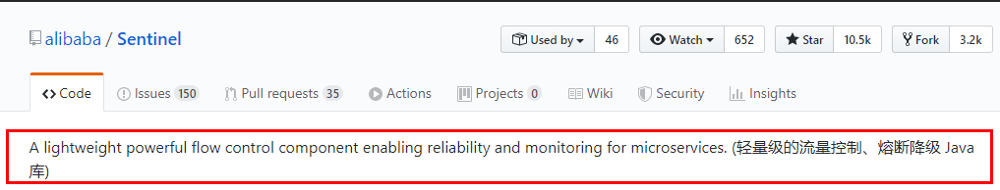

**`一句话解释，之前我们讲解过的Hystrix`**


## 去哪下？

https://github.com/alibaba/Sentinel/releases


## 能干嘛？


## 怎么玩？

>Sentinel的API：
>
>https://spring-cloud-alibaba-group.github.io/github-pages/greenwich/spring-cloud-alibaba.html#_spring_cloud_alibaba_sentinel
>
>
>
>服务使用中遇到的各种问题
>
>服务雪崩
>
>服务熔断
>
>服务降级
>
>服务限流


# 安装Sentinel控制台

## sentinel组件由2部分构成

>后台
>
>前台   端口默认为：8080             和tomcat有冲突，所以这里再启动时要注意
>
>


## 安装步骤

>https://github.com/alibaba/Sentinel/releases
>
>1. 下载地址操作如下图
>
>2. 下载到本地sentinel-dashboard-1.7.0.jar
>3. 这里有两个前提准备：①java8环境ok     ②8080端口不能被占用
>4. sentinel-dashboard-1.7.0.jar
>
>
>
>5. 访问sentinel管理界面   http://localhost:8080         **`登录账号密码均为sentinel`**
>
>   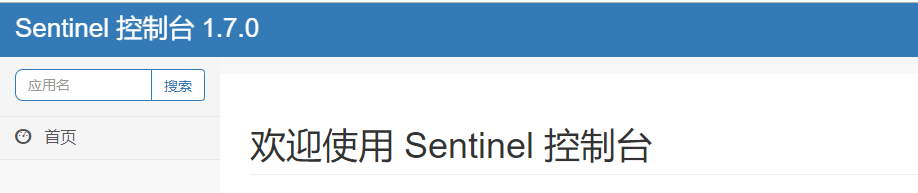


# 初始化演示工程

## 启动Nacos8848成功

http://localhost:8848/nacos/#/login


## 建立一个model

### 建model

### 写POM

这是这个项目主要的依赖

```xml
<!--SpringCloud ailibaba nacos -->
        <dependency>
            <groupId>com.alibaba.cloud</groupId>
            <artifactId>spring-cloud-starter-alibaba-nacos-discovery</artifactId>
        </dependency>
        <!--SpringCloud ailibaba sentinel-datasource-nacos 后续做持久化用到-->
        <dependency>
            <groupId>com.alibaba.csp</groupId>
            <artifactId>sentinel-datasource-nacos</artifactId>
        </dependency>
        <!--SpringCloud ailibaba sentinel -->
        <dependency>
            <groupId>com.alibaba.cloud</groupId>
            <artifactId>spring-cloud-starter-alibaba-sentinel</artifactId>
        </dependency>

```


```xml
<?xml version="1.0" encoding="UTF-8"?>
<project xmlns="http://maven.apache.org/POM/4.0.0"
         xmlns:xsi="http://www.w3.org/2001/XMLSchema-instance"
         xsi:schemaLocation="http://maven.apache.org/POM/4.0.0 http://maven.apache.org/xsd/maven-4.0.0.xsd">
    <parent>
        <artifactId>Cloud2020</artifactId>
        <groupId>org.example</groupId>
        <version>1.0-SNAPSHOT</version>
    </parent>
    <modelVersion>4.0.0</modelVersion>

    <artifactId>cloudalibaba-sentinel-service8401</artifactId>

    <properties>
        <maven.compiler.source>8</maven.compiler.source>
        <maven.compiler.target>8</maven.compiler.target>
    </properties>

    <dependencies>
        <!--SpringCloud ailibaba nacos -->
        <dependency>
            <groupId>com.alibaba.cloud</groupId>
            <artifactId>spring-cloud-starter-alibaba-nacos-discovery</artifactId>
        </dependency>
        <!--SpringCloud ailibaba sentinel-datasource-nacos 后续做持久化用到-->
        <dependency>
            <groupId>com.alibaba.csp</groupId>
            <artifactId>sentinel-datasource-nacos</artifactId>
        </dependency>
        <!--SpringCloud ailibaba sentinel -->
        <dependency>
            <groupId>com.alibaba.cloud</groupId>
            <artifactId>spring-cloud-starter-alibaba-sentinel</artifactId>
        </dependency>
        <!--openfeign-->
        <dependency>
            <groupId>org.springframework.cloud</groupId>
            <artifactId>spring-cloud-starter-openfeign</artifactId>
        </dependency>
        <!-- SpringBoot整合Web组件+actuator -->
        <dependency>
            <groupId>org.springframework.boot</groupId>
            <artifactId>spring-boot-starter-web</artifactId>
        </dependency>
        <dependency>
            <groupId>org.springframework.boot</groupId>
            <artifactId>spring-boot-starter-actuator</artifactId>
        </dependency>
        <!--日常通用jar包配置-->
        <dependency>
            <groupId>org.springframework.boot</groupId>
            <artifactId>spring-boot-devtools</artifactId>
            <scope>runtime</scope>
            <optional>true</optional>
        </dependency>
        <dependency>
            <groupId>cn.hutool</groupId>
            <artifactId>hutool-all</artifactId>
            <version>4.6.3</version>
        </dependency>
        <dependency>
            <groupId>org.projectlombok</groupId>
            <artifactId>lombok</artifactId>
            <optional>true</optional>
        </dependency>
        <dependency>
            <groupId>org.springframework.boot</groupId>
            <artifactId>spring-boot-starter-test</artifactId>
            <scope>test</scope>
        </dependency>

    </dependencies>

</project>
```


### 写yml

```yaml
server:
  port: 8401

spring:
  application:
    name: cloudalibaba-sentinel-service
  cloud:
    nacos:
      discovery:
        #Nacos服务注册中心地址
        server-addr: localhost:8848
    sentinel:
      transport:
        #配置Sentinel dashboard地址
        dashboard: localhost:8080
        #默认8719端口，假如被占用会自动从8719开始依次+1扫描,直至找到未被占用的端口
        port: 8719

management:
  endpoints:
    web:
      exposure:
        include: '*'
```


### 主启动

```java
package com.atguigu.springcloud.alibaba;

import org.springframework.boot.SpringApplication;
import org.springframework.boot.autoconfigure.SpringBootApplication;
import org.springframework.cloud.client.discovery.EnableDiscoveryClient;

@SpringBootApplication
@EnableDiscoveryClient
public class MainApp8401 {
    public static void main(String[] args) {
        SpringApplication.run(MainApp8401.class,args);
    }
}
```


### 业务类FlowLimitController

```java
package com.atguigu.springcloud.alibaba.controller;
import lombok.extern.slf4j.Slf4j;
import org.springframework.web.bind.annotation.GetMapping;
import org.springframework.web.bind.annotation.RestController;

@RestController
@Slf4j
public class FlowLimitController
{

    @GetMapping("/testA")
    public String testA()
    {
        log.info(Thread.currentThread().getName()+"----testA");
        return "------testA";
    }

    @GetMapping("/testB")
    public String testB()
    {
        return "------testB";
    }
}
```


## 启动Sentinel8080

```java
java -jar sentinel-dashboard-1.7.0.jar
```


## 启动微服务8401


## 启动8401后查看sentienl控制台

**`没访问微服务的话，那就是啥也没有`**

**`需要访问一次，才会显示，Sentinel采用了懒加载机制`**

**`sentinel8080正在监控微服务8401`**


# 流控规则

## 基本介绍

>资源名:唯一名称，默认请求路径
>
>
>
>针对来源: Sentinel可以针对调用者进行限流，填写微服务名，默认default (不区分来源)·阈值类型/单机阈值:
>
>- QPS(每秒钟的请求数量)∶当调用该api的QPS达到阈值的时候，进行限流。
>
>- 线程数:当调用该api的线程数达到阈值的时候，进行限流
>
>是否集群:不需要集群
>
>
>
>流控模式:
>
>- 直接: api达到限流条件时，直接限流.
>
>- 关联:当关联的资源达到阈值时，就限流自己
>
>- 链路:只记录指定链路上的流量（指定资源从入口资源进来的流量，如果达到阈值，就进行限流)【api级别的针对来源】
>
>
>
>流控效果:
>
>- 快速失败:直接失败，抛异常
>
>- 快速失败:直接失败，抛异常
>
>- 排队等待:匀速排队，让请求以匀速的速度通过，阈值类型必须设置为QPS，否则无效

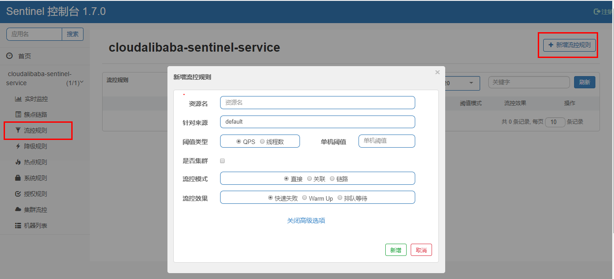


## 流控模式

### 直接(默认)

>这个很直接，快速失败（系统默认）
>
>表示1秒钟内查询1次就是OK，若超过次数1，就直接-快速失败，报默认错误
>
>

#### 测试

快速点击访问http://localhost:8401/testA

#### 结果

Blocked by Sentinel (flow limiting)


### 关联

#### 是什么

>当关联的资源达到阈值时，就限流自己
>
>当与A关联的资源B达到阀值后，就限流A自己
>
>B惹事，A挂了

---


#### 测试

当关联资源/testB的QBS阀值超过1时，就限流/testA的Rest访问地址，**`当关联资源到阈值后限制配置好的资源名`**

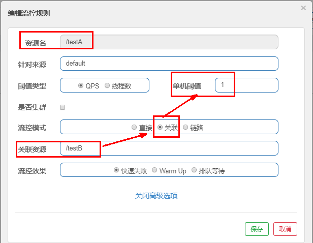


Postman模拟并发密集访问testB

>`postman里新建多线程集合组`
>
>
>
>
>
>
>
>`大批量线程高并发访问B，导致A失效了`


点击访问http://localhost:8401/testA

Blocked by Sentinel (flow limiting)


## 流控效果

### 直接

`直接->快速失败(默认的流控处理)`

>直接失败抛出异常
>
>Blocked by Sentinel (flow limiting)


#### 源码

```

com.alibaba.csp.sentinel.slots.block.flow.controller.DefaultController
```

---


### 预热


#### 定义

`**公式：阈值除以coldFactor(默认值为3),经过预热时长后才会达到阈值**`


#### 官网

>**官方介绍：**https://github.com/alibaba/Sentinel/wiki/%E6%B5%81%E9%87%8F%E6%8E%A7%E5%88%B6
>
>
>
>
>
>`**默认coldFactor为3，即请求 QPS 从 threshold / 3 开始，经预热时长逐渐升至设定的 QPS 阈值。**`
>
>
>
>**限流冷启动**
>
>**官方介绍：**https://github.com/alibaba/Sentinel/wiki/%E9%99%90%E6%B5%81---%E5%86%B7%E5%90%AF%E5%8A%A8


#### 源码

```
com.alibaba.csp.sentinel.slots.block.flow.controller.WarmUpController
```


#### WarmUp(预热)配置

| 默认 coldFactor 为 3，即请求QPS从(threshold / 3) 开始，经多少预热时长才逐渐升至设定的 QPS 阈值。 |
| ------------------------------------------------------------ |
| 案例，阀值为10+预热时长设置5秒。<br/>系统初始化的阀值为10 / 3 约等于3,即阀值刚开始为3；然后过了5秒后阀值才慢慢升高恢复到10 |


#### 测试

>多次点击http://localhost:8401/testB
>
>刚开始不行，后续慢慢OK


#### 应用场景

>如：秒杀系统在开启的瞬间，会有很多流量上来，很有可能把系统打死，
>
>预热方式就是把为了保护系统，可慢慢的把流量放进来，慢慢的把阀值增长到设置的阀值。


---


### 排队等待

#### 官网

>匀速排队，阈值必须设置为QPS
>
>官网介绍：https://github.com/alibaba/Sentinel/wiki/%E6%B5%81%E9%87%8F%E6%8E%A7%E5%88%B6
>
>
>
>


#### 源码

```
com.alibaba.csp.sentinel.slots.block.flow.controller.RateLimiterController
```


#### 测试


# 降级规则

## 基本介绍

>***官网：***https://github.com/alibaba/Sentinel/wiki/%E7%86%94%E6%96%AD%E9%99%8D%E7%BA%A7
>
>
>
>***介绍：***
>
>Sentinel 熔断降级会在调用链路中某个资源出现不稳定状态时（例如调用超时或异常比例升高），
>
>对这个资源的调用进行限制，*让请求快速失败，避免影响到其它的资源而导致级联错误。*
>
>*当资源被降级后，在接下来的降级时间窗口之内，*
>
>对该资源的调用都*自动熔断*（默认行为是抛出 DegradeException）
>
>
>
>***Sentinel的断路器是没有半开状态的：***
>
>半开的状态系统自动去检测是否请求有异常，
>
>没有异常就关闭断路器恢复使用，
>
>有异常则继续打开断路器不可用。具体可以参考Hystrix
>
>


## 简略概括

>
>
>**RT（平均响应时间，秒级）**
>
>- 平均响应时间   超出阈值  且   在时间窗口内通过的请求>=5，两个条件同时满足后触发降级
>- 窗口期过后关闭断路器
>- RT最大4900（更大的需要通过-Dcsp.sentinel.statistic.max.rt=XXXX才能生效）
>
>
>
>**异常比列（秒级）**
>
>- QPS >= 5 且异常比例（秒级统计）超过阈值时，触发降级；时间窗口结束后，关闭降级
>
>
>
>**异常数（分钟级）**
>
>- 异常数（分钟统计）超过阈值时，触发降级；时间窗口结束后，关闭降级


## 降级策略实战

### RT

#### 是什么

>***平均响应时间（ DEGRADE_GRADE_RT ):***
>
>当1s内持续进入5个请求，对应时刻的平均响应时间（秒级）均超过阈值（ count，以ms为单位)，
>
>那么在接下的时间窗口（ DegradeRule中的timewindow，以s为单位）之内，
>
>对这个方法的调用都会自动地熔断(抛出DegradeException )。
>
>注意Sentinel 默认统计的RT上限是4900 ms，超出此阈值的都会算作4900 ms，若需要变更此上限可以通过启动配置项-Dcsp.sentinel.statistic.max. rt=xxx来配置。
>
>


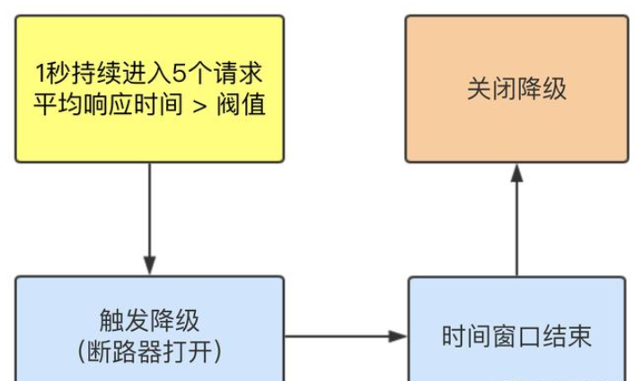

#### 测试

**controller**

```java
@GetMapping("/testD")
public String testD()
{
    //暂停几秒钟线程
    try { TimeUnit.SECONDS.sleep(1); } catch (InterruptedException e) { e.printStackTrace(); }
    log.info("testD 测试RT");
    return "------testD";
}
```


**配置**


**jmeter压测**


**结论**

>
>
>按照上述配置，
>
>  永远一秒钟打进来10个线程（大于5个了）调用testD，我们希望200毫秒处理完本次任务，
>如果超过200毫秒还没处理完，在未来1秒钟的时间窗口内，断路器打开(保险丝跳闸)微服务不可用，保险丝跳闸断电了
>
>后续我停止jmeter，没有这么大的访问量了，断路器关闭(保险丝恢复)，微服务恢复OK
>
>


---


### 异常比例

#### 是什么

> 异常比例( DEGRADF_GRADE_EXCEPTION_RATIo ):当资源的每秒请求量>=5，
>
> 并且每秒异常总数占通过量的比值超过阈值（ DegradeRule中的count ）之后，资源进入降级状态，
>
> 
>
> 即在接下的时间窗口( DegradeRule中的timewindow，以s为单位)之内，对这个方法的调用都会自动地返回。异常比率的阈值范围是[0.0，1.0]，代表0% - 100%。
>
> 

#### 测试

**controller**

```java
@GetMapping("/testD")
public String testD()
{
    log.info("testD 测试RT");
    int age = 10/0;
    return "------testD";
}
```


**配置**


**jmeter**


**结论**

>按照上述配置，
>单独访问一次，必然来一次报错一次(int age  = 10/0)，调一次错一次；
>
>
>
>开启jmeter后，直接高并发发送请求，多次调用达到我们的配置条件了。
>断路器开启(保险丝跳闸)，微服务不可用了，不再报错error而是服务降级了。
>
>


---


### 异常数

#### 是什么

>异常数( DEGRADF_GRADE_EXCEPTION_COUNT ):当资源近1分钟的异常数目超过阈值之后会进行熔断。注意由于统计时间窗口是分钟级别的，
>
>若 timeNMindow小于60s，则结束熔断状态后仍可能再进入熔断状态。
>
>***时间窗口一定要大于等于60秒。***
>
>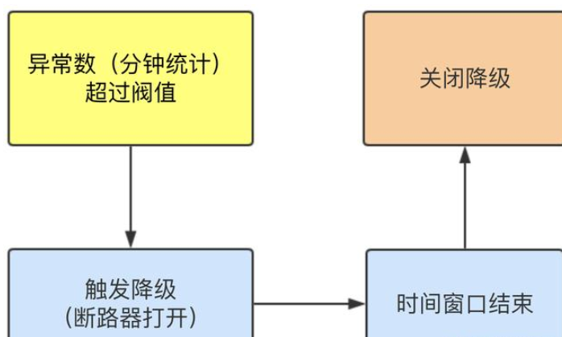


***异常数是按照分钟统计的,所以时间一定要大于60s***


#### 测试

**controller**

```java
@GetMapping("/testE")
public String testE()
{
    log.info("testE 测试异常比例");
    int age = 10/0;
    return "------testE 测试异常比例";
}

```


**配置**

>
>
>
>
>http://localhost:8401/testE，第一次访问绝对报错，因为除数不能为零，
>我们看到error窗口，但是达到5次报错后，进入熔断后降级。


**jmeter**


---


# 热点key限流规则

## 基本介绍

**介绍：**

>热点即经常访问的数据，很多时候我们希望统计或者限制某个热点数据中访问频次最高的TopN数据，
>
>并对其访问进行限流或者其它操作
>
>


**官网：**

https://github.com/alibaba/Sentinel/wiki/%E7%83%AD%E7%82%B9%E5%8F%82%E6%95%B0%E9%99%90%E6%B5%81


**承上启下**

>兜底方法分为**系统默认**和**客户自定义**两种
>
>之前的case，限流出问题后，都是用sentinel系统默认的提示：Blocked by Sentinel (flow limiting)
>
>
>
>我们能不能自定类似hystrix，某个方法出问题了，就找对应的兜底降级方法？
>
>答：Htstrix用**@HystrixCommand** 
>
>​	 Sentinel用**@SentinelResource**


## @SentinelResource简单介绍

```java
@GetMapping("/testHotKey")
@SentinelResource(value = "testHotKey",blockHandler = "dealHandler_testHotKey")
//value是资源名字，blockHandler是兜底方法
public String testHotKey(@RequestParam(value = "p1",required = false) String p1, 
                         @RequestParam(value = "p2",required = false) String p2){
    return "------testHotKey";
}
public String dealHandler_testHotKey(String p1,String p2,BlockException exception)
{
    return "-----dealHandler_testHotKey";
}
//sentinel系统默认的提示：Blocked by Sentinel (flow limiting)
```


*@SentinelResource(value = "testHotKey",blockHandler = "dealHandler_testHotKey")*

*方法testHotKey里面第一个参数只要QPS超过每秒1次，马上降级处理*


下面的篇章会详细介绍


## 热点key限流规则实战

>
>
>
>
>
>
>限流模式只支持QPS模式，固定写死了。（这才叫热点）
>
>**@SentinelResource**注解的方法参数索引，0代表第一个参数，1代表第二个参数，以此类推
>
>单机阀值以及统计窗口时长表示在此窗口时间超过阀值就限流。
>
>上面的抓图就是第一个参数有值的话，1秒的QPS为1，超过就限流，限流后调用
>
>dealHandler_testHotKey支持方法。


### 测试

http://localhost:8401/testHotKey?p2=abc 

http://localhost:8401/testHotKey?p1=abc

http://localhost:8401/testHotKey?p1=abc&p2=33


## 参数例外项（重）

>上述案例演示了第一个参数p1，当QPS超过1秒1次点击后马上被限流
>
>
>
>**特例情况**
>
>我们希望p1参数当它是某个特殊值时，它的限流值和平时不一样
>
>例子：当p1的值等于5时，它的阈值可以达到200
>
>​		当p1不等于5时，就正常安排的阙值即可


### 实战案例

**配置**

>
>
>
>
>***记得“添加”***


**测试**

http://localhost:8401/testHotKey?p1=5     当p1等于5的时候，阈值变为200

http://localhost:8401/testHotKey?p1=3     当p1不等于5的时候，阈值就是平常的1


**热点参数的注意点：*参数必须是基本类型或者String***


# 系统规则

**官网：**

https://github.com/alibaba/Sentinel/wiki/%E7%B3%BB%E7%BB%9F%E8%87%AA%E9%80%82%E5%BA%94%E9%99%90%E6%B5%81


**各项参数说明：**


**配置全局QPS**


# @SentinelResource

## 按资源名称限流

### 启动nacos，sentinel


### 建立model

**yml**

```yaml
 
server:
  port: 8401

spring:
  application:
    name: cloudalibaba-sentinel-service
  cloud:
    nacos:
      discovery:
        server-addr: localhost:8848 #Nacos服务注册中心地址
    sentinel:
      transport:
        dashboard: localhost:8080 #配置Sentinel dashboard地址
        port: 8719

management:
  endpoints:
    web:
      exposure:
        include: '*'
 

```


**修改业务类RateLimitController**

```java
@RestController
public class RateLimitController
{
    @GetMapping("/byResource")
    @SentinelResource(value = "byResource",blockHandler = "handleException")
    //blockHandler是违规处理的方法（这个方法是自定义的）
    public CommonResult byResource()
    {
        return new CommonResult(200,"按资源名称限流测试OK",new Payment(2020L,"serial001"));
    }
    public CommonResult handleException(BlockException exception)
    {
        return new CommonResult(444,exception.getClass().getCanonicalName()+"\t 服务不可用");
    }
}

```


**主启动类**

```java
@EnableDiscoveryClient
@SpringBootApplication
public class MainApp8401
{
    public static void main(String[] args) {
        SpringApplication.run(MainApp8401.class, args);
    }
}
```


### 配置流控规则

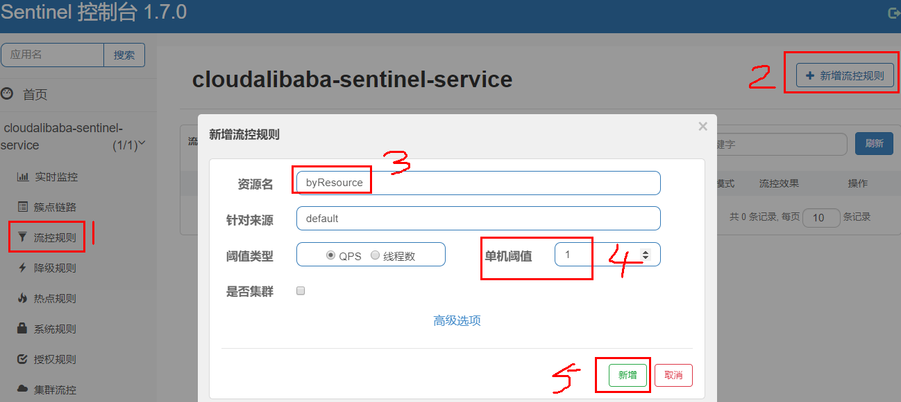


### 测试

>1s点一下没事，但是如果快速点就会降级
>
>而降级的方法，因为这是用@Sentinel的value名字来处理，所以会给出自己定义的方法
>
>如果用url进行处理，那可能只会用系统的处理方法了
>
>


## 按照Url地址限流

（只能由系统自己处理，不能自定义异常）

>这里**和按资源名称限流**的例子基本相似，
>
>只是需要改变成url即可，
>
>**但需要注意的是：**如果用url作为资源名的话，那么降级方法可能就是sentinel自带的降级方法了。
>
>
>
>


## 客户自定义限流处理逻辑（业务代码分离）

### 操作步骤


> **建立自定义限流处理类CustomerBlockHandler**
>
>```java
>@Component
>public class CustomerBlockHandler
>{
>    public static CommonResult handleException(BlockException exception){
>        return new CommonResult(2020,"自定义的限流处理信息......CustomerBlockHandler");
>    }
>}
>```
>
>
>
>
>
>
>
>**调用自定义处理方法**
>
>```java
>// * 自定义通用的限流处理逻辑，
>// blockHandlerClass = CustomerBlockHandler.class , 自定义处理类 
>// blockHandler = handleException2， 自定义处理方法
>// 上述配置：找CustomerBlockHandler类里的handleException2方法进行兜底处理
>// */
>//    /**
>//     * 自定义通用的限流处理逻辑
>//     */
>    @GetMapping("/rateLimit/customerBlockHandler")
>    @SentinelResource(value = "customerBlockHandler",
>            blockHandlerClass = CustomerBlockHandler.class,
>            blockHandler = "handleException")
>    public CommonResult customerBlockHandler()
>    {
>        return new CommonResult(200,"按客户自定义限流处理逻辑");
>    }
>```
>
>
>
>**配置流控规则**
>
>
>
>
>
>**图解**
>
>


# 服务熔断功能

**sentinel整合ribbon+openFeign+fallback**

（这里就不介绍rest的负载均衡，直接以openFeign作为演示，反正ribbon也包含在openFeign里）

## 演示

### 提供者9003/9004

新建cloudalibaba-provider-payment9003/9004两个一样的做法

#### **pom**

```xml
 
<?xml version="1.0" encoding="UTF-8"?>
<project xmlns="http://maven.apache.org/POM/4.0.0"
         xmlns:xsi="http://www.w3.org/2001/XMLSchema-instance"
         xsi:schemaLocation="http://maven.apache.org/POM/4.0.0 http://maven.apache.org/xsd/maven-4.0.0.xsd">
    <parent>
        <artifactId>mscloud03</artifactId>
        <groupId>com.atguigu.springcloud</groupId>
        <version>1.0-SNAPSHOT</version>
    </parent>
    <modelVersion>4.0.0</modelVersion>

    <artifactId>cloudalibaba-provider-payment9003</artifactId>


    <dependencies>
        <!--SpringCloud ailibaba nacos -->
        <dependency>
            <groupId>com.alibaba.cloud</groupId>
            <artifactId>spring-cloud-starter-alibaba-nacos-discovery</artifactId>
        </dependency>
        <dependency><!-- 引入自己定义的api通用包，可以使用Payment支付Entity -->
            <groupId>com.atguigu.springcloud</groupId>
            <artifactId>cloud-api-commons</artifactId>
            <version>${project.version}</version>
        </dependency>
        <!-- SpringBoot整合Web组件 -->
        <dependency>
            <groupId>org.springframework.boot</groupId>
            <artifactId>spring-boot-starter-web</artifactId>
        </dependency>
        <dependency>
            <groupId>org.springframework.boot</groupId>
            <artifactId>spring-boot-starter-actuator</artifactId>
        </dependency>
        <!--日常通用jar包配置-->
        <dependency>
            <groupId>org.springframework.boot</groupId>
            <artifactId>spring-boot-devtools</artifactId>
            <scope>runtime</scope>
            <optional>true</optional>
        </dependency>
        <dependency>
            <groupId>org.projectlombok</groupId>
            <artifactId>lombok</artifactId>
            <optional>true</optional>
        </dependency>
        <dependency>
            <groupId>org.springframework.boot</groupId>
            <artifactId>spring-boot-starter-test</artifactId>
            <scope>test</scope>
        </dependency>
    </dependencies>
</project>
 

```


#### **yml类**

*记得修改不同的端口号*

```yaml
 
server:
  port: 9003

spring:
  application:
    name: nacos-payment-provider
  cloud:
    nacos:
      discovery:
        server-addr: localhost:8848 #配置Nacos地址

management:
  endpoints:
    web:
      exposure:
        include: '*'
```


#### **主启动类**

```java
@SpringBootApplication
@EnableDiscoveryClient
public class PaymentMain9003
{
    public static void main(String[] args) {
            SpringApplication.run(PaymentMain9003.class, args);
    }
}
```


#### **业务类**

```java
@RestController
public class PaymentController
{
    @Value("${server.port}")
    private String serverPort;

    public static HashMap<Long,Payment> hashMap = new HashMap<>();
    static
    {
        hashMap.put(1L,new Payment(1L,"28a8c1e3bc2742d8848569891fb42181"));
        hashMap.put(2L,new Payment(2L,"bba8c1e3bc2742d8848569891ac32182"));
        hashMap.put(3L,new Payment(3L,"6ua8c1e3bc2742d8848569891xt92183"));
    }

    @GetMapping(value = "/paymentSQL/{id}")
    public CommonResult<Payment> paymentSQL(@PathVariable("id") Long id)
    {
        Payment payment = hashMap.get(id);
        CommonResult<Payment> result = new CommonResult(200,"from mysql,serverPort:  "+serverPort,payment);
        return result;
    }


}
```


#### **测试**

http://localhost:9003/paymentSQL/1


### 消费者84

>sentinel就是通过fallback和blockhandler还有openfeign完成对代码bug，违规处理，提供者断联的降级处理


>如果fallback和blockhandler一起使用，违规和代码异常bug一起出现，那么都是先进行bug处理，因为他无法完成他的请求，所以也不会违规。
>
>


#### 只配置fallback

**fallback处理的是业务异常，如果代码有bug，总不能将错误页面给出去吧，应当给出一个较为友好的页面（降级处理）**

```java
@RequestMapping("/consumer/fallback/{id}")
    @SentinelResource(value = "fallback",fallback = "handlerFallback")
//fallback负责业务异常
    public CommonResult<Payment> fallback(@PathVariable Long id)
    {
        CommonResult<Payment> result = restTemplate.getForObject(SERVICE_URL + "/paymentSQL/"+id,CommonResult.class,id);

        if (id == 4) {
            throw new IllegalArgumentException ("IllegalArgumentException,非法参数异常....");
        }else if (result.getData() == null) {
            throw new NullPointerException ("NullPointerException,该ID没有对应记录,空指针异常");
        }

        return result;
    }
    public CommonResult handlerFallback(@PathVariable  Long id,Throwable e) {
        Payment payment = new Payment(id,"null");
        return new CommonResult<>(444,"兜底异常handlerFallback,exception内容  "+e.getMessage(),payment);

```


**图解**

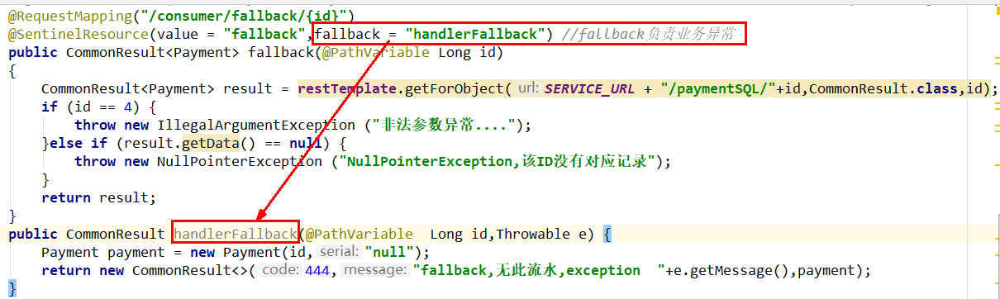


**结果**


#### 只配置blockhandler

**blockhandler主管的是违规操作，给出友好页面（降级服务）**


```java
@RestController
@Slf4j
public class CircleBreakerController
{
    public static final String SERVICE_URL = "http://nacos-payment-provider";

    @Resource
    private RestTemplate restTemplate;

    @RequestMapping("/consumer/fallback/{id}")
     @SentinelResource(value = "fallback",blockHandler = "blockHandler") //blockHandler负责在sentinel里面配置的降级限流
    public CommonResult<Payment> fallback(@PathVariable Long id)
    {
        CommonResult<Payment> result = restTemplate.getForObject(SERVICE_URL + "/paymentSQL/"+id,CommonResult.class,id);
        if (id == 4) {
            throw new IllegalArgumentException ("非法参数异常....");
        }else if (result.getData() == null) {
            throw new NullPointerException ("NullPointerException,该ID没有对应记录");
        }
        return result;
    }
    public CommonResult handlerFallback(@PathVariable  Long id,Throwable e) {
        Payment payment = new Payment(id,"null");
        return new CommonResult<>(444,"fallback,无此流水,exception  "+e.getMessage(),payment);
    }
    public CommonResult blockHandler(@PathVariable  Long id,BlockException blockException) {
        Payment payment = new Payment(id,"null");
        return new CommonResult<>(445,"blockHandler-sentinel限流,无此流水: blockException  "+blockException.getMessage(),payment);
    }

}
 
```


**图解**

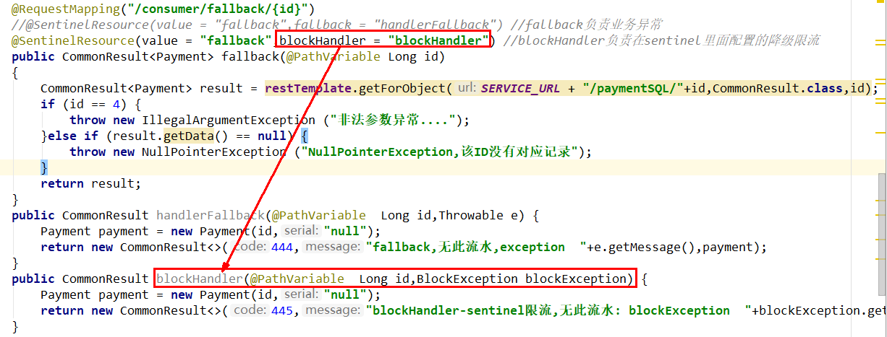


**配置规则**

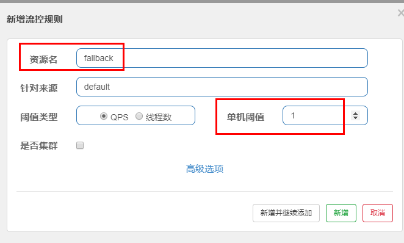


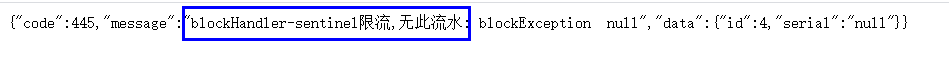


#### 配置fallback和blocakhandler


若 blockHandler 和 fallback 都进行了配置，则被限流降级而抛出 BlockException 时只会进入 blockHandler 处理逻辑。


#### openfeign实例

##### **pom**

```xml
<?xml version="1.0" encoding="UTF-8"?>
<project xmlns="http://maven.apache.org/POM/4.0.0"
         xmlns:xsi="http://www.w3.org/2001/XMLSchema-instance"
         xsi:schemaLocation="http://maven.apache.org/POM/4.0.0 http://maven.apache.org/xsd/maven-4.0.0.xsd">
    <parent>
        <artifactId>mscloud03</artifactId>
        <groupId>com.atguigu.springcloud</groupId>
        <version>1.0-SNAPSHOT</version>
    </parent>
    <modelVersion>4.0.0</modelVersion>

    <artifactId>cloudalibaba-consumer-nacos-order84</artifactId>

    <dependencies>
        <!--SpringCloud openfeign -->
        <dependency>
            <groupId>org.springframework.cloud</groupId>
            <artifactId>spring-cloud-starter-openfeign</artifactId>
        </dependency>

        <!--SpringCloud ailibaba nacos -->
        <dependency>
            <groupId>com.alibaba.cloud</groupId>
            <artifactId>spring-cloud-starter-alibaba-nacos-discovery</artifactId>
        </dependency>
        <!--SpringCloud ailibaba sentinel -->
        <dependency>
            <groupId>com.alibaba.cloud</groupId>
            <artifactId>spring-cloud-starter-alibaba-sentinel</artifactId>
        </dependency>
        <!-- 引入自己定义的api通用包，可以使用Payment支付Entity -->
        <dependency>
            <groupId>com.atguigu.springcloud</groupId>
            <artifactId>cloud-api-commons</artifactId>
            <version>${project.version}</version>
        </dependency>
        <!-- SpringBoot整合Web组件 -->
        <dependency>
            <groupId>org.springframework.boot</groupId>
            <artifactId>spring-boot-starter-web</artifactId>
        </dependency>
        <dependency>
            <groupId>org.springframework.boot</groupId>
            <artifactId>spring-boot-starter-actuator</artifactId>
        </dependency>
        <!--日常通用jar包配置-->
        <dependency>
            <groupId>org.springframework.boot</groupId>
            <artifactId>spring-boot-devtools</artifactId>
            <scope>runtime</scope>
            <optional>true</optional>
        </dependency>
        <dependency>
            <groupId>org.projectlombok</groupId>
            <artifactId>lombok</artifactId>
            <optional>true</optional>
        </dependency>
        <dependency>
            <groupId>org.springframework.boot</groupId>
            <artifactId>spring-boot-starter-test</artifactId>
            <scope>test</scope>
        </dependency>
    </dependencies>
</project>
```


##### **yml**

```yaml
server:
  port: 84


spring:
  application:
    name: nacos-order-consumer
  cloud:
    nacos:
      discovery:
        server-addr: localhost:8848
    sentinel:
      transport:
        #配置Sentinel dashboard地址
        dashboard: localhost:8080
        #默认8719端口，假如被占用会自动从8719开始依次+1扫描,直至找到未被占用的端口
        port: 8719


#消费者将要去访问的微服务名称(注册成功进nacos的微服务提供者)
service-url:
  nacos-user-service: http://nacos-payment-provider
 

# 激活Sentinel对Feign的支持
feign:
  sentinel:
    enabled: true  
```


业务类

```java
/**
 * @auther zzyy
 * @create 2019-12-10 17:17
 * 使用 fallback 方式是无法获取异常信息的，
 * 如果想要获取异常信息，可以使用 fallbackFactory参数
 */
@FeignClient(value = "nacos-payment-provider",fallback = PaymentFallbackService.class)//调用中关闭9003服务提供者
public interface PaymentService
{
    @GetMapping(value = "/paymentSQL/{id}")
    public CommonResult<Payment> paymentSQL(@PathVariable("id") Long id);
}
 
```


##### 降级处理方法

```java
@Component
public class PaymentFallbackService implements PaymentService
{
    @Override
    public CommonResult<Payment> paymentSQL(Long id)
    {
        return new CommonResult<>(444,"服务降级返回,没有该流水信息",new Payment(id, "errorSerial......"));
    }
}

```


##### controller

```java
@RestController
@Slf4j
public class CircleBreakerController
{
    //==================OpenFeign
    @Resource
    private PaymentService paymentService;

    @GetMapping(value = "/consumer/openfeign/{id}")
    public CommonResult<Payment> paymentSQL(@PathVariable("id") Long id)
    {
        if(id == 4)
        {
            throw new RuntimeException("没有该id");
        }
        return paymentService.paymentSQL(id);
    }

}

```


##### 主启动类

```java
@EnableDiscoveryClient
@SpringBootApplication
@EnableFeignClients
public class OrderNacosMain84
{
    public static void main(String[] args) {
            SpringApplication.run(OrderNacosMain84.class, args);
    }
}
```


##### 测试

测试84调用9003，此时故意关闭9003微服务提供者，看84消费侧自动降级，不会被耗死


## 忽略属性

```java
package com.atguigu.springcloud.alibaba.controller;

import com.alibaba.csp.sentinel.annotation.SentinelResource;
import com.alibaba.csp.sentinel.slots.block.BlockException;
import com.atguigu.springcloud.entities.CommonResult;
import com.atguigu.springcloud.entities.Payment;
import lombok.extern.slf4j.Slf4j;
import org.springframework.beans.factory.annotation.Autowired;
import org.springframework.web.bind.annotation.GetMapping;
import org.springframework.web.bind.annotation.PathVariable;
import org.springframework.web.bind.annotation.RequestMapping;
import org.springframework.web.bind.annotation.RestController;
import org.springframework.web.client.RestTemplate;

import javax.annotation.Resource;
import java.sql.SQLException;
import java.util.concurrent.Executors;

/**
 * @auther zzyy
 * @create 2020-02-13 20:24
 */
@RestController
@Slf4j
public class CircleBreakerController
{
    public static final String SERVICE_URL = "http://nacos-payment-provider";

    @Resource
    private RestTemplate restTemplate;

    @RequestMapping("/consumer/fallback/{id}")
    @SentinelResource(value = "fallback", fallback = "handlerFallback", blockHandler = "blockHandler",
            exceptionsToIgnore = {IllegalArgumentException.class})
    public CommonResult<Payment> fallback(@PathVariable Long id)
    {
        CommonResult<Payment> result = restTemplate.getForObject(SERVICE_URL + "/paymentSQL/"+id,CommonResult.class,id);
        if (id == 4) {
            throw new IllegalArgumentException ("非法参数异常....");
        }else if (result.getData() == null) {
            throw new NullPointerException ("NullPointerException,该ID没有对应记录");
        }
        return result;
    }
    public CommonResult handlerFallback(@PathVariable  Long id,Throwable e) {
        Payment payment = new Payment(id,"null");
        return new CommonResult<>(444,"fallback,无此流水,exception  "+e.getMessage(),payment);
    }
    public CommonResult blockHandler(@PathVariable  Long id,BlockException blockException) {
        Payment payment = new Payment(id,"null");
        return new CommonResult<>(445,"blockHandler-sentinel限流,无此流水: blockException  "+blockException.getMessage(),payment);
    }
}
 
 
 

```


**图说**


**结果**

问题会被打到前台


# 规则持久化

## 是什么？

**一旦我们重启应用，sentinel规则将消失，生产环境需要将配置规则进行持久化**


## 怎么玩？

>将限流配置规则持久化进Nacos保存，只要刷新8401某个rest地址，sentinel控制台
>
>的流控规则就能看到，只要Nacos里面的配置不删除，针对8401上sentinel上的流控规则持续有效


## 步骤

### pom

```xml
<!--SpringCloud ailibaba sentinel-datasource-nacos -->
<dependency>
    <groupId>com.alibaba.csp</groupId>
    <artifactId>sentinel-datasource-nacos</artifactId>
</dependency>
```


### yml

```yaml
 
server:
  port: 8401

spring:
  application:
    name: cloudalibaba-sentinel-service
  cloud:
    nacos:
      discovery:
        server-addr: localhost:8848 #Nacos服务注册中心地址
    sentinel:
      transport:
        dashboard: localhost:8080 #配置Sentinel dashboard地址
        port: 8719
      datasource:
        ds1:
          nacos:
            server-addr: localhost:8848
            dataId: cloudalibaba-sentinel-service
            groupId: DEFAULT_GROUP
            data-type: json
            rule-type: flow

management:
  endpoints:
    web:
      exposure:
        include: '*'

feign:
  sentinel:
    enabled: true # 激活Sentinel对Feign的支持
 

```


### 添加nacos业务规则配置


>```xml
> 
>[
>    {
>        "resource": "/rateLimit/byUrl",
>        "limitApp": "default",
>        "grade": 1,
>        "count": 1,
>        "strategy": 0,
>        "controlBehavior": 0,
>        "clusterMode": false
>    }
>]
>```
>
>
>
>resource：资源名称；
>limitApp：来源应用；
>grade：阈值类型，0表示线程数，1表示QPS；
>count：单机阈值；
>strategy：流控模式，0表示直接，1表示关联，2表示链路；
>controlBehavior：流控效果，0表示快速失败，1表示Warm Up，2表示排队等待；
>clusterMode：是否集群。


### 测试

访问一下该页面，刷新一下sentinel，发现含有该规则


# 问题

Hystrix是不是管配置违规和java代码异常？

答：是，他是统一一起将违规和bug一起降级


降级规则的业务代码分离。
