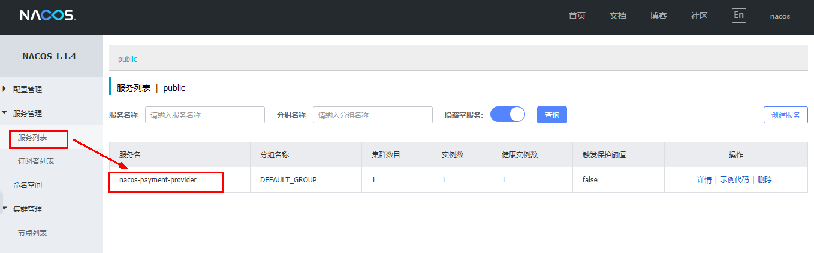
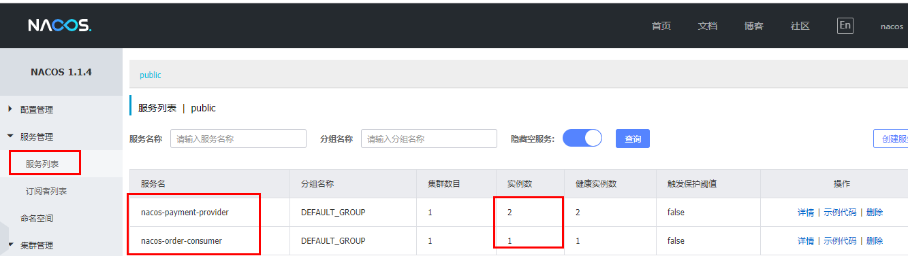
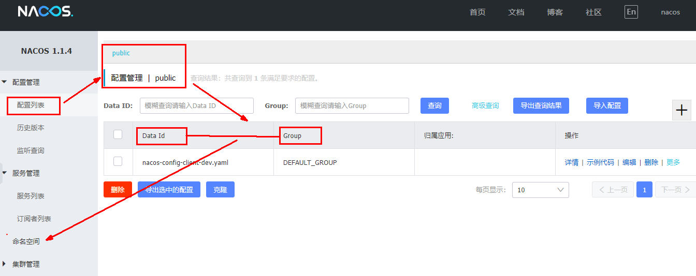
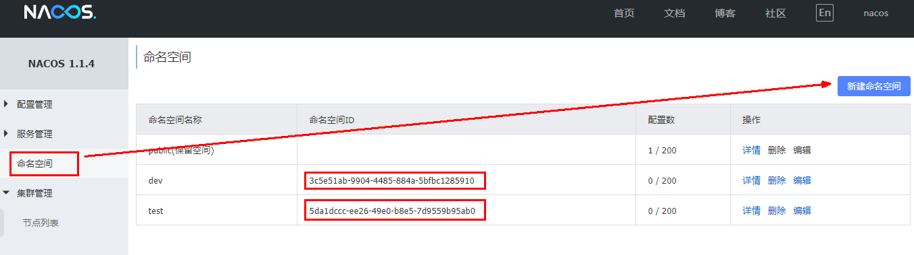

# Nacos简介

## Nacos是什么？

>**一个更易于构建云原生应用的动态服务发现、配置管理和服务管理平台。**
>
>Nacos就是**注册中心 + 配置中心**的组合


其实Nacos = Eureka+Config +Bus


## Nacos能做什么？

>替代Eureka做服务注册中心
>
>替代Config做服务配置中心


## Nacos在哪里下？

nacos下载地址

https://github.com/alibaba/nacos/releases


官方文档

https://nacos.io/zh-cn/index.html


https://spring-cloud-alibaba-group.github.io/github-pages/greenwich/spring-cloud-alibaba.html#_spring_cloud_alibaba_nacos_discovery


## Nacos与其他注册中心的比较


​				**据说 Nacos 在阿里巴巴内部有超过 10 万的实例运行，已经过了类似双十一等各种大型流量的考验**


# Nacos的安装和运行

## 安装

本地Java8+Maven环境已经OK

**下载地址：**

https://github.com/alibaba/nacos/releases


## 运行

1. 解压安装包，直接运行bin目录下的**`startup.cmd`**


2. 命令运行成功后直接访问http://localhost:8848/nacos

   默认账号密码都是nacos

3. 访问成功页面


# Nacos作为服务注册中心

## 官网文档

https://spring-cloud-alibaba-group.github.io/github-pages/greenwich/spring-cloud-alibaba.html#_spring_cloud_alibaba_nacos_config

## 基于Nacos的提供者

### pom文件

#### 父pom

在depencyManagement中加入springcloudalibaba的依赖

```xml
  <dependencyManagement>
    <dependencies>
<!--      springcloud Alibaba的依赖-->
        <dependency>
          <groupId>com.alibaba.cloud</groupId>
          <artifactId>spring-cloud-alibaba-dependencies</artifactId>
          <version>2.1.0.RELEASE</version>
          <type>pom</type>
          <scope>import</scope>
        </dependency>
      </dependencies>
   </dependencyManagement>

```

#### 本模块pom

其实就是加一个nacos的发现依赖

```xml
<!--SpringCloud ailibaba nacos -->
        <dependency>
            <groupId>com.alibaba.cloud</groupId>
            <artifactId>spring-cloud-starter-alibaba-nacos-discovery</artifactId>
        </dependency>
```


```xml
<?xml version="1.0" encoding="UTF-8"?>
<project xmlns="http://maven.apache.org/POM/4.0.0"
         xmlns:xsi="http://www.w3.org/2001/XMLSchema-instance"
         xsi:schemaLocation="http://maven.apache.org/POM/4.0.0 http://maven.apache.org/xsd/maven-4.0.0.xsd">
    <parent>
        <artifactId>Cloud2020</artifactId>
        <groupId>org.example</groupId>
        <version>1.0-SNAPSHOT</version>
    </parent>
    <modelVersion>4.0.0</modelVersion>

    <artifactId>cloudalibaba-provider-payment9001</artifactId>

    <dependencies>
        <!--SpringCloud ailibaba nacos -->
        <dependency>
            <groupId>com.alibaba.cloud</groupId>
            <artifactId>spring-cloud-starter-alibaba-nacos-discovery</artifactId>
        </dependency>
        <!-- SpringBoot整合Web组件 -->
        <dependency>
            <groupId>org.springframework.boot</groupId>
            <artifactId>spring-boot-starter-web</artifactId>
        </dependency>
        <dependency>
            <groupId>org.springframework.boot</groupId>
            <artifactId>spring-boot-starter-actuator</artifactId>
        </dependency>
        <!--日常通用jar包配置-->
        <dependency>
            <groupId>org.springframework.boot</groupId>
            <artifactId>spring-boot-devtools</artifactId>
            <scope>runtime</scope>
            <optional>true</optional>
        </dependency>
        <dependency>
            <groupId>org.projectlombok</groupId>
            <artifactId>lombok</artifactId>
            <optional>true</optional>
        </dependency>
        <dependency>
            <groupId>org.springframework.boot</groupId>
            <artifactId>spring-boot-starter-test</artifactId>
            <scope>test</scope>
        </dependency>
    </dependencies>
</project>


```

### yml文件

```yaml
server:
  port: 9001

spring:
  application:
    name: nacos-payment-provider
  cloud:
    nacos:
      discovery:
        server-addr: localhost:8848 #配置Nacos地址

management:
  endpoints:
    web:
      exposure:
        include: '*'  #暴露全部端口


```

### 主启动类

**`@EnableDiscoveryClient  与EnableEurekaClient的区别`**

>@EnableDiscoveryClient和@EnableEurekaClient共同点就是：**都是能够让注册中心能够发现，扫描到改服务。**
>
>不同点：**`@EnableEurekaClient只适用于Eureka作为注册中心，@EnableDiscoveryClient 可以是其他注册中心。`**


```java
package com.atgugu.cloudalibaba;

import org.springframework.boot.SpringApplication;
import org.springframework.boot.autoconfigure.SpringBootApplication;
import org.springframework.cloud.client.discovery.EnableDiscoveryClient;

@SpringBootApplication
@EnableDiscoveryClient
public class PaymentMain9001 {
    public static void main(String[] args) {
        SpringApplication.run(PaymentMain9001.class,args);
    }
}
```

### 业务类

```java
 
package com.atgugu.cloudalibaba.controller;

import org.springframework.beans.factory.annotation.Value;
import org.springframework.web.bind.annotation.GetMapping;
import org.springframework.web.bind.annotation.PathVariable;
import org.springframework.web.bind.annotation.RestController;

/**
 * @auther zzyy
 * @create 2019-12-03 16:05
 */
@RestController
public class PaymentController
{
    @Value("${server.port}")
    private String serverPort;

    @GetMapping(value = "/payment/nacos/{id}")
    public String getPayment(@PathVariable("id") Integer id)
    {
        return "nacos registry, serverPort: "+ serverPort+"\t id"+id;
    }
}
```


### 测试

http://localhost:9001/payment/nacos/1



含有提供者就ok了


## 虚拟端口映射

如果需要建立相同的微服务，只改变端口，那么这里可以去取巧，采用虚拟端口映射

这样也可以方便的验证负载均衡


## 基于Nacos的消费者

### pom文件

其实就是加一个nacos的发现依赖

```xml
<!--SpringCloud ailibaba nacos -->
        <dependency>
            <groupId>com.alibaba.cloud</groupId>
            <artifactId>spring-cloud-starter-alibaba-nacos-discovery</artifactId>
        </dependency>
```


```xml
<?xml version="1.0" encoding="UTF-8"?>
<project xmlns="http://maven.apache.org/POM/4.0.0"
         xmlns:xsi="http://www.w3.org/2001/XMLSchema-instance"
         xsi:schemaLocation="http://maven.apache.org/POM/4.0.0 http://maven.apache.org/xsd/maven-4.0.0.xsd">
    <parent>
        <artifactId>mscloud03</artifactId>
        <groupId>com.atguigu.springcloud</groupId>
        <version>1.0-SNAPSHOT</version>
    </parent>
    <modelVersion>4.0.0</modelVersion>

    <artifactId>cloudalibaba-consumer-nacos-order83</artifactId>


    <dependencies>
        <!--SpringCloud ailibaba nacos -->
        <dependency>
            <groupId>com.alibaba.cloud</groupId>
            <artifactId>spring-cloud-starter-alibaba-nacos-discovery</artifactId>
        </dependency>
        <!-- 引入自己定义的api通用包，可以使用Payment支付Entity -->
        <dependency>
            <groupId>com.atguigu.springcloud</groupId>
            <artifactId>cloud-api-commons</artifactId>
            <version>${project.version}</version>
        </dependency>
        <!-- SpringBoot整合Web组件 -->
        <dependency>
            <groupId>org.springframework.boot</groupId>
            <artifactId>spring-boot-starter-web</artifactId>
        </dependency>
        <dependency>
            <groupId>org.springframework.boot</groupId>
            <artifactId>spring-boot-starter-actuator</artifactId>
        </dependency>
        <!--日常通用jar包配置-->
        <dependency>
            <groupId>org.springframework.boot</groupId>
            <artifactId>spring-boot-devtools</artifactId>
            <scope>runtime</scope>
            <optional>true</optional>
        </dependency>
        <dependency>
            <groupId>org.projectlombok</groupId>
            <artifactId>lombok</artifactId>
            <optional>true</optional>
        </dependency>
        <dependency>
            <groupId>org.springframework.boot</groupId>
            <artifactId>spring-boot-starter-test</artifactId>
            <scope>test</scope>
        </dependency>
    </dependencies>
</project>
```


### yml文件

```yaml
server:
  port: 83


spring:
  application:
    name: nacos-order-consumer
  cloud:
    nacos:
      discovery:
        server-addr: localhost:8848


#消费者将要去访问的微服务名称(注册成功进nacos的微服务提供者)
service-url:
  nacos-user-service: http://nacos-payment-provider 
```


### 主启动类

**`@EnableDiscoveryClient`**:启动Nacos注册中心

```java
package com.atguigu.springcloud.alibaba;

import org.springframework.boot.SpringApplication;
import org.springframework.boot.autoconfigure.SpringBootApplication;
import org.springframework.cloud.client.discovery.EnableDiscoveryClient;

/**
 * @auther zzyy
 * @create 2020-02-10 12:01
 */
@EnableDiscoveryClient
@SpringBootApplication
public class OrderNacosMain83
{
    public static void main(String[] args)
    {
        SpringApplication.run(OrderNacosMain83.class,args);
    }
} 
```


### 业务类

```java
package com.atguigu.springcloud.alibaba.controller;

import com.atguigu.springcloud.alibaba.service.paymentservice;
import org.springframework.beans.factory.annotation.Autowired;
import org.springframework.beans.factory.annotation.Value;
import org.springframework.web.bind.annotation.GetMapping;
import org.springframework.web.bind.annotation.PathVariable;
import org.springframework.web.bind.annotation.RequestMapping;
import org.springframework.web.bind.annotation.RestController;
import org.springframework.web.client.RestTemplate;

import javax.annotation.Resource;

@RestController
public class OrderNacosController
{
    @Autowired
    private paymentservice paymentservice;
    @Resource
    private RestTemplate restTemplate;
    @Value("${service-url.nacos-user-service}")
    private String serverURL;

    @GetMapping("/consumer/payment/nacos/{id}")
    public String paymentInfo(@PathVariable("id") Long id)
    {
        return restTemplate.getForObject(serverURL+"/payment/nacos/"+id,String.class);
    }

    @RequestMapping("/consumer/payment/nacos/feigin/{id}")
    public String paymentInfoFeign(@PathVariable("id") Integer id){
        return paymentservice.getPayment(id);
    }
}
```


### 测试

nacos控制台



http://localhost:83/consumer/payment/nacos/13

83访问9001/9002，轮询负载OK


## 服务注册中心对比

**nacos全景图**


**nacos和cap**


**Nacos支持ap和cp模式的切换**

>
>
>
>C是所有节点在同一时间看到的数据是一致的；而A的定义是所有的请求都会收到响应。
>
>
>何时选择使用何种模式？
>一般来说，
>如果不需要存储服务级别的信息且服务实例是通过nacos-client注册，并能够保持心跳上报，那么就可以选择AP模式。当前主流的服务如 Spring cloud 和 Dubbo 服务，都适用于AP模式，AP模式为了服务的可能性而减弱了一致性，因此AP模式下只支持注册临时实例。
>
>如果需要在服务级别编辑或者存储配置信息，那么 CP 是必须，K8S服务和DNS服务则适用于CP模式。
>CP模式下则支持注册持久化实例，此时则是以 Raft 协议为集群运行模式，该模式下注册实例之前必须先注册服务，如果服务不存在，则会返回错误。
>
>
>curl -X PUT '$NACOS_SERVER:8848/nacos/v1/ns/operator/switches?entry=serverMode&value=CP'
>
> 

# Nacos作为服务配置中心

## Nacos配置中心---基础配置

### 建model

### pom文件

主要是要加nacos-config依赖

```xml
<!--nacos-config-->
        <dependency>
            <groupId>com.alibaba.cloud</groupId>
            <artifactId>spring-cloud-starter-alibaba-nacos-config</artifactId>
        </dependency>
```


```xml
<?xml version="1.0" encoding="UTF-8"?>
<project xmlns="http://maven.apache.org/POM/4.0.0"
         xmlns:xsi="http://www.w3.org/2001/XMLSchema-instance"
         xsi:schemaLocation="http://maven.apache.org/POM/4.0.0 http://maven.apache.org/xsd/maven-4.0.0.xsd">
    <parent>
        <artifactId>Cloud2020</artifactId>
        <groupId>org.example</groupId>
        <version>1.0-SNAPSHOT</version>
    </parent>
    <modelVersion>4.0.0</modelVersion>

    <artifactId>cloudalibaba-config-nacos-client3377</artifactId>

    <properties>
        <maven.compiler.source>8</maven.compiler.source>
        <maven.compiler.target>8</maven.compiler.target>
    </properties>
    <dependencies>
        <!--nacos-config-->
        <dependency>
            <groupId>com.alibaba.cloud</groupId>
            <artifactId>spring-cloud-starter-alibaba-nacos-config</artifactId>
        </dependency>
        <!--nacos-discovery-->
        <dependency>
            <groupId>com.alibaba.cloud</groupId>
            <artifactId>spring-cloud-starter-alibaba-nacos-discovery</artifactId>
        </dependency>
        <!--web + actuator-->
        <dependency>
            <groupId>org.springframework.boot</groupId>
            <artifactId>spring-boot-starter-web</artifactId>
        </dependency>
        <dependency>
            <groupId>org.springframework.boot</groupId>
            <artifactId>spring-boot-starter-actuator</artifactId>
        </dependency>
        <!--一般基础配置-->
        <dependency>
            <groupId>org.springframework.boot</groupId>
            <artifactId>spring-boot-devtools</artifactId>
            <scope>runtime</scope>
            <optional>true</optional>
        </dependency>
        <dependency>
            <groupId>org.projectlombok</groupId>
            <artifactId>lombok</artifactId>
            <optional>true</optional>
        </dependency>
        <dependency>
            <groupId>org.springframework.boot</groupId>
            <artifactId>spring-boot-starter-test</artifactId>
            <scope>test</scope>
        </dependency>
    </dependencies>
</project>

```
### yaml文件

>Nacos同springcloud-config一样，在项目初始化时，要保证先从配置中心进行配置拉取，
>
>拉取配置之后，才能保证项目的正常启动。
>
>springboot中配置文件的加载是存在优先级顺序的，bootstrap优先级高于application


bootstrap.yaml文件

```yaml
# nacos配置
server:
  port: 3377

spring:
  application:
    name: nacos-config-client
  cloud:
    nacos:
      discovery:
        server-addr: localhost:8848 #Nacos服务注册中心地址
      config:
        server-addr: localhost:8848 #Nacos作为配置中心地址
        file-extension: yaml #指定yaml格式的配置
#        group: Test_Group
        namespace:
          7515e860-a4e9-4f08-9f6e-afa0ceb75f77


  # ${spring.application.name}-${spring.profile.active}.${spring.cloud.nacos.config.file-extension}
# nacos-config-client
```


application.yaml文件

```yaml

spring:
  profiles:
#    active: dev # 表示开发环境
    active: info # 表示测试环境
#config:
#  info:nacos-config-client-dev   Group:DEFAULT_GROUP
```


### 主启动类

```java
package com.atguigu.springcloud.alibaba;

import org.springframework.boot.SpringApplication;
import org.springframework.boot.autoconfigure.SpringBootApplication;
import org.springframework.cloud.client.discovery.EnableDiscoveryClient;

/**
 * @auther zzyy
 * @create 2020-02-10 16:51
 */
@EnableDiscoveryClient
@SpringBootApplication
public class NacosConfigClientMain3377
{
    public static void main(String[] args) {
            SpringApplication.run(NacosConfigClientMain3377.class, args);
    }
}
```


### 业务类

@RefreshScope实现类的动态刷新功能

```java
package com.atguigu.springcloud.alibaba.controller;

import org.springframework.beans.factory.annotation.Value;
import org.springframework.cloud.context.config.annotation.RefreshScope;
import org.springframework.web.bind.annotation.GetMapping;
import org.springframework.web.bind.annotation.RestController;

@RestController
@RefreshScope //在控制器类加入@RefreshScope注解使当前类下的配置支持Nacos的动态刷新功能。
public class ConfigClientController
{
    @Value("${config.info}")
    private String configInfo;

    @GetMapping("/config/info")
    public String getConfigInfo() {
        return configInfo;
    }
}
```


### 测试

**`完成Nacos中添加配置信息后`**

运行cloud-config-nacos-client3377的主启动类

调用接口查看配置信息

http://localhost:3377/config/info


**`自带动态刷新`**

修改下Nacos中的yaml配置文件，再次调用查看配置的接口，就会发现配置已经刷新


## Nacos中添加配置信息

### Nacos中的匹配规则

Nacos中的dataid的组成格式及与SpringBoot配置文件中的匹配规则

**官网：**https://nacos.io/zh-cn/docs/quick-start-spring-cloud.html


### 总结

>最后公式：
>${spring.application.name}-${spring.profiles.active}.${spring.cloud.nacos.config.file-extension}
>
>prefix 默认为 spring.application.name 的值
>
>spring.profile.active 即为当前环境对应的 profile，可以通过配置项 spring.profile.active 来配置。
>
>file-exetension 为配置内容的数据格式，可以通过配置项 spring.cloud.nacos.config.file-extension 来配置


### 配置新增


### Nacos历史配置

**Nacos会记录配置文件的历史版本默认保留30天，此外还有一键回滚功能，回滚操作将会触发配置更新**

回滚


## Nacos配置中心---分类配置

**如果遇到了多项目多环境的问题该如何解决？**

>问题1：
>
>实际开发中，通常一个系统会准备
>
>dev开发环境
>
>test测试环境
>
>prod生产环境。
>
>如何保证指定环境启动时服务能正确读取到Nacos上相应环境的配置文件呢？
>
>问题2：
>
>一个大型分布式微服务系统会有很多微服务子项目，
>
>每个微服务项目又都会有相应的开发环境、测试环境、预发环境、正式环境......
>
>那怎么对这些微服务配置进行管理呢？


### Nacos的图形化管理界面




### Namespace + Group + DataId的区分

>
>
>namespace是可以用于区分部署环境的，Group和DataID逻辑上区分两个目标对象。
>
>默认情况：
>Namespace=public，Group=DEFAULT_GROUP, 默认Cluster是DEFAULT
>
>
>
>Namespace主要用来实现隔离。
>
>比方说我们现在有三个环境：开发、测试、生产环境，我们就可以创建三个Namespace，不同的Namespace之间是隔离的。
>
>
>
>Group默认是DEFAULT_GROUP，Group可以把不同的微服务划分到同一个分组里面去
>
>
>
>Service就是微服务；一个Service可以包含多个Cluster（集群），Nacos默认Cluster是DEFAULT，Cluster是对指定微服务的一个虚拟划分。
>
>
>
>Instance:就是微服务实例了


### Nacos三种方案加载配置

#### DataId方案

默认空间+默认分组+新建dev和test两个DataID

在application.yaml中的spring.profiles.active进行修改即可


#### Group方案

通过Group实现环境区分

通过bootstrap.yaml中的spring.cloud.nacos.config.group: Group名   修改Group名字


#### Namespace方案

通过Namespace实现环境区分

通过bootstrap.yaml中的spring.cloud.nacos.namespace: namespace名   修改Namespace名字




# Nacos集群和持久化配置（重）

## 官网说明

**官网网址：**

https://nacos.io/zh-cn/docs/cluster-mode-quick-start.html

**Nacos官网架构图**


**Nacos集群的架构图**


**官网说明：**

https://nacos.io/zh-cn/docs/deployment.html


## Nacos持久化配置解释

### 为什么需要配置持久化 ？

>Nacos默认自带的是嵌入式数据库derby，没启动一个Nacos，那么存储的数据都会被分配到各自的数据库中。这样就无法实现高可用。
>
>那么我们该如何实现呢？
>
>这里Nacos提供了一个支持外接的数据库（暂时只支持mysql），每台Nacos都可以配置自己的外接数据库。这样Nacos集群就可以实现高可用。


### derby切换到mysql配置步骤

>1. nacos-server-1.1.4\nacos\conf目录下找到sql脚本（nacos-mysql.sql）。在自己的数据库中创建config_info数据库，并将前面的sql脚本
>
>在该数据库中执行
>
>2. nacos-server-1.1.4\nacos\conf目录下找到application.properties
>
>```properties
>spring.datasource.platform=mysql
> 
>db.num=1
>db.url.0=jdbc:mysql://127.0.0.1:3306/nacos_config?characterEncoding=utf8&connectTimeout=1000&socketTimeout=3000&autoReconnect=true
>db.user=root
>db.password=123456
>```
>
>
>
>
>
>3. 启动Nacos，可以看到是个全新的空记录界面，出现的数据都是以前记录进derby的


## Linux版Nacos+MySQL生产环境配置

### 下载linux版的Nacos

https://github.com/alibaba/nacos/releases/tag/1.1.4

```matlab
tar -zxvf 压缩包名字
```

最好复制一下做个备份


### 集群配置步骤

#### 1.Linux服务器上mysql数据库配置

>nacos-server-1.1.4\nacos\conf目录下找到sql脚本（nacos-mysql.sql）。在自己的数据库中创建config_info数据库，并将前面的sql脚本
>
>在该数据库中执行


#### 2.application.properties配置


application.properties 文件打开后的最后面，配置如下内容：


#### 3.Linux服务器上nacos的集群配置cluster.conf

>梳理出3台nacos集器的不同服务端口号
>
>复制出cluster.conf
>
>
>
>
>
>
>
>
>
>
>
>这个IP不能写127.0.0.1，必须是Linux命令hostname -i能够识别的IP

#### 4.编辑Nacos的启动脚本startup.sh，使它能够接受不同的启动端口

>/mynacos/nacos/bin 目录下有startup.sh平时单机版的启动，都是./startup.sh即可。
>
>但是现在要集群**`启动Nacos`**，我们希望**`传递不同的端口号启动不同的nacos实例。`**
>
>命令：./startup.sh -p 3333        
>
>表示启动端口号为3333的nacos服务器实例，和上一步的cluster.conf配置的一致。

##### 修改内容

**修改前**


**修改后**


**启动方式**


#### 5.Nginx的配置，由它作为负载均衡器

>修改nginx的配置文件
>
>
>
>
>
>

```xml
#多个服务器，与server中的location的proxy_passj实现负载均衡
upstream cluster{
        server 127.0.0.1:3333;
        server 127.0.0.1:4444;
        server 127.0.0.1:5555;
    }
```

```
server {
        listen       1111;
        server_name  localhost;
        #charset koi8-r;
        #access_log  logs/host.access.log  main;
        location / {
            #root   html;
            #index  index.html index.htm;
            proxy_pass http://cluster;
        }

```

重启nginx即可

```
./nginx -s stop
./nginx
```

#### 6.截止到此处，1个Nginx+3个nacos注册中心+1个mysql

测试通过nginx访问nacos

http://192.168.111.144:1111/nacos/#/login


### 测试

微服务cloudalibaba-provider-payment9002启动注册进nacos集群


## 小总结

**`微服务实例去直接访问Nginx向外提供的端口，Nginx为我们实现Nacos的负载均衡`**

**`Mysql则是所有Nacos集群的外接服务器，这样就可以实现高可用和持久化配置`**


