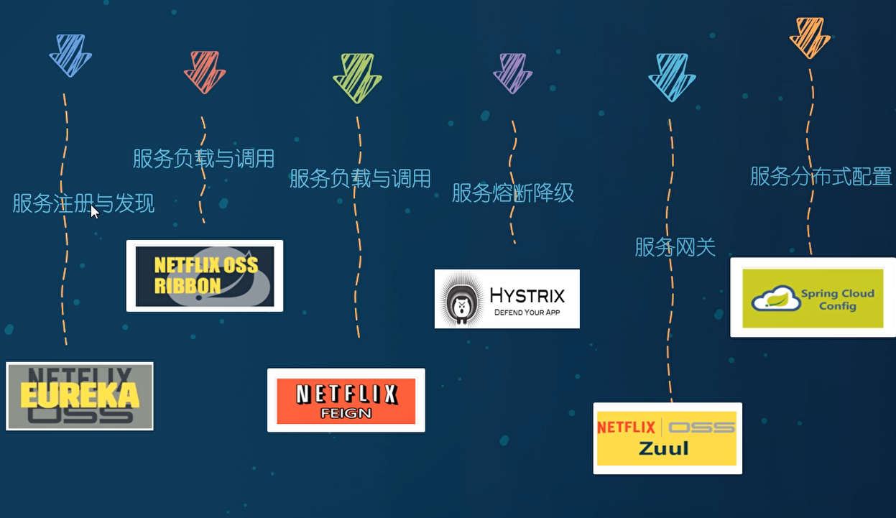
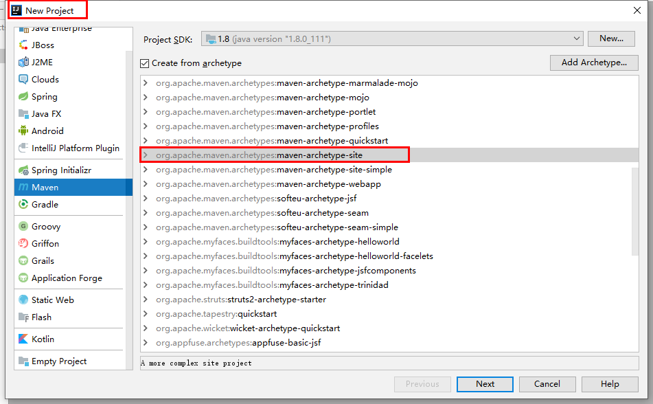
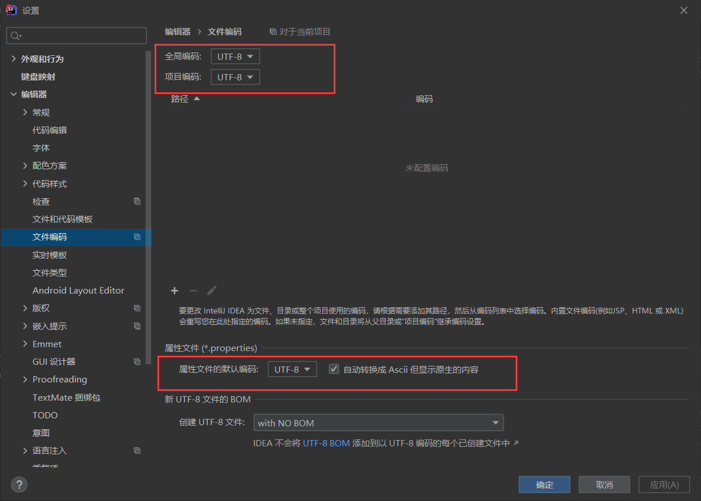
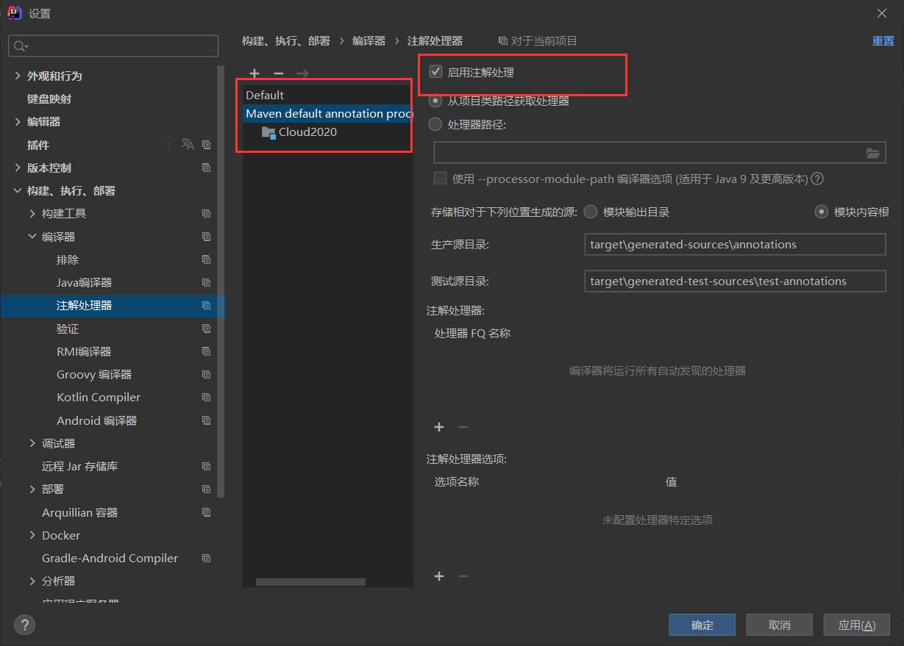
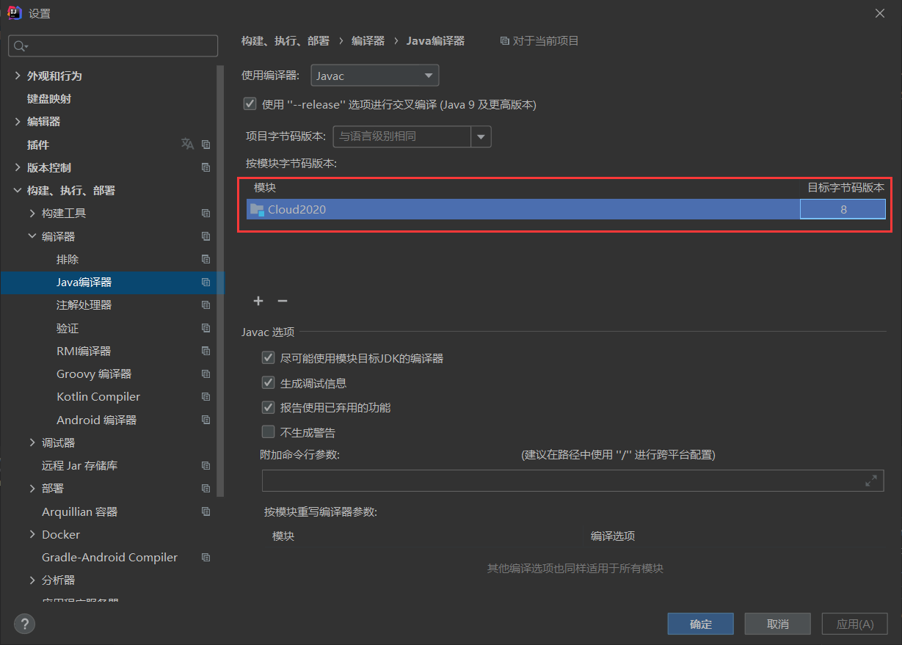
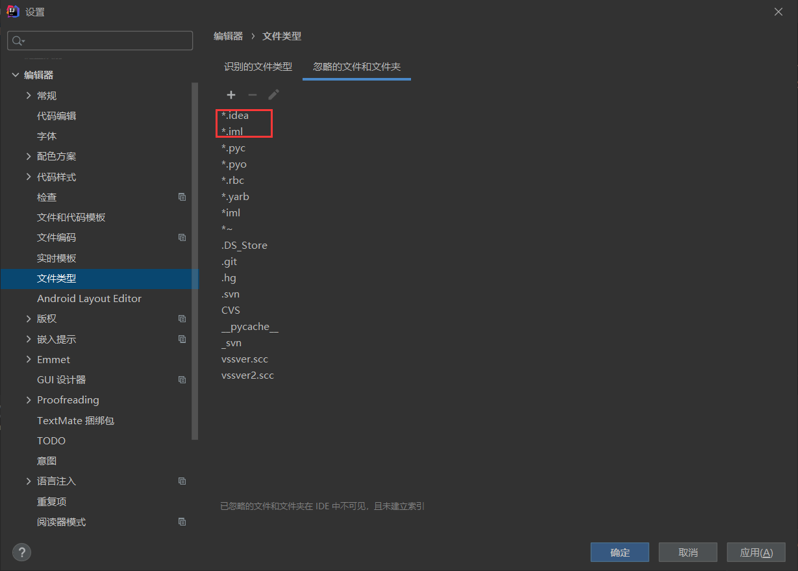
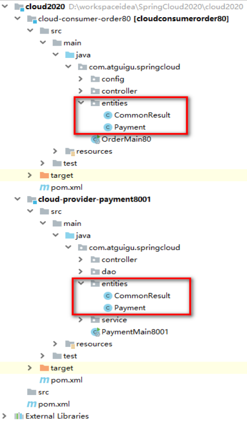

# SpringCloud

# 第一章 . 微服务概述与SpringCloud

## 1. 微服务与微服务架构

微服务：

站在技术维度上来说，微服务就是将以前传统的一站式应用按照业务逻辑分成一个一个的服务，彻底地解耦合

- 每个微服务提供单个业务功能的服务，一个服务做一件事

- 从技术角度看，每个微服务就是一个小而独立的，像进程一样，能够独立启动，销毁，拥有自己独立的数据库。


微服务架构：

它是一种架构模式。它提倡将单⼀应⽤程序划分成⼀组⼩的服务，服务之间互相协调、互相配合，为⽤户提供最终价值。

每个服务都能独立的部署到生产环境中。另外**应当尽量避免集中式的服务管理机制**

## 2. 分布式与集群的关系

>分布式：不同的服务器处理不同的业务，这些服务器都可以当成一个独立的服务器来对待。而这些服务器组合在一起就成了分布式系统
>
>集群：指的是多台服务器集中在一起，实现同一业务
>
>**分布式的每一个节点都可以做集群，但集群不一定就是分布式**


## 3.SpringCloud是什么？

分布式微服务架构下的**一站式解决方案**，是各个微服务架构落地技术的集合体，俗称：**微服务全家桶**


## 4. SpringBoot和SpringCloud有什么关系？

>SpringBoot：
>
>专注于快速方便的开发单个个体微服务。
>
>
>
>SpringCloud：
>
>1. 关注于全局的微服务的整理治理框架。它将	SpringBoot开发的每个单体微服务整合并管理起来。
>2. 为各个微服务之间提供，配置管理、服务发现、断路器、路由、微代理、事件总线、全局锁、决策竞选、分布式会话等等集成服务
>3. SpringBoot可以离开SpringCloud独立使用开发项目，但是SpringCloud离不开SpringBoot，属于依赖的关系.
>4.  SpringBoot专注于快速、方便的开发单个微服务个体，SpringCloud关注全局的服务治理框架。

​						

## 5. SpringCloud与Dubbo的区别

>最大的区别：SpringCloud舍弃了RPC通信，采用了基于Http的REST方式
>
>严格来说这两种方式各有优劣。虽然后者牺牲了服务调用的性能，但也避免了RPC原生所带来的问题。而且REST比RPC更加灵活，服务提供方和调用方的依赖只依靠一纸契约，不存在代码级别的强依赖，这在强调快速演化的微服务环境下，显得更加合适。





## 6. 分布式结构（Cloud）的组件


# 第二章 . 微服务架构编码构建—Rest微服务

## 创建聚合父工程Project

### 1.NewProject



### 2.设置字符编码  

### 3.注解生效激活



### 4.java编译版本选择



### 5.FileType过滤



## 父工程POM

```xml
<?xml version="1.0" encoding="UTF-8"?>

<project xmlns="http://maven.apache.org/POM/4.0.0" xmlns:xsi="http://www.w3.org/2001/XMLSchema-instance"
  xsi:schemaLocation="http://maven.apache.org/POM/4.0.0 http://maven.apache.org/xsd/maven-4.0.0.xsd">
  <modelVersion>4.0.0</modelVersion>

  <groupId>org.example</groupId>
  <artifactId>Cloud2020</artifactId>
  <version>1.0-SNAPSHOT</version>

  <modules>
    <module>cloud-provider-payment8001</module>
  </modules>

  <packaging>pom</packaging>
  <!-- 统一管理jar包版本 -->
  <properties>
    <project.build.sourceEncoding>UTF-8</project.build.sourceEncoding>
    <maven.compiler.source>1.8</maven.compiler.source>
    <maven.compiler.target>1.8</maven.compiler.target>
    <junit.version>4.12</junit.version>
    <log4j.version>1.2.17</log4j.version>
    <lombok.version>1.16.18</lombok.version>
    <mysql.version>8.0.22</mysql.version>
    <druid.version>1.1.16</druid.version>
    <mybatis.spring.boot.version>2.0.0</mybatis.spring.boot.version>
  </properties>

  <!-- 子模块继承之后，提供作用：锁定版本+子modlue不用写groupId和version  -->
  <dependencyManagement>
    <dependencies>
      <!--spring boot 2.2.2-->
      <dependency>
        <groupId>org.springframework.boot</groupId>
        <artifactId>spring-boot-dependencies</artifactId>
        <version>2.2.2.RELEASE</version>
        <type>pom</type>
        <scope>import</scope>
      </dependency>
      <!--spring cloud Hoxton.SR1-->
      <dependency>
        <groupId>org.springframework.cloud</groupId>
        <artifactId>spring-cloud-dependencies</artifactId>
        <version>Hoxton.SR1</version>
        <type>pom</type>
        <scope>import</scope>
      </dependency>
      <!--spring cloud alibaba 2.1.0.RELEASE-->
      <dependency>
        <groupId>com.alibaba.cloud</groupId>
        <artifactId>spring-cloud-alibaba-dependencies</artifactId>
        <version>2.1.0.RELEASE</version>
        <type>pom</type>
        <scope>import</scope>
      </dependency>
      <dependency>
        <groupId>mysql</groupId>
        <artifactId>mysql-connector-java</artifactId>
        <version>${mysql.version}</version>
      </dependency>
      <dependency>
        <groupId>com.alibaba</groupId>
        <artifactId>druid</artifactId>
        <version>${druid.version}</version>
      </dependency>
      <dependency>
        <groupId>org.mybatis.spring.boot</groupId>
        <artifactId>mybatis-spring-boot-starter</artifactId>
        <version>${mybatis.spring.boot.version}</version>
      </dependency>
      <dependency>
        <groupId>junit</groupId>
        <artifactId>junit</artifactId>
        <version>${junit.version}</version>
      </dependency>
      <dependency>
        <groupId>log4j</groupId>
        <artifactId>log4j</artifactId>
        <version>${log4j.version}</version>
      </dependency>
      <dependency>
        <groupId>org.projectlombok</groupId>
        <artifactId>lombok</artifactId>
        <version>${lombok.version}</version>
        <optional>true</optional>
      </dependency>
    </dependencies>
  </dependencyManagement>

  <build>
    <plugins>
      <plugin>
        <groupId>org.springframework.boot</groupId>
        <artifactId>spring-boot-maven-plugin</artifactId>
        <configuration>
          <fork>true</fork>
          <addResources>true</addResources>
        </configuration>
      </plugin>
    </plugins>
  </build>

</project>
```

**注1：DependencyManagement和Dependencies的区别**

**通常会在一个组织或者项目的最顶层的父POM 中看到dependencyManagement 元素。**

使用pom.xml 中的dependencyManagement 元素能让所有在子项目中引用一个依赖而不用显式的列出版本号。
Maven 会沿着父子层次向上走，直到找到一个拥有dependencyManagement 元素的项目，然后它就会使用这个
dependencyManagement 元素中指定的版本号。


**注2：父工程创建完成执行mvn:install将父工程发布到仓库方便子工程继承**

## 服务提供者

### 1.配置pom文件

```xml
<?xml version="1.0" encoding="UTF-8"?>
<project xmlns="http://maven.apache.org/POM/4.0.0"
         xmlns:xsi="http://www.w3.org/2001/XMLSchema-instance"
         xsi:schemaLocation="http://maven.apache.org/POM/4.0.0 http://maven.apache.org/xsd/maven-4.0.0.xsd">
    <parent>
        <artifactId>Cloud2020</artifactId>
        <groupId>org.example</groupId>
        <version>1.0-SNAPSHOT</version>
    </parent>

    <modelVersion>4.0.0</modelVersion>

    <artifactId>cloud-provider-payment8001</artifactId>

    <dependencies>
        <dependency>
            <groupId>org.springframework.boot</groupId>
            <artifactId>spring-boot-starter-web</artifactId>
        </dependency>
        <dependency>
            <groupId>org.springframework.boot</groupId>
            <artifactId>spring-boot-starter-actuator</artifactId>
        </dependency>
        <dependency>
            <groupId>org.mybatis.spring.boot</groupId>
            <artifactId>mybatis-spring-boot-starter</artifactId>
        </dependency>
        <dependency>
            <groupId>com.alibaba</groupId>
            <artifactId>druid-spring-boot-starter</artifactId>
            <version>1.1.10</version>
        </dependency>
        <!--mysql-connector-java-->
        <dependency>
            <groupId>mysql</groupId>
            <artifactId>mysql-connector-java</artifactId>
        </dependency>
        <!--jdbc-->
        <dependency>
            <groupId>org.springframework.boot</groupId>
            <artifactId>spring-boot-starter-jdbc</artifactId>
        </dependency>
        <dependency>
            <groupId>org.springframework.boot</groupId>
            <artifactId>spring-boot-devtools</artifactId>
            <scope>runtime</scope>
            <optional>true</optional>
        </dependency>
        <dependency>
            <groupId>org.projectlombok</groupId>
            <artifactId>lombok</artifactId>
            <optional>true</optional>
        </dependency>
        <dependency>
            <groupId>org.springframework.boot</groupId>
            <artifactId>spring-boot-starter-test</artifactId>
            <scope>test</scope>
        </dependency>
    </dependencies>
</project>
```

### 2.写yml

```yaml
server:
  port: 8001

spring:
  application:
    name: cloud-payment-service
  datasource:
    type: com.alibaba.druid.pool.DruidDataSource            # 当前数据源操作类型
    driver-class-name: com.mysql.cj.jdbc.Driver              # mysql驱动包 com.mysql.jdbc.Driver
    url: jdbc:mysql://localhost:3306/cloud2020?useUnicode=true&characterEncoding=UTF-8&serverTimezone=GMT%2B8
    username: root
    password: 123456789


mybatis:
  mapperLocations: classpath:mapper/*.xml
  type-aliases-package: com.atguigu.springcloud.entities    # 所有Entity别名类所在包


```

### 3.主启动类

```java
package com.atguigu.springcloud;

import org.mybatis.spring.annotation.MapperScan;
import org.springframework.boot.SpringApplication;
import org.springframework.boot.autoconfigure.SpringBootApplication;

@MapperScan(basePackages = "com.atguigu.springcloud.dao")
@SpringBootApplication
public class PaymentMain8001 {
    public static void main(String[] args) {
        SpringApplication.run(PaymentMain8001.class,args);
    }
}

```

### 4.业务类

#### 4.1entities

```java
package com.atguigu.springcloud.entities;

import lombok.AllArgsConstructor;
import lombok.Data;
import lombok.NoArgsConstructor;
import lombok.extern.slf4j.Slf4j;

import java.io.Serializable;

@Data
@AllArgsConstructor
@NoArgsConstructor
@Slf4j
public class Payment implements Serializable {
    private Long id;
    private String serial;
}


```

```java
package com.atguigu.springcloud.entities;

import lombok.AllArgsConstructor;
import lombok.Data;
import lombok.NoArgsConstructor;

@Data
@NoArgsConstructor
@AllArgsConstructor
public class CommonResult <T>{
    private Integer code;
    private String message;
    private T Date;
    public CommonResult(Integer code,String message){
        this(code,message,null);
    }
}

```


#### 4.2dao

```java
package com.atguigu.springcloud.dao;


import com.atguigu.springcloud.entities.Payment;
import org.apache.ibatis.annotations.Param;

public interface PaymentDao {
    public int create(Payment payment);

    public Payment getPaymentById(@Param("id") Long id);
}

```

**mapper文件**

```xml
<?xml version="1.0" encoding="UTF-8" ?>
<!DOCTYPE mapper PUBLIC "-//mybatis.org//DTD Mapper 3.0//EN" "http://mybatis.org/dtd/mybatis-3-mapper.dtd" >

<mapper namespace="com.atguigu.springcloud.dao.PaymentDao">

    <resultMap id="BaseResultMap" type="com.atguigu.springcloud.entities.Payment">
        <id column="id" property="id" jdbcType="BIGINT"/>
        <result column="serial" property="serial" jdbcType="VARCHAR"/>
    </resultMap>

    <insert id="create" parameterType="Payment" useGeneratedKeys="true" keyProperty="id">
        INSERT INTO payment(SERIAL) VALUES(#{serial});
    </insert>

    <select id="getPaymentById" parameterType="Long" resultMap="BaseResultMap" >
        SELECT * FROM payment WHERE id=#{id};
    </select>

</mapper>


```


#### 4.3service

```java
package com.atguigu.springcloud.service;

import com.atguigu.springcloud.entities.Payment;
import org.apache.ibatis.annotations.Param;

public interface PaymentService {
    public int create(Payment payment);

    public Payment getPaymentById(@Param("id") Long id);
}

```

```java
package com.atguigu.springcloud.service.impl;

import com.atguigu.springcloud.dao.PaymentDao;
import com.atguigu.springcloud.entities.Payment;
import com.atguigu.springcloud.service.PaymentService;
import org.springframework.beans.factory.annotation.Autowired;
import org.springframework.stereotype.Service;
//@SuppressWarnings("all")
@Service
public class PaymentServiceImpl implements PaymentService {
    @Autowired
    public PaymentDao dao;
    @Override
    public int create(Payment payment) {
        return dao.create(payment);
    }

    @Override
    public Payment getPaymentById(Long id) {
        return dao.getPaymentById(id);
    }
}

```


#### 4.4controller

```java
package com.atguigu.springcloud.controller;

import com.atguigu.springcloud.entities.CommonResult;
import com.atguigu.springcloud.entities.Payment;
import com.atguigu.springcloud.service.PaymentService;
import lombok.extern.slf4j.Slf4j;
import org.springframework.beans.factory.annotation.Autowired;
import org.springframework.web.bind.annotation.*;

@RestController
@Slf4j
public class PaymentController {
    @Autowired
    private PaymentService paymentService;

    @PostMapping(value = "/payment/create")
    public CommonResult<Payment> create(@RequestBody Payment payment){
        int result = paymentService.create(payment);
        log.info("*****插入操作返回结果:" + result);

        if(result > 0)
        {
            return new CommonResult(200,"插入数据库成功",result);
        }else{
            return new CommonResult(444,"插入数据库失败",null);
        }

    }
    @GetMapping(value = "/payment/get/{id}")
    public CommonResult<Payment> getPaymentById(@PathVariable("id") Long id)
    {
        Payment payment = paymentService.getPaymentById(id);
        log.info("*****查询结果:{}",payment);
        if (payment != null) {
            return new CommonResult(200,"查询成功",payment);
        }else{
            return new CommonResult(444,"没有对应记录,查询ID: "+id,null);
        }
    }

}

```


## 服务消费者

### 1.配置pom文件

```xml
<?xml version="1.0" encoding="UTF-8"?>
<project xmlns="http://maven.apache.org/POM/4.0.0"
         xmlns:xsi="http://www.w3.org/2001/XMLSchema-instance"
         xsi:schemaLocation="http://maven.apache.org/POM/4.0.0 http://maven.apache.org/xsd/maven-4.0.0.xsd">
    <parent>
        <artifactId>Cloud2020</artifactId>
        <groupId>org.example</groupId>
        <version>1.0-SNAPSHOT</version>
    </parent>
    <modelVersion>4.0.0</modelVersion>

    <artifactId>cloud-consumer--order80</artifactId>

    <dependencies>
        <dependency>
            <groupId>org.springframework.boot</groupId>
            <artifactId>spring-boot-starter-web</artifactId>
        </dependency>
        <dependency>
            <groupId>org.springframework.boot</groupId>
            <artifactId>spring-boot-starter-actuator</artifactId>
        </dependency>
        <dependency>
            <groupId>org.springframework.boot</groupId>
            <artifactId>spring-boot-devtools</artifactId>
            <scope>runtime</scope>
            <optional>true</optional>
        </dependency>
        <dependency>
            <groupId>org.projectlombok</groupId>
            <artifactId>lombok</artifactId>
            <optional>true</optional>
        </dependency>
        <dependency>
            <groupId>org.springframework.boot</groupId>
            <artifactId>spring-boot-starter-test</artifactId>
            <scope>test</scope>
        </dependency>
<!--        配置外置的项目组-->
        <dependency>
            <groupId>org.example</groupId>
            <artifactId>cloud-api-commons</artifactId>
            <version>1.0-SNAPSHOT</version>
        </dependency>
    </dependencies>
</project>
```


### 2.写yml

```yaml
server:
  port: 80
spring:
  application:
    name: cloud-consumer--order80

```


### 3.主启动类

```java
package com.atguigu.springcloud;

import org.springframework.boot.SpringApplication;
import org.springframework.boot.autoconfigure.SpringBootApplication;

@SpringBootApplication
public class OrderMain80 {
    public static void main(String[] args) {
        SpringApplication.run(OrderMain80.class);
    }
}

```


### 4.业务类

配置类

```java
package com.atguigu.springcloud.config;

import org.springframework.context.annotation.Bean;
import org.springframework.context.annotation.Configuration;
import org.springframework.web.client.RestTemplate;

@Configuration
public class ApplicationContextConfig {

    @Bean
    public RestTemplate getRestTemplate(){
        return new RestTemplate();
    }
}

```


controller类

```java
package com.atguigu.springcloud.controller;

import com.atguigu.springcloud.entites.CommonResult;
import com.atguigu.springcloud.entites.Payment;
import lombok.extern.slf4j.Slf4j;
import org.springframework.beans.factory.annotation.Autowired;
import org.springframework.web.bind.annotation.*;
import org.springframework.web.client.RestTemplate;

@Slf4j
@RestController
public class OrderController {
    public static final String url="http://localhost:8001";

    @Autowired
    private RestTemplate restTemplate;
//远程调用该方法
   
    @PostMapping("/consumer/payment/create")
    public CommonResult<Payment> create(@RequestBody Payment payment){
        return restTemplate.postForObject(url+"/payment/create",payment,CommonResult.class);
    }
    @GetMapping("/consumer/payment/get/{id}")
    public CommonResult<Payment> getPayment(@PathVariable("id") Long id){
        return restTemplate.getForObject(url+"/payment/get/"+id,CommonResult.class);
    }

}

```

**entities类，因为后期，我们可以将这个重复的entities类，将他抽离封装到一个api模块中，所以这里暂无**


##  **RestTemplate**

RestTemplate提供了多种便捷访问远程Http服务的方法，是一种简单便捷的访问Restful服务模板类，

是Spring 提供的用于访问Rest服务的客户端模板工具集


官网地址： https://docs.spring.io/spring-framework/docs/5.2.2.RELEASE/javadoc-api/org/springframework/web/client/RestTemplate.html


使用RestTemplate访问Restful接口非常的简单粗暴无脑。

（url，requestMap，ResponseBean.class）这三个参数分别代表

REST请求地址、请求参数、Http响应转换被转换成的对象类型。

 

使用例子：

```java
public CommonResult<Payment> create(@RequestBody Payment payment){
        return restTemplate.postForObject(url+"/payment/create",payment,CommonResult.class);
    }
```


## 工具服务者（API模块）



因此可以将entities抽出来，我们将他封装再一个模块中

### 1.pom文件

```xml
<?xml version="1.0" encoding="UTF-8"?>
<project xmlns="http://maven.apache.org/POM/4.0.0"
         xmlns:xsi="http://www.w3.org/2001/XMLSchema-instance"
         xsi:schemaLocation="http://maven.apache.org/POM/4.0.0 http://maven.apache.org/xsd/maven-4.0.0.xsd">
    <parent>
        <artifactId>cloud2020</artifactId>
        <groupId>com.atguigu.springcloud</groupId>
        <version>1.0-SNAPSHOT</version>
    </parent>
    <modelVersion>4.0.0</modelVersion>
    <artifactId>cloud-api-commons</artifactId>

    <dependencies>
        <dependency>
            <groupId>org.springframework.boot</groupId>
            <artifactId>spring-boot-devtools</artifactId>
            <scope>runtime</scope>
            <optional>true</optional>
        </dependency>

        <dependency>
            <groupId>org.projectlombok</groupId>
            <artifactId>lombok</artifactId>
           <optional>true</optional>
        </dependency>
        <dependency>
            <groupId>cn.hutool</groupId>
            <artifactId>hutool-all</artifactId>
            <version>5.1.0</version>
        </dependency>
    </dependencies>
```

### 2.entities(封装的公共类)

### 3.maven命令 clean    |      install
