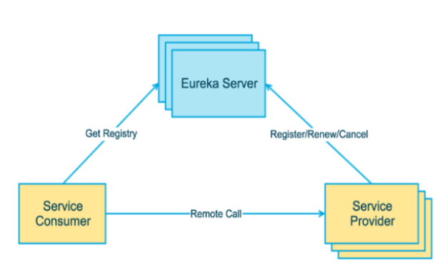
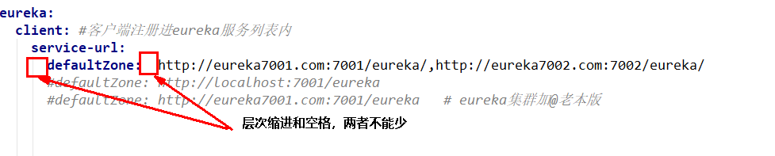
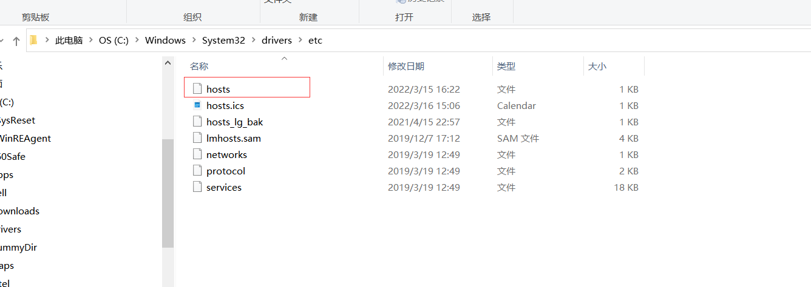
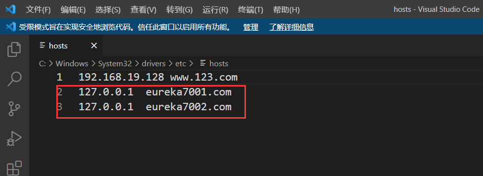

# Eureka服务注册与发现

# 第一章  Eureka基础知识

## 1.1 服务治理　　

>**定义：**
>
>在传统的**rpc远程调用框架**中，管理每个服务与服务之间依赖关系比较复杂，**管理比较复杂，所以需要使用服务治理**，**管理服务与服务之间依赖关系**，可以实现**服务调用、负载均衡、容错**等，**实现服务发现与注册**。


**实现服务发现与注册**

 Spring Cloud 封装了 Netflix 公司开发的 Eureka 模块来实现**服务治理**


## 1.2 服务注册与发现

**服务注册**

将服务信息注册进注册中心

**服务发现**

从注册中心获取服务信息。   

实质：***存key服务命令   取value服务调用地址***


Eureka采用了**CS的设计架构**，**Eureka Server** **作为服务注册功能的服务器**，**它是服务注册中心**。

而系统中的其他微服务，**使用 Eureka的客户端(Eureka Provider)连接到 Eureka Server并维持心跳连接**。

这样系统的维护人员就可以通过 Eureka Server 来监控系统中各个微服务是否正常运行。


## 1.3 Eureka两组件

### EurekaServer

>Eureka Server**提供服务注册服务**
>
>各个微服务节点通过配置启动后，会在EurekaServer中进行**注册**，
>
>这样EurekaServer中的**服务注册表中将会存储所有可用服务节点的信息**，服务节点的信息可以在界面中直观看到。


### EurekaClient

>EurekaClient **通过注册中心进行访问**
>
>是一个Java客户端，用于简化Eureka Server的交互


**注意：**

>客户端同时也具备一个内置的、使用轮询(round-robin)负载算法的负载均衡器。
>
>在应用启动后，将会向Eureka Server发送心跳(默认周期为30秒)。如果Eureka Server在多个心跳周期内没有接收到某个节点的心跳，
>
>EurekaServer将会从服务注册表中把这个服务节点移除（默认90秒）


# 第二章  单机Eureka构建步骤



## 2. 1生成eurekaServer端注册中心（房东）

### 操作步骤

#### 建Moudule   

#### 改pom

```xml
    <!--eureka-server-->
    <dependency>
        <groupId>org.springframework.cloud</groupId>
        <artifactId>spring-cloud-starter-netflix-eureka-server</artifactId>
    </dependency>
```

```xml
<?xml version="1.0" encoding="UTF-8"?>
<project xmlns="http://maven.apache.org/POM/4.0.0"
         xmlns:xsi="http://www.w3.org/2001/XMLSchema-instance"
         xsi:schemaLocation="http://maven.apache.org/POM/4.0.0 http://maven.apache.org/xsd/maven-4.0.0.xsd">
    <parent>
        <artifactId>Cloud2020</artifactId>
        <groupId>org.example</groupId>
        <version>1.0-SNAPSHOT</version>
    </parent>
    <modelVersion>4.0.0</modelVersion>

    <artifactId>cloud-eureka-server7001</artifactId>

    <properties>
        <maven.compiler.source>8</maven.compiler.source>
        <maven.compiler.target>8</maven.compiler.target>
    </properties>
    <dependencies>
        <!--eureka-server-->
        <dependency>
            <groupId>org.springframework.cloud</groupId>
            <artifactId>spring-cloud-starter-netflix-eureka-server</artifactId>
        </dependency>

        <!-- 引入自己定义的api通用包，可以使用Payment支付Entity -->
        <dependency>
<!--            <groupId>com.atguigu.springcloud</groupId>-->
            <groupId>org.example</groupId>
            <artifactId>cloud-api-commons</artifactId>
            <version>1.0-SNAPSHOT</version>
        </dependency>
        <!--boot web actuator-->
        <dependency>
            <groupId>org.springframework.boot</groupId>
            <artifactId>spring-boot-starter-web</artifactId>
        </dependency>
        <dependency>
            <groupId>org.springframework.boot</groupId>
            <artifactId>spring-boot-starter-actuator</artifactId>
        </dependency>
        <!--一般通用配置-->
        <dependency>
            <groupId>org.springframework.boot</groupId>
            <artifactId>spring-boot-devtools</artifactId>
            <scope>runtime</scope>
            <optional>true</optional>
        </dependency>
        <dependency>
            <groupId>org.projectlombok</groupId>
            <artifactId>lombok</artifactId>
        </dependency>
        <dependency>
            <groupId>org.springframework.boot</groupId>
            <artifactId>spring-boot-starter-test</artifactId>
            <scope>test</scope>
        </dependency>
        <dependency>
            <groupId>junit</groupId>
            <artifactId>junit</artifactId>
        </dependency>
    </dependencies>

</project>


```

写yml

```yaml
server:
  port: 7001

eureka:
  instance:
    hostname: localhost #eureka服务端的实例名称就是本项目名称
  client:
    register-with-eureka: false  #false:不向注册中心注册自己   true:向注册中心注册自己
    fetch-registry: false  #false表示自己就是注册中心，不需要再去检索服务。我的职责是维护服务实例
    service-url:
      #      #设置与Eureka Server交互的地址查询服务和注册服务都需要依赖这个地址。
      defaultZone: http://${eureka.instance.hostname}:${server.port}/eureka/
```


#### 主启动

需要再主启动类这里加一个注解，表明这是eureka注册中心

**@EnableEurekaServer**

```java
package com.atguigu.springcloud;

import org.springframework.boot.SpringApplication;
import org.springframework.boot.autoconfigure.SpringBootApplication;
import org.springframework.cloud.netflix.eureka.server.EnableEurekaServer;

@SpringBootApplication
@EnableEurekaServer
public class EurekaMain7001 {
    public static void main(String[] args) {
        SpringApplication.run(EurekaMain7001.class,args);
    }
}

```


#### 测试

http://localhost:7001/

## 2.3生成eurekaClient端服务提供者（开公司的）

### 操作步骤 

#### 建Moudule   

#### 改pom

```xml
 <!--eureka-client-->
        <dependency>
            <groupId>org.springframework.cloud</groupId>
            <artifactId>spring-cloud-starter-netflix-eureka-client</artifactId>
        </dependency>
```


```xml
<?xml version="1.0" encoding="UTF-8"?>
<project xmlns="http://maven.apache.org/POM/4.0.0"
         xmlns:xsi="http://www.w3.org/2001/XMLSchema-instance"
         xsi:schemaLocation="http://maven.apache.org/POM/4.0.0 http://maven.apache.org/xsd/maven-4.0.0.xsd">
    <parent>
        <artifactId>Cloud2020</artifactId>
        <groupId>org.example</groupId>
        <version>1.0-SNAPSHOT</version>
    </parent>

    <modelVersion>4.0.0</modelVersion>

    <artifactId>cloud-provider-payment8001</artifactId>

    <dependencies>

        <dependency>
            <groupId>org.springframework.boot</groupId>
            <artifactId>spring-boot-starter-web</artifactId>
        </dependency>
        <dependency>
            <groupId>org.springframework.boot</groupId>
            <artifactId>spring-boot-starter-actuator</artifactId>
        </dependency>
        <dependency>
            <groupId>org.mybatis.spring.boot</groupId>
            <artifactId>mybatis-spring-boot-starter</artifactId>
        </dependency>
        <dependency>
            <groupId>com.alibaba</groupId>
            <artifactId>druid-spring-boot-starter</artifactId>
            <version>1.1.10</version>
        </dependency>
        <!--mysql-connector-java-->
        <dependency>
            <groupId>mysql</groupId>
            <artifactId>mysql-connector-java</artifactId>
        </dependency>
        <!--jdbc-->
        <dependency>
            <groupId>org.springframework.boot</groupId>
            <artifactId>spring-boot-starter-jdbc</artifactId>
        </dependency>
        <dependency>
            <groupId>org.springframework.boot</groupId>
            <artifactId>spring-boot-devtools</artifactId>
            <scope>runtime</scope>
            <optional>true</optional>
        </dependency>
        <dependency>
            <groupId>org.projectlombok</groupId>
            <artifactId>lombok</artifactId>
            <optional>true</optional>
        </dependency>
        <dependency>
            <groupId>org.springframework.boot</groupId>
            <artifactId>spring-boot-starter-test</artifactId>
            <scope>test</scope>
        </dependency>
        <!--        配置外置的项目组-->
        <dependency>
            <groupId>org.example</groupId>
            <artifactId>cloud-api-commons</artifactId>
            <version>1.0-SNAPSHOT</version>
        </dependency>
        <!--eureka-client-->
        <dependency>
            <groupId>org.springframework.cloud</groupId>
            <artifactId>spring-cloud-starter-netflix-eureka-client</artifactId>
        </dependency>
    </dependencies>
</project>
```

写yml

```yaml
server:
  port: 7001

eureka:
  instance:
    hostname: localhost #eureka服务端的实例名称就是本项目名称
  client:
    register-with-eureka: false  #false:不向注册中心注册自己   true:向注册中心注册自己
    fetch-registry: false  #false表示自己就是注册中心，不需要再去检索服务。我的职责是维护服务实例
    service-url:
      #      #设置与Eureka Server交互的地址查询服务和注册服务都需要依赖这个地址。
      defaultZone: http://${eureka.instance.hostname}:${server.port}/eureka/
```


#### 主启动

需要再主启动类这里加一个注解，表明向eureka的注册中心注册这是EurekaClient

**@EnableEurekaClient**

```java
package com.atguigu.springcloud;

import org.mybatis.spring.annotation.MapperScan;
import org.springframework.boot.SpringApplication;
import org.springframework.boot.autoconfigure.SpringBootApplication;
import org.springframework.cloud.netflix.eureka.EnableEurekaClient;

@EnableEurekaClient
@MapperScan(basePackages = "com.atguigu.springcloud.dao")
@SpringBootApplication
public class PaymentMain8001 {
    public static void main(String[] args) {
        SpringApplication.run(PaymentMain8001.class,args);
    }
}

```


#### 测试

启动eurekaServer端注册中心

http://localhost:7001/

## 2.4.生成eurekaClient端服务消费者（客户）

### 操作步骤

#### 建Moudule   

#### 改pom

```xml
 <!--eureka-client-->
        <dependency>
            <groupId>org.springframework.cloud</groupId>
            <artifactId>spring-cloud-starter-netflix-eureka-client</artifactId>
        </dependency>
```


```xml
<?xml version="1.0" encoding="UTF-8"?>
<project xmlns="http://maven.apache.org/POM/4.0.0"
         xmlns:xsi="http://www.w3.org/2001/XMLSchema-instance"
         xsi:schemaLocation="http://maven.apache.org/POM/4.0.0 http://maven.apache.org/xsd/maven-4.0.0.xsd">
    <parent>
        <artifactId>Cloud2020</artifactId>
        <groupId>org.example</groupId>
        <version>1.0-SNAPSHOT</version>
    </parent>
    <modelVersion>4.0.0</modelVersion>

    <artifactId>cloud-consumer--order80</artifactId>

    <dependencies>
        <dependency>
            <groupId>org.springframework.boot</groupId>
            <artifactId>spring-boot-starter-web</artifactId>
        </dependency>
        <dependency>
            <groupId>org.springframework.boot</groupId>
            <artifactId>spring-boot-starter-actuator</artifactId>
        </dependency>
        <dependency>
            <groupId>org.springframework.boot</groupId>
            <artifactId>spring-boot-devtools</artifactId>
            <scope>runtime</scope>
            <optional>true</optional>
        </dependency>
        <dependency>
            <groupId>org.projectlombok</groupId>
            <artifactId>lombok</artifactId>
            <optional>true</optional>
        </dependency>
        <dependency>
            <groupId>org.springframework.boot</groupId>
            <artifactId>spring-boot-starter-test</artifactId>
            <scope>test</scope>
        </dependency>
<!--        配置外置的项目组-->
        <dependency>
            <groupId>org.example</groupId>
            <artifactId>cloud-api-commons</artifactId>
            <version>1.0-SNAPSHOT</version>
        </dependency>
<!--        eureka client端-->
        <dependency>
            <groupId>org.springframework.cloud</groupId>
            <artifactId>spring-cloud-starter-netflix-eureka-client</artifactId>
        </dependency>

    </dependencies>
</project>
```

写yml

```yaml
server:
  port: 7001

eureka:
  instance:
    hostname: localhost #eureka服务端的实例名称就是本项目名称
  client:
    register-with-eureka: false  #false:不向注册中心注册自己   true:向注册中心注册自己
    fetch-registry: false  #false表示自己就是注册中心，不需要再去检索服务。我的职责是维护服务实例
    service-url:
      #      #设置与Eureka Server交互的地址查询服务和注册服务都需要依赖这个地址。
      defaultZone: http://${eureka.instance.hostname}:${server.port}/eureka/
```


#### 主启动

需要再主启动类这里加一个注解，表明向eureka的注册中心注册这是EurekaClient

**@EnableEurekaClient**

```java
package com.atguigu.springcloud;

import org.springframework.boot.SpringApplication;
import org.springframework.boot.autoconfigure.SpringBootApplication;
import org.springframework.cloud.netflix.eureka.EnableEurekaClient;

@EnableEurekaClient
@SpringBootApplication
public class OrderMain80 {
    public static void main(String[] args) {
        SpringApplication.run(OrderMain80.class);
    }
}

```


#### 测试

先要启动EurekaServer，7001服务

再要启动服务提供者provider，8001服务

http://localhost:7001/


## bug

**注意：yml文件的空格和缩进；**

Failed to bind properties under 'eureka.client.service-url' to java.util.Map<java.lang.String, java.lang.String>



# 第三章 集群Eureka构建步骤

## 3.1 为什么要建立Eureka集群

答：高可用，如果只建立一个注册中心，如果他出现问题了，那就会导致整个环境都不可用，所以要建立集群。


**服务注册**

将服务信息注册进注册中心

**服务发现**

从注册中心获取服务信息。   实质：存key服务命令   取value服务调用地址


## 3.2 EurekaServer集群构建

(和基础的EurekaServer注册中心的配置没啥变化)   就是再配置文件（application.yml）中需要进行一些更改

### 实现步骤

#### 建立两个EurekaServer模块

#### pom文件

```xml
<?xml version="1.0" encoding="UTF-8"?>
<project xmlns="http://maven.apache.org/POM/4.0.0"
         xmlns:xsi="http://www.w3.org/2001/XMLSchema-instance"
         xsi:schemaLocation="http://maven.apache.org/POM/4.0.0 http://maven.apache.org/xsd/maven-4.0.0.xsd">
    <parent>
        <artifactId>Cloud2020</artifactId>
        <groupId>org.example</groupId>
        <version>1.0-SNAPSHOT</version>
    </parent>
    <modelVersion>4.0.0</modelVersion>

    <artifactId>cloud-eureka-server7002</artifactId>

    <properties>
        <maven.compiler.source>8</maven.compiler.source>
        <maven.compiler.target>8</maven.compiler.target>
    </properties>

    <dependencies>
        <!--eureka-server-->
        <dependency>
            <groupId>org.springframework.cloud</groupId>
            <artifactId>spring-cloud-starter-netflix-eureka-server</artifactId>
        </dependency>

        <!-- 引入自己定义的api通用包，可以使用Payment支付Entity -->
        <dependency>
            <!--            <groupId>com.atguigu.springcloud</groupId>-->
            <groupId>org.example</groupId>
            <artifactId>cloud-api-commons</artifactId>
            <version>1.0-SNAPSHOT</version>
        </dependency>
        <!--boot web actuator-->
        <dependency>
            <groupId>org.springframework.boot</groupId>
            <artifactId>spring-boot-starter-web</artifactId>
        </dependency>
        <dependency>
            <groupId>org.springframework.boot</groupId>
            <artifactId>spring-boot-starter-actuator</artifactId>
        </dependency>
        <!--一般通用配置-->
        <dependency>
            <groupId>org.springframework.boot</groupId>
            <artifactId>spring-boot-devtools</artifactId>
            <scope>runtime</scope>
            <optional>true</optional>
        </dependency>
        <dependency>
            <groupId>org.projectlombok</groupId>
            <artifactId>lombok</artifactId>
        </dependency>
        <dependency>
            <groupId>org.springframework.boot</groupId>
            <artifactId>spring-boot-starter-test</artifactId>
            <scope>test</scope>
        </dependency>
        <dependency>
            <groupId>junit</groupId>
            <artifactId>junit</artifactId>
        </dependency>
    </dependencies>

</project>


```


#### 修改映射配置

找到C:\Windows\System32\drivers\etc路径下的hosts文件



修改映射配置添加进hosts文件

```
127.0.0.1  eureka7001.com
127.0.0.1  eureka7002.com
```





#### 写YML

**端口为7001的模块**

```yaml
server:
  port: 7001

eureka:
  instance:
#    hostname: localhost #eureka服务端的实例名称就是本项目名称
    hostname: eureka7001.com #eureka服务端的实例名称
  client:
    register-with-eureka: false  #不向注册中心注册自己
    fetch-registry: false  #false表示自己就是注册中心，不需要再去检索服务。我的职责是维护服务实例
    service-url:
      #      #设置与Eureka Server交互的地址查询服务和注册服务都需要依赖这个地址。
      #defaultZone: http://${eureka.instance.hostname}:${server.port}/eureka/
      defaultZone: http://eureka7002.com:7002/eureka/    #向7002的注册中心注册


  server:
    enable-self-preservation=true: true  #关闭自我保护机制
    eviction-interval-timer-in-ms: 2000   #超时时间设置
```

**端口为7002的模块**

```yaml
server:
  port: 7002

eureka:
  instance:
#    hostname: localhost #eureka服务端的实例名称就是本项目名称
    hostname: eureka7002.com #eureka服务端的实例名称
  client:
    register-with-eureka: false  #不向注册中心注册自己
    fetch-registry: false  #false表示自己就是注册中心，不需要再去检索服务。我的职责是维护服务实例
    service-url:
      #      #设置与Eureka Server交互的地址查询服务和注册服务都需要依赖这个地址。
#      defaultZone: http://${eureka.instance.hostname}:${server.port}/eureka/
      defaultZone: http://eureka7001.com:7001/eureka/   #向7001的注册中心注册

```

#### 启动类

```java
package com.atguigu.springcloud;

import org.springframework.boot.SpringApplication;
import org.springframework.boot.autoconfigure.SpringBootApplication;
import org.springframework.cloud.netflix.eureka.server.EnableEurekaServer;

@SpringBootApplication
@EnableEurekaServer
public class EurekaMain7002 {
    public static void main(String[] args) {
        SpringApplication.run(EurekaMain7002.class,args);
    }
}

```

## 3.3 EurekaClient提供者集群构建

介绍：**将EurekaClient提供者微服务发布到上面2台Eureka集群配置中**

### 实现步骤

其实也不用怎么取修改，只需要改一下application配置文件


#### 建立两个EurekaClient提供者模块

#### pom文件

```xml
<?xml version="1.0" encoding="UTF-8"?>
<project xmlns="http://maven.apache.org/POM/4.0.0"
         xmlns:xsi="http://www.w3.org/2001/XMLSchema-instance"
         xsi:schemaLocation="http://maven.apache.org/POM/4.0.0 http://maven.apache.org/xsd/maven-4.0.0.xsd">
    <parent>
        <artifactId>Cloud2020</artifactId>
        <groupId>org.example</groupId>
        <version>1.0-SNAPSHOT</version>
    </parent>

    <modelVersion>4.0.0</modelVersion>

    <artifactId>cloud-provider-payment8001</artifactId>

    <dependencies>

        <dependency>
            <groupId>org.springframework.boot</groupId>
            <artifactId>spring-boot-starter-web</artifactId>
        </dependency>
        <dependency>
            <groupId>org.springframework.boot</groupId>
            <artifactId>spring-boot-starter-actuator</artifactId>
        </dependency>
        <dependency>
            <groupId>org.mybatis.spring.boot</groupId>
            <artifactId>mybatis-spring-boot-starter</artifactId>
        </dependency>
        <dependency>
            <groupId>com.alibaba</groupId>
            <artifactId>druid-spring-boot-starter</artifactId>
            <version>1.1.10</version>
        </dependency>
        <!--mysql-connector-java-->
        <dependency>
            <groupId>mysql</groupId>
            <artifactId>mysql-connector-java</artifactId>
        </dependency>
        <!--jdbc-->
        <dependency>
            <groupId>org.springframework.boot</groupId>
            <artifactId>spring-boot-starter-jdbc</artifactId>
        </dependency>
        <dependency>
            <groupId>org.springframework.boot</groupId>
            <artifactId>spring-boot-devtools</artifactId>
            <scope>runtime</scope>
            <optional>true</optional>
        </dependency>
        <dependency>
            <groupId>org.projectlombok</groupId>
            <artifactId>lombok</artifactId>
            <optional>true</optional>
        </dependency>
        <dependency>
            <groupId>org.springframework.boot</groupId>
            <artifactId>spring-boot-starter-test</artifactId>
            <scope>test</scope>
        </dependency>
        <!--        配置外置的项目组-->
        <dependency>
            <groupId>org.example</groupId>
            <artifactId>cloud-api-commons</artifactId>
            <version>1.0-SNAPSHOT</version>
        </dependency>
        <!--eureka-client-->
        <dependency>
            <groupId>org.springframework.cloud</groupId>
            <artifactId>spring-cloud-starter-netflix-eureka-client</artifactId>
        </dependency>
    </dependencies>
</project>
```


#### 改YML

```yaml
server:
  port: 8001

spring:
  application:
    name: cloud-payment-service
  datasource:
    type: com.alibaba.druid.pool.DruidDataSource            # 当前数据源操作类型
    driver-class-name: com.mysql.cj.jdbc.Driver              # mysql驱动包 com.mysql.jdbc.Driver
    url: jdbc:mysql://localhost:3306/cloud2020?useUnicode=true&characterEncoding=UTF-8&serverTimezone=GMT%2B8
    username: root
    password: 123456789

eureka:
  client:
    #表示是否将自己注册进EurekaServer默认为true。
    register-with-eureka: true
    #是否从EurekaServer抓取已有的注册信息，默认为true。单节点无所谓，集群必须设置为true才能配合ribbon使用负载均衡
    fetchRegistry: true
    service-url:
#      defaultZone: http://localhost:7001/eureka        #单机版本
      defaultZone: http://eureka7001.com:7001/eureka,http://eureka7002.com:7002/eureka  # 集群版，向多个注册中心注册


    instance:
      #Eureka客户端向服务端发送心跳的时间间隔，单位为秒(默认是30秒)
      lease-renewal-interval-in-seconds: 1
      #Eureka服务端在收到最后一次心跳后等待时间上限，单位为秒(默认是90秒)，超时将剔除服务
      lease-expiration-duration-in-seconds: 2


mybatis:
  mapperLocations: classpath:mapper/*.xml
  type-aliases-package: com.atguigu.springcloud.entites    # 所有Entity别名类所在包
```

#### 启动类

```java
package com.atguigu.springcloud;

import org.mybatis.spring.annotation.MapperScan;
import org.springframework.boot.SpringApplication;
import org.springframework.boot.autoconfigure.SpringBootApplication;
import org.springframework.cloud.netflix.eureka.EnableEurekaClient;

@EnableEurekaClient
@MapperScan(basePackages = "com.atguigu.springcloud.dao")
@SpringBootApplication
public class PaymentMain8001 {
    public static void main(String[] args) {
        SpringApplication.run(PaymentMain8001.class,args);
    }
}

```


## 3.4 EurekaClient消费者针对集群的构建

将EurekaClient消费者微服务发布到上面2台Eureka集群配置中


**只需要修改一下yml方法，再给RestTemplate赋予负载均衡的能力即可**

### 实现步骤

#### 改yml

```yaml
server:
  port: 80

spring:
    application:
        name: cloud-order-service

eureka:
  client:
    #表示是否将自己注册进EurekaServer默认为true。
    register-with-eureka: true
    #是否从EurekaServer抓取已有的注册信息，默认为true。单节点无所谓，集群必须设置为true才能配合ribbon使用负载均衡
    fetchRegistry: true
    service-url:
      #defaultZone: http://localhost:7001/eureka
      defaultZone: http://eureka7001.com:7001/eureka,http://eureka7002.com:7002/eureka  # 集群版
```


#### 业务类

**配置类**

为了实现负载均很，给RestTemplate赋予负载均衡的能力

再方法上加**@LoadBalanced**

```java
package com.atguigu.springcloud.config;

import org.springframework.cloud.client.loadbalancer.LoadBalanced;
import org.springframework.context.annotation.Bean;
import org.springframework.context.annotation.Configuration;
import org.springframework.web.client.RestTemplate;

@Configuration
public class ApplicationContextConfig {

    @Bean
    @LoadBalanced   //使用该注解可以赋予RestTemplate负载均衡的能力
    public RestTemplate getRestTemplate(){
        return new RestTemplate();

    }
}

```

# 第四章 服务发现Discovery

对于注册进eureka里面的微服务，可以通过服务发现来获得该服务的信息


再模块主启动类上加**@EnableDiscoveryClient**

```java
package com.atguigu.springcloud;

import org.springframework.boot.SpringApplication;
import org.springframework.boot.autoconfigure.SpringBootApplication;
import org.springframework.cloud.client.discovery.EnableDiscoveryClient;
import org.springframework.cloud.netflix.eureka.EnableEurekaClient;

/**
 * @auther zzyy
 * @create 2020-01-27 19:50
 */
@SpringBootApplication
@EnableEurekaClient
@EnableDiscoveryClient //服务发现
public class PaymentMain8001
{
    public static void main(String[] args)
    {
        SpringApplication.run(PaymentMain8001.class,args);
    }
}
 
 

```


例子：

```java
package com.atguigu.springcloud.controller;

import com.atguigu.springcloud.entites.CommonResult;
import com.atguigu.springcloud.entites.Payment;
import org.springframework.cloud.client.ServiceInstance;
import org.springframework.cloud.client.discovery.DiscoveryClient;
import lombok.extern.slf4j.Slf4j;
import org.springframework.beans.factory.annotation.Autowired;
import org.springframework.web.bind.annotation.*;
import org.springframework.web.client.RestTemplate;

import java.util.List;

@Slf4j
@RestController
public class OrderController {

    

    @Autowired
    private DiscoveryClient discoveryClient;

   
    @RequestMapping("/discovery/test")
    public Object discovery(){
        List<String> services = discoveryClient.getServices();//该方法可以获取注册中心的微服务
        for(String tmp:services){
            log.info(tmp);
        }
        List<ServiceInstance> instances = discoveryClient.getInstances("CLOUD-PAYMENT-SERVICE");
        //该方法可以得到该名字的微服务有多少个实例，获取实例
        for(ServiceInstance instance:instances){
            log.info("host:"+instance.getHost()+"\turi"+instance.getUri()+"\tport:"+instance.getPort());
        }
        return this.discoveryClient;
    }

}
```

# 第五章 Eureka自我保护

## 概述

保护模式：主要用于一组客户端和Eureka Server之间存在网络分区场景下的保护。

一旦进入保护模式，**Eureka Server将会尝试保护其服务注册表中的信息，不再删除服务注册表中的数据，也就是不会注销任何微服务。**


## 举例

服务端向注册中心注册，但是呢，如果因为网络拥挤，网络延迟的问题，但是客户端他本身是没有问题的，

这个时候Eureka不应该将他删除

所以Eureka就提供了一个自我保护的机制。会给出一定的时间，再这个时间范围内不将该服务从注册中心删除，

如果再规定时间内又接到了心跳心号则继续正常工作

如果没有就将其删除。


## 禁用自我保护

EurekaServer端

出厂默认，自我保护机制是开启的

eureka.server.enable-self-preservation=true


使用eureka.server.enable-self-preservation = false 可以禁用自我保护模式


EurekaClient端

默认情况下

Eureka客户端向服务端发送心跳的时间间隔，单位为秒(默认是30秒)：

>eureka.instance.lease-renewal-interval-in-seconds=30	


​	


Eureka服务端在收到最后一次心跳后等待时间上限，单位为秒(默认是90秒)，超时将剔除服务：

>eureka.instance.lease-expiration-duration-in-seconds=90


