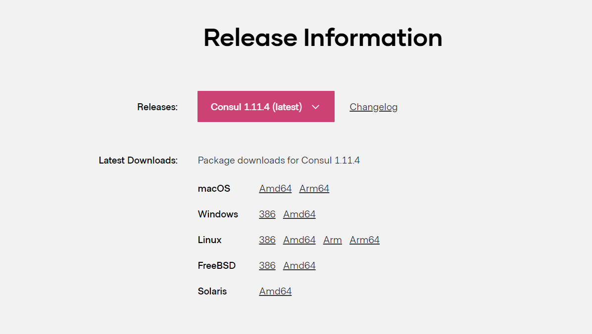

# Consul

# 第一章  什么是Consul

## 1.1 简单介绍

Consul 是一套开源的**分布式服务发现和配置管理系统**，由 HashiCorp 公司用 **Go 语言**开发。

提供了**微服务系统中的服务治理、配置中心、控制总线**等功能。

这些功能中的每一个都可以根据需要单独使用，也可以一起使用以构建全方位的服务网格，

总之Consul提供了一种完整的服务网格解决方案。


## 1.2 下载Consul

下载地址：https://www.consul.io/downloads




里面就一个exe文件


启动consul的方法：

再该目录下进入命令行窗口输入：

```
consul agent -dev
```


查看是否安装成功consul

```
consul --version
```


## 1.3 启动Consul

consul的命令窗口不关闭，consul的注册中心服务端就不会关闭

通过这个网址访问：http://localhost:8500


# 第二章 服务提供者

Consul.exe文件启动后，Consul这个注册中心就一直启动着


再普通的项目模块的基础上，加一下几个步骤


## pom的依赖

```xml
<!--SpringCloud consul-server -->
        <dependency>
            <groupId>org.springframework.cloud</groupId>
            <artifactId>spring-cloud-starter-consul-discovery</artifactId>
        </dependency>

```


## 主启动类

启动类要加上**@EnableDiscoveryClient**

该注解用于向使用consul或者zookeeper作为注册中心时注册服务

```java
package com.atguigu.springcloud;

import org.springframework.boot.SpringApplication;
import org.springframework.boot.autoconfigure.SpringBootApplication;
import org.springframework.cloud.client.discovery.EnableDiscoveryClient;

/**
 * @auther zzyy
 * @create 2020-01-31 12:00
 */
@SpringBootApplication
@EnableDiscoveryClient
public class PaymentMain8006
{
    public static void main(String[] args)
    {
        SpringApplication.run(PaymentMain8006.class,args);
    }
}
 
 

```


## yml文件

```yaml
###consul服务端口号
server:
  port: 8006

spring:
  application:
    name: consul-provider-payment
  ####consul注册中心地址
  cloud:
    consul:
      host: localhost
      port: 8500
      discovery:
        #hostname: 127.0.0.1
        service-name: ${spring.application.name}

```


业务方法就正常写就好


# 第三章 服务消费者

消费者也不需要太大修改，只需要改pom，主启动类，yml文件

其他和正常项目的步骤相同


## pom的依赖

```xml
<!--SpringCloud consul-server -->
        <dependency>
            <groupId>org.springframework.cloud</groupId>
            <artifactId>spring-cloud-starter-consul-discovery</artifactId>
        </dependency>

```

## 主启动类

```java
package com.atguigu.springcloud;

import org.springframework.boot.SpringApplication;
import org.springframework.boot.autoconfigure.SpringBootApplication;
import org.springframework.cloud.client.discovery.EnableDiscoveryClient;

@SpringBootApplication
@EnableDiscoveryClient//该注解用于向使用consul或者zookeeper作为注册中心时注册服务
public class OrderConsulMain80 {
    public static void main(String[] args) {
        SpringApplication.run(OrderConsulMain80.class,args);
    }
}

```


## yml文件

```yaml
###consul服务端口号
server:
  port: 80

spring:
  application:
    name: cloud-consumer-order
  ####consul注册中心地址
  cloud:
    consul:
      host: localhost
      port: 8500
      discovery:
        #hostname: 127.0.0.1
        service-name: ${spring.application.name}

```


配置类和业务类照旧就可


# 第四章 Zookeeper

Zookeeper的使用方法和Consul雷同，可看脑图，这里不做赘述


# 其他问题

## @EnableDiscoveryClient  与EnableEurekaClient的区别

从Spring Cloud Edgware开始，@EnableDiscoveryClient 或@EnableEurekaClient 可省略。只需加上相关依赖，并进行相应配置，即可将微服务注册到服务发现组件上。

@EnableDiscoveryClient和@EnableEurekaClient共同点就是：都是能够让注册中心能够发现，扫描到改服务。

不同点：@EnableEurekaClient只适用于Eureka作为注册中心，@EnableDiscoveryClient 可以是其他注册中心。
