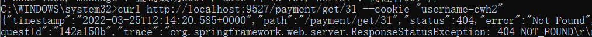
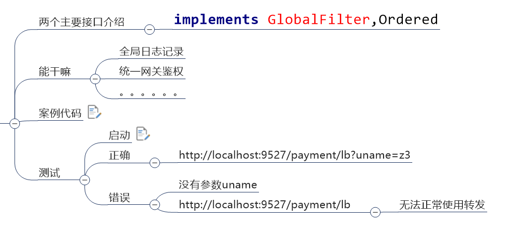
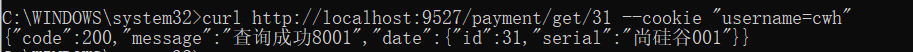
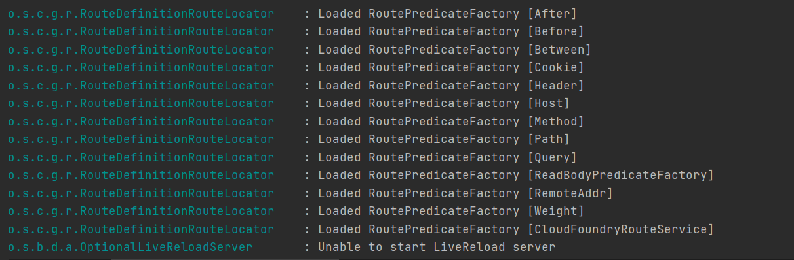

# Gateway

# GateWay简介

## 是什么？

>**SpringCloud Gateway** 是 Spring Cloud 的一个全新项目，基于 Spring 5.0+Spring Boot 2.0 和 Project Reactor 等技术开发的网关，**它旨在为微服务架构提供一种简单有效的统一的 API 路由管理方式。**
>
>**SpringCloud Gateway** 作为 Spring Cloud 生态系统中的网关，目标是替代 Zuul，在Spring Cloud 2.0以上版本中，没有对新版本的Zuul 2.0以上最新高性能版本进行集成仍然还是使用的Zuul 1.x非Reactor模式的老版本。
>
>而为了提升网关的性能，**SpringCloud Gateway是基于WebFlux框架实现的，而WebFlux框架底层则使用了高性能的Reactor模式通信框架Netty。**

## 能干嘛？

>反向代理
>
>鉴权
>
>流量控制
>
>熔断
>
>日志监控
>
>。。。。

## 微服务架构中网关的位置


# 三大核心概念

## Route（路由）

>路由是构建网关的基本模块，它由**ID，目标URI**，**一系列的断言和过滤器**组成，
>
>如果断言为true则匹配该路由

## Predicate（断言）

>参考的是Java8的java.util.function.Predicate
>
>开发人员可以**匹配HTTP请求中的所有内容(例如请求头或请求参数)，如果请求与断言相匹配则进行路由**

## Filter（过滤）

>指的是Spring框架中GatewayFilter的实例，使用过滤器，**可以在请求被路由前或者之后对请求进行修改。**

## 总结

>web请求，通过一些匹配条件，定义到真正的服务节点。并在这个转发的前后，进行一些精细化控制。
>
>Predicate：就是匹配条件
>
>Filter：就是我们进行精细化控制的方法


# GateWay工作流程

## 官网总结


>客户端向 Spring Cloud Gateway 发出请求。然后在 Gateway Handler Mapping 中找到与请求相匹配的路由，将其发送到 Gateway Web Handler。
>
>Handler 再通过指定的过滤器链来将请求发送到我们实际的服务执行业务逻辑，然后返回。
>过滤器之间用虚线分开是因为过滤器可能会在发送代理请求之前（“pre”）或之后（“post”）执行业务逻辑。
>
>Filter在“pre”类型的过滤器可以做参数校验、权限校验、流量监控、日志输出、协议转换等，
>在“post”类型的过滤器中可以做响应内容、响应头的修改，日志的输出，流量监控等有着非常重要的作用。


**核心：路由转发+执行过滤器链**


# 入门配置

Gateway网关有两种配置方法这里只写yml配置，还有一个手动配置可以查阅资料或者脑图

## pom文件 

```xml
<?xml version="1.0" encoding="UTF-8"?>
<project xmlns="http://maven.apache.org/POM/4.0.0"
         xmlns:xsi="http://www.w3.org/2001/XMLSchema-instance"
         xsi:schemaLocation="http://maven.apache.org/POM/4.0.0 http://maven.apache.org/xsd/maven-4.0.0.xsd">
    <parent>
        <artifactId>Cloud2020</artifactId>
        <groupId>org.example</groupId>
        <version>1.0-SNAPSHOT</version>
    </parent>
    <modelVersion>4.0.0</modelVersion>

    <artifactId>cloud-gateway-gateway9527</artifactId>

    <properties>
        <maven.compiler.source>8</maven.compiler.source>
        <maven.compiler.target>8</maven.compiler.target>
    </properties>

    <dependencies>
        <!--gateway-->
        <dependency>
            <groupId>org.springframework.cloud</groupId>
            <artifactId>spring-cloud-starter-gateway</artifactId>
        </dependency>
        <!--eureka-client-->
        <dependency>
            <groupId>org.springframework.cloud</groupId>
            <artifactId>spring-cloud-starter-netflix-eureka-client</artifactId>
        </dependency>
        <!-- 引入自己定义的api通用包，可以使用Payment支付Entity -->
        <dependency>
            <groupId>org.example</groupId>
            <artifactId>cloud-api-commons</artifactId>
            <version>1.0-SNAPSHOT</version>
        </dependency>
        <!--一般基础配置类-->
        <dependency>
            <groupId>org.springframework.boot</groupId>
            <artifactId>spring-boot-devtools</artifactId>
            <scope>runtime</scope>
            <optional>true</optional>
        </dependency>
        <dependency>
            <groupId>org.projectlombok</groupId>
            <artifactId>lombok</artifactId>
            <optional>true</optional>
        </dependency>
        <dependency>
            <groupId>org.springframework.boot</groupId>
            <artifactId>spring-boot-starter-test</artifactId>
            <scope>test</scope>
        </dependency>
    </dependencies>


</project>
```

## yml文件

```yaml
server:
  port: 9527

spring:
  application:
    name: cloud-gateway

eureka:
  instance:
    hostname: cloud-gateway-service
  client: #服务提供者provider注册进eureka服务列表内
    service-url:
      register-with-eureka: true
      fetch-registry: true
      defaultZone: http://eureka7001.com:7001/eureka
 
 
 

```

## 主启动类

```java
package com.atguigu.springcloud;

import org.springframework.boot.SpringApplication;
import org.springframework.boot.autoconfigure.SpringBootApplication;
import org.springframework.cloud.netflix.eureka.EnableEurekaClient;

@SpringBootApplication
@EnableEurekaClient
public class GateWayMain9527 {
    public static void main(String[] args) {
        SpringApplication.run(GateWayMain9527.class,args);
    }
}
```

## 无业务类

## 新增yml

```yaml
 server:
  port: 9527

spring:
  application:
    name: cloud-gateway
  cloud:
    gateway:
      routes:
        - id: payment_routh #payment_route    #路由的ID，没有固定规则但要求唯一，建议配合服务名
          uri: http://localhost:8001          #匹配后提供服务的路由地址
          predicates:
            - Path=/payment/get/**         # 断言，路径相匹配的进行路由

        - id: payment_routh2 #payment_route    #路由的ID，没有固定规则但要求唯一，建议配合服务名
          uri: http://localhost:8001          #匹配后提供服务的路由地址
          predicates:
            - Path=/payment/lb/**         # 断言，路径相匹配的进行路由

eureka:
  instance:
    hostname: cloud-gateway-service
  client: #服务提供者provider注册进eureka服务列表内
    service-url:
      register-with-eureka: true
      fetch-registry: true
      defaultZone: http://eureka7001.com:7001/eureka
 

```

## 测试

启动7001

启动8001

启动9527

访问：http://localhost:8001/payment/get/31

访问：http://localhost:9527/payment/get/31

# 通过微服务名实现动态访问

为了保证路由网关的性能，在新加入一个服务器也能马上调用，不需要再去加多余的配置，这里应该实现**`动态访问`**

开启后，默认情况下GateWay会根据注册中心的服务列表，以注册中心上的服务名为路径转发，进而实现动态访问      


```yaml
server:
  port: 9527

spring:
  application:
    name: cloud-gateway
  cloud:
    gateway:
      discovery:
        locator:
          enabled: true #开启从注册中心动态创建路由的功能，利用微服务名进行路由
      routes:
        - id: payment_routh #payment_route    #路由的ID，没有固定规则但要求唯一，建议配合服务名
          # uri: http://localhost:8001          #匹配后提供服务的路由地址
          uri: lb://cloud-payment-service #匹配后提供服务的路由地址
          predicates:
            - Path=/payment/get/**         # 断言，路径相匹配的进行路由

        - id: payment_routh2 #payment_route    #路由的ID，没有固定规则但要求唯一，建议配合服务名
          # uri: http://localhost:8001          #匹配后提供服务的路由地址
          uri: lb://cloud-payment-service #匹配后提供服务的路由地址
          predicates:
            - Path=/payment/lb/**         # 断言，路径相匹配的进行路由

eureka:
  instance:
    hostname: cloud-gateway-service
  client: #服务提供者provider注册进eureka服务列表内
    service-url:
      register-with-eureka: true
      fetch-registry: true
      defaultZone: http://eureka7001.com:7001/eureka
 
 

```

需要注意的是uri的协议为lb，表示启用Gateway的负载均衡功能。

lb://serviceName是spring cloud gateway在微服务中自动为我们创建的负载均衡uri


**测试：**

http://localhost:9527/payment/lb

8001  /  8002两个端口来回切换


# Predicate的使用

## 时间相关配置

After：在指定时间之**后**进行路由

Before：在指定时间之**前**进行路由

Between：在指定时间之**间**进行路由

**yml文件**

```yml
predicates:
    - Path=/payment/lb/**
    #- After=2020-04-25T16:30:58.215+08:00[Asia/Shanghai]
    #- Before=2020-04-25T16:40:58.215+08:00[Asia/Shanghai]
    - Between=2020-04-25T16:35:58.215+08:00[Asia/Shanghai],2020-04-25T16:40:58.215+08:00[Asia/Shanghai]
```

上述配置的时间格式可以通过以下代码得到

**java**

```java
@Test
public void test(){
    ZonedDateTime now = ZonedDateTime.now();
    System.out.println(now);
}
```


## 请求相关配置

**Cookie**

配置说明：【Cookie=cookie名, cookie值的正则表达式规则】

**yml**

```yml
predicates:
  - Path=/payment/lb/**
  - Cookie=id, [0-9]
```

使用 curl 工具模拟携带 cookie 发送请求




**Header**

配置说明：【Header=header名, header值的正则表达式规则】

**yml**

```yml
predicates:
  - Path=/payment/lb/**
  - Header=h, [a-h]
```


**Host**

配置说明：【Host=主机名（可配置多个，也可以使用通配符）】

**yml**

```yml
predicates:
  - Path=/payment/lb/**
  - Host=**.a.com,**.b.cn
```


**Method**

配置说明：【Method=请求类型】

**yml**

```yml
predicates:
  - Path=/payment/lb/**
  - Method=GET
```


**Path**

配置说明：【Path=请求路径】

**yml**

```yml
predicates:
  - Path=/payment/lb/**
```


**Query**

配置说明：【Query=参数名，参数值】

**yml**

```yml
predicates:
  - Path=/payment/lb/**
  - Query=name, zhangsan
```

**详见：[官网](https://cloud.spring.io/spring-cloud-static/spring-cloud-gateway/2.2.2.RELEASE/reference/html/#gateway-request-predicates-factories)**


# Filter的使用

>路由过滤器可用于修改进入的HTTP请求和返回的HTTP响应，路由过滤器只能指定路由进行使用。
>
>Spring Cloud Gateway 内置了多种路由过滤器，他们都由GatewayFilter的工厂类来产生


- 生命周期：pre、post
- 种类：GatewayFilter、GlobalFilter

官网：

https://cloud.spring.io/spring-cloud-static/spring-cloud-gateway/2.2.1.RELEASE/reference/html/#the-addrequestparameter-gatewayfilter-factory


这两个种类有十几种之多


## 常用的GatewayFilter

这里用AddRequestParameter举个例子

加一个名为“X-Request-Id”的请求参数

yml文件

```yaml
 
server:
  port: 9588

spring:
  application:
    name: cloud-gateway
  cloud:
    gateway:
      discovery:
        locator:
          enabled: true #开启从注册中心动态创建路由的功能
          lower-case-service-id: true #使用小写服务名，默认是大写
      routes:
        - id: payment_routh #payment_route #路由的ID，没有固定规则但要求唯一，建议配合服务名
          uri: lb://cloud-provider-payment #匹配后的目标服务地址，供服务的路由地址
          #uri: http://localhost:8001 #匹配后提供服务的路由地址
          filters:
            - AddRequestParameter=X-Request-Id,1024 #过滤器工厂会在匹配的请求头加上一对请求头，名称为X-Request-Id值为1024
          predicates:
            - Path=/paymentInfo/**        # 断言，路径相匹配的进行路由
            - Method=GET,POST

eureka:
  instance:
    hostname: cloud-gateway-service
  client: #服务提供者provider注册进eureka服务列表内
    service-url:
      register-with-eureka: true
      fetch-registry: true
      defaultZone: http://eureka7001.com:7001/eureka
 
 
 

```


## 自定义过滤器

## 两个主要接口

>implements GlobalFilter,Ordered

## 能干嘛

- 全局日志记录
- 统一网关鉴权
- 。。。。。

## 案例

```java
@Component
@Slf4j
public class MyGlobalFilter implements GlobalFilter, Ordered {
    @Override
    public Mono<Void> filter(ServerWebExchange exchange, GatewayFilterChain chain) {
        String username = exchange.getRequest().getQueryParams().getFirst("username");
        //用户名为空时，给出错误响应
        if (username == null) {
            log.info("用户名为空，非法登录");
            exchange.getResponse().setStatusCode(HttpStatus.NOT_ACCEPTABLE);
            return exchange.getResponse().setComplete();
        }
        return chain.filter(exchange);
    }

    @Override
    public int getOrder() {
        return 0;
    }
}
```





># 宝宝，这个主题太好看了
>
># 已经满足了老夫的少女心啊！！！
>
>







H.png

