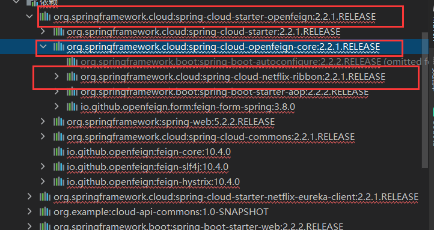
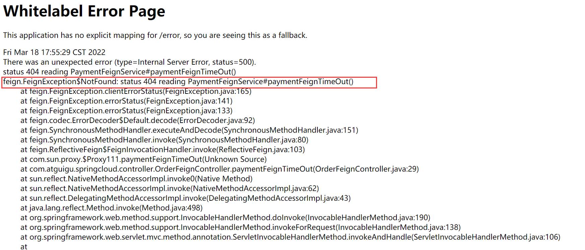
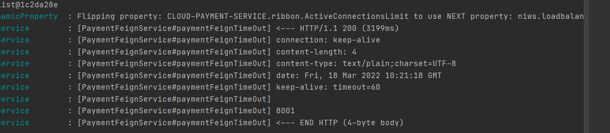

# OpenFeign

# 第一章 OpenFeign简介

## 1.1 什么是OpenFeign

OpenFeign是一个**声明式的Web服务客户端**，让编写Web服务客户端变得非常容易，**只需创建一个接口并在接口上添加注解即可**


## 1.2 OpenFeign的作用

前面在使用**Ribbon+RestTemplate**时，利用RestTemplate对http请求的**封装处理，形成了一套模版化的调用方法。**

但是实际开发中一个接口不可能只被调用一次，所以通常会令每个客户端包装这些依赖服务的调用。

Feign在此基础上做了进一步封装，由他来帮助我们定义和实现依赖服务接口的定义。

在Feign的实现下，我们只需**使用接口+注解的方式**，就能完成对**提供者服务端接口的绑定**，更加优雅的实现服务调用


**OpenFeign集成了Ribbon**


**最重要的作用：**

OpenFeign是Spring Cloud 在Feign的基础上**支持了SpringMVC的注解**，如**@RequesMapping等等**。

OpenFeign的**@FeignClient可以解析SpringMVC的@RequestMapping注解下的接口**，**并通过动态代理的方式产生实现类**，

**实现类中做负载均衡并调用其他服务**。

# 第二章 OpenFeign使用步骤

简单来说就是：接口+注解


## 2.1 使用步骤

### 新建消费者模块

### 写pom文件

其实就是加了下面这个依赖

> <!--openfeign-->
>        <dependency>
>            <groupId>org.springframework.cloud</groupId>
>            <artifactId>spring-cloud-starter-openfeign</artifactId>
>        </dependency>


```xml
<?xml version="1.0" encoding="UTF-8"?>
<project xmlns="http://maven.apache.org/POM/4.0.0"
         xmlns:xsi="http://www.w3.org/2001/XMLSchema-instance"
         xsi:schemaLocation="http://maven.apache.org/POM/4.0.0 http://maven.apache.org/xsd/maven-4.0.0.xsd">
    <parent>
        <artifactId>Cloud2020</artifactId>
        <groupId>org.example</groupId>
        <version>1.0-SNAPSHOT</version>
    </parent>
    <modelVersion>4.0.0</modelVersion>

    <artifactId>cloud-consumer-feign-order80</artifactId>

    <properties>
        <maven.compiler.source>8</maven.compiler.source>
        <maven.compiler.target>8</maven.compiler.target>
    </properties>
    <dependencies>
        <!--openfeign-->
        <dependency>
            <groupId>org.springframework.cloud</groupId>
            <artifactId>spring-cloud-starter-openfeign</artifactId>
        </dependency>
        <!--eureka client-->
        <dependency>
            <groupId>org.springframework.cloud</groupId>
            <artifactId>spring-cloud-starter-netflix-eureka-client</artifactId>
        </dependency>
        <!-- 引入自己定义的api通用包，可以使用Payment支付Entity -->
        <!--        配置外置的项目组-->
        <dependency>
            <groupId>org.example</groupId>
            <artifactId>cloud-api-commons</artifactId>
            <version>1.0-SNAPSHOT</version>
        </dependency>
        <!--web-->
        <dependency>
            <groupId>org.springframework.boot</groupId>
            <artifactId>spring-boot-starter-web</artifactId>
        </dependency>
        <dependency>
            <groupId>org.springframework.boot</groupId>
            <artifactId>spring-boot-starter-actuator</artifactId>
        </dependency>
        <!--一般基础通用配置-->
        <dependency>
            <groupId>org.springframework.boot</groupId>
            <artifactId>spring-boot-devtools</artifactId>
            <scope>runtime</scope>
            <optional>true</optional>
        </dependency>
        <dependency>
            <groupId>org.projectlombok</groupId>
            <artifactId>lombok</artifactId>
            <optional>true</optional>
        </dependency>
        <dependency>
            <groupId>org.springframework.boot</groupId>
            <artifactId>spring-boot-starter-test</artifactId>
            <scope>test</scope>
        </dependency>
    </dependencies>


</project>
```

### 写yml文件

无需改变什么

```yaml
server:
  port: 80

eureka:
  client:
    register-with-eureka: false
    service-url:
      defaultZone: http://eureka7001.com:7001/eureka/,http://eureka7002.com:7002/eureka/
```

### 主启动类

要在方法上加一个激活@FeignClients的注解**@EnableFeignClients**

```java
package com.atguigu.springcloud;

import org.springframework.boot.SpringApplication;
import org.springframework.boot.autoconfigure.SpringBootApplication;
import org.springframework.cloud.netflix.eureka.EnableEurekaClient;
import org.springframework.cloud.openfeign.EnableFeignClients;

@SpringBootApplication
@EnableFeignClients   //激活@FeignClients
@EnableEurekaClient
public class OrderFeignMain80 {
    public static void main(String[] args) {
        SpringApplication.run(OrderFeignMain80.class,args);
    }
}
```

### 业务类

>***`Feign远程调用时，@PathVariable 注解中的value属性不能省略`***
>
>**如果没有指定,参数无法自动绑定**

业务逻辑接口

需要注意一些细节，直接看内部代码

```java
package com.atguigu.springcloud.service;

import com.atguigu.springcloud.entites.CommonResult;
import com.atguigu.springcloud.entites.Payment;
import org.springframework.cloud.openfeign.FeignClient;
import org.springframework.stereotype.Component;
import org.springframework.web.bind.annotation.GetMapping;
import org.springframework.web.bind.annotation.PathVariable;

@Component   //让该消费者的业务类被发现
@FeignClient("CLOUD-PAYMENT-SERVICE") //这个是微服务的名称（该微服务的下方可能还有很多个实例）
public interface PaymentFeignService {

    //可以使用SpringMVC的注解
    //这个是对应的（提供者）微服务 提供的controller类下面的方法。
    //这里将该微服务提供的类接口化
    @GetMapping(value = "/payment/get/{id}")  
    public CommonResult<Payment> getPaymentById(@PathVariable("id") Long id);
}
```


### Controller类

这里就正常写

```java
package com.atguigu.springcloud.controller;

import com.atguigu.springcloud.entites.CommonResult;
import com.atguigu.springcloud.entites.Payment;
import com.atguigu.springcloud.service.PaymentFeignService;
import org.springframework.beans.factory.annotation.Autowired;
import org.springframework.stereotype.Controller;
import org.springframework.web.bind.annotation.GetMapping;
import org.springframework.web.bind.annotation.PathVariable;
import org.springframework.web.bind.annotation.ResponseBody;

import javax.annotation.Resource;

@Controller
public class OrderFeignController {
    @Autowired
//    @Resource
    PaymentFeignService service;

    @ResponseBody
    @GetMapping("/consumer/payment/get/{id}")
    public CommonResult<Payment> getPaymentById(@PathVariable("id") Long id){
        return service.getPaymentById(id);
    }

}
```


## 2.2 测试

先启动2个eureka集群7001/7002

再启动2个微服务8001/8002

启动OpenFeign启动

http://localhost/consumer/payment/get/31


## 2.3 Feign自带负载均衡配置项




# 第三章 OpenFeign超时控制

## 3.1 故意设置超时设置

我们在提供者设置让一个线程睡眠3s，模拟业务繁忙

```java
@GetMapping("/payment/feign/timeout")
    public String paymentFeignTimeOut(){
        Thread thread = Thread.currentThread();
        try {
            thread.sleep(3000);
        } catch (InterruptedException e) {
            e.printStackTrace();
        }
        return port;

    }
```

然后消费者这端调用该方法

```java
//业务类
@GetMapping("/payment/feign/timeout")
    public String paymentFeignTimeOut();
    
    
//controller类
@ResponseBody
    @GetMapping("/consumer/payment/feign/timeout")
    public String paymentFeignTimeOut(){
        return service.paymentFeignTimeOut();
    }
```

得到超时报错




**超时原因：**

默认Feign客户端只等待一秒钟，但是服务端处理需要超过1秒钟，导致Feign客户端不想等待了，直接返回报错。

为了避免这样的情况，有时候我们需要设置Feign客户端的超时控制。


## 3.2 解决超时问题

在yml文件中添加Ribbon配置

```yaml
server:
  port: 80

eureka:
  client:
    register-with-eureka: false
    service-url:
      defaultZone: http://eureka7001.com:7001/eureka/,http://eureka7002.com:7002/eureka/

#设置feign客户端超时时间(OpenFeign默认支持ribbon)
ribbon:
#指的是建立连接所用的时间，适用于网络状况正常的情况下,两端连接所用的时间
  ReadTimeout: 5000
#指的是建立连接后从服务器读取到可用资源所用的时间
  ConnectTimeout: 5000
```


# 第四章 OpenFeign日志打印功能

## 4.1 日志打印功能有什么用

Feign 提供了日志打印功能，我们可以通过配置来调整日志级别，从而了解 Feign 中 Http 请求的细节。

说白了就是对Feign接口的调用情况进行监控和输出


## 4.2 日志级别


NONE：默认的，不显示任何日志；

BASIC：仅记录请求方法、URL、响应状态码及执行时间；

HEADERS：除了 BASIC 中定义的信息之外，还有请求和响应的头信息；

FULL：除了 HEADERS 中定义的信息之外，还有请求和响应的正文及元数据。


## 4.3 配置日志Bean

```java
 
package com.atguigu.springcloud.cfgbeans;

import org.springframework.context.annotation.Bean;
import org.springframework.context.annotation.Configuration;
import feign.Logger;

/**
 * @auther zzyy
 * @create 2019-11-10 17:00
 */
@Configuration
public class FeignConfig
{
    @Bean
    Logger.Level feignLoggerLevel()
    {
        return Logger.Level.FULL;
    }
}
```


## 4.3 yml文件加配置

```yaml
server:
  port: 80

eureka:
  client:
    register-with-eureka: false
    service-url:
      defaultZone: http://eureka7001.com:7001/eureka/,http://eureka7002.com:7002/eureka/

#设置feign客户端超时时间
#springCloud默认开启支持ribbon
ribbon:
#指的是建立连接所用的时间，适用于网络状况正常的情况下,两端连接所用的时间
  ReadTimeout: 5000
#指的是建立连接后从服务器读取到可用资源所用的时间
  ConnectTimeout: 5000

logging:
  level:
    # feign日志以什么级别监控哪个接口
    com.atguigu.springcloud.service.PaymentFeignService: debug
 
```

启动8001就可以了，以下就是日志文件打印出的信息！！




# 问题

为什么用了@EnableOpenFeign就无法将该微服务注册进Eureka注册中心？

