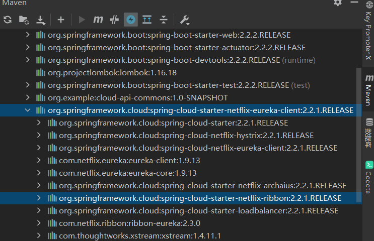
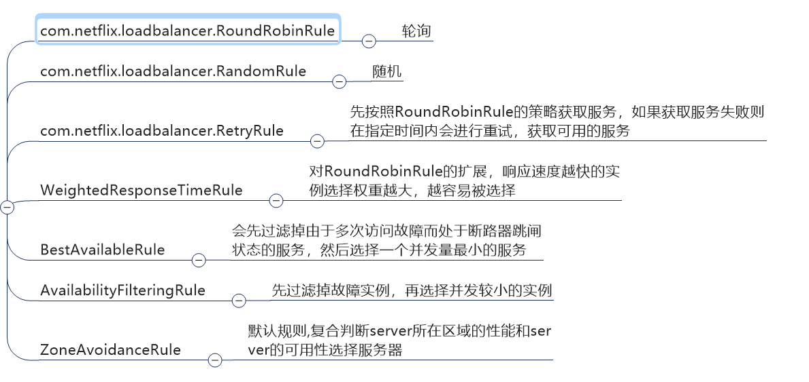
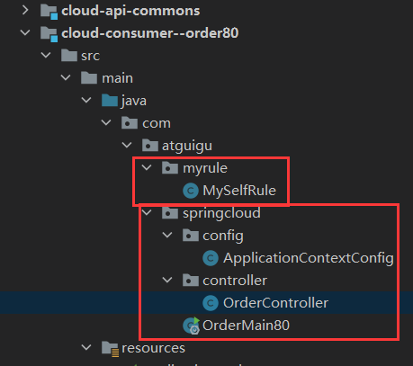

# Ribbon

# 第一章 Ribbon简介

## Ribbon简介

Ribbon是实现了一套客户端  的软件负载均衡算法和服务调用的工具


Ribbon其实就是一个**软负载均衡**的客户端组件，

他可以和其他所需请求的客户端结合使用，和eureka结合只是其中的一个实例。


## Ribbon的作用

**负载均衡+RestTemplate调用**


## 负载均衡（LB）

简单的说就是将用户的请求平摊到多个服务上，从而达到系统高可用（HA）的目的。

常见的负载均很有：硬件，Ribbon，Nginx


### 集中式LB（Nginx）

>即在服务的消费方和提供方之间使用独立的LB设施(可以是硬件，如F5, 也可以是软件，如**Nginx**), 
>
>由该设施负责把访问请求通过某种策略转发至服务的提供方；


### 进程内LB（Ribbon）

>将LB逻辑集成到消费方，消费方从服务注册中心获知有哪些地址可用，然后自己再从这些地址中选择出一个合适的服务器。
>
>**Ribbon**就属于进程内LB，它只是一个类库，集成于消费方进程，消费方通过它来获取到服务提供方的地址。


# 第二章 Ribbon负载均衡演示

## Ribbon的工作原理

Ribbon在工作时分成两步

- 第一步先选择 **EurekaServer** ,它优先选择在**同一个区域内负载较少的server.**

- 第二步再根据用户指定的**策略**，在从server取到的服务注册列表中选择一个地址。

  其中Ribbon提供了多种策略：比如轮询、随机和根据响应时间加权。


## Ribbon不需要引入依赖的原因

RIbbon的依赖已经被纳入了Eureka的依赖中了，所以使用Eureka不需要再映入Ribbon

Eureka也可以有负载均衡的能力。




## 构建Ribbon项目

### pom文件

因为Eureka依赖自动纳入了RIbbon依赖所以无需引入

```xml
<?xml version="1.0" encoding="UTF-8"?>
<project xmlns="http://maven.apache.org/POM/4.0.0"
         xmlns:xsi="http://www.w3.org/2001/XMLSchema-instance"
         xsi:schemaLocation="http://maven.apache.org/POM/4.0.0 http://maven.apache.org/xsd/maven-4.0.0.xsd">
    <parent>
        <artifactId>Cloud2020</artifactId>
        <groupId>org.example</groupId>
        <version>1.0-SNAPSHOT</version>
    </parent>
    <modelVersion>4.0.0</modelVersion>

    <artifactId>cloud-consumer--order80</artifactId>

    <dependencies>
        <dependency>
            <groupId>org.springframework.boot</groupId>
            <artifactId>spring-boot-starter-web</artifactId>
        </dependency>
        <dependency>
            <groupId>org.springframework.boot</groupId>
            <artifactId>spring-boot-starter-actuator</artifactId>
        </dependency>
        <dependency>
            <groupId>org.springframework.boot</groupId>
            <artifactId>spring-boot-devtools</artifactId>
            <scope>runtime</scope>
            <optional>true</optional>
        </dependency>
        <dependency>
            <groupId>org.projectlombok</groupId>
            <artifactId>lombok</artifactId>
            <optional>true</optional>
        </dependency>
        <dependency>
            <groupId>org.springframework.boot</groupId>
            <artifactId>spring-boot-starter-test</artifactId>
            <scope>test</scope>
        </dependency>
<!--        配置外置的项目组-->
        <dependency>
            <groupId>org.example</groupId>
            <artifactId>cloud-api-commons</artifactId>
            <version>1.0-SNAPSHOT</version>
        </dependency>
<!--        eureka消费端-->
        <dependency>
            <groupId>org.springframework.cloud</groupId>
            <artifactId>spring-cloud-starter-netflix-eureka-client</artifactId>
        </dependency>

    </dependencies>
</project>
```

### 启动类

```java
package com.atguigu.springcloud;

import com.atguigu.myrule.MySelfRule;
import org.springframework.boot.SpringApplication;
import org.springframework.boot.autoconfigure.SpringBootApplication;
import org.springframework.cloud.netflix.eureka.EnableEurekaClient;
import org.springframework.cloud.netflix.ribbon.RibbonClient;

@EnableEurekaClient
@SpringBootApplication
public class OrderMain80 {
    public static void main(String[] args) {
        SpringApplication.run(OrderMain80.class);
    }
}

```

### yml文件

```yaml
server:
  port: 80
spring:
  application:
    name: cloud-order-service
eureka:
  client:
    register-with-eureka: true
    fetch-registry: true
    service-url:   #其实这就是个Eureka Server的地址而已
      defaultZone: http://eureka7001.com:7001/eureka,http://eureka7002.com:7002/eureka  # 集群版，向多个注册中心注册
```

### 应用层

#### 配置类

加入了@LoadBalanced就是默认以“轮询”算法的方式访问服务

```java
package com.atguigu.springcloud.config;

import org.springframework.cloud.client.loadbalancer.LoadBalanced;
import org.springframework.context.annotation.Bean;
import org.springframework.context.annotation.Configuration;
import org.springframework.web.client.RestTemplate;

@Configuration
public class ApplicationContextConfig {

    @Bean
    @LoadBalanced   //使用该注解可以赋予RestTemplate负载均衡的能力
    public RestTemplate getRestTemplate(){
        return new RestTemplate();

    }
}

```

#### Controller

```java
package com.atguigu.springcloud.controller;

import com.atguigu.springcloud.entites.CommonResult;
import com.atguigu.springcloud.entites.Payment;
import org.springframework.cloud.client.ServiceInstance;
import org.springframework.cloud.client.discovery.DiscoveryClient;
import lombok.extern.slf4j.Slf4j;
import org.springframework.beans.factory.annotation.Autowired;
import org.springframework.web.bind.annotation.*;
import org.springframework.web.client.RestTemplate;

import java.util.List;

@Slf4j
@RestController
public class OrderController {

    public static final String url="http://CLOUD-PAYMENT-SERVICE";

    @Autowired
    private DiscoveryClient discoveryClient;

    @Autowired
    private RestTemplate restTemplate;

    @PostMapping("/consumer/payment/create")
    public CommonResult<Payment> create(@RequestBody Payment payment){
        return restTemplate.postForObject(url+"/payment/create",payment,CommonResult.class);
    }
    @GetMapping("/consumer/payment/get/{id}")
    public CommonResult<Payment> getPayment(@PathVariable("id") Long id){
        return restTemplate.getForObject(url+"/payment/get/"+id,CommonResult.class);
    }

    @RequestMapping("/discovery/test")
    public Object discovery(){
        List<String> services = discoveryClient.getServices();
        for(String tmp:services){
            log.info(tmp);
        }
        List<ServiceInstance> instances = discoveryClient.getInstances("CLOUD-PAYMENT-SERVICE");
        for(ServiceInstance instance:instances){
            log.info("host:"+instance.getHost()+"\turi"+instance.getUri()+"\tport:"+instance.getPort());
        }
        return this.discoveryClient;
    }

}
```


# 第三章 Ribbon的核心组件

## IRule

IRule：根据特定算法中从服务列表中选取一个要访问的服务


## 负载均衡的算法




## 替换默认的负载均衡算法

#### 官方提醒

这个自定义配置类不能放在@ComponentScan所扫描的当前包下以及子包下，

否则我们自定义的这个配置类就会被所有的Ribbon客户端所共享，达不到特殊化定制的目的了。


实际上就是：设置一个定义负载均很算法的配置类，但是**这个配置类不能在主启动类的包和其子包下。**




## 修改算法的演示

### 定义算法配置类

（提醒另起一个包）

```java
package com.atguigu.myrule;

import com.netflix.loadbalancer.IRule;
import com.netflix.loadbalancer.RandomRule;
import org.springframework.context.annotation.Bean;
import org.springframework.context.annotation.Configuration;

@Configuration
public class MySelfRule {
    @Bean
    public IRule myRule(){
        return new RandomRule();
    }
}
```


### 主启动类添加@RibbonClient

```java
package com.atguigu.springcloud;

import com.atguigu.myrule.MySelfRule;
import org.springframework.boot.SpringApplication;
import org.springframework.boot.autoconfigure.SpringBootApplication;
import org.springframework.cloud.netflix.eureka.EnableEurekaClient;
import org.springframework.cloud.netflix.ribbon.RibbonClient;

@EnableEurekaClient
@SpringBootApplication
@RibbonClient(name = "CLOUD-PAYMENT-SERVICE",configuration = MySelfRule.class)
//@RibbonClient中name属性代表提供者的名称，configuration属性：运用的负载均衡的算法
public class OrderMain80 {
    public static void main(String[] args) {
        SpringApplication.run(OrderMain80.class);
    }
}
```


# 第四章 Ribbon VS Nginx

**Ribbon本地负载均衡和Nginx服务端负载均衡的区别**

Nginx是服务器负载均衡，客户端所有请求都会交给nginx，然后由nginx实现转发请求。即负载均衡是由服务端实现的。

 Ribbon本地负载均衡，在调用微服务接口时候，会在注册中心上获取注册信息服务列表之后缓存到JVM本地，从而在本地实现RPC远程服务调用技术。


