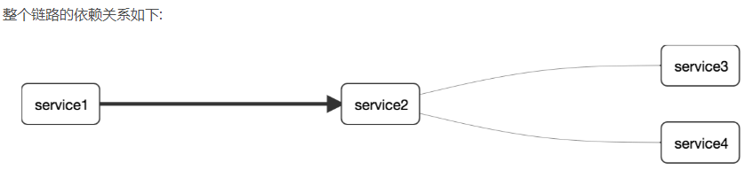

# SpringCloud Sleuth

# 概述

## 问题

>在微服务框架中，一个由客户端发起的请求在后端系统中会经过多个不同的的服务节点调用来协同产生最后的请求结果，
>
>每一个前段请求都会形成一条复杂的分布式服务调用链路，链路中的任何一环出现高延时或错误都会引起整个请求最后的失败。


## 什么是Sleuth？

SpringCloud Sleuth ：**`分布式请求链路跟踪`**

Spring Cloud Sleuth提供了一套完整的服务跟踪的解决方案

在分布式系统中提供追踪解决方案并且兼容支持了zipkin


## github地址

https://github.com/spring-cloud/spring-cloud-sleuth


# 搭建链路监控步骤

## 1.下载zipkin

SpringCloud从F版起已不需要自己构建Zipkin Server了，只需调用jar包即可

### 下载地址

https://dl.bintray.com/openzipkin/maven/io/zipkin/java/zipkin-server/（好像失效了）


### 运行zipkin


### 访问控制台

http://localhost:9411/zipkin/


### 关键术语


> 上图表示的是一请求链路
>
> 一条链路通过Trace Id唯一标识，Span标识发起的请求信息，各span通过parent id 关联起来
>
> 
>
> 


## 2.服务提供者

(对cloud-provider-payment8001进行修改)

### pom依赖

加入下面这个新的依赖

><!--包含了sleuth+zipkin 请求链路跟踪-->
>        <dependency>
>            <groupId>org.springframework.cloud</groupId>
>            <artifactId>spring-cloud-starter-zipkin</artifactId>
>        </dependency>


```xml
<?xml version="1.0" encoding="UTF-8"?>
<project xmlns="http://maven.apache.org/POM/4.0.0"
         xmlns:xsi="http://www.w3.org/2001/XMLSchema-instance"
         xsi:schemaLocation="http://maven.apache.org/POM/4.0.0 http://maven.apache.org/xsd/maven-4.0.0.xsd">
    <parent>
        <artifactId>Cloud2020</artifactId>
        <groupId>org.example</groupId>
        <version>1.0-SNAPSHOT</version>
    </parent>

    <modelVersion>4.0.0</modelVersion>

    <artifactId>cloud-provider-payment8001</artifactId>

    <dependencies>

        <!--包含了sleuth+zipkin 请求链路跟踪-->
        <dependency>
            <groupId>org.springframework.cloud</groupId>
            <artifactId>spring-cloud-starter-zipkin</artifactId>
        </dependency>

        <dependency>
            <groupId>org.springframework.boot</groupId>
            <artifactId>spring-boot-starter-web</artifactId>
        </dependency>
        <dependency>
            <groupId>org.springframework.boot</groupId>
            <artifactId>spring-boot-starter-actuator</artifactId>
        </dependency>
        <dependency>
            <groupId>org.mybatis.spring.boot</groupId>
            <artifactId>mybatis-spring-boot-starter</artifactId>
        </dependency>
        <dependency>
            <groupId>com.alibaba</groupId>
            <artifactId>druid-spring-boot-starter</artifactId>
            <version>1.1.10</version>
        </dependency>
        <!--mysql-connector-java-->
        <dependency>
            <groupId>mysql</groupId>
            <artifactId>mysql-connector-java</artifactId>
        </dependency>
        <!--jdbc-->
        <dependency>
            <groupId>org.springframework.boot</groupId>
            <artifactId>spring-boot-starter-jdbc</artifactId>
        </dependency>
        <dependency>
            <groupId>org.springframework.boot</groupId>
            <artifactId>spring-boot-devtools</artifactId>
            <scope>runtime</scope>
            <optional>true</optional>
        </dependency>
        <dependency>
            <groupId>org.projectlombok</groupId>
            <artifactId>lombok</artifactId>
            <optional>true</optional>
        </dependency>
        <dependency>
            <groupId>org.springframework.boot</groupId>
            <artifactId>spring-boot-starter-test</artifactId>
            <scope>test</scope>
        </dependency>
        <!--        配置外置的项目组-->
        <dependency>
            <groupId>org.example</groupId>
            <artifactId>cloud-api-commons</artifactId>
            <version>1.0-SNAPSHOT</version>
        </dependency>
        <!--eureka-client-->
        <dependency>
            <groupId>org.springframework.cloud</groupId>
            <artifactId>spring-cloud-starter-netflix-eureka-client</artifactId>
        </dependency>
    </dependencies>
</project>
```

### yml文件

进行下面的修改

>
>
>spring:
>  zipkin:
>    base-url: http://localhost:9411     #将数据传输给zipkin的url地址
>  sleuth:
>    sampler:
>      #采样率值介于 0 到 1 之间，1 则表示全部采集
>      probability: 1

```yaml
server:
  port: 8001

spring:
  zipkin:
    base-url: http://localhost:9411
  sleuth:
    sampler:
      #采样率值介于 0 到 1 之间，1 则表示全部采集
      probability: 1
  application:
    name: cloud-payment-service


  datasource:
    type: com.alibaba.druid.pool.DruidDataSource            # 当前数据源操作类型
    driver-class-name: com.mysql.cj.jdbc.Driver              # mysql驱动包 com.mysql.jdbc.Driver
    url: jdbc:mysql://localhost:3306/cloud2020?useUnicode=true&characterEncoding=UTF-8&serverTimezone=GMT%2B8
    username: root
    password: 123456789

eureka:
  client:
    #表示是否将自己注册进EurekaServer默认为true。
    register-with-eureka: true
    #是否从EurekaServer抓取已有的注册信息，默认为true。单节点无所谓，集群必须设置为true才能配合ribbon使用负载均衡
    fetchRegistry: true
    service-url:
#      defaultZone: http://localhost:7001/eureka        #单机版本
      defaultZone: http://eureka7001.com:7001/eureka  #,http://eureka7002.com:7002/eureka  # 集群版，向多个注册中心注册

#    instance:
#      #Eureka客户端向服务端发送心跳的时间间隔，单位为秒(默认是30秒)
#      lease-renewal-interval-in-seconds: 1
#      #Eureka服务端在收到最后一次心跳后等待时间上限，单位为秒(默认是90秒)，超时将剔除服务
#      lease-expiration-duration-in-seconds: 2


mybatis:
  mapperLocations: classpath:mapper/*.xml
  type-aliases-package: com.atguigu.springcloud.entites    # 所有Entity别名类所在包


```

### 主启动类

不需要改变，无需加任何依赖

### 业务类

也无需改变


## 3.服务消费者

### pom依赖

只需要额外增加此依赖

><!--包含了sleuth+zipkin 请求链路跟踪-->
>  <dependency>
>      <groupId>org.springframework.cloud</groupId>
>      <artifactId>spring-cloud-starter-zipkin</artifactId>
>  </dependency>

```xml
<?xml version="1.0" encoding="UTF-8"?>
<project xmlns="http://maven.apache.org/POM/4.0.0"
         xmlns:xsi="http://www.w3.org/2001/XMLSchema-instance"
         xsi:schemaLocation="http://maven.apache.org/POM/4.0.0 http://maven.apache.org/xsd/maven-4.0.0.xsd">
    <parent>
        <artifactId>Cloud2020</artifactId>
        <groupId>org.example</groupId>
        <version>1.0-SNAPSHOT</version>
    </parent>
    <modelVersion>4.0.0</modelVersion>

    <artifactId>cloud-consumer-feign-order80</artifactId>

    <properties>
        <maven.compiler.source>8</maven.compiler.source>
        <maven.compiler.target>8</maven.compiler.target>
    </properties>
    <dependencies>
        <!--包含了sleuth+zipkin 请求链路跟踪-->
        <dependency>
            <groupId>org.springframework.cloud</groupId>
            <artifactId>spring-cloud-starter-zipkin</artifactId>
        </dependency>

        <!--openfeign-->
        <dependency>
            <groupId>org.springframework.cloud</groupId>
            <artifactId>spring-cloud-starter-openfeign</artifactId>
        </dependency>
        <!--eureka client-->
        <dependency>
            <groupId>org.springframework.cloud</groupId>
            <artifactId>spring-cloud-starter-netflix-eureka-client</artifactId>
        </dependency>
        <!-- 引入自己定义的api通用包，可以使用Payment支付Entity -->
        <!--        配置外置的项目组-->
        <dependency>
            <groupId>org.example</groupId>
            <artifactId>cloud-api-commons</artifactId>
            <version>1.0-SNAPSHOT</version>
        </dependency>
        <!--web-->
        <dependency>
            <groupId>org.springframework.boot</groupId>
            <artifactId>spring-boot-starter-web</artifactId>
        </dependency>
        <dependency>
            <groupId>org.springframework.boot</groupId>
            <artifactId>spring-boot-starter-actuator</artifactId>
        </dependency>
        <!--一般基础通用配置-->
        <dependency>
            <groupId>org.springframework.boot</groupId>
            <artifactId>spring-boot-devtools</artifactId>
            <scope>runtime</scope>
            <optional>true</optional>
        </dependency>
        <dependency>
            <groupId>org.projectlombok</groupId>
            <artifactId>lombok</artifactId>
            <optional>true</optional>
        </dependency>
        <dependency>
            <groupId>org.springframework.boot</groupId>
            <artifactId>spring-boot-starter-test</artifactId>
            <scope>test</scope>
        </dependency>
    </dependencies>


</project>
```

### yml文件

进行下面的修改

>
>
>spring:
>  zipkin:
>    base-url: http://localhost:9411     #将数据传输给zipkin的url地址
>  sleuth:
>    sampler:
>      #采样率值介于 0 到 1 之间，1 则表示全部采集
>      probability: 1

```yaml
server:
  port: 80
spring:
  application:
    name: cloud-order-service
  zipkin:
    base-url: http://localhost:9411
  sleuth:
    sampler:
      probability: 1


eureka:
  client:
    register-with-eureka: true
    service-url:
      defaultZone: http://eureka7001.com:7001/eureka/ #,http://eureka7002.com:7002/eureka/

#设置feign客户端超时时间(OpenFeign默认支持ribbon)
ribbon:
  #指的是建立连接所用的时间，适用于网络状况正常的情况下,两端连接所用的时间
  ReadTimeout: 5000
  #指的是建立连接后从服务器读取到可用资源所用的时间
  ConnectTimeout: 5000

logging:
  level:
    # feign日志以什么级别监控哪个接口
    com.atguigu.springcloud.service.PaymentFeignService: debug
```

### 主启动类

不需要改变，无需加任何依赖

### 业务类

也无需改变


## 4.测试

依次启动7001/8001/80

打开zipkin面板  http://localhost:9411


# 遗留问题

问题：不是说SpringCloud到H版本就不用自己构建zipkin的客户端么？只需要调用jar包就可以

采样率：多少时间获取一次数据

zipkin下载地址