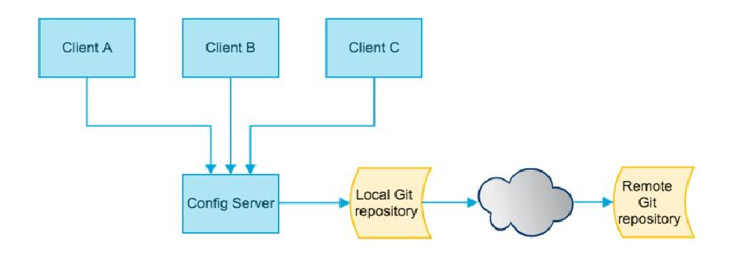
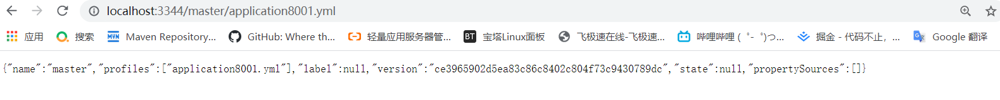
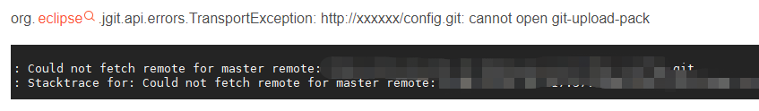
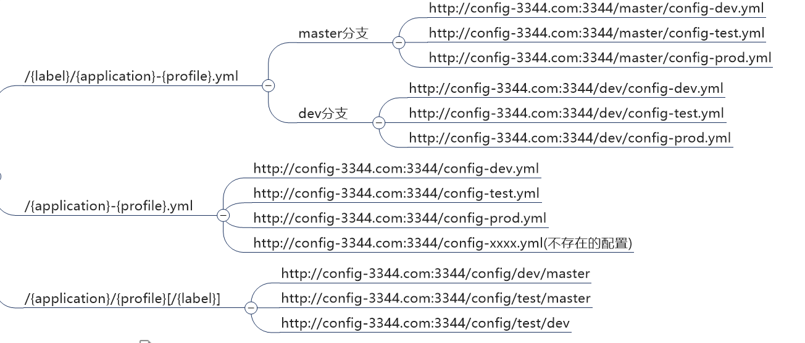
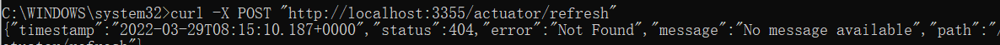

# Config

# 概述

## 分布式面临的配置问题

>微服务意味着要将单体应用中的业务拆分成一个个子服务，每个服务的粒度相对较小，因此系统中会出现大量的服务。
>
>由于每个服务都需要必要的配置信息才能运行，所以一套集中式的、动态的配置管理设施是必不可少的。
>
>SpringCloud提供了ConfigServer来解决这个问题，我们每一个微服务自己带着一个application.yml，上百个配置文件的管理......

## Config定义及用法 



>**定义：**
>
>- SpringCloud Config为微服务架构中的微服务**提供集中化的外部配置支持**，配置服务器为各个微服务提供了**一个中心化的外部配置**
>
>**用法：**
>
>- SpringCloud Config分为**服务端和客户端**两部分


## Config能干嘛

>1. 集中管理配置文件
>2. 不同环境不同配置，动态化的配置更新，分环境部署比如dev/test/prod/beta/release
>3. 运行期间动态调整配置，不再需要在每个服务部署的机器上编写配置文件，服务会向配置中心统一拉取配置自己的信息
>4. 当配置发生变动时，服务不需要重启即可感知到配置的变化并应用新的配置
>5. 将配置信息以REST接口的形式暴露          （post、curl访问刷新均可......）


## 官网地址

https://cloud.spring.io/spring-cloud-static/spring-cloud-config/2.2.1.RELEASE/reference/html/


# Config用法

## Config服务端配置与测试

### 前期准备

准备

1.在GitHub上新建一个仓库，再上传一些配置文件（application.yml）

2.获取新建的git地址（git@github.com:zzyybs/springcloud-config.git）

3.本地新建一个git仓库文件夹，clone 新建的Github的仓库（git clone git@github.com:zzyybs/springcloud-config.git）

4.将文件传到Github的远程仓库

>git add .
>
>git commit -m "init yml"
>
>git push origin master  (origin:远端代号)

### Config服务端实例

#### 1.新建一个Moudle

#### 2.POM文件

**新增依赖**

```xml
 <dependency>
            <groupId>org.springframework.cloud</groupId>
            <artifactId>spring-cloud-config-server</artifactId>
 </dependency>
```

**实例**

```xml
<?xml version="1.0" encoding="UTF-8"?>
<project xmlns="http://maven.apache.org/POM/4.0.0"
         xmlns:xsi="http://www.w3.org/2001/XMLSchema-instance"
         xsi:schemaLocation="http://maven.apache.org/POM/4.0.0 http://maven.apache.org/xsd/maven-4.0.0.xsd">
    <parent>
        <artifactId>Cloud2020</artifactId>
        <groupId>org.example</groupId>
        <version>1.0-SNAPSHOT</version>
    </parent>
    <modelVersion>4.0.0</modelVersion>

    <artifactId>cloud-config-center_3344</artifactId>

    <properties>
        <maven.compiler.source>8</maven.compiler.source>
        <maven.compiler.target>8</maven.compiler.target>
    </properties>

    <dependencies>
        <dependency>
            <groupId>org.springframework.cloud</groupId>
            <artifactId>spring-cloud-config-server</artifactId>
        </dependency>
        <dependency>
            <groupId>org.springframework.cloud</groupId>
            <artifactId>spring-cloud-starter-netflix-eureka-client</artifactId>
        </dependency>
        <dependency>
            <groupId>org.springframework.boot</groupId>
            <artifactId>spring-boot-starter-web</artifactId>
        </dependency>

        <dependency>
            <groupId>org.springframework.boot</groupId>
            <artifactId>spring-boot-starter-actuator</artifactId>
        </dependency>
        <dependency>
            <groupId>org.springframework.boot</groupId>
            <artifactId>spring-boot-devtools</artifactId>
            <scope>runtime</scope>
            <optional>true</optional>
        </dependency>
        <dependency>
            <groupId>org.projectlombok</groupId>
            <artifactId>lombok</artifactId>
            <optional>true</optional>
        </dependency>
        <dependency>
            <groupId>org.springframework.boot</groupId>
            <artifactId>spring-boot-starter-test</artifactId>
            <scope>test</scope>
        </dependency>
    </dependencies>


</project>
```

#### 3.YML文件

这里可能会出现以下错误


不过可以避免，用uri填写为http，容易成功

```yaml
server:
  port: 3344

spring:
  application:
    name:  cloud-config-center #注册进Eureka服务器的微服务名
  cloud:
    config:
      server:
        git:
        #git地址，建议填写rui为http,而不是git ，不然容易认证失败
        #当然 使用git也可以，但是必须加username，password 
          uri: https://github.com/SmallBlackKing/springcloud-config.git
#          username: SmallBlackKing
#          password: chenwenhao1207
#          uri:	git@github.com:zzyybs/springcloud-config.git #GitHub上面的git仓库名字

#		  搜索目录
          search-paths:
            - springcloud-config

      ####读取分支
      label: master

#服务注册到eureka地址
eureka:
  client:
    service-url:
      defaultZone: http://localhost:7001/eureka
```

#### 4.主启动类

这里新增了一个注解**@EnableConfigServer**


```java
package com.atguigu.springcloud;

import org.springframework.boot.SpringApplication;
import org.springframework.boot.autoconfigure.SpringBootApplication;
import org.springframework.cloud.config.server.EnableConfigServer;

@SpringBootApplication
@EnableConfigServer
public class ConfigCenterMain3344
{
    public static void main(String[] args) {
        SpringApplication.run(ConfigCenterMain3344.class, args);
    }
}
```


### 测试

http://localhost:3344/master/application8001.yml

返回的是一个json串，不是yml文件内容



重启一下也许就好了




### 配置读取规则



>**注意：**
>
>label：分支(branch)
>name ：服务名
>profiles：环境(dev/test/prod)


## Config客户端配置与测试

- 可以理解为yml文件就是引入Config配置中心的yml文件，其他的业务类主方法还是照常用

### Config客户端实例

#### 1.新建一个model

（cloud-config-client-3355）

#### 2.POM文件

**新增依赖**

```xml

<dependency>
            <groupId>org.springframework.cloud</groupId>
            <artifactId>spring-cloud-starter-config</artifactId>
        </dependency>
```

**实例**

```xml
<?xml version="1.0" encoding="UTF-8"?>
<project xmlns="http://maven.apache.org/POM/4.0.0"
         xmlns:xsi="http://www.w3.org/2001/XMLSchema-instance"
         xsi:schemaLocation="http://maven.apache.org/POM/4.0.0 http://maven.apache.org/xsd/maven-4.0.0.xsd">
    <parent>
        <artifactId>Cloud2020</artifactId>
        <groupId>org.example</groupId>
        <version>1.0-SNAPSHOT</version>
    </parent>
    <modelVersion>4.0.0</modelVersion>

    <artifactId>cloud-config-client-3355</artifactId>

    <properties>
        <maven.compiler.source>8</maven.compiler.source>
        <maven.compiler.target>8</maven.compiler.target>
    </properties>

    <dependencies>
        <dependency>
            <groupId>org.springframework.cloud</groupId>
            <artifactId>spring-cloud-starter-config</artifactId>
        </dependency>
        <dependency>
            <groupId>org.springframework.cloud</groupId>
            <artifactId>spring-cloud-starter-netflix-eureka-client</artifactId>
        </dependency>
        <dependency>
            <groupId>org.springframework.boot</groupId>
            <artifactId>spring-boot-starter-web</artifactId>
        </dependency>
        <dependency>
            <groupId>org.springframework.boot</groupId>
            <artifactId>spring-boot-starter-actuator</artifactId>
        </dependency>

        <dependency>
            <groupId>org.springframework.boot</groupId>
            <artifactId>spring-boot-devtools</artifactId>
            <scope>runtime</scope>
            <optional>true</optional>
        </dependency>
        <dependency>
            <groupId>org.projectlombok</groupId>
            <artifactId>lombok</artifactId>
            <optional>true</optional>
        </dependency>
        <dependency>
            <groupId>org.springframework.boot</groupId>
            <artifactId>spring-boot-starter-test</artifactId>
            <scope>test</scope>
        </dependency>
    </dependencies>


</project>

```

#### 3.YML文件

#### bootstrap.yml

>applicaiton.yml是**用户级的资源配置项**
>
>bootstrap.yml是**系统级的，优先级更加高**
>
>Spring Cloud会创建一个`Bootstrap Context`，作为Spring应用的`Application Context`的父上下文。
>
>
>
>**初始化的时候，`Bootstrap Context`负责从外部源加载配置属性并解析配置。这两个上下文共享一个从外部获取的`Environment`。**
>
>**正因为BootstrapContext是负载加载外部源配置文件，所以Client端的yml文件只能用bootstrap**
>
>**外部引入的配置属性优先级高于Bootstrap和Application**
>
>
>
>`Bootstrap`属性有高优先级，默认情况下，它们不会被本地配置覆盖。 
>
>`Bootstrap context`和`Application Context`有着不同的约定，
>
>所以新增了一个`bootstrap.yml`文件，保证`Bootstrap Context`和`Application Context`配置的分离。
>
>**要将Client模块下的application.yml文件改为bootstrap.yml,这是很关键的，**
>
>因为bootstrap.yml是比application.yml先加载的。bootstrap.yml优先级高于application.yml
>
> 


**建立bootstrap.yml文件**

```yaml
server:
  port:3344
spring:
  application:
    name: config-client
  cloud:
    #Config客户端配置
    config:
      label: master #分支名称
      name: application8001 #配置文件名称
#      profile: dev #读取后缀名称   
#	  上述3个综合：master分支上config-dev.yml的配置文件被读取http://config-3344.com:3344/master/config-dev.yml

#     上述2个综合：master分支上application8001.yml的配置文件被读取http://config-3344.com:3344/master/config-dev.yml
      uri: http://localhost:3344 #配置中心地址k

#服务注册到eureka地址
eureka:
  client:
    service-url:
      defaultZone: http://localhost:7001/eureka

# 暴露监控端点
management:
  endpoints:
    web:
      exposure:
        include: "*"
```

外部文件如果是server.port=3399

那么就是用3399这个端口

#### 4.主启动类

```java
package com.atguigu.springcloud;

import org.springframework.boot.SpringApplication;
import org.springframework.boot.autoconfigure.SpringBootApplication;
import org.springframework.cloud.netflix.eureka.EnableEurekaClient;

@EnableEurekaClient
@SpringBootApplication
public class ConfigClientMain3355
{
    public static void main(String[] args)
    {
        SpringApplication.run(ConfigClientMain3355.class,args);
    }
}
```

#### 5.业务类

```java
package com.atguigu.springcloud.controller;

import org.springframework.beans.factory.annotation.Value;
import org.springframework.cloud.context.config.annotation.RefreshScope;
import org.springframework.web.bind.annotation.GetMapping;
import org.springframework.web.bind.annotation.RequestMapping;
import org.springframework.web.bind.annotation.RestController;
//@RefreshScope
@RestController
public class ConfigClientController {

    @Value("${server.port}")
    private String port;
    @Value("${config.info}")
    private String configInfo;
    @Value("${spring.application.name}")
    private String name;

    @GetMapping("/configInfo3")
    public String getConfigInfo3()
    {
        return name;
    }
    @GetMapping("/configInfo2")
    public String getConfigInfo2()
    {
        return configInfo;
    }

    @RequestMapping("/configInfo")
    public String getConfigInfo(){
        return port;
    }
}
```

### 测试

http://localhost:3355/configInfo

成功实现了客户端3355访问SpringCloud Config3344通过GitHub获取配置信息


### 遗留问题

- Linux运维修改GitHub上的配置文件内容做调整
- 刷新3344，发现ConfigServer配置中心立刻响应
- 刷新3355，发现ConfigClient客户端没有任何响应
- 3355没有变化除非自己重启或者重新加载
- 难到每次运维修改配置文件，客户端都需要重启？？ 简直就是噩梦


## Config客户端之动态刷新

**解决问题：**

**避免每次更新配置都要重启客户端微服务3355（客户端）**


### 动态刷新步骤

#### 1.修改3355模块

（Config客户端）

#### 2.POM引入actuator监控

```xml
 <!--
spring-boot-starter-actuator模块是一个spring提供的监控模块。我们在开运行发过程中，需要实时和定时监控服务的各项状态和可用性。 Spring Boot的spring-boot-starter-actuator 模块（健康监控）功能提供了很多监控所需的接口，可以对应用系统进行配置查看、相关功能统计等。

默认情况下，通过web端只可访问http://localhost:8080/actuator/health ，可在application.properties中配置访问的uri、权限、端口等


-->
<dependency>
    <groupId>org.springframework.boot</groupId>
    <artifactId>spring-boot-starter-actuator</artifactId>
</dependency>
 

```

#### 3.修改YML，暴露监控端口

```yaml
server:
  port: 3355

spring:
  application:
    name: config-client
  cloud:
    #Config客户端配置
    config:
      label: master #分支名称
      name: config #配置文件名称
      profile: dev #读取后缀名称   上述3个综合：master分支上config-dev.yml的配置文件被读取
      uri: http://localhost:3344 #配置中心地址k

#服务注册到eureka地址
eureka:
  client:
    service-url:
      defaultZone: http://localhost:7001/eureka
# 暴露监控端点
management:
  endpoints:
    web:
      exposure:
        include: "*"
 
 

```

#### 4.`@RefreshScope`业务类Controller修b改

**@RefreshScope** 在类上才可以实现对象属性的的动态更新

```java
package com.atguigu.springcloud.controller;

import org.springframework.beans.factory.annotation.Value;
import org.springframework.cloud.context.config.annotation.RefreshScope;
import org.springframework.web.bind.annotation.GetMapping;
import org.springframework.web.bind.annotation.RequestMapping;
import org.springframework.web.bind.annotation.RestController;
@RefreshScope
@RestController
public class ConfigClientController {

    @Value("${server.port}")
    private String port;
    @Value("${config.info}")
    private String configInfo;
    @Value("${spring.application.name}")
    private String name;

    @GetMapping("/configInfo3")
    public String getConfigInfo3()
    {
        return name;
    }
    @GetMapping("/configInfo2")
    public String getConfigInfo2()
    {
        return configInfo;
    }

    @RequestMapping("/configInfo")
    public String getConfigInfo(){
        return port;
    }
}
```


### 测试

>- 此时修改github---> 3344 ---->3355
>
>- 需要运维人员发送Post请求刷新3355
>
>​	**必须是POST请求**
>
>​	curl -X POST "http://localhost:3355/actuator/refresh"
>
>
>
>- http://localhost:3355/configInfo
>
>   改变了O(∩_∩)O


问题

1.将配置信息以REST接口的形式暴露

2.boostrap的用法

```yaml
spring:
  application:
    name: config-client
  cloud:
    #Config客户端配置
    config:
      label: master #分支名称
      name: application8001 #配置文件名称
#      profile: dev #读取后缀名称   上述3个综合：master分支上config-dev.yml的配置文件被读取http://config-3344.com:3344/master/config-dev.yml
      uri: http://localhost:3344 #配置中心地址k
```

3.config服务端访问远程仓库返回的是一个json串，而不是yml文件的内容？

