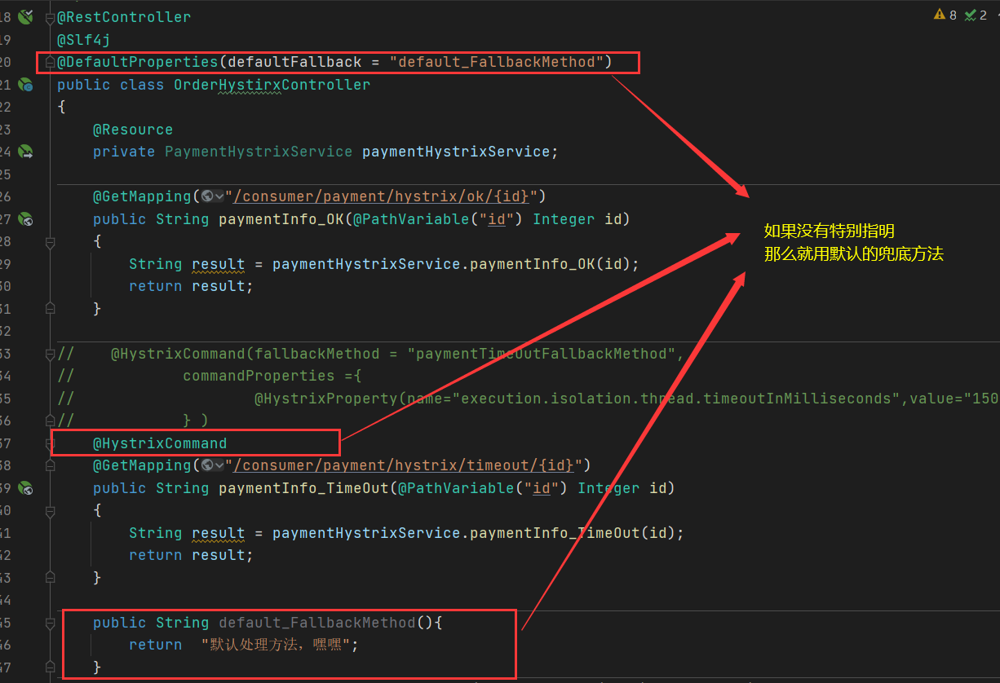
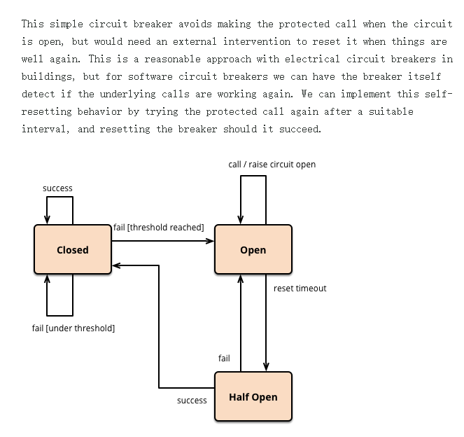
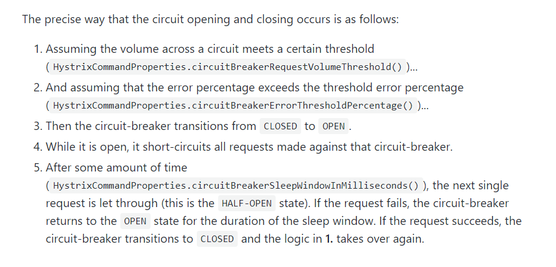
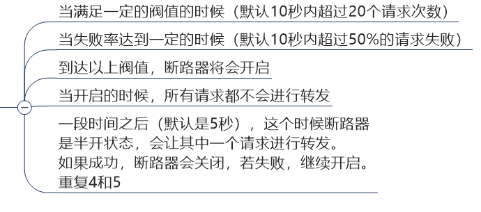
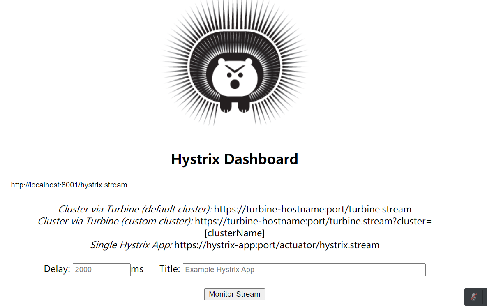
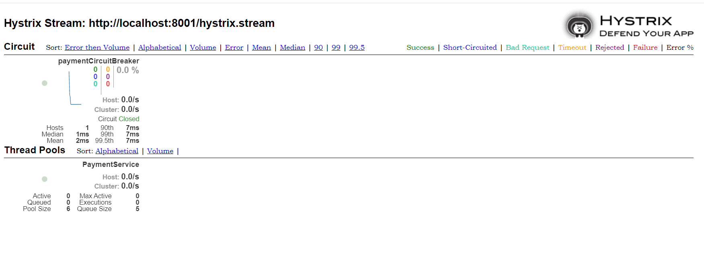

# Hystrix断路器

# 第一章 Hystrix概述

## 开发Hystrix背景

### 分布式系统面临的问题

复杂分布式体系结构中的应用程序有数十个依赖关系，每一个依赖关系在某些时候将不可避免的失败。

### 服务雪崩

多个微服务之间调用的时候，假如微服务A调用微服务B和微服务C，微服务B和微服务C又调用其他的微服务，这就是所谓的"**扇出**"。

如果**扇出的链路**上某个微服务的调用响应的**时间过长或者不可用**，

对微服A的调用就会占用越来越多的系统资源，进而引起系统崩溃，所谓的"**雪崩效应**"。

所以，当你发现某一个微服务实例失败了，他还在吸取流量或者调用其他依赖，其他微服务。那么这就会发生“**雪崩**”（联级故障）


## 什么是Hystrix？

Hystrix 是一个用于处理分布式系统的延迟和容错的开源库。

在分布式系统里，许多依赖不可避免的会出现**调用失败，超时和异常**等错误

Hystrix能够保证在一个依赖出问题的情况下，**不会导致整体服务失败，避免级联故障，以提高分布式系统的弹性。**


**Hystrix是怎么实现对分布式系统的保护的呢？**

当某一个微服务发生故障时，通过 “ 断路器 ” 的故障监控（类似熔断保险丝），

**向调用方法返回一个符合预期的，可处理的备选结果（Fallback），而不是长时间的等待或者抛出调用方无法处理的异常。**

这样就可以保证了服务调用的线程不会被长时间，不必要地占用，从而避免了故障在分布式系统中蔓延，引发“**雪崩**”。


## Hystrix能做什么？

服务降级

服务熔断

接近实时的监控。。。


# 第二章 Hystrix重要概念

## 服务降级

**概念**

服务器忙，请稍后再试，让服务器返回一个较为友好的提示，fallback


**那些情况会发生服务降级**

>1. 程序运行异常
>2. 超时
>3. 服务熔断触发服务降级
>4. 线程池/信号量打满也会导致服务降级


## 服务熔断

**概念**

这有点类似于“保险丝”，当达到最大服务访问后，直接拒绝访问，然后调用**服务降级**给他们返回一个友好的提示。


触发服务熔断后  ->   会调用服务降级    ->    当恢复正常访问量再被调用


## 服务限流

**概念**

秒杀高并发等操作，严禁一窝蜂的过来拥挤，大家排队，一秒钟N个，有序进行


# 第三章 Hystrix服务降级案例

## 问题介绍

**问题：**

承上一章OpenFeign，我们对一对正常的微服务（提供者，消费者），进行压力测试，

会发现我们消费者一端访问要么一直转圈圈等待，要么超时错误


**问题原因：**

8001同一层次的其它接口服务被困死，因为tomcat线程池里面的工作线程已经被挤占完毕

80此时调用8001，客户端访问缓慢，转圈圈


**结论：**
正因为我们有上述故障或不佳表现，所以才产生了服务降级，服务熔断，服务限流等功能


**如何处理？ 解决的要求**

>（提供者）
>
>超时导致服务器变慢  ---------------   超时不再等待    ------------------    **服务降级**
>
>出错（宕机或程序有问题）  ---------------   给一个兜底方法  ---------------   **服务降级**
>
> （消费者）
>
>提供者ok了，调用者自己出现故障或有自我要求（自己等待时间小于提供者），那么消费者就自己处理**服务降级**                

下面就进行演示


## 降级配置

>业务类
>
>**@HystrixCommand**			//降级配置注解
>
>
>
>主启动类
>
>这个是在提供者类上的
>
>**@EnableCircuitBreaker**   //激活@HystrixCommand  降级配置注解
>
>
>
>这个是在消费者类上的
>
>**@EnableHystrix**      	//激活@HystrixCommand  降级配置注解
>
>注意在消费者这端需要在yml激活feign下的Hystrix


**详解@HystrixCommand注解**

**例子**

```java
 /*
    *   @HystrixCommand:降级配置的注解
    *   属性：
    *   fallbackMethod  ：  处理后续的兜底方法
    *   commandProperties：
    *   @HystrixProperty(name="execution.isolation.thread.timeoutInMilliseconds",value="3000")：设置峰值为3s
    *
    * */
    @HystrixCommand(fallbackMethod = "paymentInfo_TimeOutHandler",
            commandProperties = {
            @HystrixProperty(name="execution.isolation.thread.timeoutInMilliseconds",value="5000")
            }
    )
    public String paymentInfo_TimeOut(Integer id){
//        int num=1/0;
        try {
            Thread.sleep(3000);
        } catch (InterruptedException e) {
            e.printStackTrace();
        }
        return  "线程池:"+Thread.currentThread().getName()+";paymentInfo_TimeOut,id:"+id+"\t"+"O(∩_∩)O，耗费3秒";
    }

//    兜底方法
//    返回值类型就应该和对要兜底的方法同类型，方法和参数都要相同
    public String paymentInfo_TimeOutHandler(Integer id){

        return "/(ㄒoㄒ)/调用支付接口超时或异常：\t"+ "\t当前线程池名字" + Thread.currentThread().getName();
    }
```


### 构建项目

#### ① 提供者8001

这个的兜底方法是写在service下方的

#### 写pom

```xml
<?xml version="1.0" encoding="UTF-8"?>
<project xmlns="http://maven.apache.org/POM/4.0.0"
         xmlns:xsi="http://www.w3.org/2001/XMLSchema-instance"
         xsi:schemaLocation="http://maven.apache.org/POM/4.0.0 http://maven.apache.org/xsd/maven-4.0.0.xsd">
    <parent>
        <artifactId>Cloud2020</artifactId>
        <groupId>org.example</groupId>
        <version>1.0-SNAPSHOT</version>
    </parent>
    <modelVersion>4.0.0</modelVersion>

    <artifactId>cloud-provider-hystrix-payment8001</artifactId>

    <properties>
        <maven.compiler.source>8</maven.compiler.source>
        <maven.compiler.target>8</maven.compiler.target>
    </properties>
    <dependencies>
        <!--hystrix-->
        <dependency>
            <groupId>org.springframework.cloud</groupId>
            <artifactId>spring-cloud-starter-netflix-hystrix</artifactId>
        </dependency>
        <!--eureka client-->
        <dependency>
            <groupId>org.springframework.cloud</groupId>
            <artifactId>spring-cloud-starter-netflix-eureka-client</artifactId>
        </dependency>
        <!--web-->
        <dependency>
            <groupId>org.springframework.boot</groupId>
            <artifactId>spring-boot-starter-web</artifactId>
        </dependency>
        <dependency>
            <groupId>org.springframework.boot</groupId>
            <artifactId>spring-boot-starter-actuator</artifactId>
        </dependency>
        <!--        配置外置的项目组-->
        <dependency>
            <groupId>org.example</groupId>
            <artifactId>cloud-api-commons</artifactId>
            <version>1.0-SNAPSHOT</version>
        </dependency>
        <dependency>
            <groupId>org.springframework.boot</groupId>
            <artifactId>spring-boot-devtools</artifactId>
            <scope>runtime</scope>
            <optional>true</optional>
        </dependency>
        <dependency>
            <groupId>org.projectlombok</groupId>
            <artifactId>lombok</artifactId>
            <optional>true</optional>
        </dependency>
        <dependency>
            <groupId>org.springframework.boot</groupId>
            <artifactId>spring-boot-starter-test</artifactId>
            <scope>test</scope>
        </dependency>
    </dependencies>

</project>
```

#### 写yml

```yaml
server:
  port: 8001

spring:
  application:
    name: cloud-provider-hystrix-payment

eureka:
  client:
    register-with-eureka: true
    fetch-registry: true
    service-url:
      #defaultZone: http://eureka7001.com:7001/eureka,http://eureka7002.com:7002/eureka
      defaultZone: http://eureka7001.com:7001/eureka
```

#### 写主启动类

```java
package com.atguigu.springcloud;

import org.springframework.boot.SpringApplication;
import org.springframework.boot.autoconfigure.SpringBootApplication;
import org.springframework.cloud.client.circuitbreaker.EnableCircuitBreaker;
import org.springframework.cloud.netflix.eureka.EnableEurekaClient;

@SpringBootApplication
@EnableEurekaClient
@EnableCircuitBreaker   //激活@HystrixCommand  降级配置注解
public class PaymentHystrixMain8001 {

    public static void main(String[] args) {
        SpringApplication.run(PaymentHystrixMain8001.class,args);
    }
}
```

#### 写业务方法

##### Service

```java
package com.atguigu.springcloud.service;

import com.netflix.hystrix.contrib.javanica.annotation.HystrixCommand;
import com.netflix.hystrix.contrib.javanica.annotation.HystrixProperty;
import org.springframework.stereotype.Service;

@Service
public class PaymentService {

    public String paymentInfo_OK(Integer id){
        return "线程池:"+Thread.currentThread().getName()+";paymentInfo_OK,id:"+id+"\t"+"O(∩_∩)O";
    }

    /*
    *   @HystrixCommand:降级配置的注解
    *   属性：
    *   fallbackMethod  ：  处理后续的兜底方法
    *   commandProperties：
    *   @HystrixProperty(name="execution.isolation.thread.timeoutInMilliseconds",value="3000")：设置峰值为3s
    *
    * */
    @HystrixCommand(fallbackMethod = "paymentInfo_TimeOutHandler",
            commandProperties = {
            @HystrixProperty(name="execution.isolation.thread.timeoutInMilliseconds",value="5000")
            }
    )
    public String paymentInfo_TimeOut(Integer id){
//        int num=1/0;
        try {
            Thread.sleep(3000);
        } catch (InterruptedException e) {
            e.printStackTrace();
        }
        return  "线程池:"+Thread.currentThread().getName()+";paymentInfo_TimeOut,id:"+id+"\t"+"O(∩_∩)O，耗费3秒";
    }

//    兜底方法
//    返回值类型就应该和对要兜底的方法同类型，方法和参数都要相同
    public String paymentInfo_TimeOutHandler(Integer id){

        return "/(ㄒoㄒ)/调用支付接口超时或异常：\t"+ "\t当前线程池名字" + Thread.currentThread().getName();
    }


}
```

##### Controller

```java
package com.atguigu.springcloud.controller;

import com.atguigu.springcloud.service.PaymentService;
import lombok.extern.slf4j.Slf4j;
import org.springframework.beans.factory.annotation.Autowired;
import org.springframework.web.bind.annotation.GetMapping;
import org.springframework.web.bind.annotation.PathVariable;
import org.springframework.web.bind.annotation.RestController;
@Slf4j
@RestController
public class PaymentController {
    @Autowired
    PaymentService service;

    @GetMapping("/payment/hystrix/ok/{id}")
    public String paymentInfo_OK(@PathVariable("id") Integer id) {
        String result=service.paymentInfo_OK(id);
        log.info("****result: "+result);
        return result;
    }

    @GetMapping("/payment/hystrix/timeout/{id}")
    public String paymentInfo_TimeOut(@PathVariable("id") Integer id) throws InterruptedException
    {
        String result = service.paymentInfo_TimeOut(id);
        log.info("****result: "+result);
        return result;
    }

}
```

#### ②消费者80

这个的兜底方法是写在controller下方的


#### 写pom

```xml
<?xml version="1.0" encoding="UTF-8"?>
<project xmlns="http://maven.apache.org/POM/4.0.0"
         xmlns:xsi="http://www.w3.org/2001/XMLSchema-instance"
         xsi:schemaLocation="http://maven.apache.org/POM/4.0.0 http://maven.apache.org/xsd/maven-4.0.0.xsd">
    <parent>
        <artifactId>Cloud2020</artifactId>
        <groupId>org.example</groupId>
        <version>1.0-SNAPSHOT</version>
    </parent>
    <modelVersion>4.0.0</modelVersion>

    <artifactId>cloud-consumer-feign-hystrix-order80</artifactId>

    <properties>
        <maven.compiler.source>8</maven.compiler.source>
        <maven.compiler.target>8</maven.compiler.target>
    </properties>

    <dependencies>
        <!--openfeign-->
        <dependency>
            <groupId>org.springframework.cloud</groupId>
            <artifactId>spring-cloud-starter-openfeign</artifactId>
        </dependency>
        <!--hystrix-->
        <dependency>
            <groupId>org.springframework.cloud</groupId>
            <artifactId>spring-cloud-starter-netflix-hystrix</artifactId>
        </dependency>
        <!--eureka client-->
        <dependency>
            <groupId>org.springframework.cloud</groupId>
            <artifactId>spring-cloud-starter-netflix-eureka-client</artifactId>
        </dependency>
        <!--        配置外置的项目组-->
        <dependency>
            <groupId>org.example</groupId>
            <artifactId>cloud-api-commons</artifactId>
            <version>1.0-SNAPSHOT</version>
        </dependency>
        <!--web-->
        <dependency>
            <groupId>org.springframework.boot</groupId>
            <artifactId>spring-boot-starter-web</artifactId>
        </dependency>
        <dependency>
            <groupId>org.springframework.boot</groupId>
            <artifactId>spring-boot-starter-actuator</artifactId>
        </dependency>
        <!--一般基础通用配置-->
        <dependency>
            <groupId>org.springframework.boot</groupId>
            <artifactId>spring-boot-devtools</artifactId>
            <scope>runtime</scope>
            <optional>true</optional>
        </dependency>
        <dependency>
            <groupId>org.projectlombok</groupId>
            <artifactId>lombok</artifactId>
            <optional>true</optional>
        </dependency>
        <dependency>
            <groupId>org.springframework.boot</groupId>
            <artifactId>spring-boot-starter-test</artifactId>
            <scope>test</scope>
        </dependency>
    </dependencies>


</project>
```

#### 写yml

```yaml
server:
  port: 80

eureka:
  client:
    register-with-eureka: true
    service-url:
      defaultZone: http://eureka7001.com:7001/eureka/

#ribbon:
#  #指的是建立连接所用的时间，适用于网络状况正常的情况下,两端连接所用的时间
#  ReadTimeout: 5000
#  #指的是建立连接后从服务器读取到可用资源所用的时间
#  ConnectTimeout: 5000

#激活feign服务调度下的hystrix
feign:
  hystrix:
    enabled: true   
```

#### 写主启动类

```java
package com.atguigu.springcloud;

import org.springframework.boot.SpringApplication;
import org.springframework.boot.autoconfigure.SpringBootApplication;
import org.springframework.cloud.netflix.hystrix.EnableHystrix;
import org.springframework.cloud.openfeign.EnableFeignClients;


@SpringBootApplication
@EnableFeignClients
@EnableHystrix      //激活hystrix的方法
public class OrderHystrixMain80
{
    public static void main(String[] args)
    {
        SpringApplication.run(OrderHystrixMain80.class,args);
    }
}
```

#### 写业务方法

##### Service

```java
package com.atguigu.springcloud.service;

import org.springframework.cloud.openfeign.FeignClient;
import org.springframework.stereotype.Component;
import org.springframework.web.bind.annotation.GetMapping;
import org.springframework.web.bind.annotation.PathVariable;
@Component
@FeignClient("CLOUD-PROVIDER-HYSTRIX-PAYMENT")
public interface PaymentHystrixService
{
    @GetMapping("/payment/hystrix/ok/{id}")
    String paymentInfo_OK(@PathVariable("id") Integer id);

    @GetMapping("/payment/hystrix/timeout/{id}")
    String paymentInfo_TimeOut(@PathVariable("id") Integer id);
}
```

##### Controller

```java
package com.atguigu.springcloud.controller;

import com.atguigu.springcloud.service.PaymentHystrixService;
import com.netflix.hystrix.contrib.javanica.annotation.HystrixCommand;
import com.netflix.hystrix.contrib.javanica.annotation.HystrixProperty;
import lombok.extern.slf4j.Slf4j;
import org.springframework.web.bind.annotation.GetMapping;
import org.springframework.web.bind.annotation.PathVariable;
import org.springframework.web.bind.annotation.RestController;

import javax.annotation.Resource;

/**
 * @auther zzyy
 * @create 2020-02-20 11:57
 */
@RestController
@Slf4j
public class OrderHystirxController
{
    @Resource
    private PaymentHystrixService paymentHystrixService;

    @GetMapping("/consumer/payment/hystrix/ok/{id}")
    public String paymentInfo_OK(@PathVariable("id") Integer id)
    {
        String result = paymentHystrixService.paymentInfo_OK(id);
        return result;
    }
//	设置超时后的兜底
    @HystrixCommand(fallbackMethod = "paymentTimeOutFallbackMethod",
            commandProperties ={
                    @HystrixProperty(name="execution.isolation.thread.timeoutInMilliseconds",value="1500")
            } )
    @GetMapping("/consumer/payment/hystrix/timeout/{id}")
    public String paymentInfo_TimeOut(@PathVariable("id") Integer id)
    {
        String result = paymentHystrixService.paymentInfo_TimeOut(id);
        return result;
    }
// 	兜底方法
    public String paymentTimeOutFallbackMethod(@PathVariable("id") Integer id)
    {
        return "我是消费者80,对方支付系统繁忙请10秒钟后再试或者自己运行出错请检查自己,o(╥﹏╥)o";
    }
}
```


## 默认兜底方法

每个方法配置一个服务降级方法，技术上可以，实际上傻X

除了个别重要核心业务有专属，其它普通的可以通过**@DefaultProperties(defaultFallback = "")**  

统一跳转到统一处理结果页面

**通用的和独享的各自分开，避免了代码膨胀，合理减少了代码量**





## 业务代码和兜底方法分离

我们只需要为消费者@Feign提供者这个接口  **实现  一个服务降级处理的实现类**即可实现解耦


**步骤**

新建一个service的服务降级实现类

```java
package com.atguigu.springcloud.service;

import org.springframework.stereotype.Component;

@Component

public class PaymentFallbackService implements PaymentHystrixService{

    @Override
    public String paymentInfo_OK(Integer id) {
        return "调用paymentInfo_ok失败了";
    }

    @Override
    public String paymentInfo_TimeOut(Integer id) {
        return "调用paymentInfo_TimeOut失败了";
    }
}
```


修改接口类的 @FeignClient 注解，再起后加入fallback属性

```java
package com.atguigu.springcloud.service;

import org.springframework.cloud.openfeign.FeignClient;
import org.springframework.stereotype.Component;
import org.springframework.web.bind.annotation.GetMapping;
import org.springframework.web.bind.annotation.PathVariable;
@Component
//@FeignClient("CLOUD-PROVIDER-HYSTRIX-PAYMENT")
//fallback属性：服务降级实现类
@FeignClient(value = "CLOUD-PROVIDER-HYSTRIX-PAYMENT",fallback = PaymentFallbackService.class)
public interface PaymentHystrixService
{
    @GetMapping("/payment/hystrix/ok/{id}")
    String paymentInfo_OK(@PathVariable("id") Integer id);

    @GetMapping("/payment/hystrix/timeout/{id}")
    String paymentInfo_TimeOut(@PathVariable("id") Integer id);
}
```


修改yml  

启动feign下的hystrix

```yaml
server:
  port: 80

eureka:
  client:
    register-with-eureka: true
    service-url:
      defaultZone: http://eureka7001.com:7001/eureka/

#ribbon:
#  #指的是建立连接所用的时间，适用于网络状况正常的情况下,两端连接所用的时间
#  ReadTimeout: 5000
#  #指的是建立连接后从服务器读取到可用资源所用的时间
#  ConnectTimeout: 5000

# 用于服务降级 在注解@FeignClient中添加fallbackFactory属性值
feign:
  hystrix:
    enabled: true
```


```xml
<?xml version="1.0" encoding="UTF-8"?>
<project xmlns="http://maven.apache.org/POM/4.0.0"
         xmlns:xsi="http://www.w3.org/2001/XMLSchema-instance"
         xsi:schemaLocation="http://maven.apache.org/POM/4.0.0 http://maven.apache.org/xsd/maven-4.0.0.xsd">
    <parent>
        <artifactId>Cloud2020</artifactId>
        <groupId>org.example</groupId>
        <version>1.0-SNAPSHOT</version>
    </parent>
    <modelVersion>4.0.0</modelVersion>

    <artifactId>cloud-provider-hystrix-payment8001</artifactId>

    <properties>
        <maven.compiler.source>8</maven.compiler.source>
        <maven.compiler.target>8</maven.compiler.target>
    </properties>
    <dependencies>
        <!--hystrix-->
        <dependency>
            <groupId>org.springframework.cloud</groupId>
            <artifactId>spring-cloud-starter-netflix-hystrix</artifactId>
        </dependency>
        <!--eureka client-->
        <dependency>
            <groupId>org.springframework.cloud</groupId>
            <artifactId>spring-cloud-starter-netflix-eureka-client</artifactId>
        </dependency>
        <!--web-->
        <dependency>
            <groupId>org.springframework.boot</groupId>
            <artifactId>spring-boot-starter-web</artifactId>
        </dependency>
        <dependency>
            <groupId>org.springframework.boot</groupId>
            <artifactId>spring-boot-starter-actuator</artifactId>
        </dependency>
        <!--        配置外置的项目组-->
        <dependency>
            <groupId>org.example</groupId>
            <artifactId>cloud-api-commons</artifactId>
            <version>1.0-SNAPSHOT</version>
        </dependency>
        <dependency>
            <groupId>org.springframework.boot</groupId>
            <artifactId>spring-boot-devtools</artifactId>
            <scope>runtime</scope>
            <optional>true</optional>
        </dependency>
        <dependency>
            <groupId>org.projectlombok</groupId>
            <artifactId>lombok</artifactId>
            <optional>true</optional>
        </dependency>
        <dependency>
            <groupId>org.springframework.boot</groupId>
            <artifactId>spring-boot-starter-test</artifactId>
            <scope>test</scope>
        </dependency>
    </dependencies>

</project>
```


# 第四章 Hystrix服务熔断案例

## 服务熔断是什么

### 熔断机制概述

>熔断机制是应对雪崩效应的一种微服务链路保护机制。**当扇出链路的某个微服务宕机或出现bug，没法返回数据时，就会进行服务降级。**
>
>进而熔断该节点的微服务调用，快速返回错误。
>
>**当检测到该节点微服务调用响应正常后，就会恢复调用链路。**


### 默认启动熔断机制的情况

在Spring Cloud框架里，熔断机制通过Hystrix实现。Hystrix会监控微服务间调用的状况，

当失败的调用到一定阈值，**缺省是5秒内20次调用失败**，就会**启动熔断机制**。熔断机制的注解是**`@HystrixCommand。`**


## 服务熔断实操

### service层

在方法上加入下面的服务熔断注解@HystrixCommand

服务熔断和服务降级的注解相同

**@HystrixCommand各个属性:**

>涉及到断路器的三个重要参数：**快照时间窗、请求总数阀值、错误百分比阀值**。
>
>1：快照时间窗：断路器确定是否打开需要统计一些请求和错误数据，而统计的时间范围就是快照时间窗，默认为最近的10秒。
>
>2：请求总数阀值：在快照时间窗内，必须满足请求总数阀值才有资格熔断。默认为20，意味着在10秒内，如果该hystrix命令的调用次数不足20
>
>次，即使所有的请求都超时或其他原因失败，断路器都不会打开。
>
>3：错误百分比阀值：当请求总数在快照时间窗内超过了阀值，比如发生了30次调用，如果在这30次调用中，有15次发生了超时异常，也就是超过
>
>50%的错误百分比，在默认设定50%阀值情况下，这时候就会将断路器打开。


>@HystrixProperty(name = "circuitBreaker.enabled",value = "true"),   //是否开始断路器
>        @HystrixProperty(name = "circuitBreaker.requestVolumeThreshold",value = "10"),  //请求次数
>        @HystrixProperty(name = "circuitBreaker.sleepWindowInMilliseconds",value = "10000"),//时间窗口期
>        @HystrixProperty(name = "circuitBreaker.errorThresholdPercentage",value = "60"),//失败率达到多少后跳匝

```java
//=========服务熔断
@HystrixCommand(fallbackMethod = "paymentCircuitBreaker_fallback",commandProperties = {
        @HystrixProperty(name = "circuitBreaker.enabled",value = "true"),   //是否开始断路器
        @HystrixProperty(name = "circuitBreaker.requestVolumeThreshold",value = "10"),  //请求次数
        @HystrixProperty(name = "circuitBreaker.sleepWindowInMilliseconds",value = "10000"),//时间窗口期
        @HystrixProperty(name = "circuitBreaker.errorThresholdPercentage",value = "60"),//失败率达到多少后跳匝
})
public String paymentCircuitBreaker(@PathVariable("id") Integer id)
{
    if(id < 0)
    {
        throw new RuntimeException("******id 不能负数");
    }
    String serialNumber=IdUtil.simpleUUID();

    return Thread.currentThread().getName()+"\t"+"调用成功，流水号: " + serialNumber;
}
public String paymentCircuitBreaker_fallback(@PathVariable("id") Integer id)
{
    return "id 不能负数，请稍后再试，/(ㄒoㄒ)/~~   id: " +id;
}
```


### controller层

```java
@GetMapping("/payment/circuit/{id}")
public String paymentCircuitBreaker(@PathVariable("id") Integer id)
{
    String result = service.paymentCircuitBreaker(id);
    log.info("****result: "+result);
    return result;
}
```


## 服务熔断机制的原理

### 大佬的结论




### 熔断类型

#### 熔断打开

>请求不再进行调用服务，
>
>当打开时长达到了所设时间或者默认的时间时，所设闹钟就会进入半熔断状态

#### 熔断关闭

>熔断关闭，请求正常进行调用服务，不会对服务熔断

#### 熔断半开

>当处于熔断打开状态后再等待一段时间后，就会再次发送请求。
>
>如果请求发送成功，那么熔断状态就恢复为“关闭”，如果还是失败，则就会持续为“打开”状态
>
>再次等待下一段时间后，再发送请求


### 官网流程



### 断路器工作流程

断路器打开条件



断路器打开之后

>1：再有请求调用的时候，将不会调用主逻辑，而是直接调用降级fallback。通过断路器，
>
>​	实现了自动地发现错误并将降级逻辑切换为主逻辑，减少响应延迟的效果。
>
>2：原来的主逻辑要如何恢复呢？
>
>对于这一问题，hystrix也为我们实现了**自动恢复功能**。
>
>当断路器打开，对主逻辑进行熔断之后，hystrix会启动一个**休眠时间窗**，在这个时间窗内，**降级逻辑是临时的成为主逻辑，**
>
>当**休眠时间窗到期**，断路器将进入**半开状态**，释放一次请求到原来的主逻辑上，**如果此次请求正常返回，那么断路器将继续闭合**，
>
>主逻辑恢复，如果这次请求依然有问题，断路器继续进入打开状态，**休眠时间窗重新计时。**
>
>


# 第五章 Hystrix工作流程


# 	第六章 服务监控hystrixDashboard

## 概述

>除了隔离依赖服务的调用以外，Hystrix还提供了**准实时的调用监控（Hystrix Dashboard）**，
>
>Hystrix会持续地记录所有通过Hystrix发起的请求的执行信息，并以统计报表和图形的形式展示给用户，
>
>包括每秒执行多少请求多少成功，多少失败等。
>
>Netflix通过hystrix-metrics-event-stream项目实现了对以上指标的监控。Spring Cloud也提供了Hystrix Dashboard的整合，
>
>**对监控内容转化成可视化界面**。


## 实操

### pom文件

hystrixDashboard的依赖

><dependency>
>            <groupId>org.springframework.cloud</groupId>
>            <artifactId>spring-cloud-starter-netflix-hystrix-dashboard</artifactId>
></dependency>

```xml
<?xml version="1.0" encoding="UTF-8"?>
<project xmlns="http://maven.apache.org/POM/4.0.0"
         xmlns:xsi="http://www.w3.org/2001/XMLSchema-instance"
         xsi:schemaLocation="http://maven.apache.org/POM/4.0.0 http://maven.apache.org/xsd/maven-4.0.0.xsd">
    <parent>
        <artifactId>Cloud2020</artifactId>
        <groupId>org.example</groupId>
        <version>1.0-SNAPSHOT</version>
    </parent>
    <modelVersion>4.0.0</modelVersion>

    <artifactId>cloud-consumer-hystrix-dashboard9001</artifactId>

    <properties>
        <maven.compiler.source>8</maven.compiler.source>
        <maven.compiler.target>8</maven.compiler.target>
    </properties>

    <dependencies>
        <dependency>
            <groupId>org.springframework.cloud</groupId>
            <artifactId>spring-cloud-starter-netflix-hystrix-dashboard</artifactId>
        </dependency>
        <dependency>
            <groupId>org.springframework.boot</groupId>
            <artifactId>spring-boot-starter-actuator</artifactId>
        </dependency>

        <dependency>
            <groupId>org.springframework.boot</groupId>
            <artifactId>spring-boot-devtools</artifactId>
            <scope>runtime</scope>
            <optional>true</optional>
        </dependency>
        <dependency>
            <groupId>org.projectlombok</groupId>
            <artifactId>lombok</artifactId>
            <optional>true</optional>
        </dependency>
        <dependency>
            <groupId>org.springframework.boot</groupId>
            <artifactId>spring-boot-starter-test</artifactId>
            <scope>test</scope>
        </dependency>
    </dependencies>


</project>
```

### 主启动类

**@EnableHystrixDashboard：激活HystrixDashboard**

```java
package com.atguigu.springcloud;

import org.springframework.boot.SpringApplication;
import org.springframework.boot.autoconfigure.SpringBootApplication;
import org.springframework.cloud.netflix.hystrix.dashboard.EnableHystrixDashboard;

@SpringBootApplication
@EnableHystrixDashboard
public class HystrixDashboardMain9001 {
    public static void main(String[] args) {
        SpringApplication.run(HystrixDashboardMain9001.class,args);
    }
}
```

### 测试

http://localhost:9001/hystrixhttp://localhost:9001/hystrix




### 其他项目（待测项目）配置

（提供者）

新版本Hystrix需要在主启动类中指定监控路径

```java
/**
 *此配置是为了服务监控而配置，与服务容错本身无关，springcloud升级后的坑
 *ServletRegistrationBean因为springboot的默认路径不是"/hystrix.stream"，
 *只要在自己的项目里配置上下面的servlet就可以了
 */
@Bean
public ServletRegistrationBean getServlet() {
    HystrixMetricsStreamServlet streamServlet = new HystrixMetricsStreamServlet();
    ServletRegistrationBean registrationBean = new ServletRegistrationBean(streamServlet);
    registrationBean.setLoadOnStartup(1);
    registrationBean.addUrlMappings("/hystrix.stream");
    registrationBean.setName("HystrixMetricsStreamServlet");
    return registrationBean;
}
```


测试：


成功进入下面这个页面




