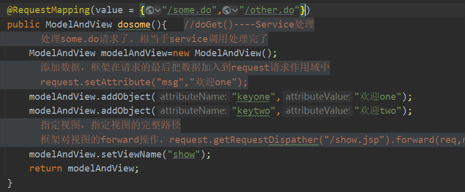

常见错误：在配置文件里会出现的错误：

NotWritablePropertyException: Invalid property 'StudentDao' of bean class [service.impl.StudentServiceimpl]: Bean property 'StudentDao' is not writable or has an invalid setter method. Does the parameter type of the setter match the return type of the getter?

①在service接口实现类中可能没有去设置set方法

②在applicationContext配置文件中可能没有写配置service或者其他类的相关信息


springmvc框架找不到静态资源的原因

>当你的项目中使用了“/”，它会代替tomcat中的default（看2.4解读<url-pattern>）
>
>导致所有的静态资源都给DispatcherServlet处理，默认情况下DispatcherServlet没有处理静态资源的能力
>
>没有控制器对象能处理静态资源的访问。所以如果通过“/”去让所有的文件都归中央调度器调度的后果就是，访问静态资源文件会出现		404
>		
>
>动态资源文件“some.do"是可以访问，是因为mycontroller能处理some.do文件
>
>


# SpringMVC框架

## SpringMVC简单介绍

- **springMvc:是基于spring的一个框架，，实际上就是spring的一个小模块，专门是做web开发的，可以理解为servlet的一个升级。       web开发的底层是servlet，框架是servlet基础上面加入一些功能，让你做web开发更加方便**

- **SpringMVC就是一个Spring。Spring是容器，ioc能够管理对象，使用<bean>,@Component，@Repository，@Controller，@Service，@Bean。Spring能够创建对象，放入到容器中（SpringMVC容器），springmvc容器中放的是控制器对象**

- **我们要做的是使用@Contorller创建控制器对象，把对象放入到springmvc容器中，把创建的对象作为控制器使用**

  **这个控制器对象能够接收用户的请求，显示处理结果，就当作是一个servlet使用。但不是servlet）**

- **使用@Controller注解创建的是一个普通类的对象，不是Servlet。springmvc赋予了控制器对象一些额外的功能**


- **web开发底层就是servlet，springmvc中有一个对象是Servlet：DispatherServlet**
- **DispatherServlet：负责接收用户的所有请求，用户把请求给了DispatherServlet，之后DispatherServlet把请求转发给我们的Controller对象，最后是Controller对象处理请求**
- **可以写为 /，因为 DispatcherServlet 会将向静态资源的获取请求，例如.css、.js、.jpg、.png 等资源的获取请求，当作是一个普通的 Controller 请求。中央调度器会调用处理器映射器为其查找相应的处理器。当然也是找不到的，所以在这种情况下，所有的静态资源获取请求也均会报 404 错误。**


# 创建一个SpringMVC框架的过程


## 新建maven项目

## 加入依赖

```xml
<!--    servlet依赖-->
    <dependency>
      <groupId>javax.servlet</groupId>
      <artifactId>javax.servlet-api</artifactId>
      <version>3.1.0</version>
      <scope>provided</scope>
    </dependency>
<!--    Springmvc依赖-->
    <dependency>
      <groupId>org.springframework</groupId>
      <artifactId>spring-webmvc</artifactId>
      <version>5.2.5.RELEASE</version>
    </dependency>
    <!--    jsp依赖-->
    <dependency>
      <groupId>javax.servlet.jsp</groupId>
      <artifactId>jsp-api</artifactId>
      <version>2.2.1-b03</version>
      <scope>provided</scope>
    </dependency>
```

## 在web.xml中注册DispatcherServlet(中央调度器)

​	1）DispatcherServlet叫做中央调度器，是一个servlet，它的父类是继承HttpServlet

​	2）DispatcherServlet也叫做前端控制器（front controller）

​	3）DispatcherServlet负责接收用户提交的请求，调用其他的控制器对象，并把请求的处理结果显示给用户


```xml
<?xml version="1.0" encoding="UTF-8"?>
<web-app xmlns="http://xmlns.jcp.org/xml/ns/javaee"
         xmlns:xsi="http://www.w3.org/2001/XMLSchema-instance"
         xsi:schemaLocation="http://xmlns.jcp.org/xml/ns/javaee http://xmlns.jcp.org/xml/ns/javaee/web-app_4_0.xsd"
         version="4.0">
<!--
    声明，注册springmvc的核心对象DispatcherServlet
    需要在tomcat服务器启动后，创建DispatcherServlet对象的实例
    为什么要创建DispatcherServlet对象的实例呢？

    答：因为DispatcherServlet在他的创建过程中，会同时创建springmvc容器对象，
        读取springmvc的配置文件，把这个配置文件中的对象都创建好，当用户发起请求时就可以直接使用对象了

    servlet的初始化会执行init（）方法。DispatcherServlet在init（）方法中{
        //创建容器
        webApplicationContext ctx=new ClassPathXmlApplicationContext("springmvc.xml")
        //把容器对象放入到ServletContext中
        getServletContext().setAttribute(key,ctx);
    }

    springmvc创建容器时，读取的配置文件默认是WEB-INF/<servlet-name>-servlet.xml
-->
    <servlet>
        <servlet-name>myweb</servlet-name>
        <servlet-class>org.springframework.web.servlet.DispatcherServlet</servlet-class>

<!--        自定义springmvc读取的配置文件的位置-->
        <init-param>
<!--            springmvc的配置文件的位置的属性-->
            <param-name>contextConfigLocation</param-name>
<!--            必须叫contextConfigLocation这个名字-->
<!--            指定自定义文件的位置-->
            <param-value>classpath:SpringmvcOne.xml</param-value>
        </init-param>

<!--        在tomcat启动后，创建Servlet对象
            load-on-startup；表示tomcat启动后创建对象的顺序。
            它的值是整数，数值越小，tomcat创建对象的时间越早，大于等于0的整数
            为什么要配置load-on-startup
            答：因为需要在中央调度器DispatcherServlet启动的时候将springmvc容器创建出来，将文件创建好
-->
        <load-on-startup>1</load-on-startup>
    </servlet>
    <servlet-mapping>
        <servlet-name>myweb</servlet-name>
<!--
        使用框架的时候，url-pattern可以使用两种方式
        1.使用扩展名的方式，语法“ *.xxxx ”，xxxx是自定义的扩展名。常用的有*.do,*.action,*.mvc等等
        https://localhost:8080/myweb/some.do
        https://localhost:8080/myweb/other.do
        2.使用斜杆“/”
		当你的项目中使用了“/”，它会代替tomcat中的default（看2.4解读<url-pattern>）
		导致所有的静态资源都给DispatcherServlet处理，默认情况下DispatcherServlet没有处理静态资源的能力
		没有控制器对象能处理静态资源的访问。所以如果通过“/”去让所有的文件都归中央调度器调度的后果就是，访问静态资源文件会出现		404
		
		动态资源文件“some.do"是可以访问，是因为mycontroller能处理some.do文件
-->
        <url-pattern>*.do</url-pattern>
    </servlet-mapping>
</web-app>
```

## 创建一个发起请求的页面

```jsp
<%@ page contentType="text/html;charset=UTF-8" language="java" %>
<html>
<head>
    <title>Title</title>
</head>
<body>
<p>第一个springmvc项目</p>
<p><a href="some.do">调用dosome方法</a></p>
</body>
</html>
```

## 创建控制器类

### 在类的上面加入@Controller注解，创建对象，并放入到springmvc容器中

### 在类中的方法上面加入@RequestMapping注解。

```java
package controller;

import org.springframework.stereotype.Controller;
import org.springframework.web.bind.annotation.RequestMapping;
import org.springframework.web.servlet.ModelAndView;

/*
*   @Controller：创建处理器对象，对象放在springmvc容器中
*   位置：在类的上方
*   和spring中讲的@Service，@Component
*
*   能处理请求的都是控制器（处理器）：MyController能处理请求，叫做后端控制器（back controller）
* */
@Controller
public class MyController {
    /*
    *   处理用户提交的请求，springmvc中是使用方法来处理的
    *   方法是自定义的，可以有多种返回值，多种参数，方法名称自定义
    * */

    /*
    *   准备使用dosome方法来处理some.do请求
    *   @RequestMapping：请求映射，作用是把请求地址和一个方法绑定在一起。一个请求指定一个方法处理
    *       属性：1.value  是一个字符串String  ，它表示的是一个请求uri的地址
    *               value的值必须是唯一的，不能重复的
    *       位置：1.在方法的上面，常用的（一般都在方法上面）
    *             2.在类的上面
    *   说明：使用@RequestMapping修饰的方法叫做处理器方法或者控制器方法。
    *   使用@RequestMapping修饰的方法可以处理请求的，lServlet中的doGet，doPost
    *
    *   返回值：ModelAndView 表示本次请求的处理结果
    *   Model：数据，请求处理完成后，要给用户看的数据
    *   View：视图，比如jsp等等
    * */
    @RequestMapping(value = "/some.do")
    public ModelAndView dosome(){   //doGet()----Service处理
//        处理some.do请求了。相当于service调用处理完了
        ModelAndView modelAndView=new ModelAndView();
//        添加数据，框架在请求的最后把数据加入到request请求作用域中
//        request.setAttribute("msg","欢迎one");
        modelAndView.addObject("keyone","欢迎one");
        modelAndView.addObject("keytwo","欢迎two");
//        指定视图，指定视图的完整路径
//        框架对视图的forward操作，request.getRequestDispather("/show.jsp").forward(req,resp);
        modelAndView.setViewName("/show.jsp");
        return modelAndView;
    }
}
```

## 创建一个作为结果的jsp，显示请求的处理结果

```jsp
<%@ page contentType="text/html;charset=UTF-8" language="java" %>
<html>
<head>
    <title>Title</title>
</head>
<br>
<h1>keyone:${keyone}</h1></br>
<h1>keytwo:${keytwo}</h1>
</body>
</html>
```

## 创建springmvc的配置文件（spring的配置文件一样）

### 声明组件扫描器，指定@Contorller注解所在的包名

### 声明视图解析器。帮助处理视图

```xml
<?xml version="1.0" encoding="UTF-8"?>
<beans xmlns="http://www.springframework.org/schema/beans"
       xmlns:xsi="http://www.w3.org/2001/XMLSchema-instance"
       xmlns:context="http://www.springframework.org/schema/context"
       xmlns:mvc="http://www.springframework.org/schema/mvc"
       xsi:schemaLocation="http://www.springframework.org/schema/beans
       http://www.springframework.org/schema/beans/spring-beans-4.2.xsd
    http://www.springframework.org/schema/mvc
    http://www.springframework.org/schema/mvc/spring-mvc-4.2.xsd
    http://www.springframework.org/schema/context
    http://www.springframework.org/schema/context/spring-context-4.2.xsd">
<!--    添加组件扫描器-->
    <context:component-scan base-package="controller"/>
</beans>
```

# SpringMVC请求处理过程

>some.do发起一个请求，会先给tomcat服务器发起，
>
>tomcat服务器根据some.do这个别名会找到这个中央调度器DispatcherServlet，
>
>中央调度器DispatcherServlet会创建springmvc容器对象，读取该容器对象的xml配置文件找到组件扫描器，组件扫描器会去扫描找到Controller对象。
>
>然后将会发现与网站的uri一致的@RequstMapping。中央调度器会将some.do转发给dosome这个方法
>
>这个框架中的dosome这个方法，处理完后会把ModelAndView进行处理，转发给show.jsp
>
>


​																					**springmvc请求过程图解**

# 视图扫描器

## 为了保护jsp，不被猜中就直接访问，可以将jsp放入WEB-INF中，如下图


## 配置视图扫描器

```xml
<!--    声明springmvc中的视图解析器，帮助开发人员设置视图文件的路径-->
    <bean class="org.springframework.web.servlet.view.InternalResourceViewResolver">
<!--        前缀：视图文件的路径-->
        <property name="prefix" value="/WEB-INF/view/"/>
<!--        后缀：试图文件的后缀名-->
        <property name="suffix" value=".jsp"/>
    </bean>

```

因为又试图文件解析器，所以只用写名字就行

## SpringMVC中的请求作用域

```java
 ModelAndView modelAndView=new ModelAndView();
//        添加数据，框架在请求的最后把数据加入到request请求作用域中
//        request.setAttribute("msg","欢迎one");
        modelAndView.addObject("keyone","欢迎one");
        modelAndView.addObject("keytwo","欢迎two");
```

## @RequestMapping的属性value

value的属性是字符串数组，在其中写的是请求名称

它其中可以写多个请求名称，代表多个请求都用这个方法来进行处理



# SpringMVC注解式开发

# RequestMapping定义请求规则

## RequestMapping放到类上，代表一类的名称（前缀名）

```java
/*@RequestMapping:
        value:所有请求地址的公共部分，叫做模块名称
        位置：放在类的上面*/
@Controller
@RequestMapping("/test")
public class MyController {

    @RequestMapping(value = {"/some.do","/other.do"})
    public ModelAndView dosome(){
        ModelAndView modelAndView=new ModelAndView();
        modelAndView.addObject("keyone","欢迎one");
        modelAndView.addObject("keytwo","欢迎two");
        modelAndView.setViewName("show");
        return modelAndView;
    }
}
```


```jsp
<p><a href="test/other.do">调用dosome方法</a></p>
```


例如：

http://localhost:8080/ch02_RequestMapping/user/some.do

http://localhost:8080/ch02_RequestMapping/test/some.do

## 对请求方式的定义

有点类似于Servlet中的要用doget()还是dopost()方法接收请求内容

如果要保证请求方式一定时post指令，则用RequestMethod.POST指令

```java
/*
* @RequestMapping:请求映射
*       属性：method，表示请求的方式。它的值是RequestMethod类的枚举值GET,POST,HEAD,PUT,DELETE等
*            例如表示get请求方式，RequestMethod.GET
*                   post方式，RequestMethod.POST
*       要你用get方式，你不用get方式，则报一下错误
		HTTP Status 405 – 方法不允许Request method 'GET' not supported
* */
@RequestMapping(value = {"/some.do"},method = RequestMethod.GET)
```

# 处理器方法的参数

HttpServletRequest，HttpServletResponse，HttpSession可以直接出现在处理器方法的参数位置

## 逐个参数接收

req.getParameter(duixiang);

 逐个接收请求参数：
 要求：处理器（controller）方法的形参参数名必须 和 **请求参数名相同**
           **同名的请求参数赋值给同名的形参**
 框架接收请求参数

   1.使用request接收请求参数
   String strName=request.getParamter（"name"）
   String strAge=request.getParamter（"age"）

   2.Springmvc框架通过DispatcherServlet调用MyController的dosome（）方法
       调用方法时，按名称对应，将同名的请求参数赋给同名的形参
       dosome(strName，Integer.valueOf(strAge))
      框架会提供类型转换的功能，将String转换为Integer，Float，Double等


好处： 可以在方法中直接使用name和age这两个请求参数，不用再去通过request获取参数，和转换类型了

```java
public class MyController {
    /*
    * 逐个接收请求参数：
    *   要求：处理器（controller）方法的形参参数名必须和请求参数名相同
    *           同名的请求参数赋值给同名的形参
    * 框架接收请求参数
    *   1.使用request接收请求参数
    *   String strName=request.getParamter（"name"）
    *   String strAge=request.getParamter（"age"）
    *   2.Springmvc框架通过DispatcherServlet调用MyController的dosome（）方法
    *       调用方法时，按名称对应，将同名的请求参数赋给同名的形参
    *       dosome(strName，Integer.valueOf(strAge))
    *       框架会提供类型转换的功能，将String转换为Integer，Float，Double等
    * */
    @RequestMapping(value = {"/receiveParamte01.do"})
    public ModelAndView dosome(String name,Integer age){
//        可以在方法中直接使用name和age这两个请求参数，不用再去通过request获取参数，和转换类型了
        ModelAndView modelAndView=new ModelAndView();
        modelAndView.addObject("keyName",name);
        modelAndView.addObject("keyAge",age);
        System.out.println("name:"+name);
        System.out.println("age:"+age);
        modelAndView.setViewName("show");
        return modelAndView;
    }
```

**400的状态码：是客户端错误，一般是提交请求参数发生的问题，比如类型转换异常，**

## 请求参数中文乱码问题

因为post的请求参数是在响应体中，响应体一般是以ISO的东欧解码方式，所以需要有req.setCharacterEncoding("utf-8");

springmvc可以通过过滤器进行解决

```xml
    <filter>
        <filter-name>characterEncordingFilter</filter-name>
        <filter-class>org.springframework.web.filter.CharacterEncodingFilter</filter-class>
<!--        设置项目中使用的字符串编码-->
        <init-param>
            <param-name>encoding</param-name>
            <param-value>utf-8</param-value>
        </init-param>   
<!--        强制请求对象（HttpServletRequest）使用encoding设置的编码-->
        <init-param>
            <param-name>forceRequestEncoding</param-name>
            <param-value>true</param-value>
        </init-param>
<!--        强制响应对象（HttpServletResponse）使用encoding设置的编码-->
        <init-param>
            <param-name>forceResponseEncoding</param-name>
            <param-value>true</param-value>
        </init-param>
    </filter>
    <filter-mapping>
        <filter-name>characterEncordingFilter</filter-name>
        <url-pattern>/*</url-pattern>
    </filter-mapping>
```

## 校正请求参数名@RequestParameter

```java
/*
* 请求中参数名和处理器方法的形参名不一样
* @RequestParam：逐个接收请求参数中，解决请求参数和形参名不一致的问题
*       属性：  1.value   请求中的参数名
*       位置：  2.required是一个boolean，默认是true
*                        true：表示请求中心必须含有该参数
*       位置：  在方法参数前
* */
public ModelAndView dosome(@RequestParam(value = "rname",required=false) String name,
                           @RequestParam(value = "rage") Integer age){
    ***
        ***
        ***
}
```

## 请求参数以json形式通过Body传输用@RequestBody

**@RequestBody主要用来接收前端传递给后端的json字符串中的数据的(请求体中的数据的)；**

而最常用的使用请求体传参的无疑是POST请求了，所以使用@RequestBody接收数据时，一般都用POST方式进行提交。

在后端的同一个接收方法里，@RequestBody与@RequestParam()可以同时使用，@RequestBody最多只能有一个，而@RequestParam()可以有多个。


RequestBody 接收的是请求体里面的数据；而RequestParam接收的是key-value里面的参数


```java
@RequestMapping(value = "/testone.do")
    public ModelAndView testone(@RequestBody String str){
        System.out.println(str);
        System.out.println("testone执行了");
        return dosome();
    }


//执行结果：
//username=user&password=123
```


>RequestParam接收的参数是来自requestHeader中，即请求头，通常用于get请求。
>
>RequestBody注解接收的参数是来自requestBody中的，即请求体；
>
>一般用于处理非Content-Type：application/x-www-form-urlencoded编码格式的数据，
>
>比如application/json、application/xml等类型的数据；
>


## MultipartFile类

>**一般来讲使用MultipartFile这个类主要是来实现以表单的形式进行文件上传功能。**
>
>1. MultipartFile一种可以接收使用***多种请求方式\**来进行上传文件的代表形式。（如果使用spring框架来实现项目中的文件上传功能，则MultipartFile是最合适的选择，而这里提到的***多种请求方式**则可以通俗理解为以表单的形式提交**）。
>
>2. 这个文件内容可以存储到内存中或者存储在磁盘的临时位置上。
>
>   无论发生哪种情况，用户都可以自由地拷贝文件内容到session存储中，或者以一种永久存储的形式进行存储。
>
>4. 这种临时性的存储在请求结束之后将会被清除掉。
>
>

### 常用方法

### (1).getName方法

    getName方法获取的是前后端约定的传入文件的参数的名称，在SpringBoot后台中则是通过@Param("uploadFile") 注解定义的内容。

### (2).getOriginalFileName方法

    getOriginalFileName方法获取的是文件的完整名称，包括文件名称+文件拓展名。

### (3).getContentType方法

    getContentType方法获取的是文件的类型，注意是文件的类型，不是文件的拓展名。

### (4).isEmpty方法

    isEmpty方法用来判断传入的文件是否为空，如果为空则表示没有传入任何文件。

### (5).getSize方法

    getSize方法用来获取文件的大小，单位是字节。

### (6).getBytes方法

    getBytes方法用来将文件转换成一种字节数组的方式进行传输，会抛出IOException异常。

### (7).getInputStream方法

    getInputStream方法用来将文件转换成输入流的形式来传输文件，会抛出IOException异常。

### (8).transferTo方法

    transferTo方法用来将接收文件传输到给定目标路径，会抛出IOException、IllegalStateException异常。该方法在实际项目开发中使用较少。


## 对象参数接收

接收多个参数的常用方法

**将多个属性放入到一个实体类中，通过实体类对象来调用其中的多个属性**
        **要求：处理器方法形参是java对象，这个对象的属性和请求中参数名是一样的**
        **框架会创建形参的java对象，给属性赋值。请求中的参数是name，框架会调用setName（）；**
**流程：框架它会自己自动的创建java对象，给属性赋值**

```java
@RequestMapping("/receiveParamte02.do")
    /*
    将多个属性放入到一个实体类中，通过实体类对象来调用其中的多个属性
        要求：处理器方法形参是java对象，这个对象的属性和请求中参数名是一样的
        框架会创建形参的java对象，给属性赋值。请求中的参数是name，框架会调用setName（）；
    流程：框架它会自己自动的创建java对象，给属性赋值
    */
    public ModelAndView doother1(Student student){
//        可以在方法中直接使用name和age这两个请求参数，不用再去通过request获取参数，和转换类型了
        ModelAndView modelAndView=new ModelAndView();
        modelAndView.addObject("keyName",student.getName());
        modelAndView.addObject("keyAge",student.getAge());
        modelAndView.addObject("keystudent",student);
        modelAndView.setViewName("show");
        return modelAndView;
    }
```

# 处理器方法的返回值

## 返回ModelAndView

代表返回数据和视图

它会先创建一个modelAndView对象，再把数据放入到其中，

通过的原Servlet的**请求作用域**的方式request.setAttribute("msg","欢迎one")

这是把请求放入到请求作用域中

```java
        ModelAndView modelAndView=new ModelAndView();
//        添加数据，框架在请求的最后把数据加入到request请求作用域中
//        request.setAttribute("msg","欢迎one");
		modelAndView.addObject("keyone","欢迎one");
        modelAndView.addObject("keytwo","欢迎two");
```

把转发的view放入到setViewName中，

用的是原Servlet中的getRequestDispather（“***”）.forward(req,resp)

```java
//        指定视图，指定视图的完整路径
//        框架对视图的forward操作，request.getRequestDispather("/show.jsp").forward(req,resp);
        modelAndView.setViewName("show");
```

## 返回String

代表转发路径的字符串，框架会自动转发forward到该字符串的地址

```java
//    处理器方法返回String,表示完整视图路径，则不能配置视图解析器
//                        表示别名路径，则需要配置视图解析器
    @RequestMapping(value = {"/some.do"},method = RequestMethod.GET)
    public String dosome(HttpServletRequest request, Student student) {
        request.setAttribute("name",student.getName());
        request.setAttribute("age",student.getAge());
//        框架会对视图执行转forward操作
        return "WEB-INF/view/other02.jsp";
    }
```

## 返回void（了解）

手工实现void会用到

处理器方法返回void,响应ajax请求

手工实现ajax，json数据：代码有重复的1.java对象转为json      2.通过HttpServletResponse输出json数据

## 返回对象Object

处理器也可以返回Object对象，这个Object可以是Integer，String，List，Map等。

但返回的对象不是作为逻辑视图出现的，而是作为直接在页面显示的数据出现的

一般返回的是ajax的数据


### 原本处理ajax的后端代码例子

```java
实现ajax需要的准备工作有jquery的jar包和json（jackson）的jar包

public class mycontroller {
    @RequestMapping(value = "/returnObject-ajax.do")
    public void ajaxjava01(HttpServletResponse response,String name,Integer age)throws Exception{
        Student student=new Student();
        student.setName(name);
        student.setAge(age);

        String json="";
        if(student!=null){
            ObjectMapper om=new ObjectMapper();
            json=om.writeValueAsString(student);
        }

        response.setContentType("application/json;charset=utf-8");
        PrintWriter printWriter= null;
        printWriter = response.getWriter();
        printWriter.print(json);
        printWriter.flush();
        printWriter.close();
    }
}
```

### ajax实现步骤


1.加入处理json的工具库的依赖，springmvc默认使用的是jackson的依赖


2.把java对象转为json格式

​	在springmvc配置文件之间加入注册驱动

```java
<mvc:annotation-driven>
它完成的功能是这个
String json="";
        if(student!=null){
            ObjectMapper om=new ObjectMapper();
            json=om.writeValueAsString(student);
        }
        
       ObjectMapper om=new ObjectMapper();
       json=om.writeValueAsString(student);
```

3.在处理器方法的上面加入@ResponseBody注解

```java
该注解所完成的代码是将数据传回前端
 response.setContentType("application/json;charset=utf-8");
        PrintWriter printWriter= null;
        printWriter = response.getWriter();
        printWriter.print(json);
        printWriter.flush();
        printWriter.close();
```

例子：

```java
//    处理器方法返回Student对象，转为json格式，响应ajax请求
    /*
    * @ResponseBody:
    *   作用：把处理器方法返回对象转为json后，通过HttpServletResponse输出给浏览器
    *   位置：方法的定义上面任意位置
    * */
	/*
    * <mvc:annotation-driven>:
    *   作用：把处理器方法返回对象转为json
    *   位置：定义在springmvc的配置文件中
    * */
	
    @ResponseBody
    @RequestMapping(value = "/returnObject-ajax02.do")
    public Student ajaxjava00(HttpServletResponse response,String name,Integer age)throws Exception{
        Student student=new Student();
        student.setName(name);
        student.setAge(age);
        return student;//它会被框架转为json格式
    }
```


### 返回对象框架的处理流程


## 返回List

```java
@ResponseBody
@RequestMapping(value = "/returnObject-ajax03.do")
public List<Student> ajaxjava03(HttpServletResponse response, String name, Integer age)throws Exception{
    List<Student> list=new ArrayList<Student>();

    Student stu1=new Student();
    stu1.setName(name);
    stu1.setAge(age);
    list.add(stu1);
    Student stu2=new Student();
    stu2.setName(name);
    stu2.setAge(age);
    list.add(stu2);

    return list;
}
```

## 返回字符串对象

区分返回字符串的是数据还是视图，看有没有@Responsebody这个注解，有的话就是数据，反之就是视图

通过框架返回数据中出现**中文**又**不是json**的数据，就需要**指定ajax中的dataType：text，**

而后端这边也需要在**@RequestMapping中添加一个属性produces**

该属性是设置返回数据的编码形式。


# 解读< url-pattern/>

>**可以写为 /，因为 DispatcherServlet 会将向静态资源的获取请求，例如.css、.js、.jpg、.png 等资源的获取请求，当作是一个普通的 Controller 请求。中央调度器会调用处理器映射器为其查找相应的处理器。当然也是找不到的，所以在这种情况下，所有的静态资源获取请求也均会报 404 错误。**
>
>

## 配置文件续接< url-pattern>详解

**发起的访问**除了web-Inf中映射好的servlet或者springmvc的中央调度器，一般都交给tomcat进行处理


**tomcat本身就能处理静态资源文件**


```xml
<?xml version="1.0" encoding="UTF-8"?>
<web-app xmlns="http://xmlns.jcp.org/xml/ns/javaee"
         xmlns:xsi="http://www.w3.org/2001/XMLSchema-instance"
         xsi:schemaLocation="http://xmlns.jcp.org/xml/ns/javaee http://xmlns.jcp.org/xml/ns/javaee/web-app_4_0.xsd"
         version="4.0">
<!--
    声明，注册springmvc的核心对象DispatcherServlet
    需要在tomcat服务器启动后，创建DispatcherServlet对象的实例
    为什么要创建DispatcherServlet对象的实例呢？

    答：因为DispatcherServlet在他的创建过程中，会同时创建springmvc容器对象，
        读取springmvc的配置文件，把这个配置文件中的对象都创建好，当用户发起请求时就可以直接使用对象了

    servlet的初始化会执行init（）方法。DispatcherServlet在init（）方法中{
        //创建容器
        webApplicationContext ctx=new ClassPathXmlApplicationContext("springmvc.xml")
        //把容器对象放入到ServletContext中
        getServletContext().setAttribute(key,ctx);
    }

    springmvc创建容器时，读取的配置文件默认是WEB-INF/<servlet-name>-servlet.xml
-->
    <servlet>
        <servlet-name>myweb</servlet-name>
        <servlet-class>org.springframework.web.servlet.DispatcherServlet</servlet-class>

<!--        自定义springmvc读取的配置文件的位置-->
        <init-param>
<!--            springmvc的配置文件的位置的属性-->
            <param-name>contextConfigLocation</param-name>
<!--            必须叫contextConfigLocation这个名字-->
<!--            指定自定义文件的位置-->
            <param-value>classpath:SpringmvcOne.xml</param-value>
        </init-param>

<!--        在tomcat启动后，创建Servlet对象
            load-on-startup；表示tomcat启动后创建对象的顺序。
            它的值是整数，数值越小，tomcat创建对象的时间越早，大于等于0的整数
            为什么要配置load-on-startup
            答：因为需要在中央调度器DispatcherServlet启动的时候将springmvc容器创建出来，将文件创建好
-->
        <load-on-startup>1</load-on-startup>
    </servlet>
    <servlet-mapping>
        <servlet-name>myweb</servlet-name>
<!--
        使用框架的时候，url-pattern可以使用两种方式
        1.使用扩展名的方式，语法“ *.xxxx ”，xxxx是自定义的扩展名。常用的有*.do,*.action,*.mvc等等
        https://localhost:8080/myweb/some.do
        https://localhost:8080/myweb/other.do
        2.使用斜杆“/”
		当你的项目中使用了“/”，它会代替tomcat中的default（看2.4解读<url-pattern>）
		导致所有的静态资源都给DispatcherServlet处理，默认情况下DispatcherServlet没有处理静态资源的能力
		没有控制器对象能处理静态资源的访问。所以如果通过“/”去让所有的文件都归中央调度器调度的后果就是，访问静态资源文件会出现		404
		
		动态资源文件“some.do"是可以访问，是因为mycontroller能处理some.do文件
-->
        <url-pattern>*.d</url-pattern>
    </servlet-mapping>
</web-app>
```


## < url-pattern>的“/”，“/*”，  *.do的处理

>- 带后缀配置：比如：.action、.do、.show等，该种方式比较精确和方便；
>
>- / 配置：该种方式会拦截所有的请求，不会拦截.jsp文件，但是会拦截.html等静态资源（静态资源：除了servlet和jsp之外的js、css、png等），默认使用该方式。
>- /*配置：该种方式会拦截所有的请求，包括.jsp
>  
>**/ 方式配置**
>存在问题: 拦截.html、.jsp、.css等静态资源，
>
>原因：因为tomcat容器中有一个web.xml（父），自己的项目中也有一个web.xml（子），是一个继承关系父web.xml中有一个DefaultServlet, url-pattern 是一个 /此时我们自己的web.xml中也配置了一个 / ,覆写了父web.xml的配置。
>
>不拦截.jsp的原因：因为父web.xml中有一个JspServlet，这个servlet拦截.jsp文件，而我们并没有覆写这个配置， 所以springmvc此时不拦截jsp，jsp的处理交给了tomcat
>
>**解决方案**
>
>**方案一：在springmvc的配置文件中添加以下内容**
>
>```xml
><mvc:default-servlet-handler/>
>```
>
>
>原理: 
>
>添加该标签配置之后，会在SpringMVC上下文中定义一个DefaultServletHttpRequestHandler对象这个对象如同一个检查人员，对进入DispatcherServlet的url请求进行过滤筛查，
>
>如果发现是一个静态资源请求，那么会把请求转由web应用服务器（tomcat）默认的DefaultServlet来处理，如果不是静态资源请求，那么继续由SpringMVC框架处理。
>
>**方案二：在springmvc的配置文件中添加以下内容**
>
>```xml
><mvc:resources location="classpath:/"  mapping="/resources/**"/>
>```
>
>
>原理：SpringMVC框架自己处理静态资源，mapping:约定的静态资源的url规则，location：指定的静态资源的存放位置
>
>


## 静态资源文件访问


### 使用< mvc:default-servlet-handler/>

**使用方法：**

需要在springmvc配置文件加入< mvc:default-servlet-handler>

记得加入注解驱动

```xml
<!--    注解驱动-->
    <mvc:annotation-driven/>
```


**原理是：**

>加入这个标签后，框架会创建控制器对象DefaultServletRequestHandler（类似我们自己创建的MyController）
>
>DefaultServletHttpRequestHandler这个对象可以把接收的请求都转发给tomcat的default这个servlet，
>
>**在 WEB 容器启动的时候会在上下文中定义一个 DefaultServletHttpRequestHandler**，
>
>它会对DispatcherServlet的请求进行处理，如果该请求已经作了映射，
>
>那么会接着交给后台对应的处理程序，
>
>如果没有作映射，就交给 WEB 应用服务器默认的 Servlet 处理，从而找到对应的静态资源，只有再找不到资源时才会报错。
>
>


> **①.\**** **当\**两种标签都没有\**的时候，**框架默认注册的有***\*AnnotationMethodHandlerAdapter\****这个bean，所以**能够处理@RequestMapping**这个注解。
>
>
>**②.** 但是***\*只配置了\**\**<mvc:default-servlet-handler/>\****时所注册的两个bean都**不能处理@RequestMapping注解**，因此无法找到相应的Controller，进而无法进行访问路径的映射，
>
>
>
>**③. 当**两种标签都有**的时候，**<mvc:annotation-driven/>**会注册一个***\*RequestMappingHandlerAdapter\****的bean，这个bean**能够处理@RequestMapping**这个注解。
>
>


### 使用< mvc:resources mapping="  " location=" "/>

>在 Spring3.0.4 版本后，Spring 中定义了专门用于处理静态资源访问请求的处理器 ResourceHttpRequestHandler。并且添加了<mvc:resources/>标签，专门用于解决静态资源无法访问问题


**使用方法：**

需要在springmvc配置文件加入< mvc:resources mapping="  " location=" "/>

记得加入注解驱动

```xml
<!--    注解驱动-->
    <mvc:annotation-driven/>
```


**原理是：**

>加入这个标签后框架会自己创建一个ResourceHttpRequestHandler这个处理器对象，让这个对象处理静态资源的访问，不依赖tomcat服务器。但是和< mvc:default-servlet-handler/>相同的是，这个处理器对象，会处理所有的请求，所以就会和@RequestMappering的请求发生冲突，所以需要在配置文件中加入 < mvc:annotation-driven/>进行解决这个冲突问题
>
>


mapping：访问静态资源在你的项目中的目录位置

location：静态资源在你的项目中的目录位置


### 声明注解驱动

```xml
<mvc:annotation-driven/>
```

>在spring mvc的各个组件种，处理器映射器、处理器适配器、视图解析器成为spring mvc的三大组件
>
>1. <mvc:annotation-driven> Spring MVC用来提供Controller请求转发，json自动转换等功能。，默认会帮我们注册默认处理请求，参数和返回值的类。
>
>2. 默认底层会集成jackson进行对象或集合的json格式字符串的转换，且使用它时候，自动加载ReuestMappingHandlerMapping(处理映射器)
>     和RequestMappingHandlerAdapter(处理适配器)，
>
>3. 在spirng-xml的配置文件中使用<mvc:annotation-driven>替代注解处理器和适配器的配置


**作用1：解决< mvc:default-servlet-handler/>**和@RequestMappering的请求发生冲突的问题

**作用2：解决< mvc:resources mapping="  " location=" "/>**和@RequestMappering的请求发生冲突的问题


静态资源的访问时，

一开始我在写配置的时候，只写了<context:component-scan/>，并没有使用<mvc:annotation-driven/>，servlet拦截*.do，.do请求可以被正确捕捉和处理。

后来为了解决静态资源访问的问题，servlet改成了拦截所有请求，即/，并添加了默认的servlet，这时候*.do请求不能被控制器捕捉了，页面错误为404。直到添加了<mvc:annotation-driven/>之后，.do请求才又能被正确捕捉和处理。


**作用3：把java对象转为json格式**

​	在springmvc配置文件之间加入注册驱动

```java
<mvc:annotation-driven>
它完成的功能是这个
		String json="";
        if(student!=null){
            ObjectMapper om=new ObjectMapper();
            json=om.writeValueAsString(student);
        }
        
       ObjectMapper om=new ObjectMapper();
       json=om.writeValueAsString(student);
```

# 相对地址与绝对地址

## 介绍

### 相对地址

相对地址：写在前端页面中的地址，基本都是相对地址,如“user/some.do”,"/user/some.do"

​					相对地址一般来是有个参考地址，相对地址+参考地址=绝对地址

### 绝对地址

绝对地址：带有协议名称的是绝对地址，http：//www.baidu.com

### 参考地址

## @RequestMapping中的地址

@RequestMapping("/user/some.do")这里面最前面加的/代表的是项目的根

### 在你的页面中的，访问地址不加“ / ”

​	访问的是：http://localhost:8080/ch05_urlpattern/index.jsp

​	路径：http://localhost:8080/ch05_urlpattern/

​	资源：index.jsp

在index.jsp发起user/some.do请求，访问地址变为http://localhost:8080/ch05_urlpattern/user/some.do

http://localhost:8080/ch05_urlpattern/ + user/some.do


**特殊情况的处理方式**

基地址如果是：http://localhost:8080/ch05_urlpattern/user/some.do访问地址是 user/some.do

那么就会变为http://localhost:8080/ch05_urlpattern/user/user/some.do

**解决方案**

1）加入${pageContext.request.contextPath}

2）加入一个base标签，是html语言中的标签。表示当前页面中访问地址的基地址。

​	在你的页面中那些没有以“/”开头的地址，都会以base中的地址为基地址。


### **在你的页面中的，访问地址加“ / ”**

​	访问的是：http://localhost:8080/ch05_urlpattern/index.jsp

​	路径：http://localhost:8080/ch05_urlpattern/

​	资源：index.jsp

在index.jsp发起user/some.do请求，访问地址变为http://localhost:8080/user/some.do

http://localhost:8080/ + user/some.do

## el表达式表示域名${pageContext.request.contextPath}

如果你不知道你的项目名称可以用el表达式${pageContext.request.contextPath}

例如：

```html
<a href="${pageContext.request.contextPath}/user/some.do">
```


## 指定动态相对地址


# SSM整合开发

## 1.spring和springmvc的关系

springmvc容器是spring容器的子容器，类似于java的继承。子可以访问父

在子容器中的Controller可以访问父容器中的Service对象，就可以实现controller使用serice对象

## 2.实现步骤


### 1）加入依赖

```xml
<dependency>
<!--      单元测试依赖-->
      <groupId>junit</groupId>
      <artifactId>junit</artifactId>
      <version>4.11</version>
      <scope>test</scope>
    </dependency>
    <!--    <spring依赖>-->
    <dependency>
      <groupId>org.springframework</groupId>
      <artifactId>spring-context</artifactId>
      <version>5.2.5.RELEASE</version>
    </dependency>
    <!--    spring的事务需要的依赖-->
    <dependency>
      <groupId>org.springframework</groupId>
      <artifactId>spring-tx</artifactId>
      <version>5.2.5.RELEASE</version>
    </dependency>
    <dependency>
      <groupId>org.springframework</groupId>
      <artifactId>spring-jdbc</artifactId>
      <version>5.2.5.RELEASE</version>
    </dependency>
    <!--    为了使用监听器加入的依赖-->
    <dependency>
      <groupId>org.springframework</groupId>
      <artifactId>spring-web</artifactId>
      <version>5.2.5.RELEASE</version>
    </dependency>
    <!--    Springmvc依赖-->
    <dependency>
      <groupId>org.springframework</groupId>
      <artifactId>spring-webmvc</artifactId>
      <version>5.2.5.RELEASE</version>
    </dependency>
    <!--    servlet依赖-->
    <dependency>
      <groupId>javax.servlet</groupId>
      <artifactId>javax.servlet-api</artifactId>
      <version>3.1.0</version>
      <scope>provided</scope>
    </dependency>
    <!--    jsp依赖-->
    <dependency>
      <groupId>javax.servlet.jsp</groupId>
      <artifactId>jsp-api</artifactId>
      <version>2.2.1-b03</version>
      <scope>provided</scope>
    </dependency>
    <!--    jackson依赖-->
    <dependency>
      <groupId>com.fasterxml.jackson.core</groupId>
      <artifactId>jackson-core</artifactId>
      <version>2.9.0</version>
    </dependency>
    <dependency>
      <groupId>com.fasterxml.jackson.core</groupId>
      <artifactId>jackson-databind</artifactId>
      <version>2.9.0</version>
    </dependency>
    <!--    Mybatis依赖-->
    <dependency>
      <groupId>org.mybatis</groupId>
      <artifactId>mybatis</artifactId>
      <version>3.5.1</version>
    </dependency>
    <!--    Mybatis和spring集成的依赖-->
    <dependency>
      <groupId>org.mybatis</groupId>
      <artifactId>mybatis-spring</artifactId>
      <version>1.3.1</version>
    </dependency>
    <!--    mysql驱动-->
    <dependency>
      <groupId>mysql</groupId>
      <artifactId>mysql-connector-java</artifactId>
      <version>5.1.9</version>
    </dependency>
    <!--      阿里公司的数据库连接池-->
    <dependency>
      <groupId>com.alibaba</groupId>
      <artifactId>druid</artifactId>
      <version>1.1.12</version>
    </dependency>
    <dependency>
      <groupId>org.springframework</groupId>
      <artifactId>spring-webmvc</artifactId>
      <version>5.2.5.RELEASE</version>
      <scope>compile</scope>
    </dependency>
```

### 2)  写web.xml

注册DispatcherServlet。目的

>1. 创建springmvc容器对象，才能创建Controller类对象。
>
>2. 创建的是Servlet，才能接收用户的请求。

注册spring的监听器：ContextLoaderListenner，目的：创建spring的容器对象，才能创建service，dao等对象。

注册字符集过滤器，解决post请求乱码问题

```xml
<?xml version="1.0" encoding="UTF-8"?>
<web-app xmlns="http://xmlns.jcp.org/xml/ns/javaee"
         xmlns:xsi="http://www.w3.org/2001/XMLSchema-instance"
         xsi:schemaLocation="http://xmlns.jcp.org/xml/ns/javaee http://xmlns.jcp.org/xml/ns/javaee/web-app_4_0.xsd"
         version="4.0">
<!--注册中央调度器-->
  <servlet>
    <servlet-name>myweb</servlet-name>
    <servlet-class>org.springframework.web.servlet.DispatcherServlet</servlet-class>
    <init-param>
      <param-name>contextConfigLocation</param-name>
      <param-value>classpath:conf/dispatcherServlet.xml</param-value>
    </init-param>
    <load-on-startup>1</load-on-startup>
  </servlet>
  <servlet-mapping>
    <servlet-name>myweb</servlet-name>
    <url-pattern>*.do</url-pattern>
  </servlet-mapping>
<!--  注册spring的监听器-->
  <context-param>
    <param-name>contextConfigLocation</param-name>
    <param-value>classpath:conf/applicationContext.xml</param-value>
  </context-param>
  <listener>
    <listener-class>org.springframework.web.context.ContextLoaderListener</listener-class>
  </listener>
<!--    注册字符集过滤器-->
  <filter>
    <filter-name>characterEncordingFilter</filter-name>
    <filter-class>org.springframework.web.filter.CharacterEncodingFilter</filter-class>
    <init-param>
      <param-name>encoding</param-name>
      <param-value>utf-8</param-value>
    </init-param>
    <init-param>
      <param-name>forceRequestEncoding</param-name>
      <param-value>true</param-value>
    </init-param>
    <init-param>
      <param-name>forceResponseEncoding</param-name>
      <param-value>true</param-value>
    </init-param>
  </filter>
  <filter-mapping>
    <filter-name>characterEncordingFilter</filter-name>
    <url-pattern>/*</url-pattern>
  </filter-mapping>
</web-app>
```

### 3）创建包

Controller，service，dao，domain（entity）包名创建好


### 4）写springmvc，spring，mybatis的配置文件

在resources中创建一个conf文件夹存放这些配置文件


#### ①springmvc（dispatcherServlet.xml）

```xml
<?xml version="1.0" encoding="UTF-8"?>
<beans xmlns="http://www.springframework.org/schema/beans"
       xmlns:xsi="http://www.w3.org/2001/XMLSchema-instance"
       xmlns:context="http://www.springframework.org/schema/context"
       xmlns:mvc="http://www.springframework.org/schema/mvc"
       xsi:schemaLocation="http://www.springframework.org/schema/beans http://www.springframework.org/schema/beans/spring-beans.xsd http://www.springframework.org/schema/context https://www.springframework.org/schema/context/spring-context.xsd http://www.springframework.org/schema/mvc https://www.springframework.org/schema/mvc/spring-mvc.xsd">
<!--中央调度器springmvc的配置文件-->

<!--    组件扫描器-->
    <context:component-scan base-package="controller"/>
<!--    视图解析器-->
    <bean class="org.springframework.web.servlet.view.InternalResourceViewResolver">
        <property name="prefix" value="/WEB-INF/jsp/"/>
        <property name="suffix" value=".jsp"/>
    </bean>
<!--    注解驱动-->
    <mvc:annotation-driven/>
</beans>
```

#### ②spring（applicationContext.xml）

```xml
<?xml version="1.0" encoding="UTF-8"?>
<beans xmlns="http://www.springframework.org/schema/beans"
       xmlns:xsi="http://www.w3.org/2001/XMLSchema-instance"
       xmlns:context="http://www.springframework.org/schema/context"
       xsi:schemaLocation="http://www.springframework.org/schema/beans http://www.springframework.org/schema/beans/spring-beans.xsd http://www.springframework.org/schema/context https://www.springframework.org/schema/context/spring-context.xsd">
<!--Spring的配置文件：声明service，dao，工具类等对象-->

<!--    设置扫描器-->
    <context:property-placeholder location="classpath:conf/jdbc.properties"/>
    <bean id="datasource" class="com.alibaba.druid.pool.DruidDataSource"
          init-method="init" destroy-method="close">
        <property name="url" value="${jdbc.url}"/>
        <property name="username" value="${jdbc.user}"/>
        <property name="password" value="${jdbc.password}"/>
        <property name="maxActive" value="${jdbc.max}"/>
    </bean>

<!--    声明sqlSessionFactory-->
    <bean id="sqlSessionFactory" class="org.mybatis.spring.SqlSessionFactoryBean">
        <property name="dataSource" ref="datasource"/>
        <property name="configLocation" value="classpath:conf/mybatis.xml"/>
    </bean>
<!--    声明sqlSession，mybatis的动态代理-->
    <bean id="sqlSession" class="org.mybatis.spring.mapper.MapperScannerConfigurer">
        <property name="sqlSessionFactoryBeanName" value="sqlSessionFactory"/>
        <property name="basePackage" value="dao"/>
    </bean>
    <!--    声明service-->
    <context:component-scan base-package="service"/>
    <bean id="studentService" class="service.impl.StudentServiceimpl">
        <property name="StudentDao" ref="studentDao"/>
    </bean>
</beans>
```

#### ③mybatis（mybatis.xml）

```xml
<?xml version="1.0" encoding="UTF-8" ?>
<!DOCTYPE configuration
        PUBLIC "-//mybatis.org//DTD Config 3.0//EN"
        "http://mybatis.org/dtd/mybatis-3-config.dtd">

<configuration>
<!--    &lt;!&ndash;    设置日志&ndash;&gt;-->
<!--    <settings>-->
<!--        <setting name="logImpl" value="STDOUT_LOGGING"/>-->
<!--    </settings>-->
    <!--    设置别名,设置自定义类型的简称-->
    <typeAliases>
        <package name="domain"/>
    </typeAliases>
    <!--    sql mapper文件的位置-->
    <mappers>
        <package name="dao"/>
    </mappers>
</configuration>
```

#### ④数据库的属性配置文件（jdbc.properties）和druid连接池有关

```properties
jdbc.url=jdbc:mysql://localhost:3306/bjpowernode
jdbc.user=root
jdbc.password=123456789
jdbc.max=20
```

### 5）写代码，dao接口和mapper文件（dao层），service和实现类（service层），controller（web层） ，实体类（entity层）。

#### entity

```java
package domain;

public class Student {
    private String name;
    private Integer age;
    private Integer Id;

    public Student() {
    }

    public Student(String name, Integer age, Integer id) {
        this.name = name;
        this.age = age;
        Id = id;
    }

    @Override
    public String toString() {
        return "Student{" +
                "name='" + name + '\'' +
                ", age=" + age +
                ", Id=" + Id +
                '}';
    }

    public String getName() {
        return name;
    }

    public void setName(String name) {
        this.name = name;
    }

    public Integer getAge() {
        return age;
    }

    public void setAge(Integer age) {
        this.age = age;
    }

    public Integer getId() {
        return Id;
    }

    public void setId(Integer id) {
        Id = id;
    }
}
```

#### dao接口

```java
package dao;

import domain.Student;

import java.util.List;

public interface StudentDao {
    int insertStudent(Student student);
    List<Student> selectStudent();
}
```

#### mapper

```xml
<?xml version="1.0" encoding="UTF-8" ?>
<!DOCTYPE mapper
        PUBLIC "-//mybatis.org//DTD Mapper 3.0//EN"
        "http://mybatis.org/dtd/mybatis-3-mapper.dtd">
<mapper namespace="dao.StudentDao">
    <select id="selectStudent" resultType="Student">
        select id,name,age from student
    </select>

    <insert id="insertStudent">
        insert into student(name,age) values(#{name},#{age})
    </insert>
</mapper>
```

#### service接口

```java
package service;

import domain.Student;

import java.util.List;

public interface StudentService {
    public List<Student> selectStudent();
    public int insertStudent(Student student);
}
```

#### service实现类

```java
package service.impl;

import dao.StudentDao;
import domain.Student;
import org.springframework.beans.factory.annotation.Autowired;
import service.StudentService;

import javax.annotation.Resource;
import java.util.List;

public class StudentServiceimpl implements StudentService {
//    自动注入
//    @Autowired，@Resource都是自动注入，但是来源不同，默认的注入方式也不同
    @Autowired
    private StudentDao studentDao;

    public void setStudentDao(StudentDao studentDao) {
        this.studentDao = studentDao;
    }

    @Override
    public List<Student> selectStudent() {
        List<Student> listStudent=studentDao.selectStudent();
        return listStudent;
    }

    @Override
    public int insertStudent(Student student) {
        int row=studentDao.insertStudent(student);
        return row;
    }
}
```

#### controller

```java
package controller;

import domain.Student;
import org.springframework.beans.factory.annotation.Autowired;
import org.springframework.beans.factory.annotation.Value;
import org.springframework.stereotype.Controller;
import org.springframework.web.bind.annotation.RequestMapping;
import org.springframework.web.servlet.ModelAndView;
import service.StudentService;
import service.impl.StudentServiceimpl;

import javax.annotation.Resource;

@Controller
public class MyController {
//    @Resource(name="StudentService")
    @Autowired
    private StudentService studentService;
//    private StudentServiceimpl studentServiceimpl;
    @RequestMapping(value ="/addstu.do")
    public ModelAndView addstudent(Student student){
        System.out.println("方法执行了");
        ModelAndView mav=new ModelAndView();
        int row=studentService.insertStudent(student);
        String flag="注册失败";
        if(row>0){
            flag="注册成功";
        }
        mav.addObject("flag",flag);
        System.out.println("转没转不知道");
        mav.setViewName("show");
        return mav;
    }
}
```

# SpringMVC核心技术

## 请求重定向和转发

forward：表示转发

redirect：表示重定向

forward，redirect都是关键字，有一个共同的特点就是不会和视图解析器一起工作

返回forward或redirect时，视图解析器将会停止工作

### 返回类型为String时


```java
/*
*   处理器方法返回ModelAndView，实现转发forward
*   语法：setViewName("forward:视图文件完整路径")
*   forward特点：不和视图解析器一同使用，就当项目中没有视图解析器
* */
    @RequestMapping(value = "/forwardtest01.do")
    public ModelAndView forwardtest01(){
        ModelAndView mdv=new ModelAndView();
        mdv.addObject("name","陈文浩");
        mdv.addObject("age",123);
        mdv.setViewName("forward:/show01.jsp");
        return mdv;
    }
```

redirect（重定向）

```java
/*
*   处理器方法返回ModelAndView，实现转发redirect
*   语法：setViewName("redirect:视图文件完整路径")
*   redirect特点：不和视图解析器一同使用，就当项目中没有视图解析器
*
*   框架对重定向的操作和请求转发还是有所区别的
*   1.框架会把Model中简单类型的数据，转为String使用，作为show01.jsp的get请求参数使用
*       目的是在redirecttest01.do和redirect:show01.jsp两次请求之间传递数据
*       因为是两次请求，所以请求共享作用域也是没用的
*   2.在目标redirect:show01.jsp页面可以使用参数集合对象${param.请求参数名称}获取请求数据
*       ${param.myname}
*   3.重定向不能访问WEB-INF中的文件
*
* */
@RequestMapping(value = "redirecttest01.do")
public ModelAndView redirecttest(String name,Integer age){
    ModelAndView mdv=new ModelAndView();
    mdv.addObject("myname",name);
    mdv.addObject("myage",age);
    mdv.setViewName("redirect:show01.jsp");
    return mdv;
}
```

## 异常处理

### @ExceptionHandler处理异常


springmvc框架采用的是统一，全局的异常处理

把controller中的所有异常处理都集中到一个地方。采用的是aop的思想。

把业务逻辑和异常处理代码分开。解耦合。

使用两个注解

**@ExceptionHandler**

**@ControllerAdvice**


自定义异常类


创建一个全局异常处理类

```java
package handler;


import exception.AgeException;
import exception.NameException;
import org.springframework.web.bind.annotation.ControllerAdvice;
import org.springframework.web.bind.annotation.ExceptionHandler;
import org.springframework.web.servlet.ModelAndView;

/*
* @ControllerAdvice:控制器增强（也就是说控制器类增强功能---异常处理功能）这就有点像aop了
*位置：在类的上面
* 特点：必须要让框架知道这个类，所以需要在springmvc框架中声明组件扫描器
* 指定@ControllerAdvice所在的包名
*
* */
@ControllerAdvice
public class GlobalExceptionHandler {
//    定义方法，处理发送的异常
    /*
    *   返回值：处理异常的方法和Controller中的处理方法相同
    *   可以具有相同的返回值
    *
    *   形参：Exception 可以通过它来获取发生的异常信息
    *	//也可以是Exception.class将所有的异常信息全部收集起来
    *   @ExceptionHandler（异常的class）：表示异常的类型，当发生此类型异常时，由当前方法进行处理
        参数：value=异常类型名称
     */
    @ExceptionHandler(value = NameException.class)
    public ModelAndView doNameException(Exception e){
        ModelAndView mav=new ModelAndView();
        mav.addObject("msg","名字Exception");
        mav.addObject("ex",e);
        mav.setViewName("nameError.jsp");
        return mav;

    }
    @ExceptionHandler(value = AgeException.class)
    public ModelAndView doAgeException(Exception e){
        ModelAndView mav=new ModelAndView();
        mav.addObject("msg","年龄Exception");
        mav.addObject("ex",e);
        mav.setViewName("ageError.jsp");
        return mav;

    }

}
```

springmvc配置文件

```xml
<mvc:annotation-driven/>
<context:component-scan base-package="controller"/>
<context:component-scan base-package="handler"/>
```

流程：程序进来之后会正常执行程序，如果发现了异常就会抛给提前做好的异常类。框架如果发现有抛出的异常就会去寻找对应的解决方法，不用对程序进行修改


### SimpleMappingExceptionResolver

**介绍**

>全局异常处理可使用 SimpleMappingExceptionResolver 来实现。它将异常类名映射为视图名，即发生异常时使用对应的视图报告异常。


**使用方法**

```xml
<bean id="exceptionResolver" class="org.springframework.web.servlet.handler.SimpleMappingExceptionResolver">
    <property name="exceptionMappings">
        <props>
            <!--设置异常类型和视图页面-->
            <prop key="java.lang.ArithmeticException">error</prop>
        </props>
    </property>
    <!--设置向request域中存放异常信息的key，默认是exception-->
    <property name="exceptionAttribute" value="e"></property>
</bean>
```


这里给个例子

```java
@RequestMapping("/testSimple")
public String testSimpleMappingExceptionResolver(@RequestParam("i") Integer i){
    System.out.println("测试SimpleMappingExceptionResolver");
    int result = 10 / i;
    System.out.println(result);
    return "success";
}
```


需要创建error.jsp界面


## 拦截器

### 介绍

>1) Spring MVC也可以使用拦截器对请求进行拦截处理，
>2) 用户可以自定义拦截器来实现特定的功能，自定义的拦截器可以实现HandlerInterceptor接口，也可以继承HandlerInterceptorAdapter 适配器类。
>
>2) HandlerInterceptor接口方法说明：
>
>- preHandle()：这个方法在**业务处理器处理请求之前被调用**，可以在此方法中**做一些权限的校验**。如果程序员决定该拦截器对请求进行拦截处理后还要**调用其他的拦截器，或者是业务处理器去进行处理，则返回true**；如果程序员决定**不需要再调用其他的组件去处理请求，则返回false。**
>
>- postHandle()：这个方法在**业务处理器处理请求之后**，**渲染视图之前调用**。在此方法中可以对ModelAndView中的模型和视图进行处理。
>
>- afterCompletion()：这个方法**在 DispatcherServlet 完全处理完请求后被调用**，可以在该方法中进行一些**资源清理的操作**。


**注：preHandle（）执行了对应的afterCompletion（）也会执行**

### 拦截器处理步骤


拦截器方法

```java
package handler;

import com.fasterxml.jackson.databind.cfg.HandlerInstantiator;
import org.springframework.web.servlet.HandlerInterceptor;
import org.springframework.web.servlet.ModelAndView;

import javax.servlet.http.HttpServletRequest;
import javax.servlet.http.HttpServletResponse;

public class MyInterceptor implements HandlerInterceptor {
    /*
    * perHandle:预处理方法
    * 参数：Object handler 被拦截的对象
    * 返回值boolean:
    * true：则不拦截，可以正常执行
    * false：则拦截，不进行下一步
    *
    * */
    @Override
    public boolean preHandle(HttpServletRequest request, HttpServletResponse response, Object handler) throws Exception {
        System.out.println("执行了pre");
        return true;
    }

    @Override
    public void postHandle(HttpServletRequest request, HttpServletResponse response, Object handler, ModelAndView modelAndView) throws Exception {
        System.out.println("执行了post");
    }

    @Override
    public void afterCompletion(HttpServletRequest request, HttpServletResponse response, Object handler, Exception ex) throws Exception {
        System.out.println("执行了after");
    }
}
```


springmvc配置文件

```xml
    <!--配置拦截器-->
    <!--    声明拦截器，拦截器一般有0个或多个-->
    <mvc:interceptors>
        <!--        第一个拦截器-->
        <mvc:interceptor>
            <!--            指定拦截的请求地址-->
            <mvc:mapping path="/**"/>
            <!--            指定放行的请求-->
            <mvc:exclude-mapping path="/test.jsp"/>
            <!--            指定拦截器-->
            <bean class="intercept.FirstInterceptor"/>
        </mvc:interceptor>
    </mvc:interceptors>
```

### 拦截器不拦截jsp页面

>拦截器只拦截@Controller注解的类和方法，对于jsp没有拦截
>
>(就因为这个耽误了四个小时，一直以为是拦截器配置出错，其实只是访问jsp页面的时候不拦截而已)
>
>另外需要注意的是，拦截器是会拦截静态资源的 比如html js css image这类，虽然都是页面 
>
>**但是html属于静态资源,jsp不属于**
>
>解决方案有两种:
>
>1. 将所有的jsp文件放入到WEB-INF文件夹下，这样用户是直接不能访问WEB-INF文件下的jsp文件的。spring mvc的理念也是通过controller里的@RequestMapping来请求相关jsp页面，而非用户直接访问jsp页面。
>
>也就是说，jsp页面的访问需要通过controller来进行一次请求，因为会拦截对controller的请求，所以也就相当于拦截了jsp页面。
>如果要做登陆拦截，只需要把登陆页面不拦截，其余页面拦截进行是否登陆的验证即可。
>
>2. 还有一种解决方案：jsp如果不放在WEB-INF文件下，spring mvc是无法拦截的，这种情况下需要用最原始的servlet的Filter接口。
>
>原理：**通过Request获取请求的uri进行分析过滤。**
>
>
>


### 拦截器的执行时间

在请求处理之前，也就是controller类中的方法执行之前先被拦截

在控制器方法执行之后也可以被拦截

在请求处理完成后也可以被拦截


### postHandle后处理方法和afterCompletion


```java
@Override
public void postHandle(HttpServletRequest request, HttpServletResponse response, Object handler, ModelAndView modelAndView) throws Exception {
    System.out.println("执行了post");
    if(modelAndView!=null){
        modelAndView.addObject("post","新加的");
        modelAndView.setViewName("other");
    }
}
```


拦截器，处理器，浏览器方法的执行顺序


### 多个拦截器的执行顺序


**注：preHandle（）执行了对应的afterCompletion（）也会执行**

### 多个拦截器图解


如果其中某个过程链断了，那么就会中断

### 拦截器和过滤器

#### 区别

>1.过滤器是servlet中的对象，拦截器是框架中的对象
>
>2.过滤器实现Filter接口的对象，拦截器是实现HandlerInterceptor
>
>
>

>①：拦截器是基于java的反射机制的，而过滤器是基于函数的回调。
>
>②：拦截器不依赖于servlet容器，而过滤器依赖于servlet容器。
>
>③：拦截器只对action请求起作用，而过滤器则可以对几乎所有的请求起作用。
>
>④：拦截器可以访问action上下文、值、栈里面的对象，而过滤器不可以。
>
>⑤：在action的生命周期中，拦截器可以多次被调用，而过滤器只能在容器初始化时被调用一次。
>
>⑥：拦截器可以获取IOC容器中的各个bean，而过滤器不行，这点很重要，在拦截器里注入一个service，可以调用业务逻辑。


#### 拦截器与过滤器的触发时机

>拦截器与过滤器触发时机不一样
>
>过滤器是在请求进入容器后，但请求进入servlet之前进行预处理的。请求结束返回也是，
>
>是在servlet处理完后，返回给前端之前。
>
>过滤器包裹servlet，servlet包裹住拦截器


#### 使用场景

>SpringMVC的处理器拦截器类似于Servlet开发中的过滤器Filter，用于对处理器进行预处理和后处理。
>
>1. 日志记录：记录请求信息的日志，以便进行信息监控、信息统计、计算PV（Page View）等。
>
>2. 权限检查：如登录检测，进入处理器检测检测是否登录，如果没有直接返回到登录页面；
>
>3. 性能监控：有时候系统在某段时间莫名其妙的慢，可以通过拦截器在进入处理器之前记录开始时间，在处理完后记录结束时间，从而得到该请求的处理时间（如果有反向代理，如apache可以自动记录）；
>
>4. 通用行为：读取cookie得到用户信息并将用户对象放入请求，从而方便后续流程使用，还有如提取Locale、Theme信息等，只要是多个处理器都需要的即可使用拦截器实现。
>
>5. OpenSessionInView：如hibernate，在进入处理器打开Session，在完成后关闭Session。
>
>


#### 图解


# SpringMVC执行流程


>## 执行流程简单分析
>
>（1）浏览器提交请求到中央调度器
>
>（2）中央调度器直接将请求转给处理器映射器。
>
>（3）处理器映射器会根据请求，找到处理该请求的处理器，并将其封装为处理器执行链后，返回给中央调度器。
>
>（4）中央调度器根据处理器执行链中的处理器，找到能够执行该处理器的处理器适配器。
>
>（5）处理器适配器调用执行处理器。
>
>（6）处理器将处理结果及要跳转的视图封装到一个对象 ModelAndView 中，并将其返回给处理器适配器。
>
>（7）处理器适配器直接将结果返回给中央调度器。
>
>（8）中央调度器调用视图解析器，将 ModelAndView 中的视图名称封装为视图对象。
>
>（9）视图解析器将封装了的视图对象返回给中央调度器
>
>（10）中央调度器调用视图对象，让其自己进行渲染，即进行数据填充，形成响应对象。
>
>（11）中央调度器响应浏览器。
>
>

## API简要说明

>（1） DispatcherServlet (不需要程序员开发)
>
>中央调度器，也称为前端控制器，在 MVC 架构模式中充当控制器 C，DispatcherServlet是整个流程的控制中心，由它调用诸如处理器映射器、处理器适配器、视图解析器等其它组件处理用户请求。中央调度器的存在降低了组件之间的耦合度。
>
>（2） HandlerMapping (不需要程序员开发)
>
>处理器映射器，负责根据用户请求找到相应的将要执行的 Handler，即处理器。即用于完成将用户请求映射为要处理该请求的处理器，并将处理器封装为处理器执行链传给中央调度器。
>
>（3） HandlAdapter(不需要程序员开发)
>
>处理器适配器，通过 HandlerAdapter 对处理器进行执行，这是适配器模式的应用，通过扩展适配器可以对更多类型的处理器进行执行。中央调度器会根据不同的处理器自动为处理器选择适配器，以执行处理器。
>
>（4） Handler (需要程序员开发)，即 Controller
>
>处理器，也称为后端控制器，在 DispatcherServlet 的控制下 Handler 调用 Service 层对具体的用户请求进行处理。由于 Handler 涉及到具体的用户业务请求，所以一般情况下需要程序员根据业务需求自己开发 Handler。
>
>（5） ViewResolver (不需要程序员开发)
>
>视图解析器，负责将处理结果生成 View 视图，ViewResolver 首先将逻辑视图名解析为物理视图名，即具体的页面地址，再生成 View 视图对象。最后将处理结果通过页面形式展示给用户。
>
>（6） View (需要程序员开发 jsp 页面)
>
>SpringMVC 框架提供了很多的 View 视图类型。一般情况下需要通过页面标签或页面模版技术将模型数据通过页面展示给用户，需要由程序员根据业务需求开发具体的页面。
>
>​	


