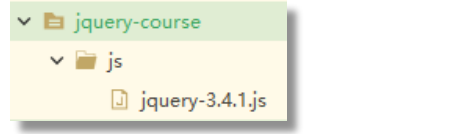
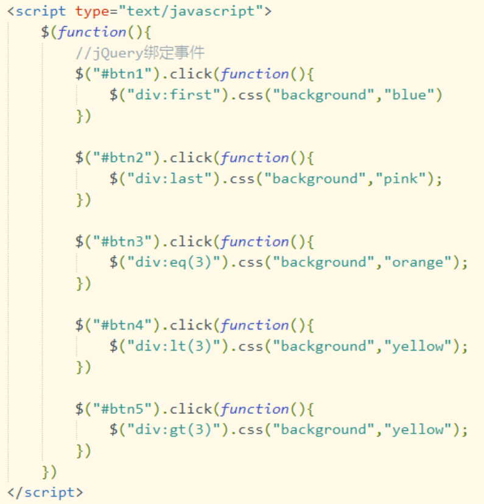
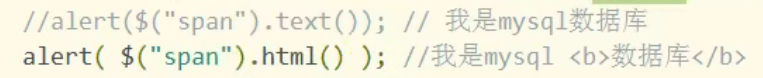
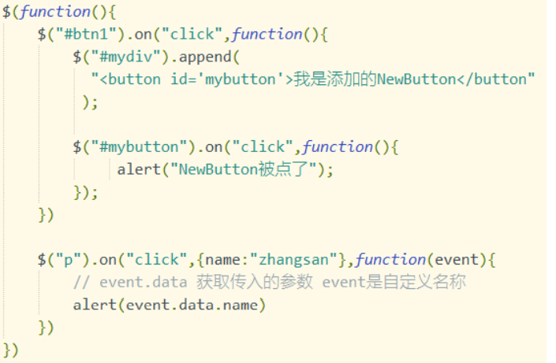

# jQuery

## jQuery的介绍

jQuery 是一款跨主流浏览器的 JavaScript 库，封装了 JavaScript 相关方法调用，简化 JavaScript 对 HTML DOM 操作

## dom对象和jquery对象

DOM 对象是用 JavaScript 语法创建的对象，也看做是 js 对象。

jquery对象是用jquery语法创建的对象

**注意：jquery对象都是`数组`，数组是dom对象**

### dom对象和jquery对象的相互转换

dom对象可以转为jquery对象，语法：  $(dom对象)

jquery对象也可以转为dom对象，语法：从jQuery数组中获取第一个对象，第一个对象就是dom对象，使用[0]或者get{0}.

为什么要进行dom和jquery的转换：目的是要使用对象的方法。

当你是dom对象时，只可以使用dom对象的属性或者方法，如果你要想使用jquery提供的函数，必须是jquery对像才可以。


## jQuery的使用

### 1.引入jar包

### 2.jquery库的引入

使用 jQuery，首先要将 jQuery 库引入。使用如下语句：

<script type="text/javascript" src="js/jquery-3.4.1.js"></script>

### 3.jQuery的函数初见

当页面加载后执行function中的代码

```javascript
/*
	1.$(document),$是jquery中的函数名称，document是函数的参数作用是document对象变成jquery函数库可以使用的对象
	2.ready：是jquery中的函数，是准备的意思，当页面的dom对象加载成功后会执行ready函数的内容。ready相当于js中的onload时间
	3.function（）自定义的标识onload后要执行的功能
*/
$(document).ready(function(){
//自定义功能代码
​		alert("Hello World")
})
```

jQuery也给了我们一个简单的方式

```javascript
$(function(){

//自定义功能代码

​		alert("Hello World")

})
```

jquery的一个例子

```jsp
<%@ page contentType="text/html;charset=UTF-8" language="java" %>
<html>
<head>
    <title>Title</title>
    <script type="text/javascript" src="js/jquery-3.6.0.js"></script>
    <script type="text/javascript">
        function btnClick(){
            var obj=document.getElementById("btn");
            alert(obj.value);
            var obj2=$(obj);
            alert(obj2.val())
            alert(123)
        }
    </script>
</head>
<body>
    <input type="button" id="btn" value="-我是按扭-" onclick="btnClick()">
</body>
</html>
```


Jquery基本注意的：

​		1.jquery对象(就是一个数组)：

​		从表单中获取value值$("#btn")，

```javascript
function btnonclick(){
				var zhi=$("#txt")[0];
				var one=zhi.value
				zhi.value=one*one
			}
```


​		 

```javascript
var btn=document.getElementById("btn");
				alert("1="+btn.value)
				var $btn=$(btn)
				alert($btn.val())
```

jquery基本内容：

添加一个$（document）.ready(function(){})再在内部加入选择器确定对象，通过选择器为某个对象确立方法即可


$(function(){
				$("#btn1").click(function(){
					var obj=$(":text")
					obj.val(12345)
					var obj2=$(":text:disabled")
					alert(obj2.val())
				})
				$("#btn2").click(function(){
					var obj=$(":checkbox:checked")
					for(var i=0;i<obj.length;i++){
						// alert(obj[i].value)
						alert($(obj[i]).val())
					}
				})
				
				

	$(document).ready(function(){
		
	})
## 选择器

### 基本选择器

**1.id 选择器**

语法：$(“#id”)

**2.class 选择器**

语法：$(“.class 名称”)

**3.标签选择器**

语法：$(“标签名”)

**4.所有选择器**

语法：$(“*”) 选取页面中所有 DOM 对象。

**5.组合选择器**

语法：$(“id,class,标签名”)

### **表单选择器**

语法： $(":type 属性值")

$(":text")

$(":password")

$(":radio")


## 过滤器

### **基本过滤器**

**1.选择第一个 first, 保留数组中第一个 DOM 对象**

语法：$(“选择器:first”)

**2.选择最后个 last, 保留数组中最后 DOM 对象**

语法：$("选择器:last")

**3.选择数组中指定对象**

语法：$(“选择器:eq(数组索引)”)

**4.选择数组中小于指定索引的所有 DOM 对象**

语法：$(“选择器:lt(数组索引)”)

**5.选择数组中大于指定索引的所有 DOM 对象**

语法：$(“选择器:gt(数组索引)”)



### **表单对象属性过滤器**

**1.选择可用的文本框**

$(“:text:enabled”)

**2.选择不可用的文本框**

$(“:text:disabled”)

**3.复选框选中的元素**

$(“:checkbox:checked”)

**4.选择指定下拉列表的被选中元素**

选择器>option:selected

## 函数

### 第一组

#### 1.val

操作数组中 DOM 对象的 value 属性.

$(选择器).val() ：无参数调用形式， 读取数组中第一个 DOM 对象的 value 属性值 

$(选择器).val(值)：有参形式调用;对数组中所有 DOM 对象的 value 属性值进行统一赋值

#### 2.text 

操作数组中所有 DOM 对象的【文字显示内容属性】

$(选择器).text():无参数调用，读取数组中所有 DOM 对象的文字显示内容，将得到内容拼接 为一个字符串返回 

$(选择器).text(值):有参数方式，对数组中所有 DOM 对象的文字显示内容进行统一赋值

#### 3.attr 

对 val, text 之外的其他属性操作 

$(选择器).attr(“属性名”): 获取 DOM 数组第一个对象的属性值 

$(选择器).attr(“属性名”,“值”): 对数组中所有 DOM 对象的属性设为新值

### 第二组

#### 1.remove 

$(选择器).remove() : 将数组中所有 DOM 对象及其子对象一并删除 

#### 2.empty 

$(选择器).empty()：将数组中所有 DOM 对象的子对象删除

#### 3.append 

为数组中所有 DOM 对象添加子对象 $(选择器).append("我动态添加的 div")

#### 4.html 

设置或返回被选元素的内容（innerHTML）。 

$(选择器).html()：无参数调用方法，获取 DOM 数组第一个匹元素的内容。 （标签中的内容时什么就显示什么，包括html标签内容）

$(选择器).html(值)：有参数调用，用于设置 DOM 数组中所有元素的内容。

$(选择器).text()：无参数调用方法，用于设置 DOM 数组中所有元素的内容。（不会显示html标签中的内容）



#### 5.each 

each 是对数组，json 和 dom 数组等的遍历,对每个元素调用一次函数。 

语法 1：$.each( 要遍历的对象, function(index,element) { 处理程序 } ) 

语法 2：jQuery 对象.each( function( index, element ) { 处理程序 } ) 

index: 数组的下标 

element: 数组的对象


**注：$相当于java的一个类名**

​		**each：就是类中的静态方法**

例子：

```js
$("#btn4").click(function () {
                var array=[13,1,15];
                $.each(array,function (i,ele) {
                    alert("---"+i+"ele:"+ele)
                })
            })
$("#btn5").click(function () {
                var json={"最爱的人":"尤梓涵","最稀罕的心情":56};
                $.each(json,function (i,ele) {
                    alert("---"+i+"ele:"+ele)
                })
            })
```


## 事件

### 定义元素监听事件

语法：$(选择器).监听事件名称（处理函数）；

说明：监听事件名称是js事件中去掉on后的内容，js中的onclick的监听事件名称就是click

例如：

为页面中所有的button绑定onclick，并关联处理函数fun1

```js
$("button").click(fun1(){
     alert("hello world！！！") 
})
```


题外话：

运行jquery时有一个ready的事件

```js
$(document).ready(函数)

$(function(){
    
})
```

事件：

事件需要写在$(document).ready(函数)内的原因

```
$(document).ready(函数)：                 在页面加载后才会执行ready里面的函数
$(document).ready(function(){            当页面dom加载后，给对象绑定事件，因为此时button对象已经在内存中创建好了，才能使用
	$("#btn2").click(function(){
                var arr=[11,22,33];
                $.each(arr,function(index,element){
                    alert("循环变量："+index+"|||数组成员："+element);
                })
            })
})
```

### on() 绑定事件

on() 方法在**被选元素上添加事件处理程序**。该方法给 API 带来很多便利，推荐使用该方法

语法：$(选择器).on(event,,data,function) 

event：事件一个或者多个，多个之间空格分开 

data：可选。规定传递到函数的额外数据，json 格式 

function: 可选。规定当事件发生时运行的函数。


例子：

****

## 使用jQuery实现Ajax

### 简介

使用jquery的函数，实现ajax请求的处理

没有jQuery之前，使用XMLHttpRequest做ajax，有四个步骤。jquery简化了ajax请求的处理

使用三个函数可以实现ajax请求的处理。

1）$.ajax() : jquery中实现ajax的核心函数

2）$.post() : 使用post方式做ajax请求。

3）$.get() : 使用get方式做ajax请求。

**注：$.post()和$.get()他们在内部都是调用的$.ajax()** 


介绍：$.ajax函数的使用，函数的参数表示请求的url，请求的方法，参数值等信息。

​		   $.ajax参数是一个json的结构。

语法：$.ajax( { name:value, name:value, ... } )

例子：$.ajax({async:true,

​				contentType:"application/json",

​				dataType:“json”，

​				

​			})

json结构的参数说明：

async ： 布尔值，表示请求是否异步处理。默认是 true

contentType ：发送数据到服务器时所使用的内容类型。默认是： "application/x-www-form-urlencoded"。

data：规定要发送到服务器的数据，可以是：string， 数组，多数是 json

dataType：期望从服务器响应的数据类型。jQuery 从 xml, json, text

当我们使用$.ajax()发起请求时，会把dataType的值发送给服务器，那我们的servlet能够读取到dataType的值，就知道你的浏览器需要的是json或者xml的数据，那么服务器就可以返回你需要的数据格式。

​					这些中测试最可能 的类型 

​					"xml" - 一个 XML 文档 

​					"html" - HTML 作为纯文本 

​					"text" - 纯文本字符串 

​					"json" - 以 JSON 运行响应，并以对象返回

error(xhr,status,error)：如果请求失败要运行的函数, 其中 xhr, status, error 是自定义的形参名

success(result,status,xhr)：当请求成功时运行的函数，其中 result, status, xhr 是自定义的形参 名

type：规定请求的类型（GET 或 POST 等），默认是 GET， get，post 不用区分大小写

url：规定发送请求的 URL。


例子

### **用jquery实现ajax**

$.ajax({})参数是 json 的数据，包含请求方式，数据，回调方法等

语法： $.ajax( { name:value, name:value, ... } )


ajax的第一步：创建对象，$.ajax({})自动创建

ajax的第二步：onreadystatechange()事件，判断是否请求成功执行，加执行成功后的函数

​						jquey中的$.ajax({})以success：function（resp）{}事件返回

​						resp返回对象类型由dateType参数获取你想要的类型数据（servlet传回来的数据转为json类型，就算响应类型是application/json，可能为传输至jsp界面时转为了string类型）

ajax的第三步：初始化请求参数， ①请求方式默认为get可以不写②需要写url，以json格式③同步还是异步，默认为异步

​																											url中所带的数据写在date参数中			

ajax的第四步：发送请求


```javascript
$(document).ready(function(){
    $("#btn2").click(function(){
        var proid=$("#proid").val();
        var proidurl="/untitled4_war_exploded/ajaxjson?proid=" + proid
        $.ajax({
            url:proidurl,
            date:{"proid":proid},//传值
            dateType:"json",//希望返回的类型，并转为该类型对象
            success:function(resp){//请求成功后执行的函数，形参自定义，形参内容为返回的对象，对象类型由dateType确定
                //resp为json对象（即是out.print()返回的数据）
                $("#proname").val(resp.name);
                $("#projiancheng").val(resp.jiancheng);
                $("#proshenghui").val(resp.shenghui1);
            }
        })
    })

})
```


