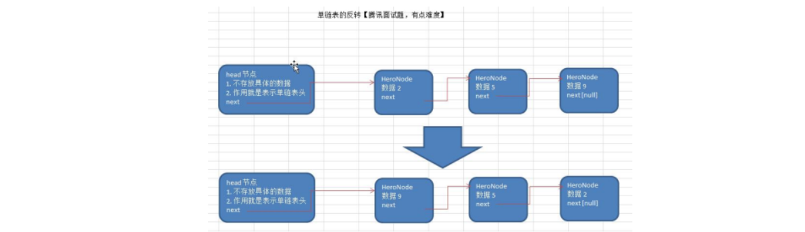

# 数据结构与算法

## 数据结构的基本概念

**程序=数据结构+算法**

数据结构是算法的基础，想要学好算法就得先学好数据结构


## 线性结构

1. 线性结构作为最常用的数据结构，其特点就是**数据元素之间存在一对一**的线性关系
2. 线性结构有两种不同的存储结构，即**顺序存储结构(数组)**和**链式存储结构(链表)**。顺序存储的线性表称为顺序表，顺序表中的存储元素是连续的
3. 链式存储的线性表称为链表，链表中的**存储元素不一定是连续的**，元素节点中存放数据元素以及相邻元素的地址信息

4. 线性结构常见的有数组，队列，链表和栈


## 非线性结构

非线性结构：二维数组，多维数组，广义表，树结构，图结构


# 稀疏数组

应用场景：很多没有意义的数据  -  >  稀疏数组


## **举例**

存储这个二维数组，如果正常的存储方法，浪费内存，浪费空间

这就可以考虑用稀疏数组


## **稀疏数组的处理方法**

记录数组一共**几行几列**，**有多少个不同的值**

把具有**不同值的元素**的行列及值记录在一个**小规模的数组**中，从而缩小程序的规模


## 应用实例


**代码实现**

```java
public class SparseArray {
    public static void main(String[] args) {
//        创建一个二维数组
        int[][] twoArrays=new int[11][11];
        twoArrays[1][2]=1;
        twoArrays[2][3]=2;
        for(int[] list:twoArrays){
            for(int row:list){
                System.out.printf("%d\t",row);
            }
            System.out.println();
        }

//        得到对应的稀疏数组
//        1.得到多少个不同的数字    2分配到对应的二维稀疏数组中
        System.out.println("----对应的稀疏数组---");
        int sum=0;
        for(int[] rows:twoArrays){
            for(int data:rows){
                if(data!=0){
                  sum++;
                }
            }
        }
        int[][] sparseArray=new int[sum+1][3];
        sparseArray[0][0]=11;
        sparseArray[0][1]=11;
        sparseArray[0][2]=sum;
        int count=0;//记录第几个不一样的数字
        for(int i=0;i<11;i++){
            for(int j=0;j<11;j++){
                if (twoArrays[i][j]!=0){
                    count++;
                    sparseArray[count][0]=i;
                    sparseArray[count][1]=j;
                    sparseArray[count][2]=twoArrays[i][j];
                }
            }
        }
//        输出稀疏数组
        for(int i=0;i<sum+1;i++){
            for(int j=0;j<3;j++){
                System.out.printf("%d\t",sparseArray[i][j]);
            }
            System.out.println();
        }
        System.out.println("---转化为对应的二维数组---");

        int[][] twoArrays2=new int[sparseArray[0][0]][sparseArray[0][1]];
        System.out.println(sparseArray.length);
        System.out.println(sparseArray[0].length);

        for(int i=0;i<sparseArray[0][2];i++){
            twoArrays2[sparseArray[i+1][0]][sparseArray[i+1][1]]=sparseArray[i+1][2];
        }

        for(int i=0;i<twoArrays2.length;i++){
            for(int j=0;j<sparseArray[0][1];j++){
                System.out.printf("%d\t",twoArrays2[i][j]);
            }
            System.out.println();
        }

    }
}

```


# 队列

队列是一个有序列表，可以用**数组**或是**链表**来实现。

遵循**先入先出**的原则。即：先存入队列的数据，要先取出。后存入的要后取出

示意图：(使用数组模拟队列示意图)


**一定注意，图中是一个数组，第一个单位是0**


## 正常的数组队列模式

队列本身是有序列表，若使用数组的结构来存储队列的数据，则队列数组的声明如下图, 其中 **maxSize** 是该队列的最大容量。


因为队列的输出、输入是分别从**前后端来处理**，因此需要**两个变量front及rear分别记录队列前后端的下标**，front 会随着数据输出而改变，而 rear则是随着数据输入而改变，如图所示:


### 数组模拟队列思路

当我们需要让数据加入队列，则需让rear指针往后移：**rear+1**，考虑到可能满队列的情况：**rear=MaxSize-1**


## 循环队列模式

在数组模拟队列思路的基础上，我们空出一个单位，作为标记

队空的情况：rear=front            队满的情况：（rear+1）%maxSize==front


## 代码实现

```java
public class LinkList {
    public static void main(String[] args) {
        Node node1=new Node(1,"陈文浩");
        Node node2=new Node(2,"尤梓涵");
        Node node3=new Node(3,"尤梓涵2");
        Node node4=new Node(4,"尤梓涵4");
        Node node42=new Node(3,"尤梓涵32");
//        插入
        ManagerNode managerNode=new ManagerNode();
//        managerNode.insertNewNode(node1);
//        managerNode.insertNewNode(node4);
//        managerNode.insertNewNode(node2);
//        managerNode.insertNewNode(node3);
        managerNode.ByNoInsertNode(node3);
        managerNode.ByNoInsertNode(node1);
        managerNode.ByNoInsertNode(node2);
        managerNode.ByNoInsertNode(node4);

        managerNode.updateNode(node42);
        managerNode.DeleteNode(4);

//        查询
        managerNode.selectLinkList();
    }
}

class ManagerNode{
    public Node headNode=new Node(0,"");

//    插入到最后一个节点   顺序插入
    public void insertNewNode(Node node){
        Node temp;
        temp=headNode;
        while (true){
            if(temp.next==null){
                break;
            }
            temp=temp.next;
        }
        temp.next=node;
    }


//    按照排名插入
    public void ByNoInsertNode(Node node){
        Node temp=headNode;
//        如果链表没有值的话
        if(temp.next==null){
            temp.next=node;
            return;
        }

//        正常情况下
        while(true){
            if(temp.next==null){
                temp.next=node;
                break;
            }

            if(node.no<temp.next.no){

                node.next=temp.next;
                temp.next=node;
                break;
            }
            temp=temp.next;
        }
    }

    public void selectLinkList(){
        if (headNode.next==null){
            System.out.println("不好意思，你这链表没东西");
            return;
        }
        Node temp=headNode;
        while (true){
            temp=temp.next;
            System.out.println(temp);

            if(temp.next==null){
                break;
            }
        }

    }

    public void updateNode(Node node){
        Node temp=headNode;
        if(temp.next==null){
            System.out.println("链表内无数据，不用修改了");
            return;
        }
        temp=temp.next;
        while (true){

            if(temp.no== node.no){
                temp.name= node.name;
                break;
            }
            if(temp.next==null){
                break;
            }
            temp=temp.next;
        }
    }

    public void DeleteNode(int no){
        Node temp=headNode;
        if(headNode.next==null){
            System.out.println("不用删了，这链表本来也啥都没有");
        }
        while(true){
            if(temp.next.no==no){
                temp.next=temp.next.next;
                break;
            }
            if(temp.next==null){
                break;
            }
            temp=temp.next;
        }
    }

}

class Node{
    public int no;
    public String name;
    public Node next;

    public Node(int no,String name){
        this.no=no;
        this.name=name;

    }

    @Override
    public String toString() {
        return "Node{" +
                "no=" + no +
                ", name='" + name + '\'' +
                '}';
    }
}

```

# 链表

## 简介


1)链表是以节点的方式来存储,**是链式存储**

2)每个节点包含 data 域， next 域：指向下一个节点.

3)如图：发现链表的**各个节点不一定是连续存储**.

4)链表分**带头节点的链表**和**没有头节点的链表**，根据实际的需求来确定


## 单链表


使用带 head头的单向链表实现–英雄排行榜管理完成对英雄人物的增删改查操作。

思路：

元素：节点

将每个节点联系起来，通过节点内的元素。

细节：头节点，注意头节点，我们单独给他设置


**代码演示**

```java
public class LinkList {
    public static void main(String[] args) {
        Node node1=new Node(1,"陈文浩");
        Node node2=new Node(2,"尤梓涵");
        Node node3=new Node(3,"尤梓涵2");
        Node node4=new Node(4,"尤梓涵4");
        Node node42=new Node(3,"尤梓涵32");
//        插入
        ManagerNode managerNode=new ManagerNode();
//        managerNode.insertNewNode(node1);
//        managerNode.insertNewNode(node4);
//        managerNode.insertNewNode(node2);
//        managerNode.insertNewNode(node3);
        managerNode.ByNoInsertNode(node3);
        managerNode.ByNoInsertNode(node1);
        managerNode.ByNoInsertNode(node2);
        managerNode.ByNoInsertNode(node4);

        managerNode.updateNode(node42);
        managerNode.DeleteNode(4);

//        查询
        managerNode.selectLinkList();
    }
}

class ManagerNode{
    public Node headNode=new Node(0,"");

//    插入到最后一个节点   顺序插入
    public void insertNewNode(Node node){
        Node temp;
        temp=headNode;
        while (true){
            if(temp.next==null){
                break;
            }
            temp=temp.next;
        }
        temp.next=node;
    }


//    按照排名插入
    public void ByNoInsertNode(Node node){
        Node temp=headNode;
//        如果链表没有值的话
        if(temp.next==null){
            temp.next=node;
            return;
        }

//        正常情况下
        while(true){
            if(temp.next==null){
                temp.next=node;
                break;
            }

            if(node.no<temp.next.no){

                node.next=temp.next;
                temp.next=node;
                break;
            }
            temp=temp.next;
        }
    }

    public void selectLinkList(){
        if (headNode.next==null){
            System.out.println("不好意思，你这链表没东西");
            return;
        }
        Node temp=headNode;
        while (true){
            temp=temp.next;
            System.out.println(temp);

            if(temp.next==null){
                break;
            }
        }

    }

    public void updateNode(Node node){
        Node temp=headNode;
        if(temp.next==null){
            System.out.println("链表内无数据，不用修改了");
            return;
        }
        temp=temp.next;
        while (true){

            if(temp.no== node.no){
                temp.name= node.name;
                break;
            }
            if(temp.next==null){
                break;
            }
            temp=temp.next;
        }
    }

    public void DeleteNode(int no){
        Node temp=headNode;
        if(headNode.next==null){
            System.out.println("不用删了，这链表本来也啥都没有");
        }
        while(true){
            if(temp.next.no==no){
                temp.next=temp.next.next;
                break;
            }
            if(temp.next==null){
                break;
            }
            temp=temp.next;
        }
    }

}

class Node{
    public int no;
    public String name;
    public Node next;

    public Node(int no,String name){
        this.no=no;
        this.name=name;

    }

    @Override
    public String toString() {
        return "Node{" +
                "no=" + no +
                ", name='" + name + '\'' +
                '}';
    }
}

```

## 单链表面试题

单链表的常见面试题有如下:

1)求单链表中有效节点的个数

2)查找单链表中的倒数第k个结点 【新浪面试题】

3)单链表的反转【腾讯面试题，有点难度】

**就是用头插法**




4)从尾到头打印单链表 【百度，要求方式1：反向遍历 。 方式2：Stack栈】

**不允许破坏结构，栈就是很好的解决方法**


5)合并两个有序的单链表，合并之后的链表依然有序【课后练习.】


```java
import java.util.Stack;

public class LinkList {
    //    获得单链表有效节点的个数
    public static int getUsefulNode(Node headNode){
        int temp=0;
        Node tempNode=headNode;
        while (true){
            if(tempNode.next==null){
                break;
            }
            temp++;
            tempNode=tempNode.next;
        }
        return temp;
    }
    public static void main(String[] args) {
        Node node1=new Node(1,"陈文浩");
        Node node2=new Node(2,"尤梓涵");
        Node node3=new Node(3,"尤梓涵2");
        Node node4=new Node(4,"尤梓涵4");
        Node node42=new Node(3,"尤梓涵32");
//        插入
        ManagerNode managerNode=new ManagerNode();
//        managerNode.insertNewNode(node1);
//        managerNode.insertNewNode(node4);
//        managerNode.insertNewNode(node2);
//        managerNode.insertNewNode(node3);
        managerNode.ByNoInsertNode(node3);
        managerNode.ByNoInsertNode(node1);
        managerNode.ByNoInsertNode(node2);
        managerNode.ByNoInsertNode(node4);

//        managerNode.updateNode(node42);
//        managerNode.DeleteNode(4);

//        查询
        managerNode.selectLinkList(managerNode.headNode);
//        System.out.println(getUsefulNode(managerNode.headNode));

//        两级反转
        System.out.println("-----------------------");
//        Node inNode=managerNode.inNode(managerNode.headNode);
//        managerNode.selectLinkList(inNode);
        managerNode.inNode(managerNode.headNode);

//        打印原来的
        managerNode.selectLinkList(managerNode.headNode);
        System.out.println("-----------------------");
//        逆序打印单链表
        managerNode.inWrite(managerNode.headNode);
    }
}

class ManagerNode{
    public Node headNode=new Node(0,"");

//    插入到最后一个节点   顺序插入
    public void insertNewNode(Node node){
        Node temp;
        temp=headNode;
        while (true){
            if(temp.next==null){
                break;
            }
            temp=temp.next;
        }
        temp.next=node;
    }
//    按照排名插入
    public void ByNoInsertNode(Node node){
        Node temp=headNode;
//        如果链表没有值的话
        if(temp.next==null){
            temp.next=node;
            return;
        }

//        正常情况下
        while(true){
            if(temp.next==null){
                temp.next=node;
                break;
            }

            if(node.no<temp.next.no){

                node.next=temp.next;
                temp.next=node;
                break;
            }
            temp=temp.next;
        }
    }
    public void selectLinkList(Node headNode){
        if (headNode.next==null){
            System.out.println("不好意思，你这链表没东西");
            return;
        }
        Node temp=headNode;
        while (true){
            temp=temp.next;
            System.out.println(temp);

            if(temp.next==null){
                break;
            }
        }

    }
//    逆序打印
    public void inWrite(Node headNode){
        Stack<Node> stack=new Stack();
        Node temp=headNode;
        while (temp.next!=null){
            stack.add(temp.next);
            temp=temp.next;
        }
        while (!stack.empty()){
            System.out.println(stack.pop());
        }

    }
//    反转
    public void inNode(Node headNode){
        Node temp=headNode.next;
        Node next=null;
        Node inHeadNode=new Node(0,"");
        while (temp!=null){
            next=temp.next;
            temp.next=inHeadNode.next;
            inHeadNode.next=temp;
            temp=next;
        }
        headNode.next=inHeadNode.next;
    }
    public void updateNode(Node node){
        Node temp=headNode;
        if(temp.next==null){
            System.out.println("链表内无数据，不用修改了");
            return;
        }
        temp=temp.next;
        while (true){

            if(temp.no== node.no){
                temp.name= node.name;
                break;
            }
            if(temp.next==null){
                break;
            }
            temp=temp.next;
        }
    }
    public void DeleteNode(int no){
        Node temp=headNode;
        if(headNode.next==null){
            System.out.println("不用删了，这链表本来也啥都没有");
        }
        while(true){
            if(temp.next.no==no){
                temp.next=temp.next.next;
                break;
            }
            if(temp.next==null){
                break;
            }
            temp=temp.next;
        }
    }
    public void inWriteList(){
        Node temp=headNode;
        int t=0;
        if(temp.next==null){
            System.out.println("不好意思，这个链表没东西");
            return;
        }
        while (true){
            if(headNode.next==null){

                break;
            }
            temp=temp.next;
        }
    }
}

class Node implements Cloneable{
    public int no;
    public String name;
    public Node next;

    public Node clone()throws  CloneNotSupportedException{
        return (Node) super.clone();
    }

    public Node(int no,String name){
        this.no=no;
        this.name=name;

    }

    @Override
    public String toString() {
        return "Node{" +
                "no=" + no +
                ", name='" + name + '\'' +
                '}';
    }
}

```

## 双向链表

- 单向链表，**查找的方向只能是一个方向**，而双向链

 表可以向前或者向后查找。

- 单向链表不能自我删除，需要靠辅助节点 ，而双向

 链表，则可以**自我删除**，所以前面我们单链表删除

 时节点，总是找到temp,temp是待删除节点的前一

 个节点(认真体会).

- 示意图帮助理解删除

  

  

**其实就是再每个节点加一个指向前节点的属性**

```java
public class DoubleLinkList {
    public static void main(String[] args) {
        DoubleListManager doubleListManager=new DoubleListManager();
        DoubleNode dn1=new DoubleNode(1,"cwh1");
        DoubleNode dn2=new DoubleNode(2,"cwh2");
        DoubleNode dn3=new DoubleNode(3,"cwh3");
        DoubleNode dn4=new DoubleNode(4,"cwh4");
        doubleListManager.insertNode(dn1);
        doubleListManager.insertNode(dn2);
        doubleListManager.insertNode(dn3);
        doubleListManager.insertNode(dn4);
        doubleListManager.deleteDoubleNode(4);
        doubleListManager.selectDoubleList(DoubleListManager.headNode);
    }
}
class DoubleListManager{
    public static DoubleNode headNode=new DoubleNode(0,"");
    public void insertNode(DoubleNode node){
        DoubleNode temp=headNode;
        while (true){
            if(temp.next==null){
                temp.next=node;
                node.pre=temp;
                break;
            }

            temp=temp.next;
        }
    }
    public void selectDoubleList(DoubleNode headNode){
        DoubleNode temp=headNode;
        if(temp.next==null){
            System.out.println("该表没东西");
            return;
        }
        while (temp.next!=null){
            System.out.println(temp.next);
            temp=temp.next;
        }
    }
    public void deleteDoubleNode(int no){
        DoubleNode temp=headNode.next;
        if(temp.next==null){
            System.out.println("这个链表为空，不用删除");
        }
        while(true){
            if(temp.next==null){
                temp.pre.next=null;
                break;
            }
            if(temp.no==no){
                temp.pre.next=temp.next;
                temp.next.pre=temp.pre;
                break;
            }

            temp=temp.next;
        }
    }
}
class DoubleNode{
    public int no;
    public String name;
    public DoubleNode next;
    public DoubleNode pre;

    public DoubleNode(int no, String name) {
        this.no = no;
        this.name = name;
    }

    public int getNo() {
        return no;
    }

    public void setNo(int no) {
        this.no = no;
    }

    public String getName() {
        return name;
    }

    public void setName(String name) {
        this.name = name;
    }

    public DoubleNode getNext() {
        return next;
    }

    public void setNext(DoubleNode next) {
        this.next = next;
    }

    public DoubleNode getPre() {
        return pre;
    }

    public void setPre(DoubleNode pre) {
        this.pre = pre;
    }

    @Override
    public String toString() {
        return "DoubleNode{" +
                "no=" + no +
                ", name='" + name + '\'' +
                '}';
    }
}

```

## 单向环形链表

### 约瑟夫问题

​	Josephu问题为:设编号为1，2，… n的n个人围坐一圈，约定编号为k (l<=k<=n)的人从1开始报数，数到m 的那个人出列，它的下一位

又从1开始报数，数到m 的那个人又出列，依次类推，直到所有人出列为止，由此产生一个出队编号的序列。


​	提示:用一个不带头结点的循环链表来处理.Josephu问题:先构成一个有n个结点的单循环链表，然后由k结点起从1开始计数，计到m时，

对应结点从链表中删除，然后再从被删除结点的下一个结点又从1开始计数，直到最后一个结点从链表中删除算法结束。结点从链表中删

除算法结束。


```java
public class YueSeFu {
    public static void main(String[] args) {
        YSFNodeManager manager=new YSFNodeManager();
        manager.createList(120);
        manager.selectList();
        manager.outQueen(1,2,120);
    }

}
class YSFNodeManager{
    public YSFNode first;
    public void createList(int n){
        if(n<1){
            System.out.println("输入错误");
        }
        YSFNode temp=null;
        for(int i=1;i<=n;i++){

            YSFNode node=new YSFNode(i);
            if(i==1){
                first=node;
                first.next=first;
                temp=node;
            }
            else {
                temp.next=node;
                node.next=first;
                temp=node;
            }
        }
    }
    public void selectList(){
        YSFNode temp=first;
        if(first.next==null){
            System.out.println("这个表没东西");
            return;
        }
        while (true){
            if(temp.next==first){
                System.out.println(temp);
                break;
            }
            System.out.println(temp);
            temp=temp.next;
        }

    }
    public void outQueen(int count,int saycounts,int sumchild){//count指的从第几个人开始数的，ks指的是数多少次，sums指的是多少个小孩
//        确定rear指针
        YSFNode rear;
        YSFNode temp=first;
        while(true){
            if(temp.next==first){
                rear=temp;
                break;
            }
            temp=temp.next;
        }
//        从第count个人开始，喊的数字saycounts次，总共有sumchild个小孩
        for(int i=0;i<count-1;i++){
            rear=rear.next;
            first=rear.next;
        }
        while(sumchild!=0){
            for(int i=0;i<saycounts-1;i++){
                rear=rear.next;
                first=rear.next;
            }
            System.out.println(first.no);
            rear.next=first.next;
            first=rear.next;
            sumchild--;
        }


    }
}
class YSFNode{
    public int no;
    public YSFNode next;

    public YSFNode(int no) {
        this.no = no;

    }

    @Override
    public String toString() {
        return "YSFNode{" +
                "no=" + no +
                '}';
    }

    public int getNo() {
        return no;
    }

    public void setNo(int no) {
        this.no = no;
    }


    public YSFNode getNext() {
        return next;
    }

    public void setNext(YSFNode next) {
        this.next = next;
    }
}

```


# java中的知识点

1.java输出空格：/t

```
System.out.printf("%d\t",row);
```

2.注意java对象，复制不能直接用“等号”，要用clone

clone用法

clone是Object的一个protect类，因为protect权限，所以想要用clone（），只能重写clone方法

**例子：**

```java
class Node implements Cloneable{
    public int no;
    public String name;
    public Node next;

    public Node clone()throws  CloneNotSupportedException{
        return (Node) super.clone();
    }
}
```


3.字符串中取出1~2个字符串，再给他转成字符

```
String expression="7*2-5*2-5+2";
index=expression.substring(temp,temp+1).charAt(0);
```


5.StringBuffer

```
StringBuffer添加字符串。
StringBuffer sb=new StringBuffer();
String str="i love world";
sb.append(str);

```


6.字符串判断相等

```
String s="adwad";
if(s.equals("adwad")){

}
```


7.将其他类型转换成String类


8.正则表达式的匹配

```
list.matches("\\d+")    //查看list字符串是否是duo'wei'z
```


9.switch

```
switch (expression) {

    case value1:

         break;

    case value2:

         break;

    ... case valueN:

         break;

    default:

     

}
```


10.Stack

```
```


4. 

抛出异常晚点再复习复习。

