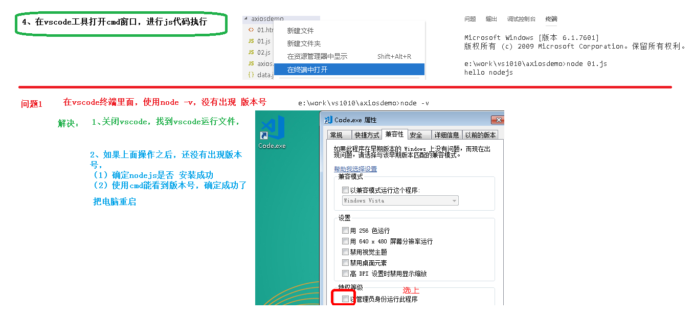
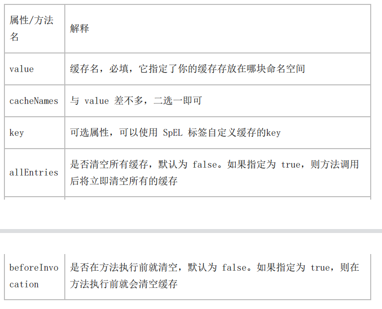

# 项目常用方法

# 配置Swagger2生成API接口文档

## 一、Swagger2介绍  

>前后端分离开发模式中，api文档是最好的沟通方式。
>
>Swagger 是一个规范和完整的框架，用于生成、描述、调用和可视化 RESTful 风格的 Web 服务。  
>
>1. 及时性 (接口变更后，能够及时准确地通知相关前后端开发人员)
>
>1. 规范性 (并且保证接口的规范性，如接口的地址，请求方式，参数及响应格式和错误信息)
>
>1. 一致性 (接口信息一致，不会出现因开发人员拿到的文档版本不一致，而出现分歧)
>
>1. 可测性 (直接在接口文档上进行测试，以方便理解业务)


## 二、配置Swagger2

### **1、创建common模块**

**在guli-parent下创建模块common**

配置：

groupId：com.atguigu

artifactId：common  


### **2、在common中引入相关依赖**

```xml
 <dependencies>
        <dependency>
            <groupId>org.springframework.boot</groupId>
            <artifactId>spring-boot-starter-web</artifactId>
            <scope>provided </scope>
        </dependency>

        <!--mybatis-plus-->
        <dependency>
            <groupId>com.baomidou</groupId>
            <artifactId>mybatis-plus-boot-starter</artifactId>
            <scope>provided </scope>
        </dependency>

        <!--lombok用来简化实体类：需要安装lombok插件-->
        <dependency>
            <groupId>org.projectlombok</groupId>
            <artifactId>lombok</artifactId>
            <scope>provided </scope>
        </dependency>

        <!--swagger-->
        <dependency>
            <groupId>io.springfox</groupId>
            <artifactId>springfox-swagger2</artifactId>
            <scope>provided </scope>
        </dependency>
        <dependency>
            <groupId>io.springfox</groupId>
            <artifactId>springfox-swagger-ui</artifactId>
            <scope>provided </scope>
        </dependency>

        <!-- redis -->
        <dependency>
            <groupId>org.springframework.boot</groupId>
            <artifactId>spring-boot-starter-data-redis</artifactId>
        </dependency>

        <!-- spring2.X集成redis所需common-pool2
        <dependency>
            <groupId>org.apache.commons</groupId>
            <artifactId>commons-pool2</artifactId>
            <version>2.6.0</version>
        </dependency>-->
    </dependencies>
```


### 3、在common下面创建子模块service-base


### 4、在模块service-base中，创建swagger的配置类

创建包com.atguigu.servicebase.config，创建类SwaggerConfig

```java
@Configuration
@EnableSwagger2
public class SwaggerConfig {

    @Bean
    public Docket webApiConfig(){

        return new Docket(DocumentationType.SWAGGER_2)
                .groupName("webApi")
                .apiInfo(webApiInfo())
                .select()
                .paths(Predicates.not(PathSelectors.regex("/admin/.*")))
                .paths(Predicates.not(PathSelectors.regex("/error.*")))
                .build();

    }

    private ApiInfo webApiInfo(){

        return new ApiInfoBuilder()
                .title("网站-课程中心API文档")
                .description("本文档描述了课程中心微服务接口定义")
                .version("1.0")
                .contact(new Contact("Helen", "http://atguigu.com", "55317332@qq.com"))
                .build();
    }
}
```


### 5、在模块service模块中引入service-base

```xml
<dependency>
    <groupId>com.atguigu</groupId>
    <artifactId>service-base</artifactId>
    <version>0.0.1-SNAPSHOT</version>
</dependency>
```


### **6、在service-edu启动类上添加注解，进行测试**

**解释：因为Swagger2这个配置类和该项目不在同一个模块下，但是com.atguigu这个包却是都有的，所以可以扫描到**


**6、测试**

http://localhost:8001/swagger-ui.html#


## 三  操作步骤


# 小方法

测试是否是空串，null

```
import org.springframework.util.StringUtils;
```

```
!StringUtils.isEmpty(name)
```


# 统一异常处理

## **什么是统一异常处理**

我们想让异常结果也显示为统一的返回结果对象，并且统一处理系统的异常信息，那么需要统一异常处理


## **创建统一异常处理器**

在service-base中创建统一异常处理类GlobalExceptionHandler.java：

- 加注解@ControllerAdvice
- 加注解@ExceptionHandler(Exception.class)

```java
//统一异常处理
@ControllerAdvice
public class GlobalExceptionHandler {

    @ResponseBody
    @ExceptionHandler(Exception.class)
    public Result error(Exception e){
        e.printStackTrace();
        return Result.error();//也可以随意发挥，Result这个只是统一返回数据格式
    }
}
```


**测试**


## **处理特定异常**

添加异常处理方法

GlobalExceptionHandler.java中添加

```java
@ExceptionHandler(ArithmeticException.class)  //特定异常
@ResponseBody
public R error(ArithmeticException e){
	e.printStackTrace();
	return R.error().message("执行了自定义异常");
}
```


**测试**


## **自定义异常**

**创建自定义异常类**

```java
@Data
@AllArgsConstructor
@NoArgsConstructor
public class GuliException extends RuntimeException {
 	@ApiModelProperty(value = "状态码") 
    private Integer code; 
    private String msg;
 
 }
```


**业务中需要的位置抛出****GuliException**

```java
try {
	int a = 10/0; 
}catch(Exception e) {
	throw new GuliException(20001,"出现自定义异常");
}
```


**添加异常处理方法**

GlobalExceptionHandler.java中添加

```java
 @ExceptionHandler(GuliException.class) 

 @ResponseBody

 public R error(GuliException e){

 	e.printStackTrace();

 	return R.error().message(e.getMsg()).code(e.getCode());

}
```


**测试**


# 跨包扫描类的办法

**@ComponentScan注解是什么**

>其实很简单，@ComponentScan主要就是定义**扫描的路径**从中找出标识了**需要装配**的类自动装配到spring的bean容器中
>
>


将需要关联的包的依赖添加到操作的项目的pom中

然后再在主方法上加入

```java
@ComponentScan(basePackages = {"com.atguigu"})
```


# ES6语法

## 基本语法

### let声明变量

```js
// var 声明的变量没有局部作用域
// let 声明的变量  有局部作用域
{
	var a = 0
	let b = 1
}
console.log(a)  // 0
console.log(b)  // ReferenceError: b is not defined
```


```js
// var 可以声明多次
// let 只能声明一次
var m = 1
var m = 2
let n = 3
let n = 4
console.log(m)  // 2
console.log(n)  // Identifier 'n' has already been declared
```


### const声明常量（只读变量）

```js
// 1、声明之后不允许改变    
const PI = "3.1415926"
PI = 3  // TypeError: Assignment to constant variable.
```


```js
// 2、一但声明必须初始化，否则会报错
const MY_AGE  // SyntaxError: Missing initializer in const declaration
```


### 解构赋值

```js
//1、数组解构
// 传统
let a = 1, b = 2, c = 3
console.log(a, b, c)
// ES6
let [x, y, z] = [1, 2, 3]
console.log(x, y, z)
```


```js
//2、对象解构
let user = {name: 'Helen', age: 18}
// 传统
let name1 = user.name
let age1 = user.age
console.log(name1, age1)
// ES6
let { name, age } =  user//注意：结构的变量必须是user中的属性
console.log(name, age)	
```


### 模板字符串

>模板字符串相当于加强版的字符串，用反引号 `,除了作为普通字符串，还可以用来定义多行字符串，还可以在字符串中加入变量和表达式

```js
// 1、多行字符串
let string1 =  `Hey,
can you stop angry now?`
console.log(string1)
// Hey,
// can you stop angry now?
```


```js
// 2、字符串插入变量和表达式。变量名写在 ${} 中，${} 中可以放入 JavaScript 表达式。
let name = "Mike"
let age = 27
let info = `My Name is ${name},I am ${age+1} years old next year.`
console.log(info)
// My Name is Mike,I am 28 years old next year.
```


```js
// 3、字符串中调用函数
function f(){
    return "have fun!"
}
let string2 = `Game start,${f()}`
console.log(string2);  // Game start,have fun!
```


### 声名对象简写

申明对象需要使用常量定义符（const）


```js
const age = 12
const name = "Amy"

// 传统
const person1 = {age: age, name: name}
console.log(person1)

// ES6
const person2 = {age, name}
console.log(person2) //{age: 12, name: "Amy"}
```


```js
// 传统
const person1 = {
    sayHi:function(){
        console.log("Hi")
    }
}
person1.sayHi();//"Hi"


// ES6
const person2 = {
    sayHi(){
        console.log("Hi")
    }
}
person2.sayHi()  //"Hi"
```


### 对象拓展运算符

拓展运算符（...）用于取出参数对象所有可遍历属性然后拷贝到当前对象。


```js
// 1、拷贝对象
let person1 = {name: "Amy", age: 15}
let someone = { ...person1 }
console.log(someone)  //{name: "Amy", age: 15}
```


```js
// 2、合并对象
let age = {age: 15}
let name = {name: "Amy"}
let person2 = {...age, ...name}
console.log(person2)  //{age: 15, name: "Amy"}
```


### 箭头函数

箭头函数提供了一种更加简洁的函数书写方式。基本语法是：

```tex
参数 => 函数体
```


```js
// 传统
var f1 = function(a){
    return a
}
console.log(f1(1))


// ES6
var f2 = a => a
console.log(f2(1))
```


```js
// 当箭头函数没有参数或者有多个参数，要用 () 括起来。
// 当箭头函数函数体有多行语句，用 {} 包裹起来，表示代码块，
// 当只有一行语句，并且需要返回结果时，可以省略 {} , 结果会自动返回。
var f3 = (a,b) => {
    let result = a+b
    return result
}
console.log(f3(6,2))  // 8

// 前面代码相当于：
var f4 = (a,b) => a+b
```


# vscode

**创建工作区（不同于idea）**


# Vue

数据必须写在data中


事件需要写在method或data中


## Vue路由

**注意：在引入js中，需要先引入vue.js再引入vue-router.js**


## Vue路由

还是要看看


# axios

## **介绍**

>axios是独立于vue的一个项目，基于promise用于浏览器和node.js的http客户端
>
>- 在浏览器中可以帮助我们完成 ajax请求的发送
>
>- 在node.js中可以向远程接口发送请求


## 使用步骤

**1.引入vue和axios的js文件**

```html
<script src="../vue_js/vue.js"></script>
<script src="axios.min.js"></script>
```


**2.使用axios**

基本使用

```js
btns[2].onclick = function(){
            //发送 AJAX 请求
            axios({
                //请求类型
                method: 'PUT',
                //URL
                url: 'http://localhost:3000/posts/3',
                //设置请求体
                data: {
                    title: "今天天气不错, 还挺风和日丽的",
                    author: "李四"
                }
            }).then(response => {
                console.log(response);
            }).catch(error=>){
                     
            })
        }
```


```js
					// 使用axios发送ajax请求
                    // axios.提交方式("请求接口路径").then("箭头函数").catch("箭头函数")
                    axios.get("json_demo.json")
                    .then(response=>{
                        // console.log(response)
                        this.memberList=response.data.data.items;
                        console.log(this.memberList);
                    })//请求成功执行then方法
                    .catch(error=>{

                    })//请求失败执行error方法
```


## 实例

```html
<!DOCTYPE html>
<html lang="en">

<head>
    <meta charset="UTF-8">
    <meta name="viewport" content="width=device-width, initial￾scale=1.0">
    <meta http-equiv="X-UA-Compatible" content="ie=edge">
    <title>Document</title>
</head>

<body>
    <div id="app">
        <div v-for="(temp,index) in memberList">
            {{temp.name}}--{{temp.age}}
        </div>
    </div>
    <script src="../vue_js/vue.js"></script>
    <script src="axios.min.js"></script>
    <script>
        new Vue({
            el: '#app',
            data: {
                memberList:[]
            },
            created(){
                this.getUserList()
            },
            methods:{//编写具体的方法
                // 创建方法查询所有数据
                getUserList(){
                    // 使用axios发送ajax请求
                    // axios.提交方式("请求接口路径").then("箭头函数").catch("箭头函数")
                    axios.get("json_demo.json")
                    .then(response=>{
                        // console.log(response)
                        this.memberList=response.data.data.items;
                        console.log(this.memberList);
                    })//请求成功执行then方法
                    .catch(error=>{

                    })//请求失败执行error方法
                }
            }
        })
    </script>
</body>

</html>
```


# **element-ui**

## 介绍

>element-ui 是饿了么前端出品的基于 Vue.js的 后台组件库，方便程序员进行页面快速布局和构建
>
>**官网：** http://element-cn.eleme.io/#/zh-CN


# Node.js

## 介绍

>简单的说 Node.js 就是运行在**服务端的 JavaScript。**
>
>Node.js是一个事件驱动I/O服务端JavaScript环境，基于Google的V8引擎，V8引擎执行Javascript的速度(**内置了V8引擎**)
>
>非常快，性能非常好


**题外**

>浏览器的内核包括两部分核心：
>
>- DOM渲染引擎；
>
>- js解析器（js引擎）
>
>**js运行在浏览器中的内核中的js引擎内部**
>
>**Node.js是脱离浏览器环境运行的JavaScript程序，基于V8 引擎（Chrome 的 JavaScript的引擎）**
>
>


## 作用

**前端**

如果你是一个前端程序员，你不懂得像PHP、Python或Ruby等动态编程语言，然后你想创建自己的服务

，那么Node.js是一个非常好的选择。

Node.js 是运行在服务端的 JavaScript，如果你熟悉Javascript，那么你将会很容易的学会Node.js。


**后端**

如果你是后端程序员，想部署一些高性能的服务，那么学习Node.js也是一个非常好的选择


## 安装

**官网：**[Node.js (nodejs.org)](https://nodejs.org/en/)

**中文官网：**http://nodejs.cn/


**查看版本**

有点像java检查是否安装成功的：java-version

```cmd
node -v
```


## **实例**

1. 随便创建一个js文件


2. 运行

打开这个“刚刚创建的js的文件目录”，在该目录下进去cmd窗口中输入命令

```js
node 
```


## 在Vscode中运行Node.js




# NPM包管理器

## 介绍

>**NPM**全称**Node Package Manager**，是Node.js包管理工具，是全球最大的模块生态系统，里面所有的模块都是开源免费的；
>
>也是Node.js的包管理工具，相当于**前端的Maven** 


## **NPM工具的安装位置**

>Node.js默认安装的npm包和工具的位置：**Node.js目录\node_modules**
>
>在这个目录下你可以看见 npm目录，npm本身就是被NPM包管理器管理的一个工具，说明
>
>**Node.js已经集成了npm工具**

*查看是否安装成功*

```xml
#在命令提示符输入 npm -v 可查看当前npm版本
npm -v
```


## 创建npm管理项目

### 项目初始化

1.先创建一个文件夹

2.项目初始化

>**npm init**  
>
>自定义初始化信息
>
>**npm init**
>
>默认初始化信息


```xml
#建立一个空文件夹，在命令提示符进入该文件夹 执行命令初始化
npm init
#按照提示输入相关信息，如果是用默认值则直接回车即可。
#name: 项目名称
#version: 项目版本号
#description: 项目描述
#keywords: {Array}关键词，便于用户搜索到我们的项目
#最后会生成package.json文件，这个是包的配置文件，相当于maven的pom.xml
#我们之后也可以根据需要进行修改。
npm init -y
```


### 修改npm镜像

>NPM官方的管理的包都是从 http://npmjs.com下载的，但是这个网站在国内速度很慢。
>
>这里推荐使用淘宝 NPM 镜像 http://npm.taobao.org/ ，淘宝 NPM 镜像是一个完整 npmjs.com 镜像，
>
>同步频率目前为 10分钟一次，以保证尽量与官方服务同步。


**设置镜像地址**

\#经过下面的配置，以后所有的 npm install 都会经过淘宝的镜像地址下载

**npm config set registry https://registry.npm.taobao.org**

\#查看npm配置信息

**npm config list**


### **npm install命令的使用**

>\#使用 npm install 安装依赖包的最新版，
>
>\#模块安装的位置：项目目录\node_modules
>
>\#安装会自动在项目目录下添加 package-lock.json文件，这个文件帮助锁定安装包的版本
>
>\#同时package.json 文件中，依赖包会被添加到dependencies节点下，类似maven中的
>
><dependencies>
>
>**npm install jquery**
>
>\#npm管理的项目在备份和传输的时候一般不携带node_modules文件夹
>
>**npm install** #根据package.json中的配置下载依赖，初始化项目
>
>\#如果安装时想指定特定的版本
>
>**npm install jquery@2.1.x**
>
>\#devDependencies节点：开发时的依赖包，项目打包到生产环境的时候不包含的依赖
>
>\#使用 -D参数将依赖添加到devDependencies节点
>
>*npm install --save-dev eslint*
>
>\#或
>
>*npm install -D eslint*
>
>\#全局安装
>
>\#Node.js全局安装的npm包和工具的位置：用户目录\AppData\Roaming\npm\node_modules
>
>\#一些命令行工具常使用全局安装的方式
>
>*npm install -g webpack*


### 其他命令

>\#更新包（更新到最新版本）
>
>**npm update 包名**
>
>\#全局更新
>
>**npm update -g 包名**
>
>\#卸载包
>
>**npm uninstall 包名**
>
>\#全局卸载
>
>**npm uninstall -g 包名**
>
>


# Babel转码器

## 简介

>Babel是一个广泛使用的转码器，**可以将ES6代码转为ES5代码，从而在现有环境执行执行。**
>
>这意味着，你可以现在就用 ES6 编写程序，而不用担心现有环境是否支持


## 安装

>#安装 
>
>npm install --global babel-cli
>
> #查看是否安装成功
>
> babel --version


## Babel的使用

### 初始化项目

npm init -y


### 创建文件

src/example.js

下面是一段ES6代码：

>// 转码前
>
>// 定义数据3 let input = [1, 2, 3] 
>
>// 将数组的每个元素 +1
>
>input = input.map(item => item + 1) 
>
>console.log(input)


### 配置babelrc

Babel的配置文件是.babelrc，存放在**项目的根目录**下，该文件用来**设置转码规则和插件**，基本格式如

下

```xml
{ 

	"presets": [],

	"plugins": []

}
```


presets字段设定转码规则，**将es2015规则加入 .babelrc**： 

```xml
{ 

	"presets": ["es2015"],

	"plugins": []

}
```


### **安装转码器**

在项目中安装

```xml
npm install --save-dev babel-preset-es2015
```


### **转码**

>转码结果写入一个文件
>
>**mkdir dist1**
>
>--out-file 或 -o 参数指定输出文件4 **babel src/example.js --out-file dist1/compiled.js**
>
>或者
>
>**babel src/example.js -o dist1/compiled.js**
>
>整个目录转码
>
>**mkdir dist2**
>
> --out-dir 或 -d 参数指定输出目录
>
> **babel src --out-dir dist2**
>
>或者
>
>**babel src -d dist2**
>
>


# 模块化

## 介绍

>传统非模块化开发有如下的缺点：
>
>- 命名冲突
>
>- 文件依赖
>
>模块化规范：
>
>- CommonJS模块化规范
>
>- ES6模块化规范


## CommonJS模块规范(ES5)

>每个文件就是一个模块，**有自己的作用域。在一个文件里面定义的变量、函数、类，都是私有的，对其他文件不可见。**
>
>


**创建model文件夹**


**导出模块**

```js
//定义成员
const sum=function(a,b){
    return parseInt(a)+parseInt(b);
}
const substract=function(a,b){
    return parseInt(a)-parseInt(b);
}
//导出成员
module.exports={
    sum,
    substract
}
```


**导入模块**

```js
//导入成员

const m=require("./01.js");
console.log(m);
console.log(m.sum(1,2),m.substract(2,-5));
```


**运行程序**

node common-js模块化/引入模块.js


>
>
>CommonJS使用 **exports 和require** 来**导出、导入模块**。


## Es6模块化规范


**ES6使用 export 和 import 来导出、导入模块。**


**导出模块**

```js
export function save(){
    console.log("save....")
}

export function getList(){
    console.log("List。。。。");
}
```


**导入模块**

```js
//只取需要的方法即可，多个方法用逗号分隔
import {save,getList} from "./01.js"
getList();
save();
```


**注意：这时的程序无法运行的，因为ES6的模块化无法在Node.js中执行，需要用abel编辑成ES5后再执行。**


**运行程序**

node es6模块化-dist/userComponent.js


## **ES6模块化的另一种写法**(常用)

导出模块

```js
export default{
    getList2(){
        console.log("getList2....");
    },
    save2(){
        console.log("save2.。。。");
    }
}
```


导入模块

```js
import model2 from "./03.js"
model2.getList2();
model2.save2();
```


# Webpack

## 介绍

>Webpack 是一个**前端资源加载/打包工具**。它将根据模块的依赖关系进行静态分析，然后将这些模块按照指定的规则生成对应的静态
>
>资源。
>
>从图中我们可以看出，**Webpack 可以将多种静态资源 js、css、less 转换成一个静态文件，减少了页面的请求**
>
>


## 作用

>webpack的好处：
>
>将多个文件打包成一个文件，因为一个一个去请求文件，这样会增加访问次数，而访问次数太多又是很降低效率的一个事情。
>
>webpack就是将多个文件打包成一个文件，降低请求次数，提高访问速度，增强用户体验。
>
>


## 初始化项目

1.创建webpack文件夹，进入webpack目录，执行命令

**npm init -y** 


2.创建src文件夹


3.src下创建

common.js

```js
exports.info = function (str) {
    document.write(str);
}
```

utils.js

```js
exports.add = function (a, b) {
    return a + b;
}
```

main.js

```js
//const csstest=require('../test.css');
const common = require('./common');
const utils = require('./utils');
common.info('Hello world!' + utils.add(100, 200));
```


## JS打包

**webpack目录下创建配置文件*webpack.config.js***


>以下配置的意思是：读取当前项目目录下src文件夹中的main.js（入口文件）内容，分析资源依赖，把相关的js文件打包，
>
>打包后的文件放入当前目录的dist文件夹下，打包后的js文件名为bundle.js


```js
const path = require("path"); //Node.js内置模块(固定)
module.exports = {
    entry: './src/main.js', //配置入口文件（改）
    output: {
        path: path.resolve(__dirname, './dist'), //输出路径，__dirname：当前文件所在路径（改）
        filename: 'bundle.js' //输出文件(改)
    },
    module: {
        rules: [
            {
                test: /\.css$/, //打包规则应用到以css结尾的文件上(固定)
                use: ['style-loader', 'css-loader']
            }
        ]
    }
}
```


**命令行执行编译命令**

webpack #有黄色警告

webpack --mode=development #没有警告,执行后查看bundle.js 里面包含了上面两个js文件的内容并惊醒了代码压缩

(也可以是webpack --mode=production)


**运行npm命令执行打包**

npm run dev


**webpack目录下创建index.html**

引用bundle.js

```html
<body>
    <script src="dist/bundle.js"></script>
</body>
```


**测试：浏览器查看**


## css打包


**安装style-loader和 css-loader**

>Webpack 本身**只能处理 JavaScript 模块**，如果要处理其他类型的文件，就需要使用 **loader 进行转换。**
>
>**Loader 可以理解为是模块和资源的转换器。**
>
>首先我们需要**安装相关Loader插件**，**css-loader 是将 css 装载到 javascript；style-loader 是让 javascript认识css**


```js
npm install --save-dev style-loader css-loader
```


**修改webpack.config.js**

```js
const path = require("path"); //Node.js内置模块(固定)
module.exports = {
    entry: './src/main.js', //配置入口文件（改）
    output: {
        path: path.resolve(__dirname, './dist'), //输出路径，__dirname：当前文件所在路径（改）
        filename: 'bundle.js' //输出文件(改)
    }
    ,//css转换的时候加
    module: {
        rules: [
            {
                test: /\.css$/, //打包规则应用到以css结尾的文件上(固定)
                use: ['style-loader', 'css-loader']
            }
        ]
    }
}
```


**在src文件夹创建style.css**

```css
body {
    background: pink;
}
```


**修改main.js**

```js
require('./style.css');//注意地址
```


**浏览器中查看index.html**


# element-ui-admin

## 命令

>- 启动：npm run dev
>
>


## 框架结构

>在src目录下的api写功能，通过router进行转发，再在views下面进行显示


## 框架的使用过程


# 跨域问题


>介绍：
>
>通过一个地址去访问另外一个地址，这个过程中如果有三个地方任何一个不一样,就会出现跨域问题
>
>访问协议    http /   https
>
>ip地址       127.0.0.1    192.1678.137
>
>端口号	   8000      8001


跨域问题的解决方案

1. nginx怎么解决跨域问题？

2. 在controller类上加@CrossOrigin

3. SpringCloud——gateway可以解决


# 阿里云OSS

还有一个七牛云OSS

>**对象存储OSS定义**
>
>阿里云对象存储OSS（Object Storage Service）是一款海量、安全、低成本、高可靠的**云存储服务**，可提供99.9999999999%（12个9）的数据持久性，99.995%的数据可用性。多种存储类型供选择，全面优化存储成本。


**使用步骤**


## 实例

（其实看官方文档就行）

**加依赖**

```xml
<dependencies>
        <!--        阿里云oss依赖-->
        <dependency>
            <groupId>com.aliyun.oss</groupId>
            <artifactId>aliyun-sdk-oss</artifactId>
            <!--            <version>2.8.3</version>-->
        </dependency>

        <!--        日期工具栏依赖-->
        <dependency>
            <groupId>joda-time</groupId>
            <artifactId>joda-time</artifactId>
        </dependency>
        <!-- hutool工具包-->
        <dependency>
            <groupId>cn.hutool</groupId>
            <artifactId>hutool-all</artifactId>
            <version>5.8.5</version>
        </dependency>
    </dependencies>
```

**properties**

```properties
#服务端口
server.port=8002
#服务名
spring.application.name=service--oss
#环境设置：dev、test、prod
spring.profiles.active=dev

#阿里云 OSS
#不同的服务器，地址不同
#your endpoint
aliyun.oss.file.endpoint=oss-cn-fuzhou.aliyuncs.com
#your accessKeyId
aliyun.oss.file.keyid=LTAI5tRq2xA9BvzokevEUHH7
#your accessKeySecret
aliyun.oss.file.keysecret=Ao5uIygRNf0xFzhZYG83fGufekyiyU
#bucket可以在控制台创建，也可以使用java代码创建
aliyun.oss.file.bucketname=edu-weilan
```

**启动类**

```java
//默认不去加载数据库配置
@SpringBootApplication(exclude = DataSourceAutoConfiguration.class)
@ComponentScan(basePackages = {"com.atguigu"})
public class OssApplication {
    public static void main(String[] args) {
        SpringApplication.run(OssApplication.class,args);
    }
}
```

**工具类**

```java
//当项目已启动，实现spring的 InitializingBean 的 afterPropertiesSet，springboot启动后，spring也会启动，后去自动执行接口中的afterPropertiesSet方法
@Component
public class ConstantPropertiesUtil implements InitializingBean {
    @Value("${aliyun.oss.file.endpoint}")
    private String endpoint;
    @Value("${aliyun.oss.file.keyid}")
    private String keyid;
    @Value("${aliyun.oss.file.keysecret}")
    private String keysecret;
    @Value("${aliyun.oss.file.bucketname}")
    private String bucketname;

    public static String END_POINT;
    public static String ACCESS_KEY_ID;
    public static String ACCESS_KEY_SECRET;
    public static String BUCKET_NAME;

    @Override
    public void afterPropertiesSet() throws Exception {
        END_POINT=endpoint;
        ACCESS_KEY_ID=keyid;
        ACCESS_KEY_SECRET=keysecret;
        BUCKET_NAME=bucketname;
    }
}
```

**service实现类**

```java
@Service
public class OssServiceImpl implements OssService {
    @Override
    public String uploadFileAvatar(MultipartFile file) {
        String endPoint = ConstantPropertiesUtil.END_POINT;
        String accessKeyId = ConstantPropertiesUtil.ACCESS_KEY_ID;
        String accessKeySecret = ConstantPropertiesUtil.ACCESS_KEY_SECRET;
        String bucketName = ConstantPropertiesUtil.BUCKET_NAME;
//      创建oss实例
        OSS ossClient = new OSSClientBuilder().build(endPoint, accessKeyId, accessKeySecret);
        try {
//            获得输入流
            InputStream inputStream = file.getInputStream();
//            获取文件名称
            String filename = file.getOriginalFilename();
            //            解决唯一性
            String simpleUUID = IdUtil.simpleUUID();
            String datapath = new DateTime().toString("yyyy/MM/dd");
            filename=datapath+"/"+simpleUUID+"/"+filename;
//            第一个：bucket名称
//            第二个：上传到oss文件路径和文件名称
//            第三个：上传文件输入流
            ossClient.putObject(bucketName,filename,inputStream);
//            关闭oss
            ossClient.shutdown();
//            https://edu-weilan.oss-cn-fuzhou.aliyuncs.com/01.JPG

            String fileurl="https://"+bucketName+"."+endPoint+"/"+filename;
            return fileurl;
        } catch (IOException e) {
            e.printStackTrace();
        }

        return null;
    }
}

```


**controller类**

```java
@RestController
@RequestMapping("/edu/fileoss")
@CrossOrigin
public class OssController {
    @Autowired
    private OssService ossService;

    @PostMapping
    public Result uploadOssFile(MultipartFile file){
        String url=ossService.uploadFileAvatar(file);
        return Result.ok().data("url",url);
    }
}

```


# EasyExcel

## 简介

>**能做什么？**
>
>1、数据导入：减轻录入工作量
>
>2、数据导出：统计信息归档
>
>3、数据传输：异构系统之间数据传输
>
>
>
>- Java领域解析、生成Excel比较有名的框架有Apache poi、jxl等。但他们都存在一个严重的问题就是
>
>非常的耗内存。如果你的系统并发量不大的话可能还行，但是一旦并发上来后一定会OOM或 
>
>者JVM频繁的full gc
>
>- EasyExcel是阿里巴巴开源的一个excel处理框架，**以使用简单、节省内存著称**。EasyExcel能大大减
>
>少占用内存的主要原因是在解析Excel时没有将文件数据一次性全部加载到内存中，而是从磁盘上一
>
>行行读取数据，逐个解析。
>
>- EasyExcel采用一行一行的解析模式，并将一行的解析结果以观察者的模式通知处理
>
>  （AnalysisEventListener）。


## EasyExcel的使用

引入依赖

```xml
             <dependency>
                 <groupId>com.alibaba</groupId>
                 <artifactId>easyexcel</artifactId>
                 <version>2.1.1</version>
             </dependency>

 <!--这个是excel需要的依赖，配合使用-->
        <dependency>
            <groupId>org.apache.poi</groupId>
            <artifactId>poi</artifactId>
        </dependency>

        <dependency>
            <groupId>org.apache.poi</groupId>
            <artifactId>poi-ooxml</artifactId>
        </dependency>
```


excel表的信息类

```java
@Data
public class ExcelSubjectData {
//    设置表头位置
    @ExcelProperty(index = 0)
    private String oneSubjectName;
    @ExcelProperty(index = 1)
    private String twoSubjectName;
}
```


EasyExcel的写操作

```java
public static void main(String[] args) throws Exception {
 // 写法1 
   String fileName = "F:\\11.xlsx"; 
 // 这里 需要指定写用哪个class去写，然后写到第一个sheet，名字为模板 然后文件流会自动关闭
 // 如果这里想使用03 则 传入excelType参数即可
 	EasyExcel.write(fileName, DemoData.class).sheet("写入方法一").doWrite(data());
 }
public static List<DemoData> getList(){
        ArrayList<DemoData> list = new ArrayList<>();
        for(int i=1;i<10;i++){
            DemoData demoData = new DemoData();
            demoData.setSno(i);
            demoData.setSname("Tome"+i);
            list.add(demoData);
        }
        return list;
    }
```


EasyExcel的读操作

第一步

```java
    public static void main(String[] args) {
        String url="F:\\11.xlsx";
//        EasyExcel.write(url,DemoData.class).sheet("写入testOne").doWrite(getList());
        // 这里 需要指定读用哪个class去读，然后读取第一个sheet 文件流会自动关闭
        EasyExcel.read(url,DemoData.class, new EasyDataListen()).sheet().doRead();
    }
```


第二步

实现AnalysisEventListener<>接口

```java
public class EasyDataListen extends AnalysisEventListener<DemoData> {
    //一行一行去读取excle内容,从第二行开始读
    @Override
    public void invoke(DemoData demoData, AnalysisContext analysisContext) {
        System.out.println(demoData);
    }
    //读表头
    @Override
    public void invokeHeadMap(Map<Integer, String> headMap, AnalysisContext context) {
        Iterator<Integer> iterator = headMap.keySet().iterator();
        while (iterator.hasNext()){
            Integer next = iterator.next();
            System.out.println(next);
        }
        System.out.println(headMap);
    }

    @Override
    public void doAfterAllAnalysed(AnalysisContext analysisContext) {

    }
}
```


# NUXT框架

## nuxt项目目录结构


# Redis

## 介绍

>由于首页数据变化不是很频繁，而且首页访问量相对较大，所以我们有必要把首页接口数据缓存
>
>到redis缓存中，减少数据库压力和提高访问速度。

## 使用方法

1. 引入依赖

```xml
 <!-- redis -->
        <dependency>
            <groupId>org.springframework.boot</groupId>
            <artifactId>spring-boot-starter-data-redis</artifactId>
        </dependency>

        <!-- spring2.X集成redis所需common-pool2-->
        <dependency>
            <groupId>org.apache.commons</groupId>
            <artifactId>commons-pool2</artifactId>
            <version>2.6.0</version>
        </dependency>
```


2. 加配置文件

```java
package com.atguigu.servicebase;

import com.fasterxml.jackson.annotation.JsonAutoDetect;
import com.fasterxml.jackson.annotation.PropertyAccessor;
import com.fasterxml.jackson.databind.ObjectMapper;
import org.springframework.cache.CacheManager;
import org.springframework.cache.annotation.CachingConfigurerSupport;
import org.springframework.cache.annotation.EnableCaching;
import org.springframework.context.annotation.Bean;
import org.springframework.context.annotation.Configuration;
import org.springframework.data.redis.cache.RedisCacheConfiguration;
import org.springframework.data.redis.cache.RedisCacheManager;
import org.springframework.data.redis.connection.RedisConnectionFactory;
import org.springframework.data.redis.core.RedisTemplate;
import org.springframework.data.redis.serializer.Jackson2JsonRedisSerializer;
import org.springframework.data.redis.serializer.RedisSerializationContext;
import org.springframework.data.redis.serializer.RedisSerializer;
import org.springframework.data.redis.serializer.StringRedisSerializer;

import java.time.Duration;

@EnableCaching
@Configuration
public class RedisConfig extends CachingConfigurerSupport {

    @Bean
    public RedisTemplate<String, Object> redisTemplate(RedisConnectionFactory factory) {
        RedisTemplate<String, Object> template = new RedisTemplate<>();
        RedisSerializer<String> redisSerializer = new StringRedisSerializer();
        Jackson2JsonRedisSerializer jackson2JsonRedisSerializer = new Jackson2JsonRedisSerializer(Object.class);
        ObjectMapper om = new ObjectMapper();
        om.setVisibility(PropertyAccessor.ALL, JsonAutoDetect.Visibility.ANY);
        om.enableDefaultTyping(ObjectMapper.DefaultTyping.NON_FINAL);
        jackson2JsonRedisSerializer.setObjectMapper(om);
        template.setConnectionFactory(factory);
        //key序列化方式
        template.setKeySerializer(redisSerializer);
        //value序列化
        template.setValueSerializer(jackson2JsonRedisSerializer);
        //value hashmap序列化
        template.setHashValueSerializer(jackson2JsonRedisSerializer);
        return template;
    }

    @Bean
    public CacheManager cacheManager(RedisConnectionFactory factory) {
        RedisSerializer<String> redisSerializer = new StringRedisSerializer();
        Jackson2JsonRedisSerializer jackson2JsonRedisSerializer = new Jackson2JsonRedisSerializer(Object.class);
        //解决查询缓存转换异常的问题
        ObjectMapper om = new ObjectMapper();
        om.setVisibility(PropertyAccessor.ALL, JsonAutoDetect.Visibility.ANY);
        om.enableDefaultTyping(ObjectMapper.DefaultTyping.NON_FINAL);
        jackson2JsonRedisSerializer.setObjectMapper(om);
        // 配置序列化（解决乱码的问题）,过期时间600秒
        RedisCacheConfiguration config = RedisCacheConfiguration.defaultCacheConfig()
                .entryTtl(Duration.ofSeconds(600))
                .serializeKeysWith(RedisSerializationContext.SerializationPair.fromSerializer(redisSerializer))
                .serializeValuesWith(RedisSerializationContext.SerializationPair.fromSerializer(jackson2JsonRedisSerializer))
                .disableCachingNullValues();
        RedisCacheManager cacheManager = RedisCacheManager.builder(factory)
                .cacheDefaults(config)
                .build();
        return cacheManager;
    }
}
```


3. 在接口中添加redis的缓存注解

>由于首页数据变化不是很频繁，而且首页访问量相对较大，所以我们有必要把首页接口数据缓存
>
>到redis缓存中，减少数据库压力和提高访问速度。


**3.1 Spring Boot**缓存注解

（**1**）缓存**@Cacheable**

根据方法对其返回结果进行缓存，下次请求时，如果缓存存在，则直接读取缓存数据返回；如果缓存不

存在，则执行方法，并把返回的结果存入缓存中。一般用在查询方法上。

查看源码，属性值如下：


**2**）缓存**@CachePut**

使用该注解标志的方法，每次都会执行，并将结果存入指定的缓存中。其他方法可以直接从响应的缓存

中读取缓存数据，而不需要再去查询数据库。一般用在新增方法上。

查看源码，属性值如下：


（**3**）缓存**@CacheEvict**

使用该注解标志的方法，会清空指定的缓存。一般用在更新或者删除方法上

查看源码，属性值如下：




4. 在采用redis注解的模块的application中配置

```properties
#关于redis的注解
spring.redis.host=120.25.219.190
spring.redis.port=6379
spring.redis.password=chenwenhao1201
spring.redis.database= 0
spring.redis.timeout=1800000

spring.redis.lettuce.pool.max-active=20
spring.redis.lettuce.pool.max-wait=-1
#最大阻塞等待时间(负数表示没限制)
spring.redis.lettuce.pool.max-idle=5
spring.redis.lettuce.pool.min-idle=0
```


5. 修改CrmBannerServiceImpl，添加redis缓存注解(在service上加，controller可能会因为统一返回类型的关系，报错)

```java
@Cacheable(value = "banner",key = "'selectFrontCourse'")
@Override
public List<EduCourse> selectFrontCourse(QueryWrapper<EduCourse> wrapperCourse) {
    List<EduCourse> courseList = baseMapper.selectList(wrapperCourse);
    return courseList;
}
```

注意：key这个属性要加‘’号


# 错误

Duplicate entry 'stri32323ng' for key 'edu_teacher.PRIMARY'

数据库中有个属性被确认为：unique


## springboot项目中如果没有配置数据库造成的异常


>spring boot 会默认加载org.springframework.boot.autoconfigure.jdbc.DataSourceAutoConfiguration这个
>
>类，
>
>而DataSourceAutoConfiguration类使用了@Configuration注解向spring注入了dataSource bean，又因为
>
>项目（oss模块）中并没有关于dataSource相关的配置信息，所以当spring创建dataSource bean时因缺
>
>少相关的信息就会报错。


**解决方法**

在@SpringBootApplication注解上加上exclude，解除自动加载DataSourceAutoConfiguration

```java
//默认不去加载数据库配置
@SpringBootApplication(exclude = DataSourceAutoConfiguration.class)
```


>DataSourceAutoConfiguration.class默认会帮我们自动配置单数据源，所以，如果想在项目中使用多数据源就需要排除它，手动指定多数据源。
>
>该注解的作用是，排除自动注入数据源的配置（取消数据库配置），在springBoot中使用多数据源时，加上@SpringBootApplication(exclude={DataSourceAutoConfiguration.calss})
>
>


# 问题

为什么listener，filter，不能被注入到spring容器中

WebApplicationContext又是什么？

弄明白SpringIOC和SpringMVC的流程？

javase基础的异常看看

明天项目做掉一半就好！（可以多做）

刷一刷算法

英语单词50个

Stream流，递归，一级分类二级分类优化？

